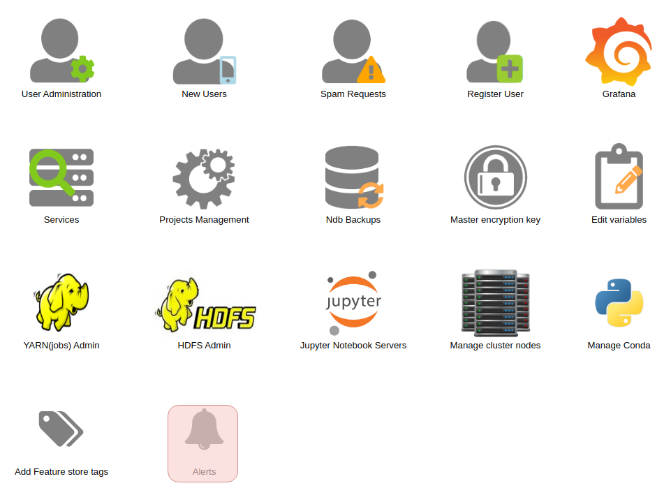
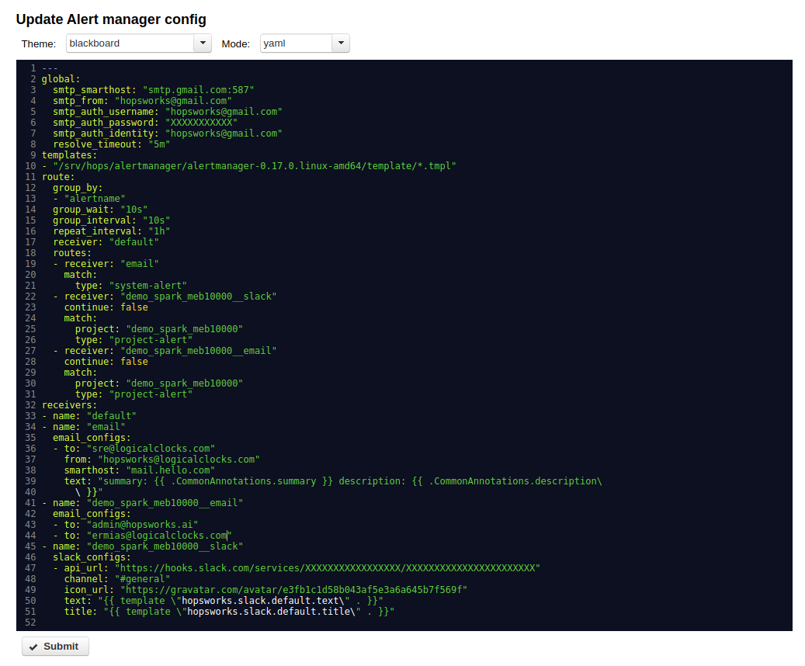

.. _Alert:
 
 
=================
Alerts
=================

The Alertmanager can be configured from the admin page by editing the configuration file.

To edit the alertmanager configuration yaml click on the bell icon in the admin page.

 
  Go to Alerts.

The alertmanager config page shown below can be used to edit the configuration file as yaml or json.

 
  Alertmanager config editor.

After editing the configuration click submit to save the new configuration and reload it to the alertmanager.

If the reload fails the old value will be restored.