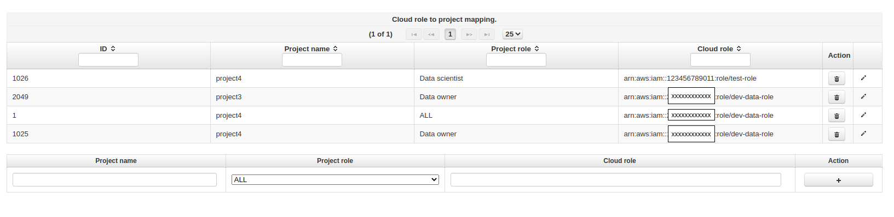
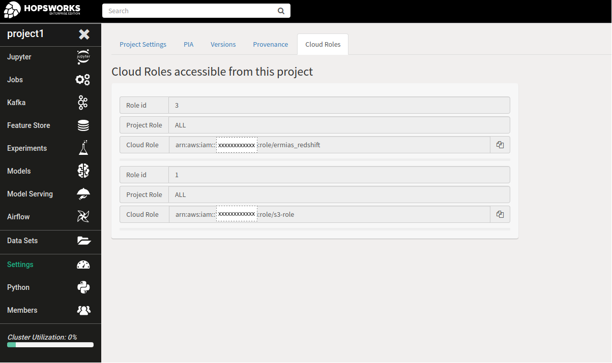

==================
AWS Role chaining
==================

Using an EC2 instance profile enables your Hopsworks cluster to access AWS resources. This forces all Hopsworks users to
share the instance profile role and the resource access policies attached to that role. To allow for per project access policies 
you could have your users use AWS credentials directly in their programs which is not recommended or you can and should use
`Role chaining <https://docs.aws.amazon.com/IAM/latest/UserGuide/id_roles_terms-and-concepts.html#iam-term-role-chaining>`_.

To use Role chaining, you need to first setup IAM roles in AWS:

1. Create an instance profile role with policies that will allow it to assume all resource roles that we can assume from the Hopsworks
cluster.

.. code-block:: json

    {
        "Version": "2012-10-17",
        "Statement": [
            {
                "Sid": "AssumeDataRoles",
                "Effect": "Allow",
                "Action": "sts:AssumeRole",
                "Resource": [
                    "arn:aws:iam::123456789011:role/test-role",
                    "arn:aws:iam::xxxxxxxxxxxx:role/s3-role",
                    "arn:aws:iam::xxxxxxxxxxxx:role/dev-s3-role",
                    "arn:aws:iam::xxxxxxxxxxxx:role/redshift"
                ]
            }
        ]
    }

Example policy for assuming four roles.

2. Create the resource roles and edit trust relationship and add policy document that will allow the instance profile to assume this role.

.. code-block:: json

    {
        "Version": "2012-10-17",
        "Statement": [
            {
            "Effect": "Allow",
            "Principal": {
                "AWS": "arn:aws:iam::xxxxxxxxxxxx:role/instance-profile"
            },
            "Action": "sts:AssumeRole"
            }
        ]
    }

Example policy document.

3. Finally attach the instance profile to the master node of your Hopsworks AWS instance.

Role chaining allows the instance profile to assume any role in the policy attached in step 1. To limit access
to roles we can create a per project mapping from the admin page in hopsworks. 

.. _goto-role-mapping.png: ../_images/admin/goto-role-mapping.png
.. figure:: ../imgs/admin/goto-role-mapping.png
  :alt: Go to role mapping
  :target: `goto-role-mapping.png`_
  :align: center
  :figclass: align-cente
 
  Go to cloud role mapping.

By clicking the cloud role mapping icon in the admin page shown in the image above you can add mappings 
by entering the project name, which roles in that project can access the cloud role and the role ARN.

.. _role-mappings.png: ../_images/admin/role-mappings.png

 
  Add cloud role to project mapping.

Any member of a project can then go to the project settings page to see which roles they can assume.

.. _project-roles.png: ../_images/admin/project-roles.png

 
  Cloud roles mapped to project.

For instructions on how to use the assume role API go to :doc:`../user_guide/hopsworks/assume-role`