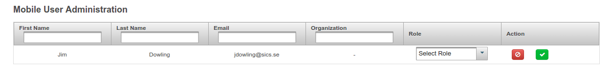
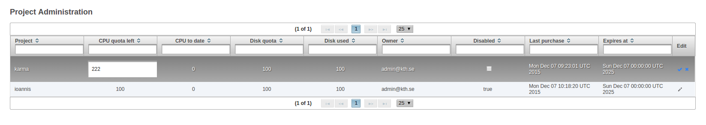

************************
HopsWorks Administrator Guide
************************

HopsWorks has an **administrator application** that allows you, the administrator, to perform management actions, monitor HopsWorks and Hops, and control HopsWorks and Hops.

Activating users
************************

You, the administrator, have to approve each new user account before the user is able to login to HopsWorks.
When you approve the account, you have to assign a role to a user as either a:

 * normal user
 * administrator user
  
Users that are assigned an **administrator** role will be granted privileges to login to the **administrator application** and control users and the system. Be careful in which users are assigned an **administrator** role. The vast majority of users will be assigned a **user** role.
   

    
    Approve User Accounts so that Users are able to Login

    
User fails to receive an email to validate her account
******************************************************

* Does your organization have a firewall that blocks outbound SMTP access?
* Login to the Glassfish Webserver and check the JavaMail settings. The JNDI name should be *mail/BBCMail*. Is the gmail username/password correct? Are the smtp server settings correct (ip-address or hostname, port, protocol (SSL, TLS))?

User receives email, but fails to validate the account
******************************************************

* Can you successfully access the HopsWorks homepage?
* Is the Glassfish webserver running and hopsworks.war application installed?
* Is MySQL Cluster running?

User successfully validates the account, but still can't login
************************************************************************

Go to the **User Administration** view. From here, select the user whose account will be enabled, and update the user's account status to **validated**.

User account has been disabled due to too many unsuccessful login attempts
****************************************************************************

Go to the **User Administration** view. From here, select the user whose account will be re-enabled, and update the user's account status to **validated**.

Disabling a user account
****************************************************************************

Go to the **User Administration** view. From here, select the user whose account will be disabled, and update the user's account status to **disabled**.

Re-activating a user account
****************************************************************************

In the ``user administration`` view, you can select the action that changes the user status to ``activated``.

    
Managing Project Quotas
***********************

Each project is by default allocated a number of CPU hours in HopsYARN and an amount of available disk storage space in HopsFS:

* HopsYARN Quota
  
* HopsFS Quota
    
We recommend that you override the default values for the Quota during the installation process, by overriding the Chef attributes:

* hopsworks/yarn_default_quota
  
* hopsworks/hdfs_default_quota

In the **Projects** view, for any given project, the administrator can update the remaining amount of HopsYARN Quota (in CPU hours) and the amount disk space allocated in HopsFS for the project.

    
    Project Administration: update quotas, disable/enable projects.

Disabling/Re-enabling Projects
************************************

In the **Projects** view, any given project can be disabled (and subsequently renabled). Disabling a project will prevent members of the project from accessing data in the project, running Jobs stored in the project, or accessing the project at all.

		
Ubikeys in HopsWorks
*********************************

Ubikeys can be used as the 2nd factor authentication device, but a Ubikey needs to be programmed before it is given to a user. We recommend programming the Ubikey using Ubuntu's Yubikey OTP tool.
From the Yubikey OTP tool program, you will have to opy the Public Identity and Secret Key fields (from Yubikey OTP) to the corresponding fields in the HopsWorks  Administration tool when you validate a user. That is, you should save the Public Identity and Secret Key fields for the Yubikey sticks, and when a user registers with one of those Ubikey sticks, you should then enter the Public Identity and Secret Key fields when approving the user's account.

.. code-block:: bash
		
   $ sudo apt-get install yubikey-personalization-gui
   $ yubikey-personalization-gui

   Installing and starting Yubikey OTP tool in Ubuntu.
   
.. figure:: ../imgs/yubikey-gui.png
    :alt: Registering YubiKey sticks
    :scale: 75
    :align: center
    :figclass: align-center
    
    Registering YubiKey sticks using Yubikey OTP tool.

.. figure:: ../imgs/yubikey-quick.png
    :alt: Registering YubiKey sticks
    :scale: 75   
    :align: center
    :figclass: align-center
    
    Registering YubiKey sticks using Yubikey OTP tool.

.. figure:: ../imgs/yubikey-public-identity-secret-key.png
    :alt: Copy the Public Identity and Secret Key fields from Yubikey OTP to the corresponding fields when you validate a user in the Admin UI. 
    :align: center
    :scale: 75
    :figclass: align-center

    Copy the Public Identity and Secret Key fields from Yubikey OTP tool and enter them into the corresponding fields in the HopsWork's Administration UI when you validate a user.

Glassfish Adminstration
-----------------------

If you didn't supply your own username/password for Glassfish administration during installation, you can login with the default username and password for Glassfish:

:: 
  https://<hostname>:4848
  username: adminuser
  password: adminpw

Users are referred to Glassfish documentation for more information regarding configuring Glassfish.

