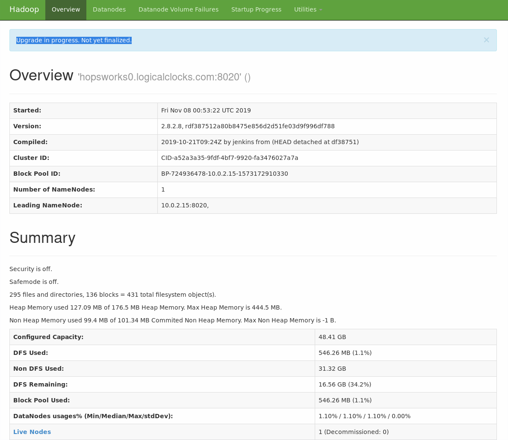

=========
HopsFS UI
=========

Similarly to the Yarn UI, the HopsFS UI icon redirects to the webpage provided by the namenodes. By default Hopsworks redirects to the leader namenode webpage. Administrators can reach the webpage of any non-leader namenode by replacing the IP in the URL.

The webpage gives information about the status of the HopsFS cluster. It provides information regarding the status of the datanodes from the namenode point of view. How many are currently active, dead or in a decommissioning phase. 
In case the cluster has corrupted blocks, the page also displays the list of files affected.

Finally, administrators can from this page determine if the HopsFS cluster is in a `Safe mode` state, meaning that the namenodes accept only read operations. This happens when the cluster is first (re)started or in case of issues with the datanodes and/or the database.

.. _hdfs-ui.png: ../_images/admin/hdfs-ui.png

   HopsFS UI

More detailed metrics are available in the :doc:`monitoring` page.
