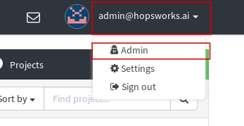
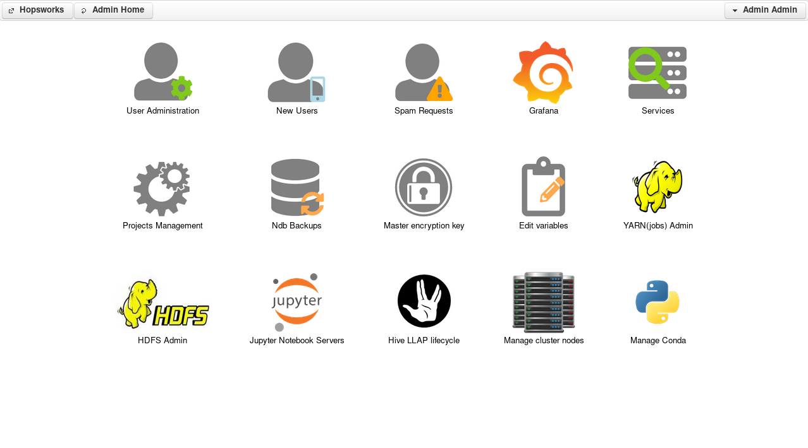

=========================
Hopsworks administration
=========================

Hopsworks has an administrator application that allows you, the administrator, to perform management actions, monitor and control Hopsworks.

To access the administrator panel you should log in into Hopsworks using your administrator account. On the top right corner, click on your email address and then on *Admin*.

.. _admin1.png: ../_images/admin/admin1.png

   Access administration panel

This will bring you to the administration panel that looks like the figure below: 

.. _admin2.png: ../_images/admin/admin2.png

   Administrator panel  

The panel gives you access to: 

.. toctree::
    :maxdepth: 1

    user-administration.rst
    project-administration.rst
    monitoring.rst
    variables.rst
    yarn-ui.rst
    hopsfs-ui.rst
    conda.rst
    nodes.rst
    jupyter.rst
    ldap.rst
    ldap_group_to_project_mapping.rst
    sso.rst
    oauth2.rst
    cloud_role_mapping.rst