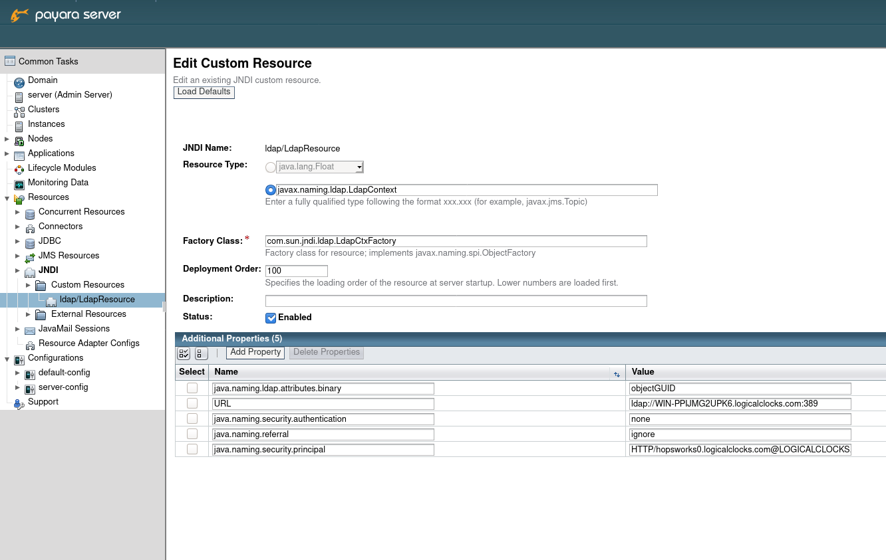
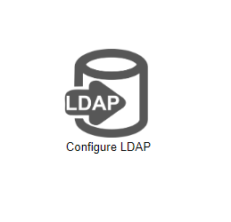
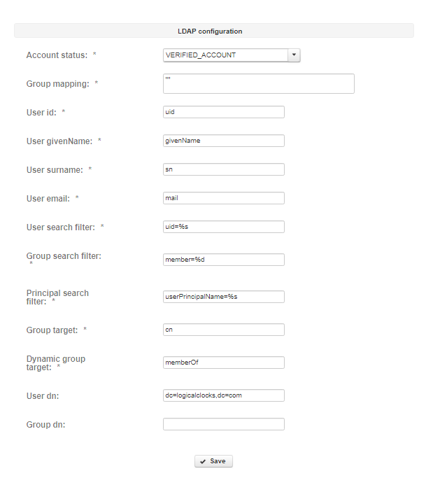

================
LDAP integration
================

Hopsworks enterprise edition supports LDAP integration for user login. 

Karamel/Chef configuration
--------------------------

LDAP integration can be configured from the cluster definition, by specifying the following attributes: 

.. code-block:: yaml

 ldap:
   enabled: true
   group_mapping: "Directory Administrators->HOPS_ADMIN;IT People-> HOPS_USER"
   user_id: "uid"
   user_givenName: "givenName"
   user_surname: "sn"
   user_email: "mail"
   user_search_filter: "uid=%s"
   group_search_filter: "member=%d"
   attr_binary: "java.naming.ldap.attributes.binary"
   group_target: "cn"
   dyn_group_target: "memberOf"
   user_dn: ""
   group_dn: ""
   account_status: 2
   jndilookupname: "dc=example,dc=com"
   provider_url: "ldap://193.10.66.104:1389"
   attr_binary_val: "entryUUID"
   security_auth: "none"
   security_principal: ""
   security_credentials: ""
   referral: "ignore"
   additional_props: ""

- `group_mapping` allows you to specify a mapping between LDAP groups and Hopsworks groups. At the moment Hopsworks supports mapping only with `HOPS_ADMIN` and `HOPS_USER` groups. If nothing is specified, users won't get any default group and administrators should assign one manually. Users are not allowed to login as long as they don't belong to any group.

- `user_id`, `user_givenName`, `user_suername`, `user_email` are the fields Hopsworks will lookup in LDAP the first time a user tries to login.

- `jndilookupname` should contain the LDAP domain.

- `attr_binary_val` is the binary unique identifier that will be used in subsequent logins to identify the user.

- `account_status` contains the status that will be set for the user account when the user first register using LDAP. `2` means `activated`, meaning that the user is able to login with no further action to be taken by the administrator. 

- `security_auth` can be "none" or "simple".

- `security_principal` contains username of the user that will be used to query LDAP.

- `security_credentials` contains the password of the user that will be used to query LDAP.

Without Karamel/Chef
--------------------

An already deployed instance can be configured to connect to LDAP without the need of running Karamel/Chef. 
Administrators should create a new `JNDI` custom resource in Payara. The name of the resource should be `ldap/LdapResource`. 
This can be done either through the Payara Web UI (as shown below) or though the `asadmin` binary from command line.

.. _ldap-resource.png: ../_images/admin/ldap-resource.png

   Create LDAP JNDI resource 

Hopsworks should be restarted after having created the resource. Run `systemctl restart glassfish-domain1` to restart it.

Setting `ldap_auth` to `True` in the :doc:`variables` panel will make appear the LDAP configuration option in the Admin panel.

.. _ldap2.png: ../_images/admin/ldap2.png

    Access to LDAP configuration
    
Clicking on the LDAP configuration option will lead to the LDAP configuration panel. From there, administrators will be able to configure the LDAP connection as explained above.

.. _ldap3.png: ../_images/admin/ldap3.png

   LDAP configuration 

After saving and restarting Hopsworks, users will be able to login using LDAP.

Migrate existing users
----------------------

Using Expat_ there is the possibility of migrating existing local users and map them to LDAP users. Currently Expat only supports migrating Single Sign On Kerberos users, but it can be easily extended to migrate LDAP users.

.. _Expat: https://github.com/logicalclocks/expat

Allow non LDAP users
--------------------

Even with LDAP enabled, users will still be able to register with their email address. It's up to the administrators to enforce a LDAP only account policy. 
Users registered with their email address will have to be activated manually by the administrators as described in :doc:`user-administration`.