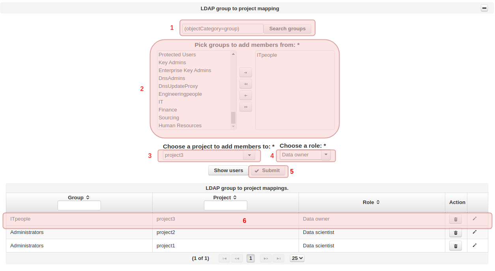

=============================
LDAP group to project mapping
=============================
 
Hopsworks enterprise edition supports LDAP group to project member mapping. To add a mapping go to the LDAP icon in the admin page
and select LDAP groups to map to a project as shown in the image below.
 
.. _mapping.png: ../_images/admin/mapping.png

 
  Create LDAP group to project mapping
 
The search groups query can be used to select specific groups to populate the left pick list in box 2. From the left pick list you can choose the
groups you want to map to a project selected in box 3. The mapping also needs to specify the role users will be assigned in the selected project.
Finally click submit to add the mapping.
 
Show users button will show you the users that are going to be added to the project. This list only contains users that are currently in
the selected LDAP groups.
 
After submission a new row will be added to the mappings table box 6 in the example above. This table can be used to edit or remove a mapping.
 
.. _sync-mapping.png: ../_images/admin/sync-mapping.png
.. figure:: ../imgs/admin/sync-mapping.png
  :alt: Sync group
  :target: `sync-mapping.png`_
  :align: center
  :figclass: align-cente
 
  Create LDAP group to project mapping sync
 
The mappings will not take effect immediately. Users will be added to projects when they first login to hopsworks or after a sync timer expires (settable in variables table 'group_mapping_sync_interval' ).
If you need the mapping to take effect immediately you can click on the manual sync buttons shown above.
 
 

