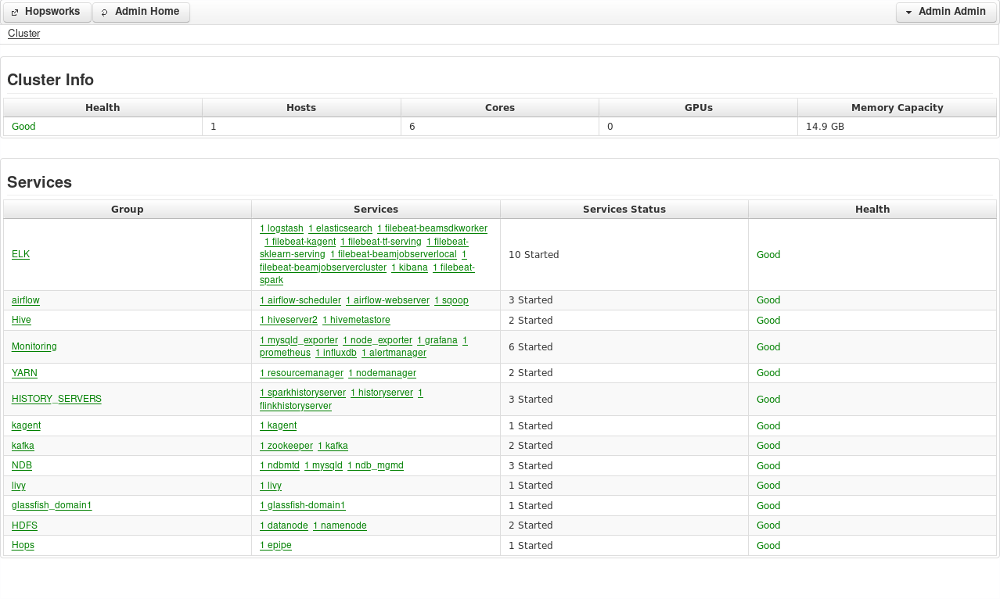
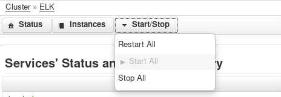

==========
Monitoring
==========

Hopsworks provides administrators with a view of the status/health of the cluster. Information is provided both through the *Services* page and through the *Grafana* page.

Services
--------

This page give the administrators an overview of which services are running on the cluster. It provides information about their status as reported by Kagent which, in turn, monitor the status of the different SystemD units.

The health of a cluster is classified as Good if all the services are running correctly. On the other hand, if an instance of a service is down, the cluster health is classified as Bad.

.. _admin-services-1.png: ../_images/admin/admin-services-1.png

   Service List 

Services are divided into groups. Clicking on a group will lead to the group administration page. From there administrators will be able to start, stop or restart all the instances of all the services running of that group.

.. _admin-services-2.png: ../_images/admin/admin-services-2.png

   Start, Stop and Restart all services in a group

Clicking on a single service will lead to a similar page where administrators will be able to start, stop or restart a specific service.

Grafana
-------

The Grafana page provides more detail information on the status of the cluster, by visualizing in Grafana the metrics of the services running in the cluster and of the hosts.
Hopsworks ships with default dashboards that cover all the major services. The default dashboards are Read-Only and can be found in the Hops folder.

If administrators want to build custom dashboards, they should log in into Grafana. The login username and password for the admin user are set from the cluster definition by specifying the parameters `grafana/admin_user` and `grafana/admin_password`. The default values are `adminuser` for the username and `adminpw` for the password.

Once logged in, administrators have the possibility of building custom visualization dashboards. They can either start from scratch or duplicate one of the default dashboards provided with Hopsworks. 
The data is taken from Prometheus, the Prometheus documentation_ contains all the instructions on how to query it. 

.. _documentation: https://prometheus.io/docs/prometheus/latest/

Administrators should be aware that dashboards are stored in a SQLite database located on the same host Grafana is running. If administrators develop custom dashboards, we recommend taking periodic backups of the Grafana database.

In the scenario in which Hopsworks is not reachable and administrators want access to the dashboard to troubleshoot problems, they can do so by connecting directly with Grafana on the port `3000`. In that case, administrators should also supply in the URL the base path: `/hopsworks-api/grafana`. The complete path would then be `http://localhost:3000/hopsworks-api/grafana`.

Alerting
--------

The default Hopsworks installation allows the possibility of deploying *Alertmanager*. *Alertmanager* is a component of the Prometheus ecosystem that is responsible of sending alerts in case something fails.

The Alertmanager can be configured from `Karamel/Chef` by specifying the Email and/or Slack configuration to use when sending alerts. Example:

.. code-block:: yaml

    attrs:                                                                                                         
        alertmanager:    
            slack:    
                api_url: <api_url> 
                channel: hopsworks 
                username: alertmanager  

The default Hopsworks installation provides a set of rules which are evaluated by Prometheus as it ingests new metrics. If one of the condition is met, Prometheus notifies the Alertmanager which sends an alert. 
The rules can be found in `/srv/hops/prometheus/prometheus/alerting-rules`. Currently Hopsworks provides rule files only for host metrics. More rules will be added in future releases. Administrators are free to change those files, however they should be aware that the files will be overwritten during upgrades.