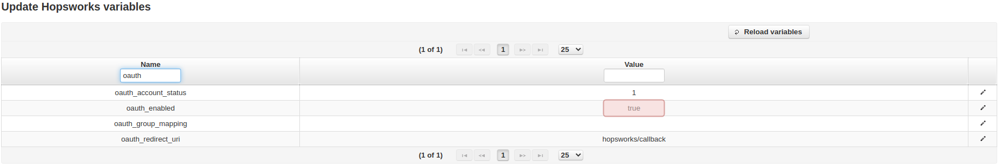
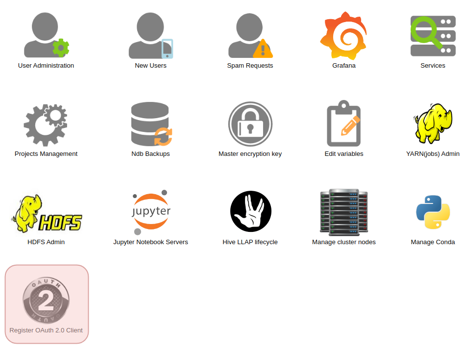
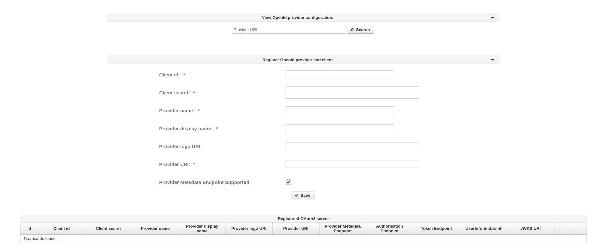

================
OAuth2 integration
================

Hopsworks enterprise edition supports OAuth2 integration for user login.

To start using OAuth2 for user authentication enable oauth from the admin page by setting `oauth_enabled` to `true` and then click `Reload variables` as shown in the image below. 

.. _enable-oauth2.png: ../_images/admin/enable-oauth2.png

   Enable OAuth2 authentication. 

- `oauth_account_status` allows you to specify if the user is going to be activated at registration. If set to 2 there is no need for an administrator to enable the account after registration.

- `oauth_group_mapping` allows you to specify a mapping between OAuth groups and Hopsworks groups. Currently Hopsworks supports mapping only with `HOPS_ADMIN` and `HOPS_USER` groups. If nothing is specified, users won't get any default group and administrators should assign one manually. Users are not allowed to login if they do not belong to any group.

After enabling you should see the `Register OAuth 2.0 Client` icon when you go back to the admin page.

.. _registerClient.png: ../_images/admin/registerClient.png

   Register OAuth 2.0 client.

Click on the `Register OAuth 2.0 Client` and fill in the information needed to conect to the OAuth provider. 

.. _registered.png: ../_images/admin/registered.png

   Register a client.

The search on the top of the page can be used to test the connection to the authentication provider and get the OpenId provider configuration.

* Register OpenId provider and client
    * `Client id` is the id given to hopsworks by the OpenId provider upon registration.
    * `Client secret` is the secret key hopsworks authenticates with to the OpenId provider.
    * `Provider name` is the unique name of the OpenId provider on hopsworks.
    * `Provider display name` is the name shown on the login page of hopsworks.
    * `Provider logo URI` is the logo shown on the login page of hopsworks.
    * `Provider URI` is the base URI of the OpenId provider.
    * `Provider Metadata Endpoint Supported` if the OpenId provider supports metadata discovery. This can be used to retrieve openid-configuration if available.

After filling in all the required fields, save the new client.

Finally logout from hopsworks and you should see a second login option with the provider name and logo of the newly registered client.
