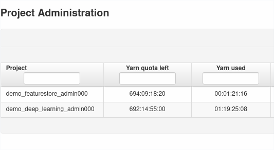
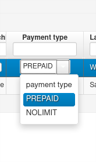
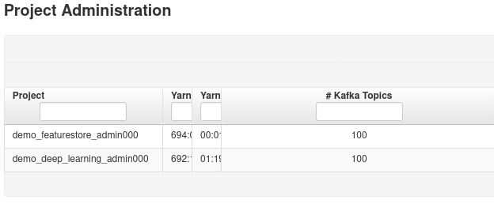
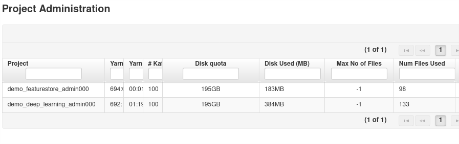

=======================
Project administration
=======================

Clicking on the *Projects Management* icon on the admin panel, will lead to the project administration panel.
From here you will be able to see and manage projects.

Quotas
------

Each project has a set of quotas which limit the amount of compute and storage they can use. From the project panel, administration can modify the different quotas. 

Yarn Quota
__________

The Yarn quota for a project determines how much computing resources a project can use. Yarn quota for a project is computed on a interval basis and projects are charged based on how many cores, memory and GPUs they are consuming at that moment. You can read more about how to configure the quota system here_.

.. _here: ./configuration/yarnconfig/quota.html

The format of the Yarn quota in the project administration panel is `dddd:hh:mm:ss` (days:hours:minutes:seconds). HopsYarn computes resource utilization based on ticks, by default the interval between two ticks is 1 second, hence why you can read the Yarn quota as days:hours:minutes:seconds. If you increase the tick frequency the rule won't apply anymore. 

The `Yarn Used` column contains the amont of compute resoruces the project has used. The same rule above applies, if the measurement interval is 1 second, you can read the column has days:hours:minutes:seconds.

The default Yarn quota for a project is `1000000 minutes` (assuming 1 tick per second). You can change the default quota by setting the `hopsworks/yarn_default_quota_mins` attribute in your custer definition.

.. _project-admin1.png: ../_images/admin/project-admin1.png

   Yarn Quota 
   

When a project runs out of credits, users won't be able to start jobs and Jupyter notebooks. Running Jobs and Jupyter notebooks are not killed when a project runs out of credits.

Administrators can disable the Yarn quota on a per project basis by changing the payment type from `PREPAID` to `NO LIMIT`.

.. _project-admin4.png: ../_images/admin/project-admin4.png

   Disable Yarn quota on a per-project basis

Kafka Topics
____________

This quota puts a limit on the amount of Kafka Topic a project can have. The default value is 100 and can be changed from the cluster definition, by setting the attribute `hopsworks/kafka_max_num_topics`

.. _project-admin2.png: ../_images/admin/project-admin2.png

   Kafka Topics quota

Storage Quota
_____________

Projects have 3 different storage quotas. Each storage quota is composed of two parts. The first part is the disk quota which limits the amount of space and the second part is the Inode quota, meaning the upper limit of files and/or directories a project can create. 
Be aware that the disk quota accounts for the replication factor. Files on HopsFS are, by defualt, triple replicated, this means that if a user uploads a 1GB file in their project, this will consume 3GB of quota. Users can decide to decrease the replication factor to save on disk quota. 
Setting the quota to -1 disables it.

.. _project-admin3.png: ../_images/admin/project-admin3.png

   Storage quota

Each project has a storage quota for the project directory itself (subdirectoy of `/Projects`) which affects all the project datasets except for the Featurestore and the Hive database. 
Both the Featurestore and the Hive database have a different storage quota.

Sharing a dataset with a project does not affect the quota for that project.

Once the storage quota has been reached, users won't be able to upload/create new files and/or create new directories.

Force delete
------------

Administrators can delete projects on behalf of users. To do so, they should click on the `Force remove` button and type the name of the project they want to delete.

Other information
-----------------

The project administrator panel shows, for each project, who is the owner of that project and what was the last time any of the quotas (compute or storage) have been udpated.