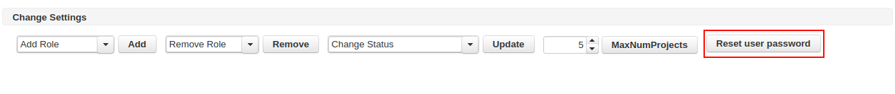
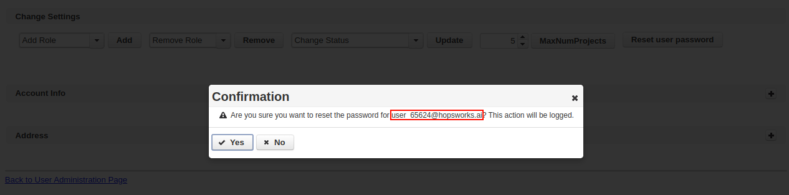
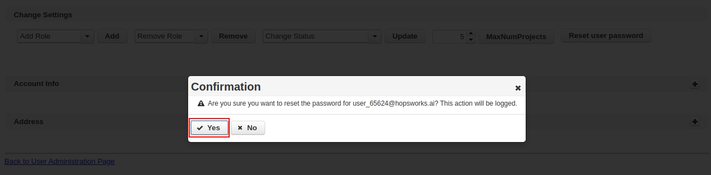
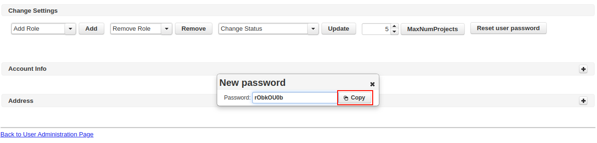
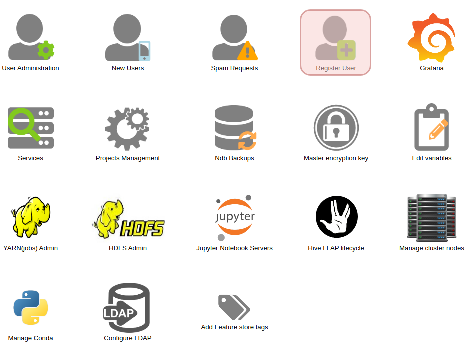
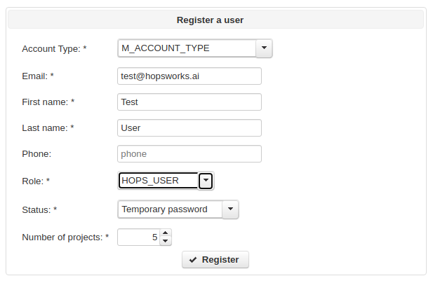
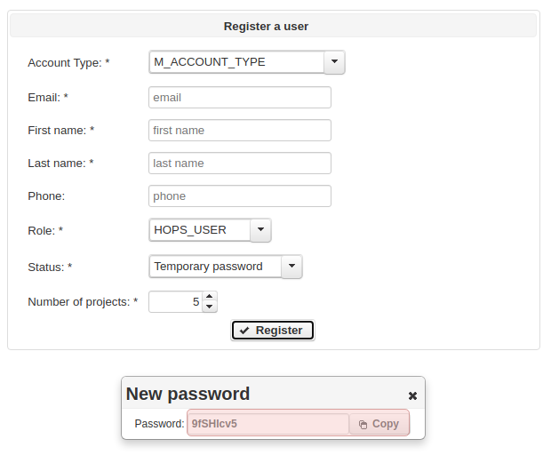
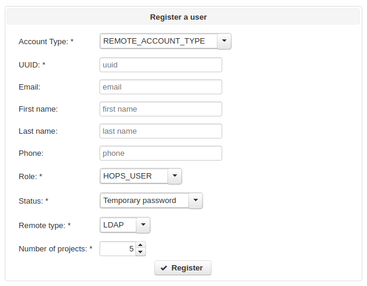
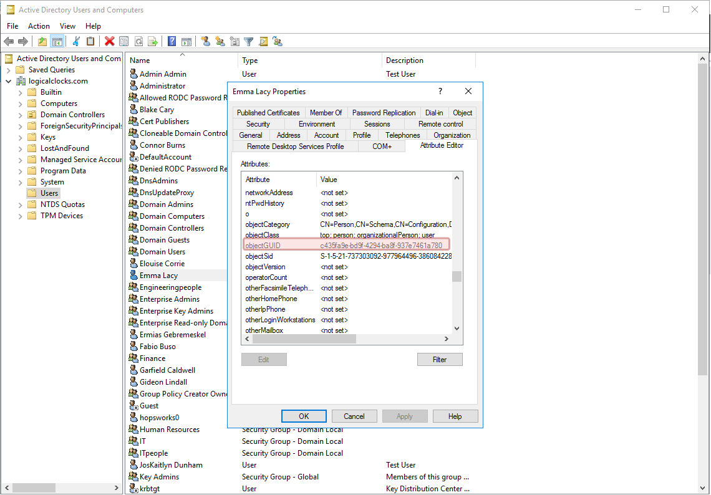

.. _hopsworks-administration:

===================
User administration
===================

Clicking on the *User administration* icon on the admin panel, will lead to the user administration panel. 
From here you will be able to see and manage the registered users.

Activating users
-----------------

When a user first registers on Hopsworks, they don't have any role and, as such, they are not allowed to perform any operation on the platform. Hopsworks users can have two roles: *Hops User* and *Hops Admin*.
*Hops User* is the base role, it allows users to create projects, invite and get invited into projects and operate within these projects. 
Within a given project, each Hops user account will assume the role of either *DataOwner* or *DataScientist. A user may have different roles in different projects. He/she may be *DataOwner* in one project, but only a *DataScientist* in a different project.
The *Hops Admin* role is a superuser role that allows all the operations allowed by the *Hops User* role and, in addition to those, it allows users to access the administration panel and manage the Hopsworks platform.

To activate a user account, as an administration, click on the modify icon on the line corresponding to the user you want to activate.

.. _user-admin1.png: ../_images/admin/user-admin1.png
.. figure:: ../imgs/admin/user-admin1.png
   :alt: Edit user 
   :target: `user-admin1.png`_
   :align: center
   :figclass: align-cente

   Edit user

This will open a new page with the details of the user. In the *Change Settings* section, an administrator can add a role to a user. Expand the drop down menu, select *Hops_User* and click *Add*. If you want to grant admin privileges to the same user, you can repeat the operation this time selecting *Hops_Admin*.

.. _user-admin2.png: ../_images/admin/user-admin2.png
.. figure:: ../imgs/admin/user-admin2.png
   :alt: Edit user 
   :target: `user-admin2.png`_
   :align: center
   :figclass: align-cente

   Add role to user

Next to the add user option, there is the *Remove Role* option. By selecting the role and clicking *Remove* an administrator can remove roles from a User.  

Activating users without a mail server
______________________________________

If Hopsworks has been configured to use a mail server/provider, Hopsworks sends out an email to the newly registered user, allowing them to verify their email address. This step must be completed before they are allowed to log in.

If however, Hopsworks has not been configured to use a mail server/provider, the verification step can be bypassed by an administrator.

.. _user-admin3.png: ../_images/admin/user-admin3.png
.. figure:: ../imgs/admin/user-admin3.png
   :alt: Edit user 
   :target: `user-admin3.png`_
   :align: center
   :figclass: align-cente

   Activate user

To activate an account, an administrator can select from the *Change status* dropdown menu the entry *Activated_Account*, and then click *Update* to change the account status.

Block/Unblock users
--------------------

If an administrator deems it necessary to prevent a user to log into the platform, they can do so from the same *Change Status* menu shown above. They can select *Blocked_Account* to the prevent the user to logging in again.

If a user fails to enter their credential correctly for more than 5 times in a row, their account will be blocked. Users will have to contact an administrator to get their account unblocked. Administrators, from the same UI, will be able to change the account status from *Blocked_Account* back to *Activated_Account*.

Increase users' max number of projects
--------------------------------------

Users are only allowed to create a limited number of projects. By default, they can only create 5 projects, but that default number can be changed during installation by setting `hopsworks/max_num_proj_per_user`. Please note that deleting a project will not mean that a user can now create more projects. The limit is related to the number of projects a user can create, not the number of projects a user may have created that are currently active. The reason for this approach is to prevent abuses of Yarn's quota system, where a user could continually drop and create projects to acquire new quota. 

If a user runs out of projects and wants to create more, they should contact an administrator. An administrator can increase the number of projects a user is able to create by editing their profile and, in the *Change Settings* section, increase the number of projects.

.. _user-admin4.png: ../_images/admin/user-admin4.png
.. figure:: ../imgs/admin/user-admin4.png
   :alt: Increase number of projects 
   :target: `user-admin4.png`_
   :align: center
   :figclass: align-center

   Increase number of projects 

Reset users' password
---------------------

If a user forgets her password and security quesion, an administrator can reset it by going to the edit user page as shown above and selecting `reset user password` button.

.. _user-admin5.png: ../_images/admin/user-admin5.png

   Reset password

Before confirming the reset action make sure the user email shown in the confirm dialog box is the user you want to reset the password for.

.. _user-admin6.png: ../_images/admin/user-admin6.png

   Confirm user email

When sure that you have the right user click yes.

.. _user-admin7.png: ../_images/admin/user-admin7.png

   Confirm password reset

The new autogenerated password will be shown. Make sure to copy it before closing the dialog box because it cannot be retrieved later.

.. _user-admin8.png: ../_images/admin/user-admin8.png

   Copy new password

Register user
-------------
To register a user from the admin page click on the icon shown on the image below and fill in all the required fields.
 
.. _register.png: ../_images/admin/register.png

 
  Go to register
 
 
.. _register-test-user.png: ../_images/admin/register-test-user.png

 
  Register a user
 
If the registration was successful a temporary password will be generated for the new user as shown in the image below.
Copy the generated password and send it to the user in a secure way.
 
.. _register-success.png: ../_images/admin/register-success.png

 
  Register success
 
You can also register a remote user (Kerbros or LDAP) by choosing account type 'REMOTE_ACCOUNT_TYPE'.
 
.. _register-remote-user.png: ../_images/admin/register-remote-user.png

 
  Register remote user
 
To register a remote user you need a 'UUID' that is the universally unique id of the remote user in LDAP or Kerberos.
To find this id in Active directory go to "users and computers" management window and right click on the user you want to
register and choose properties. This should take you to the window shown below where you can find the 'objectUUID'. 
 
.. _ad-objectuuid.png: ../_images/admin/ad-objectuuid.png

 
  Active directory objectUUID
 
To find the uuid in LDAP run 'ldapsearch' as shown in the image below.
 
.. _ldap-entryuuid.png: ../_images/admin/ldap-entryuuid.png
.. figure:: ../imgs/admin/ldap-entryuuid.png
  :alt: LDAP entryUUID
  :target: `ldap-entryuuid.png`_
  :align: center
  :figclass: align-center
 
  LDAP entryUUID
