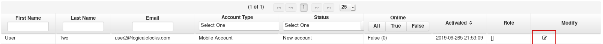
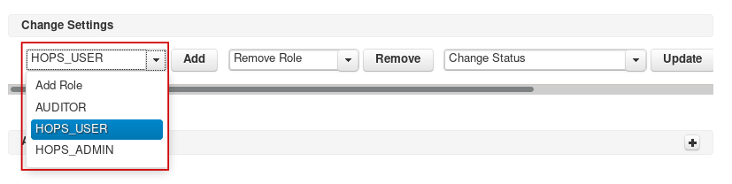
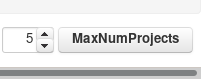

.. _hopsworks-administration:

===================
User administration
===================

Clicking on the *User administration* icon on the admin panel, will lead to the user administration panel. 
From here you will be able to see and manage the registered users.

Activating users
-----------------

When a user first registers on Hopsworks, they don't have any role as such they are not allowed to do any operation on the platform. Hopsworks users can have two roles: *Hops User* and *Hops Admin*.
*Hops User* is the base role, it allows users to create projects, invite and get invited into projects and operate within these projects. Each *Hops User* account, will then assume the role of *DataOwner* or *DataScientist* depending on which project they are operating in.
The *Hops Admin* role, allows all the operations allowed by the *Hops User* role and, in addition to those, it allows users to access the administration panel and manage the Hopsworks platform.

To activate a user account, as an administration, click on the modify icon on the line corresponding to the user you want to activate.

.. _user-admin1.png: ../_images/admin/user-admin1.png

   Edit user

This will open a new page with the deatails of the user. In the *Change Settings* section, an administrator can add a role to a user. Expand the drop down menu, select *Hops_User* and click *Add*. If you want to grant admin privileges to the same user, you can repeat the operation this time selecting *Hops_Admin*.

.. _user-admin2.png: ../_images/admin/user-admin2.png

   Add role to user

Next to the add user option, there is the *Remove Role* option. By selecting the role and clicking *Remove* an administrator can remove roles from a User.  

Activating users without mail server
____________________________________

If Hopsworks has been configured to use a mail server/provider, Hopsworks sends out an email to the newly registered user, allowing them to verify their email address. This steps is required before they are allowed to log in.

If however, Hopsworks has not been configured to use a mail server/provider, the verification step can be bypassed by an administrator.

.. _user-admin3.png: ../_images/admin/user-admin3.png
.. figure:: ../imgs/admin/user-admin3.png
   :alt: Edit user 
   :target: `user-admin3.png`_
   :align: center
   :figclass: align-cente

   Activate user

To activate an account, an administration can select from the *Change status* dropdown menu the entry *Activated_Account*, and then click *Update* to change the account status.

Block/Unblock users
--------------------

If an administration deems necessary to prevent a user to log in into the platform, they can do so from the same *Change Status* menu shown above. They can select *Blocked_Account* to the prevent the user to log in again.

If a user fails to enter their credential correctly for more than 5 times in a row, their account will be blocked. Users will have to contact an administrator to get their account unblocked. Administrators, from the same UI, will be able to change the account status from *Blocked_Account* back to *Activated_Account*.

Increase users' max number of projects
--------------------------------------

Users have a limited number of projects they can create. By default it's 5. Please note that project deletion does not decrease the number of projects. This is to prevent abuses of the Yarn quota system.

If a user runs out of projects and wants to create more, they should contact an administrator. An administrator can increase the number of projects a user is able to create by editing their profile and, in the *Change Settings* section, increase the number of projects.

.. _user-admin4.png: ../_images/admin/user-admin4.png

   Increase number of projects 
