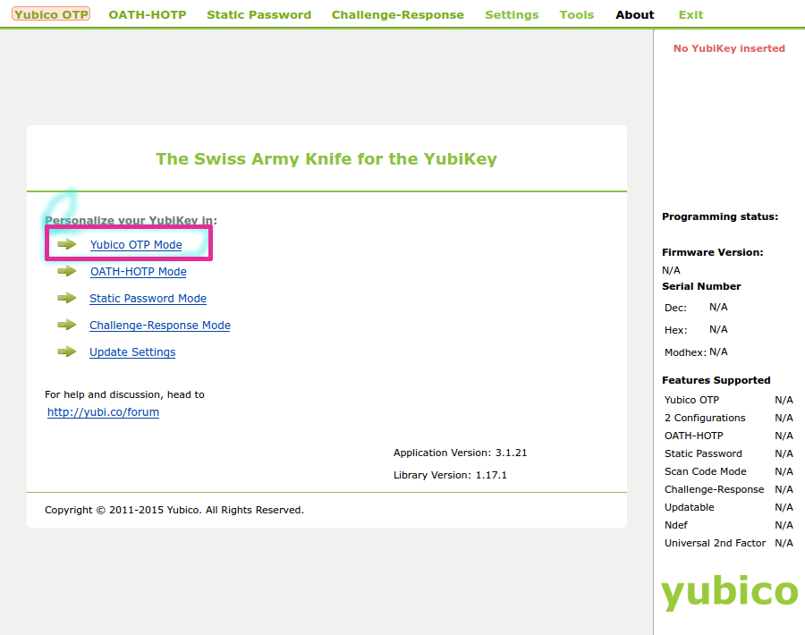
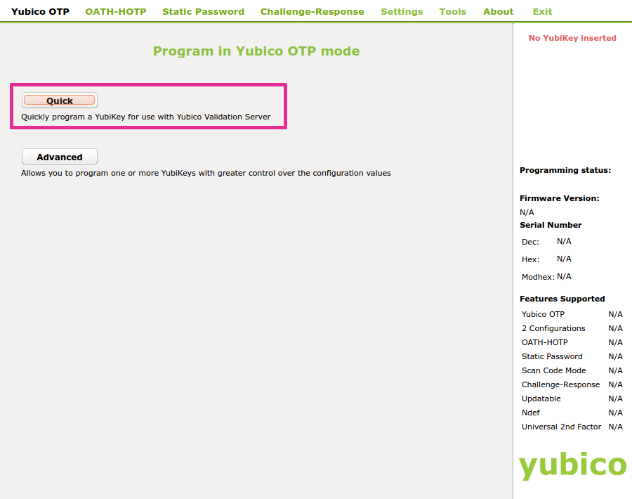
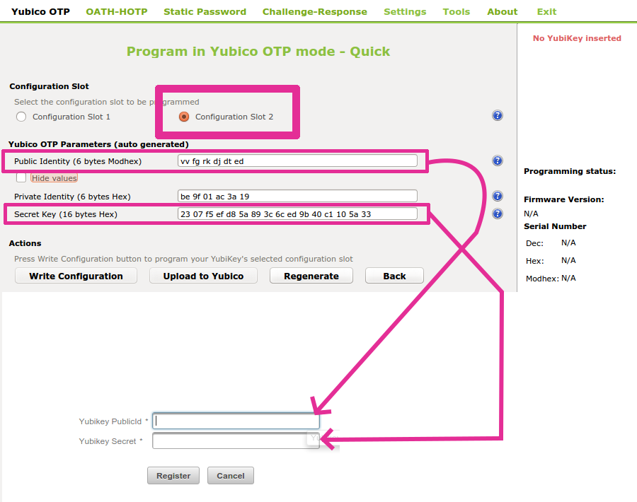

===========================
Ubikeys in Hopsworks
===========================

.. contents:: Contents
   :local:
   :depth: 2

Ubikeys can be used as the 2nd factor authentication device, but a Ubikey needs to be programmed before it is given to a user. We recommend programming the Ubikey using Ubuntu's Yubikey OTP tool.
From the Yubikey OTP tool program, you will have to opy the Public Identity and Secret Key fields (from Yubikey OTP) to the corresponding fields in the Hopsworks  Administration tool when you validate a user. That is, you should save the Public Identity and Secret Key fields for the Yubikey sticks, and when a user registers with one of those Ubikey sticks, you should then enter the Public Identity and Secret Key fields when approving the user's account.

.. code-block:: bash

   $ sudo apt-get install yubikey-personalization-gui
   $ yubikey-personalization-gui

   Installing and starting Yubikey OTP tool in Ubuntu.

    Registering YubiKey sticks using Yubikey OTP tool.

    Registering YubiKey sticks using Yubikey OTP tool.

    Copy the Public Identity and Secret Key fields from Yubikey OTP tool and enter them into the corresponding fields in the HopsWork's Administration UI when you validate a user.

.. _glassfish:

Glassfish Adminstration
-----------------------

If you didn't supply your own username/password for Glassfish administration during installation, you can login with the default username and password for Glassfish:

+------------+-------------------------+
| Glassfish URL| https://localhost:4848|
+============+=========================+
| username     | adminuser             |
+------------+-------------------------+
| password     | adminpw               |
+------------+-------------------------+

Users are referred to Glassfish documentation for more information regarding configuring Glassfish.
