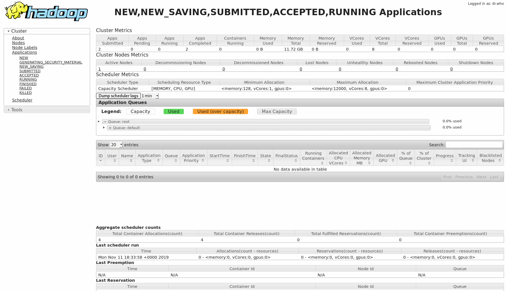

==============
Hops-Yarn UI
==============

Clicking on the Yarn UI icon redirects to the webpage provided by the Yarn Resource Manager. The page provides information regarding the status of the cluster: the amount of resource currently available and currently allocated.

Beside these metrics, which can also be found in the :doc:`monitoring` dashboard, the Yarn UI give administrators information regarding the status of running and completed applications. Administrators can see, for each application, how many resources they have allocated, their status and to which project user they belong to.

.. _yarn-ui.png: ../_images/admin/yarn-ui.png

   Yarn UI
