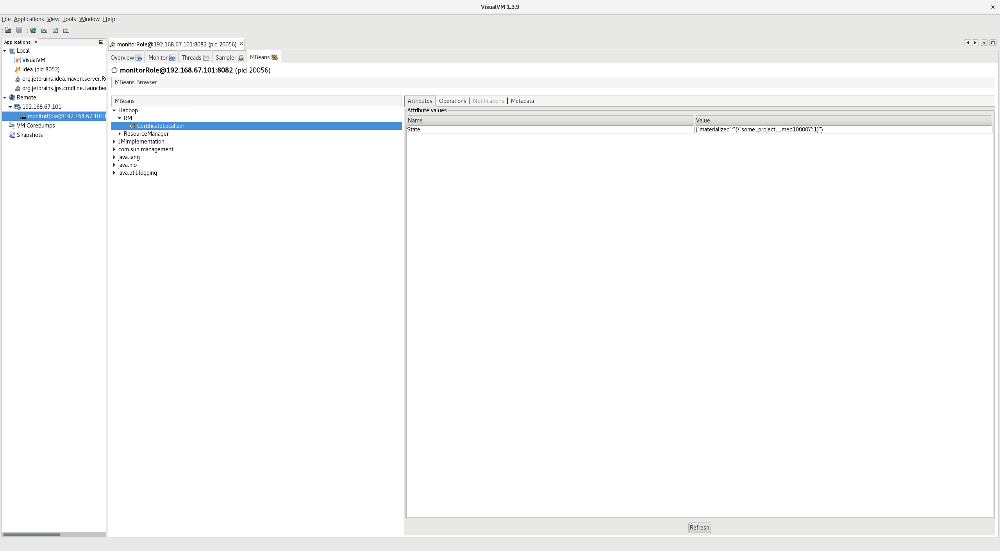
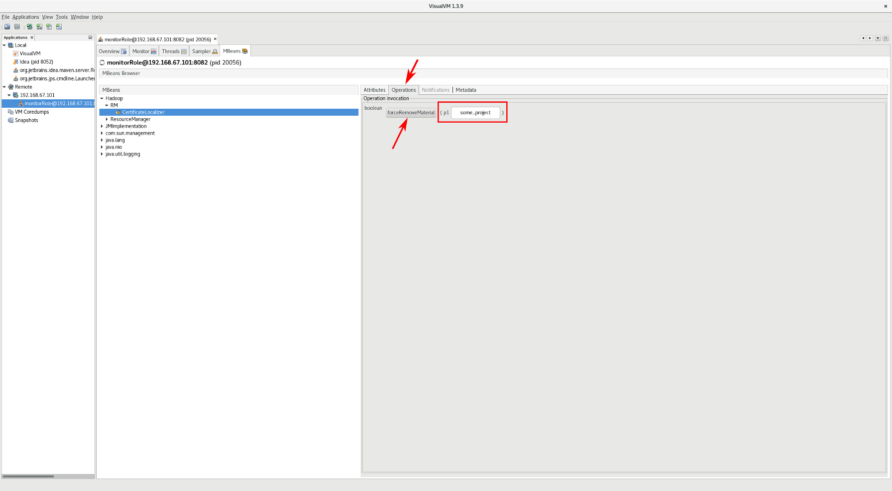

===========================
Certificate Materialization
===========================

.. contents:: Contents
   :local:
   :depth: 2

Hops and Hopsworks support transparent TLS encryption of all Remote
Procedure Calls (RPC). Every user in the system is associated with a
X.509 certificate that is stored in MySQL CLuster (NDB) database. For all RPCs
originating from Hopsworks, the keystore and truststore for the user in
question is materialized from the database in the local filesystem for
future use. If multiple sources request the same cryptographic
material, then a reference counter is incremented instead of
materializing over and over again. The materials from the local
filesystem are deleted when there are no more references to
them. Details for configuring Hops with TLS enabled can be found
in :doc:`/admin_guide/configuration/hopstls`

Certificate Materializer in Hopsworks
-------------------------------------

The service in Hopsworks that is responsible for the certificates
management is the *CertificateMaterializer*. It provides two
overloaded methods for materializing project-specific and
project-generic user certificates,
``CertificateMaterializer#materializeCertificates(String username,
String projectName)`` and
``CertificateMaterializer#materializeCertificates(String
projectName)`` respectively.

In order to remove a user's material that
is not needed any longer you can use
``CertificateMaterializer#removeCertificate(String username, String
projectName)`` and ``CertificateMaterializer#removeCertificate(String
projectName)``. Note that these methods will not remove the keystore
and truststore from the local file-system unless there are no more
references to them.

Finally if you want get access to the material
itself, use ``CertificateMaterializer#getUserMaterial(String username,
String projectName)`` and
``CertificateMaterializer#getUserMaterial(String projectName)`` which
will return a ``CertificateMaterializer.CryptoMaterial`` object
containing the keystore, truststore and password.

A typical use case is the following:

.. code-block:: java
		
   @EJB
   private CertificateMaterializer certificateMaterializer;
   String username = user.getUsername();
   String projectName = project.getName();
   try {
	certificateMaterializer.materializeCertificates(username, projectName);

	// Do something with the certificates

   } finally {
	certificateMaterializer.removeCertificates(username, projectName);
   }

Note: For DFS and Yarn client this is handled automatically as long as
you use ``DistributedFsService`` and ``YarnClientService``. So you
don't have to materialize and remove them. When a certificate has no
more references it will be *scheduled* for deletion. So even if you
have called the *remove* method, you might be able to see them in the
local filesystem.

You can query the state of the *CertificateMaterializer* through a
REST API, as well as force remove a stale certificate. First, you have to
login to Hopsworks with an *admin* (*HOPS_ADMIN* role) user. To get the state of the service do
a GET request to ``hopsworks-api/api/admin/materializer``. This will
return a map of the username associated with a certificate along with
its references number. Also, a list of certificates that are scheduled
for removal as depicted below.

.. code-block:: json

   {
    "materializedState": [
        {
            "references": 2,
            "user": "projectA__userA"
        }
    ],
    "scheduledRemovals": []
    }

In order to force remove a stale certificate do a DELETE request to
``hopsworks-api/api/admin/materializer/{certificate_username}``. Use
this operation with caution as it might disrupt running operations
that still use this cryptographic material.

Certificate Localization Service in Hops
----------------------------------------

A similar service is running on the ResourceManager(s) and
NodeManager(s) which is called *CertificateLocalizationService*. This
service extracts the keystore, truststore and password from RPCs
and stores them locally for internal consumption.

On the ResourceManager, the material is piggybacked by YarnClient when
submitting an application in the *ApplicationSubmittionContext*. The
material can be set explicitly or read them automatically if they
exist in the directory set by ``client.materialize.directory`` in
core-site.xml. On the NodeManager, the material is extracted by the RPC which starts
a container, ``ContainerManagerImpl#startContainers``. Both are
transparent to the user.

To localize a certificate you should call
``CertificateLocalizationService#materializeCertificates(String
username, ByteBuffer keyStore, String keyStorePass, ByteBuffer
trustStore, String trustStorePass)``. To remove them call
``CertificateLocalizationService#removeMaterial(String username)``. To
get information about a crypto material call
``CertificateLocalizationService#getMaterialLocation(String
username)`` which returns a ``CryptoMaterial`` object.

If RPC TLS is enabled there will be a reference to the service in
``RMContext`` of RM or to ``Context`` of NM. An example of usage is
following:

.. code-block:: java

   rmContext.getCertificateLocalizationService().
        materializeCertificates(user, kstore, kstorePass, tstore,
	tstorePass);

   try {
   // Do something with the certificates
   CryptoMaterial material = rmContext.getCertificateLocalizationService()
	.getMaterialLocation(user);

   } finally {
	rmContext.getCertificateLocalizationService().removeMaterial(user);
   }

Both in RM and NM the materials are stored in a safe directory in
``/tmp`` of the local file-system readable only by the user running the
service.

Similar administrative operations as in CertificateMaterializer of
Hopsworks are provided by the CertificateLocalizationService but
through JMX. There is a JMX call to get the state of the service and
to force remove a certificate. Both operations are password
protected. The username and the password of the role allowed is in
``$HADOOP_HOME/etc/hadoop/yarn-jmxremote.password`` and
``$HADOOP_HOME/etc/hadoop/rm-jmxremote.password``. The content of the
file should be similar to::
  
  adminRole adminPassword

Also, a policy file is expected in
``$HADOOP_HOME/etc/hadoop/jmxremote.access`` with read/write access
for the admin user, such as::

  adminRole readwrite

The object name of the MXBean for the ResourceManager is
``Hadoop:service=RM,name=CertificateLocalizer`` while for the
NodeManager ``Hadoop:service=NM,name=CertificateLocalizer``. You can
use **VisualVM** to graphically interact with the beans. Open
VisualVM, add a remote connection with the configured username and
password. Once you connect, click on the MBeans tab (you might have to
install the plugin). You will see something similar to the figure
below. On the MBeans tab, under *Hadoop* > *RM* there is the
*CertificateLocalizer* bean where you can get the state of the
service. The return value is a JSON with the certificate name and the
number of references.

.. _visualvm_jmx_state.png: ../../_images/visualvm_jmx_state.png

    CertificateLocalization service state

Next to the *Attributes* tabs there is the *Operations* tab where you
can force delete a certificate by typing the username and click on the
button. If there are still operations using the material, deleting
them will **disrupt** the application.

.. _visualvm_jmx_remove.png: ../../_images/visualvm_jmx_remove.png

    CertificateLocalization service force remove material
