Feature Store
==============

In this tutorial we cover the feature store service in Hopsworks, how it should be used, how it fits into the machine learning pipeline, and the tech-stack behind it.

Feature Store: The Data Management Layer for Machine Learning in Hopsworks
--------------------------------------------------------------------------

The feature store is the central place to store curated features for machine learning pipelines in Hopsworks. A feature is a measurable property of some data-sample. It could be for example an image-pixel, a word from a piece of text, the age of a person, a coordinate emitted from a sensor, or an aggregate value like the average number of purchases within the last hour. Features can come directly from tables or files or can be derived values, computed from one or more data sources.

Features are the fuel for AI systems, as we use them to train machine learning models so that we can make predictions for feature values that we have never seen before. In this tutorial we will see best practices for transforming raw/structured data into *features* that can be included in *training datasets* for training models.

.. _hopsworks_feature_store.png: ../_images/overview_new.png
.. figure:: ../imgs/feature_store/overview_new.png
    :alt: A feature store is the interface between feature engineering and model development.
    :target: `hopsworks_feature_store.png`_
    :align: center
    :scale: 55 %
    :figclass: align-center

    A feature store is the interface between feature engineering and model development.

From talking with many organizations that work with data and machine learning, the feature store also has a natural fit in the organizational structure, where it works as an interface between data engineers and data scientists.

*Data Engineers* write features into the feature store. Typically they will (1) read some raw or structured data from a data lake: (2) apply transformations on the data using som data processing framework like Spark; (3) store the transformed feature data in the feature store; (4) add documentation, versioning information, and statistics to the feature data in the feature store.

*Data Scientists* read features from the feature store. A data scientist tend to read features from the feature store for (1) training machine learning models and experimenting with different combination of features; and (2) serving features into machine learning models.

Motivation for the Feature Store
--------------------------------

Machine learning systems have a tendency to assemble technical debt. Examples of technical debt in machine learning systems are:

* There is no principled way to to access features during model serving.
* Features cannot easily be re-used between multiple machine learning pipelines.
* Data science projects work in isolation without collaboration and re-use.
* Features used for training and serving are inconsistent.
* When new data arrives, there is no way to pin down exactly which features need to be recomputed, rather the entire pipeline needs to be run to update features.

Using a feature store is a best practice that can reduce the technical debt of machine learning work-flows. When the feature store is built up with more features, it becomes easier and cheaper to build new models as the new models can re-use features that exist in the feature store. The Feature Store provides, among other things:

* Feature reuse
* Feature discoverability
* Feature backfilling and precomputation
* Improved documentation and analysis of features
* Software engineering principles applied to machine learning features: versioning, documentation, access-control
* Scale; The feature store needs to be able to store and manage huge feature sets (multi-terabyte at least).
* Flexibility; Data scientists must be able to read from the feature store and use the data in different machine learning frameworks, like Tensorflow, Keras, Scikit learn, and PyTorch.
* Analysis; Data scientists need an understanding of the feature data to be able to make most use of it in their models. They should be able to analyze the features, view their distributions over time, their correlations with each other etc.
* Point-in-time correctness; It can be valuable to be able to extract the value of a feature at a specific point-in-time to be able to later on change the value of the feature.
* Real-time; for client-facing models, features must be available in real-time (< 10ms) for making predictions to avoid destroying the user-experience for the user.
* Online/Offline Consistency; when a feature is used for both training and serving, and stored in two different storage layers, you want to make sure that the value and semantics of the feature is consistent.

How to Use the Feature Store
----------------------------

When adopting the feature store in your machine learning work-flows, you can think of it as the interface between data engineering and data science. It has two APIs, one for writing to the feature store and one for reading features. At the end of your data engineering pipeline, instead of writing features to a custom storage location, write the features to the feature store and get benefits such as automatic documentation, versioning, feature analysis, and feature sharing. As a data scientist, when you start a new machine learning project, you can search through the feature store for available features and only add new features if they do not already exist in the feature store. We encourage to reuse features as much as possible to avoid doing unnecessary work and to make features consistent between different models.

Creating a Project on Hopsworks with The Feature Store Service Enabled
~~~~~~~~~~~~~~~~~~~~~~~~~~~~~~~~~~~~~~~~~~~~~~~~~~~~~~~~~~~~~~~~~~~~~~

To create a project with the feature store service, mark the check-box available when you create a new project in Hopsworks.

.. _featurestore_create_project.png: ../_images/create_project.png
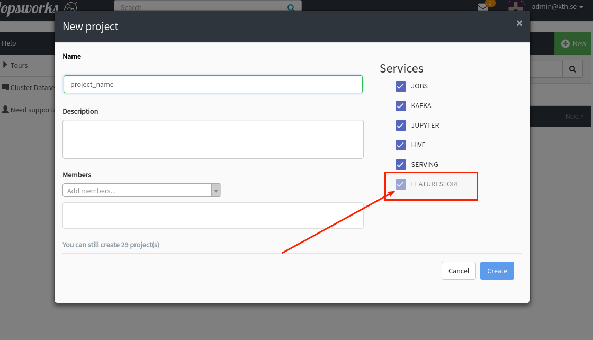

    Create a new project with the feature store service enabled.

Inside the project you can find the feature registry (where all the feature store data is browsable) in the feature store page that is accessible by clicking the feature store icon on the left.

.. _featurestore_open_registry.png: ../_images/opening_feature_registry.png
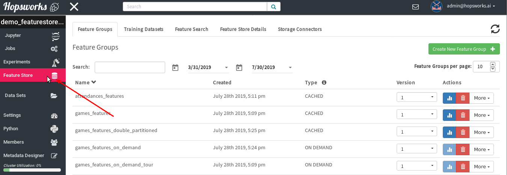

    Opening the feature store registry in Hopsworks.

Data Modeling in the Feature Store
~~~~~~~~~~~~~~~~~~~~~~~~~~~~~~~~~~

We introduce three new concepts to our users for modeling data in the feature store.

* The **feature** is an individual versioned and documented data column in the feature store, e.g the average rating of a customer.
* The **feature group** is a documented and versioned group of features stored as a Hive table. The feature group is linked to a specific Spark/Numpy/Pandas job that takes in raw data and outputs the computed features.
* The **training dataset** is a versioned and managed dataset of features and labels (potentially from multiple different feature groups). Training datasets are stored in HopsFS as tfrecords, parquet, csv, or tsv files.

.. _featurestore_concepts.png: ../_images/concepts.png
.. figure:: ../imgs/feature_store/concepts.png
    :alt: Feature Store API
    :target: `featurestore_concepts.png`_
    :align: center
    :figclass: align-center

    Concepts for modeling data in the feature store.

The API
~~~~~~~

The feature store in Hopsworks has a REST API that is accessible with any REST-client, or with the provided Python Scala/Java SDKs. This section gives an overview of the API and how to work with either the Python SDK or the Scala/Java SDK. We will show examples of the most common API methods. To get a full overview of the API please see the API-Docs-Python_, API-Docs-Scala_ and the featurestore_example_notebooks_.

**Creating New Features**

The feature store is agnostic to the method for computing the features. The only requirement is that the features can be grouped together in a Pandas, Numpy, or Spark dataframe. The user provides a dataframe with features and associated feature metadata (metadata can also be edited later through the feature registry UI) and the feature store library takes care of creating a new version of the feature group, computing feature statistics and linking the features to the job to compute them.

* Inserting into an existing feature group using the Python API:

.. code-block:: python

    from hops import featurestore
    featurestore.insert_into_featuregroup(features_df, featuregroup_name)

* Inserting into an existing feature group using the Scala/Java API:

.. code-block:: scala

    import io.hops.util.Hops
    Hops.insertIntoFeaturegroup(featuregroupName).setDataframe(sampleDF).setMode("append").write()

* Creating a new feature group using the Python API:

.. code-block:: python

    from hops import featurestore
    featurestore.create_featuregroup(features_df, featuregroup_name)

* Creating a new feature group using the Scala/Java API:

.. code-block:: scala

    import io.hops.util.Hops
    Hops.createFeaturegroup(featuregroupName).setDataframe(featuresDf).write()

**Reading From the Feature Store**

To read features from the feature store, users can use either SQL directly or the API-functions available in Python and Scala. Based on our experience with users on our platform, data scientists can have diverse backgrounds. Although some data scientists are very comfortable with SQL, others prefer higher level APIs. This motivated us to develop a query-planner to simplify user queries. The query-planner enables users to express the bare minimum information to fetch features from the feature store. For example, a user can request 100 features that are spread across 20 different feature groups by just providing a list of feature names. The query planner uses the metadata in the feature store to infer where to fetch the features from and how to join them together.

.. _featurestore_query_planner.png: ../_images/query_optimizer.png
.. figure:: ../imgs/feature_store/query_optimizer.png
    :alt: Feature Store Query Planner
    :target: `featurestore_query_planner.png`_
    :align: center
    :figclass: align-center

    Users query the feature store programmatically or using SQL. The output is provided as Pandas, Numpy or Spark dataframes.

For example, to fetch the features `average_attendance` and `average_player_age` from the feature store, all the user has to write is:

.. code-block:: python

    from hops import featurestore
    features_df = featurestore.get_features(["average_attendance", "average_player_age"])

and using the Scala/Java API:

.. code-block:: scala

    import io.hops.util.Hops
    val features_df = Hops.getFeatures(List("average_attendance", "average_player_age")).read()

**Creating Training Datasets**

Organizations typically have many different types of raw datasets that can be used to extract features. For example, in the context of user recommendation there might be one dataset with demographic data of users and another dataset with user activities. Features from the same dataset are naturally grouped into a feature group, producing one feature group per dataset. When training a model, you want to include all features that have predictive power for the prediction task, these features can potentially span multiple feature groups. The training dataset abstraction in Hopsworks Feature Store is used for this purpose, allowing users to group a set of features with labels for training a model to do a particular prediction task.

Once a user has fetched a set of features from different feature groups in the feature store, the features can be materialized into a training dataset. By creating a training dataset using the feature store API, the dataset becomes managed by the feature store. Managed training datasets are automatically analyzed for data anomalies, versioned, documented, and shared with the rest of the organization.

.. _featurestore_pipeline.png: ../_images/pipeline.png
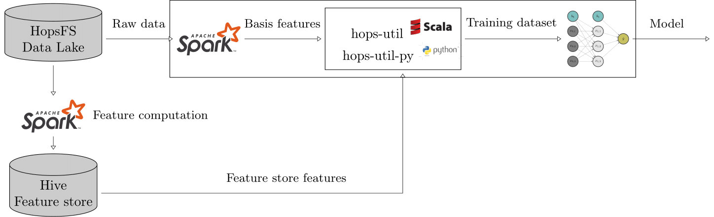

    The life-cycle of data in HopsML. Raw data is transformed into features which are grouped together into training datasets that are used to train models.

To create a managed training dataset, the user supplies a Pandas, Numpy or Spark dataframe with features and labels together with metadata.

* Creating a training dataset using the Python API:

.. code-block:: python

    from hops import featurestore
    featurestore.create_training_dataset(features_df,training_dataset_name,data_format="tfrecords")

* Creating a training dataset using the Scala/Java API:

.. code-block:: scala

    import io.hops.util.Hops
    Hops.createTrainingDataset(training_dataset_name).setDataframe(featuresDf).setDataFormat("tfrecords").write()

**Reading a Training Dataset for Training a Model**:

Once the training dataset has been created, the dataset is discoverable in the feature registry and users can use it to train models. Below is an example code snippet for training a model using a training dataset stored distributed in the tfrecords format on HopsFS.

* Using the Python API:

.. code-block:: python

    from hops import featurestore
    import tensorflow as tf
    dataset_dir = featurestore.get_training_dataset_path(td_name)
    # the tf records are written in a distributed manner using partitions
    input_files = tf.gfile.Glob(dataset_dir + "/part-r-*")
    # tf record schemas are managed by the feature store
    tf_record_schema = featurestore.get_training_dataset_tf_record_schema(td_name)
    def decode(example_proto):
        return tf.parse_single_example(example_proto, tf_record_schema)

    dataset = tf.data.TFRecordDataset(input_files)
                                 .map(decode)
                                 .shuffle(shuffle_buffer_size)
                                 .batch(batch_size)
                                 .repeat(num_epochs)
    # three layer MLP for regression
    model = tf.keras.Sequential([
           layers.Dense(64, activation="relu"),
           layers.Dense(64, activation="relu"),
           layers.Dense(1)
        ])
    model.compile(optimizer=tf.train.AdamOptimizer(lr), loss="mse")
    model.fit(dataset, epochs=num_epochs, steps_per_epoch=spe)

* Using the Scala/Java API:

.. code-block:: scala

    import io.hops.util.Hops
    val dataset_df = Hops.getTrainingDataset("team_position_prediction").read()
    val transformedDf = new VectorAssembler().setInputCols(Array( "average_player_rating","average_attendance", "sum_player_rating",
                     "sum_position", "sum_player_worth", "average_player_age", "average_player_worth",
                     "team_budget", "average_position", "sum_player_age", "sum_attendance")).
		     setOutputCol("features").
		     transform(dataset_df).
		     drop("average_player_rating").
		     drop("average_attendance").
		     drop("sum_player_rating").
		     drop("sum_player_worth").
		     drop("average_player_age").
		     drop("average_player_worth").
		     drop("team_budget").
		     drop("average_position").
		     drop("sum_player_age").
		     drop("sum_attendance").
		     drop("sum_position")
    val lr = new LinearRegression().
    setLabelCol("team_position").
    setFeaturesCol("features").
    setMaxIter(NUM_ITER).
    setRegParam(REG_LAMBDA_PARAM).
    setElasticNetParam(ELASTIC_REG_PARAM)
    val lrModel = lr.fit(transformedDf)
    lrModel.transform(transformedDf).select("features", "team_position", "prediction").show()
    val trainingSummary = lrModel.summary
    println(s"numIterations: ${trainingSummary.totalIterations}")
    println(s"objectiveHistory: [${trainingSummary.objectiveHistory.mkString(",")}]")
    trainingSummary.residuals.show()
    println(s"RMSE: ${trainingSummary.rootMeanSquaredError}")
    println(s"r2: ${trainingSummary.r2}")

**Attaching Custom Metadata to a Feature Group**:

The feature store APIs allows users to attach custom metadata to a feaure group. Currently, only Cached Feature Groups are supported. The users need to supply a metadata dictionary.

* Using the Python API:

.. code-block:: python

    from hops import featurestore
    metadataDict = {"key1" : "value1", "key2": "value2"}
    featurestore.add_metadata(featuregroup_name, metadataDict)

* Using the Scala/Java API:

.. code-block:: scala

    import io.hops.util.Hops
    import scala.collection.JavaConversions._
    import collection.JavaConverters._

    val metadataDict = Map("key1" -> "value1", "key2" -> "value2")
    Hops.addMetadata(featuregroup_name).setMetadata(metadataDict).write()

**Reading Custom Metadata attached to a Feature Group**:

Users can retrieve all metadata attached to a feature group or only specific metadata by their keys.

* Using the Python API:

.. code-block:: python

    from hops import featurestore
    # get all metadata
    featurestore.get_metadata(featuregroup_name)
    # get metadata for key1
    featurestore.get_metadata(featuregroup_name, ["key1"])
    # get metadata for key1 and key2
    featurestore.get_metadata(featuregroup_name, ["key1", "key2"])

* Using the Scala/Java API:

.. code-block:: scala

    import io.hops.util.Hops
    import scala.collection.JavaConversions._
    import collection.JavaConverters._

    // get all metadata
    Hops.getMetadata(featuregroup_name).read()
    // get metadata for key1
    Hops.getMetadata(featuregroup_name).setKeys("key1").read()
    // get metadata for key1, key2
    Hops.getMetadata(featuregroup_name).setKeys("key1", "key2").read()

**Removing Custom Metadata attached to a Feature Group**:

Users can remove the metadata attached to a feature group by their keys.

* Using the Python API:

.. code-block:: python

    from hops import featurestore

    # remove metadata for key1 and key2
    featurestore.remove_metadata(featuregroup_name, ["key1", "key2"])

* Using the Scala/Java API:

.. code-block:: scala

    import io.hops.util.Hops
    import scala.collection.JavaConversions._
    import collection.JavaConverters._

    // remove metadata for key1, key2
    Hops.removeMetadata(featuregroup_name).setKeys("key1", "key2").write()

The Feature Registry
----------------------

The feature registry is the user interface for publishing and discovering features and training datasets. The feature registry also serves as a tool for analyzing feature evolution over time by comparing feature versions. When a new data science project is started, data scientists within the project typically begin by scanning the feature registry for available features, and only add new features for their model that do not already exist in the feature store.

The feature registry provides:

* Keyword search on feature/feature group/training dataset metadata.
* Create/Update/Delete/View operations on feature/feature group/training dataset metadata.
* Automatic feature analysis.
* Feature dependency/provenance tracking.
* Feature job tracking.

**Finding Features**

In the registry you can search for features, feature groups and training datasets in the search bar. Features are automatically grouped by versions in the search results.

.. _hopsworks_featurestore_finding_features.png: ../_images/finding_features.png
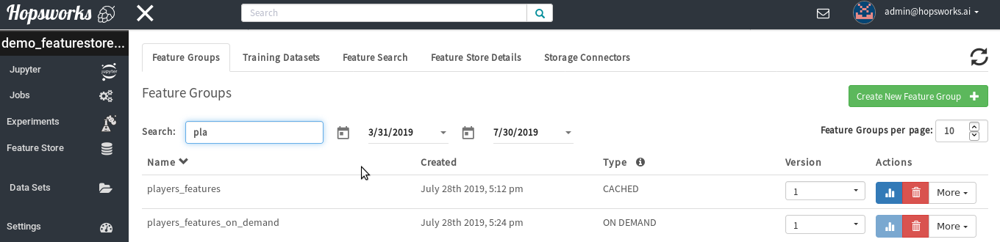

    Searching for features in the feature registry.

**Automatic Feature Analysis**

When a feature group or training dataset is updated in the feature store, a data analysis step is performed. In particular, we look at cluster analysis, feature correlation, feature histograms and descriptive statistics. We have found that these are the most common type of statistics that our users find useful in the feature modeling phase. For example, feature correlation information can be used to identify redundant features, feature histograms can be used to monitor feature distributions between different versions of a feature to discover covariate shift, and cluster analysis can be used to spot outliers. Having such statistics accessible in the feature registry helps data scientists decide on which features to use.

.. _hopsworks_featurestore_opening_stats_tab.png: ../_images/opening_stats_tab.png
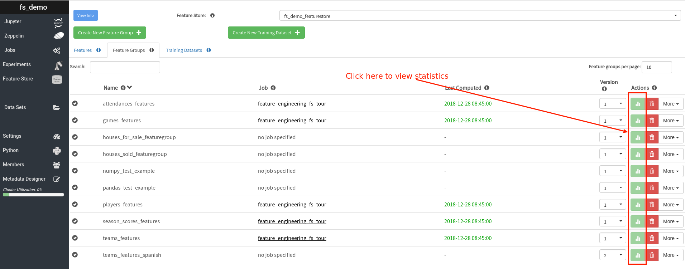

    Opening that statistics for a feature group.

**Features Unit testing**

We envision the Feature Store as a task in the software engineering life cycle. In traditional software engineering testing is an essential part of the life cycle, it even drives the development of a product.
Feature Store sits right before start training machine learning models which might take hours or days to converge. Data flowing into the Feature Store might contain invalid values which will eventually end up
training your model.

Those "bugs" in best case they brake some functional requirements of the model training application which will fail the whole pipeline. For example a nil value
that was not supposed to be there and the data scientist did not contemplate. The application will panic and you will have to run the it again. The second type of bugs do not violate any functional requirement but their value is erroneous. The trained model will manifest an erroneous behaviour. Proper testing on the trained model would expose the
problem but it is very hard to find the root of the problem and maybe too late.

In Hopsworks we do Features unit testing to identify "bugs" in feature store before you start your training pipeline. We provide an easy to use UI to compose validation rules on different **feature groups**. Internally we use
`Deequ <https://github.com/awslabs/deequ>`_ to launch a Spark job to perform the validation on TBs of data. Power users can also use Deequ directly to get the most out of the tool.

To compose validation rules or view the result of a previous run, click on the ``More`` button of a feature group and select ``Data Validation``. The main page will show up
where you can compose new validation project, view already composed rules and fetch previous validation result.

.. _hopsworks_featurestore_data_validation_main.png: ../_images/data_validation_main.png
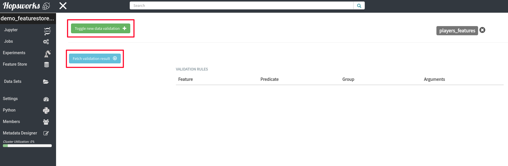

    Features unit testing main page.

Clicking on `Toggle new data validation` button shows up a new page where you can start composing validation rules. A small description is given for every predicate and by clicking `Add` you can edit the predicate's properties
as shown in the figure below. We provide a reasonable subset of Deequ's rules, each rule has a different interpretation of Min and Max values so it is advisable to read the description.
When adding a new predicate to rules you can select if it will be Warning or Error level, on which features of the group applies, minimum and maximum acceptable values for the predicate and
a small hint to be printed in the result.

In the figure below we used ``players_features`` feature group from the Feature Store demo project. It is a valid assumption that none of the features has nil values as this might fail our training job.
We selected all features and minimum/maximum thresholds are 1 since we want all to be complete.

.. _hopsworks_featurestore_data_validation_add_predicate.png: ../_images/data_validation_add_predicate.png
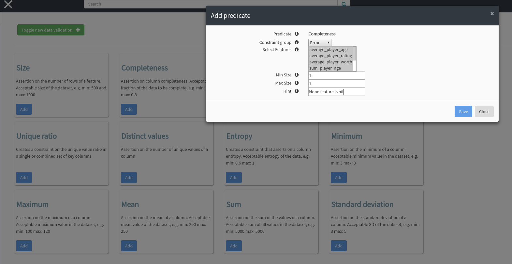

    Adding rules to constraint groups

We continue adding constraints until we're satisfied and then we click on `Create validation job` button on the right under `Checkout rules`.
For the sake of the example we added more constraints such as players' minimum average age is between 18 - 20, maximum between 25 and 30, team ID is unique and the average player rating is between
100 and 700. Finally, the validation rules basket would look like the following:

.. _hopsworks_featurestore_data_validation_checkout_rules.png: ../_images/data_validation_checkout_rules.png
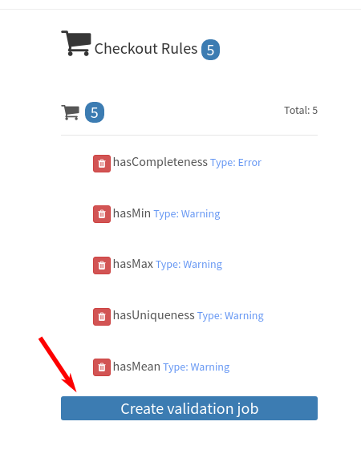

    Checking out validation rules.

Clicking on `Create validation job` button will redirect you to Jobs UI where the unit testing job has been created and we can click on `Run` button to start testing our feature group values.
After the job has finished we can go back to ``Data Validation`` page, click on `Fetch validation result` and see the results. For the example we did above, the results
are the following:

.. _hopsworks_featurestore_data_validation_result.png: ../_images/data_validation_result.png
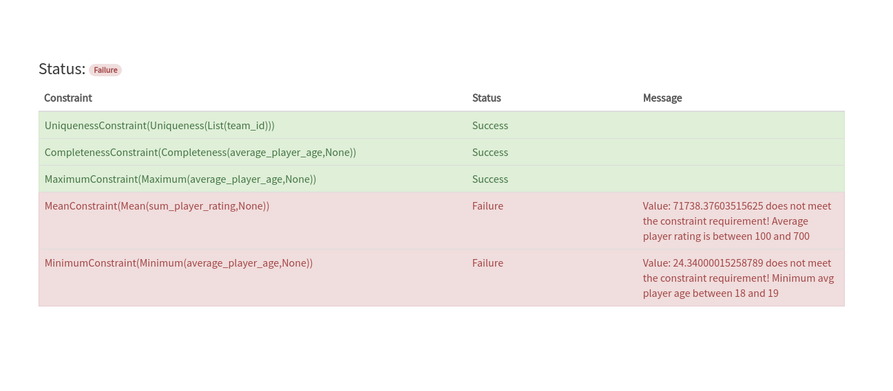

    Feature group unit testing result.

From the results we can see that all ``team_id`` s are unique, there is no nil value and the maximum average player age is indeed between 25 and 30.
Our mean constraint has failed since there is a mean value of 71738 which is not between 100 and 700. Also, the minimum average player age constraint has failed.

As we see from this example, the functional requirements of the program are met - we don't have any duplicate or nil values. The "erroneous" minimum average player age
value or mean player rating could have changed the predictive power of our model and we would not have noticed it in time.

We can schedule the whole process as Airflow tasks that will run periodically before start training your model. If you want to learn more about Airflow check our
:doc:`documentation <airflow>`. Assuming that you have already composed the validation rules, we will use Airflow operators to launch the validation job and when it finishes we will fetch the result. If the validation
is not successful then the DAG will fail without executing any other tasks. The operators would look like the following:

.. code-block:: python

    # Run validation job
    validation = HopsworksLaunchOperator(dag=dag,
                                         project_name=PROJECT_NAME,
                                         # Arbitrary task name
                                         task_id="validation_job",
                                         job_name=VALIDATION_JOB_NAME)

    # Fetch validation result
    result = HopsworksFeatureValidationResult(dag=dag,
                                              project_name=PROJECT_NAME,
                                              # Arbitrary task name
                                              task_id="parse_validation",
                                              feature_group_name=FEATURE_GROUP_NAME)

    # Run first the validation job and then evaluate the result
    validation >> result

For the full validation DAG example and more visit our `GitHub repo <https://github.com/logicalclocks/hops-examples/tree/master/airflow>`_

**Other Actions Available in the Feature Registry**

A common practice using the feature store is that the data of feature groups and training datasets are inserted using the APIs in Python/Java/Scala, but the metadata is filled and edited from the feature registry UI. In addition to editing metadata about features, the registry also provides the following functionality:

* Create/Update/Delete operations on feature groups and training datasets
* Preview feature group data
* View feature group and training dataset schemas
* Create new Training Datasets by grouping features together
* Configuring storage connectors

On-Demand and Cached Features
------------------------------------

There are two types of feature groups in the Feature Store:

* **Cached Feature Group**: This type of feature group is the most common, it will store the computed features inside the Hopsworks Feature Store.
* **On-Demand Feature Groups**: This type of feature group is not stored in Hopsworks, rather it is computed *on-demand*. To create an on-demand feature group you must configure a JDBC connector and a SQL query to compute the features. On-demand feature groups are typically used when an organization have feature data available in external storage systems and don't want to duplicate the data in Hopsworks feature store.

The code-snippets below illustrates the different APIs for creating a cached vs an on-demand feature group using the Scala SDK:

.. code-block:: scala

    //Cached Feature Group
    Hops.createFeaturegroup(fgName).setDataframe(df).write()

    //On-Demand Feature Group
    Hops.createFeaturegroup(fgName).setOnDemand(true).setJdbcConnector(sc).setSqlQuery(query).write()

Online and Offline Feature Groups
---------------------------------

To explain the need for the separation into online and offline features, it is useful to review the use-cases of the feature store. The feature store has a natural fit in the machine learning workflow. The feature store works as an interface between data engineers and data scientists.

- **Data Engineers** write features into the feature store. Typically they will (1) read some raw or structured data from a data lake: (2) apply transformations on the data using som data processing framework like Spark; (3) store the transformed feature data in the feature store; (4) add documentation, versioning information, and statistics to the feature data in the feature store.
- **Data Scientists** tend to read features from the feature store for (1) training machine learning models and experimenting with different combination of features; and (2) serving features into machine learning models. These two-use cases of the feature store has very different characteristics, motivating the need for a separation between *online* store of features and an *offline* store of features.

When reading from the feature store for training/experimentation, there are requirements on the feature store such as

- **Scale**; The feature store needs to be able to store and manage huge feature sets (multi-terabyte at least).
- **Flexibility**; Data scientists must be able to read from the feature store and use the data in different machine learning frameworks, like Tensorflow, Keras, Scikit learn, and PyTorch.
- **Analysis**; Data scientists need an understanding of the feature data to be able to make most use of it in their models. They should be able to analyze the features, view their distributions over time, their correlations with each other etc.
- **Point-in-time correctness**; It can be valuable to be able to extract the value of a feature at a specific point-in-time to be able to later on change the value of the feature. For example, say that we at point in time X have a feature-vector for customer C1, and at time X we don’t know that C1 is doing fraud, so the label of C1 is “benign customer”. Later on at time Y we find out that customer C1 actually was taking part in fraudulent activity at time X. Then we want to be able to go back and modify the label of C1 to “malign customer” and re-train our model or re-evaluate the model. I.e it should be possible to re-create old training data from future predictions. Ideally, this point-in-time correctness of a feature should be possible without having to store the value of a feature at every single point in time, rather it should be possible to re-compute the value of a feature at a specific point in time dynamically.

On the other hand, when reading from the feature store for serving models there are very specific requirements that differ from the requirements for training/serving:

- **Real-time**; for client-facing models, features must be available in real-time for making predictions to avoid destroying the user-experience for the user. The limits for what is considered real-time depends on the context. Hopsworks feature store can serve features in < 5 ms.
- **Online/Offline Consistency**; when a feature is used for both training and serving, and stored in two different storage layers, you want to make sure that the value and semantics of the feature is consistent. Offline/online consistency has a lot to do with that you have to rewrite code between train and serving, if you can use the same code for both, then a lot is solved as the transformation to compute the feature happens before it gets to the feature store, if the code for computing the feature is consistent between training/serving you can store the feature data in two different storage layers for training/serving and still be confident in its consistency. However, if you have to rewrite the pipeline to compute batch features to a new pipeline for computing online features, you might get consistency issues. The data that you give the model during serving has to look exactly the same as the data you train the model with, otherwise your model will behave weird and bad.

Due to the very different requirements on batch and real-time features, it is common to split the feature store into two parts, a batch feature store for storing features for training and a real-time feature store for storing features for serving. In Hopsworks we store offline feature data in **Hive** and online feature data in **MySQL Cluster**.

.. _hopsworks_online_featurestore.png: ../_images/online_featurestore.png
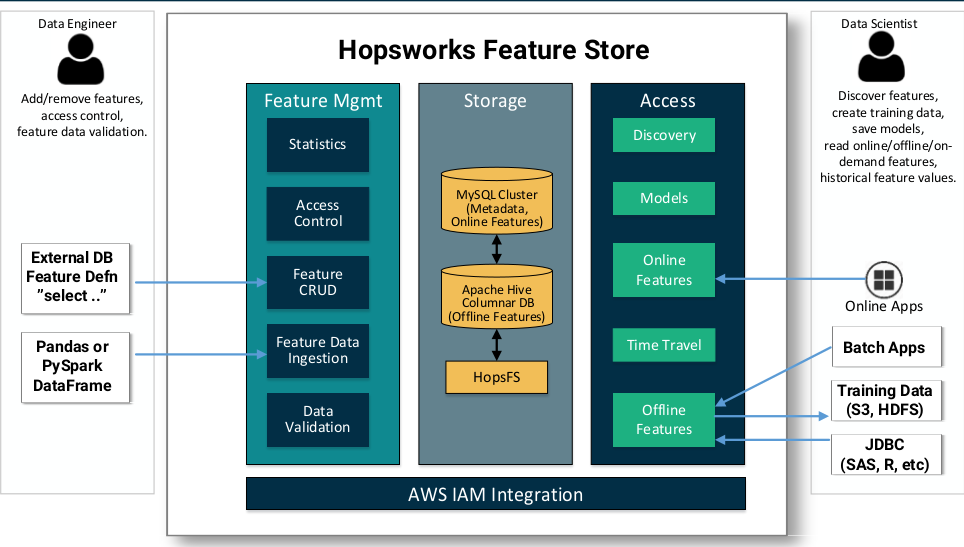

    Hopsworks Feature Store Architecture. Online features are stored in MySQL Cluster and Offline Features are stored in Hive.

The feature store service on Hopsworks unifies the Online/Offline feature data under a single API, making the underlying infrastructure transparent to the data scientist.

.. _hopsworks_online_featurestore2.png: ../_images/online_featurestore2.png
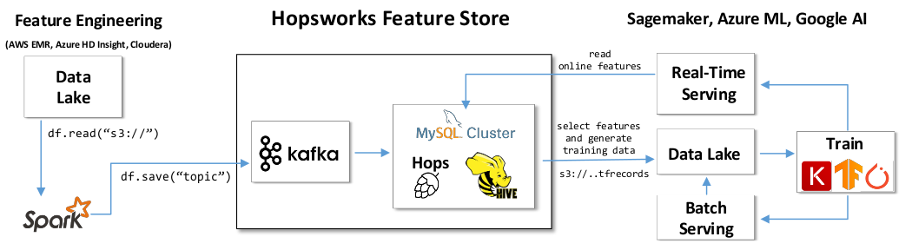rs to common ML frameworks and platforms.
    :target: `hopsworks_online_featurestore2.png`_
    :align: center
    :figclass: align-center

    Data is typically ingested into the Feature Store through Kafka and historical data is stored in the offline feature store (Hive) and recent data for online-serving is stored in the online feature store (MySQL Cluster). The feature store provides connectors to common ML frameworks and platforms.

The code-snippets below illustrates the different APIs for creating feature groups with online/offline storage enabled:

.. code-block:: python

    from hops import featurestore

    # create feature group and insert data only in the online storage
    featurestore.create_featuregroup(spark_df, featuregroup_name, online=True, primary_key="id")

    # create feature group and insert data only in the offline storage
    featurestore.create_featuregroup(spark_df, featuregroup_name, online=False, offline=True, primary_key="id")

    # create feature group and insert data in both the online and the offline storage
    featurestore.create_featuregroup(spark_df, featuregroup_name, online=True, offline=True, primary_key="id")

    # insert into an existing online feature group
    featurestore.insert_into_featuregroup(sample_df, "online_featuregroup_test", online=True, offline=False, mode="append")

    # insert into an existing offline feature group
    featurestore.insert_into_featuregroup(sample_df, "online_featuregroup_test", online=False, offline=True, mode="append")

    # insert into an existing online & offline feature group
    featurestore.insert_into_featuregroup(sample_df, "online_featuregroup_test", online=True, offline=True, mode="append")

The same methods for reading the offline feature store can be used to read from the online feature store by setting the argument `online=True`. However, please note that as the online feature store is supposed to be used for feature serving, it should be queried with primary-key lookups for getting the best performance. In fact, it is highly discouraged to use the online feature serving for doing full-table-scans. If you find yourself frequently needing to use `get_featuregroup(online=True)` to get the entire feature group (full-table scan), you are probably better of using the offline feature store. The online feature store is intended for quick primary key lookups, not data analysis. The code-snippets below illustrates the different APIs for reading from the online/offline feature store.

.. code-block:: python

    from hops import featurestore

    # primary key lookup in the online feature store using SQL
    df = featurestore.sql("SELECT feature FROM featuregroup_name WHERE primary_key=x", online=True)

    # read all values of a given featuregroup in the online featurestore
    df = featurestore.get_featuregroup(featuregroup_name, online=True)

    # read all values of a given feature in the online featurestore
    df = featurestore.get_feature(feature_name, online=True)

More examples of using feature store Python and Scala SDK to read/write from/to the online feature store are available at featurestore_example_notebooks_.

External and HopsFS Training Datasets
-------------------------------------

There are two storage types for training datasets in the Feature Store:

* **HopsFS**: The default storage type for training datasets is HopsFS, a state-of-the-art scalable file system that comes bundled with the Hopsworks stack.
* **S3**: The feature store SDKs also provides the functionality to store training datasets external to a Hopsworks installation, e.g in S3. When training datasets are stored in S3, only the metadata is managed in Hopsworks and the actual data is stored in S3. To be able to create external training datasets, you must first configure a storage connector to S3.

The code-snippets below illustrates the different APIs for creating a training dataset stored in HopsFS vs a training dataset stored in S3, using the Scala SDK:

.. code-block:: scala

    //Training Dataset stored in HopsFS (default sink)
    Hops.createTrainingDataset(tdName).setDataframe(df).write()

    //External Training Dataset
    Hops.createTrainingDataset(tdName).setDataframe(df).setSink(s3Connector).write()

Configuring Storage Connectors for the Feature Store
----------------------------------------------------

By default, a feature store created in Hopsworks will have three storage connectors:

- `projectname`, a JDBC connector for the project's general-purpose Hive database
- `projectname_featurestore`, a JDBC connector for the project's feature store database (this is where cached feature groups are stored)
- `projectname_Training_Datasets`, a HopsFS connector for storing training datasets inside the project

To configure new storage connectors, e.g S3, HopsFS, or JDBC connectors, use the form available in the feature registry UI.

.. _hopsworks_featurestore_new_sc.png: ../_images/new_sc.png
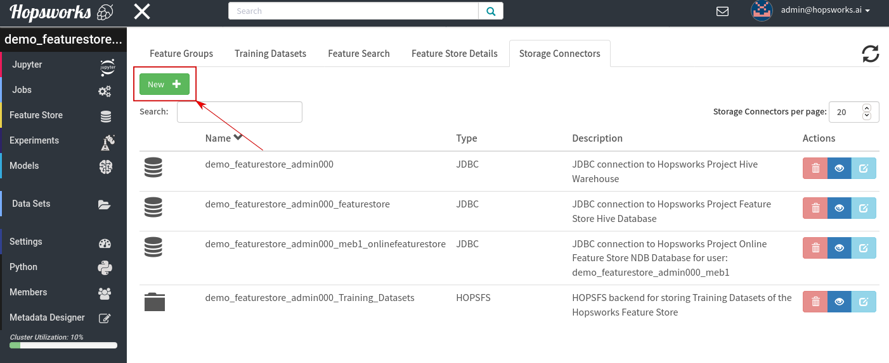

    Storage Connectors can be configured from the Feature Store UI in Hopsworks.

Incremental Ingestion to the Feature Store using Apache Hudi
------------------------------------------------------------

Hopsworks Feature Store supports Apache Hudi (hudi_) for efficient upserts and time-travel in the feature store. Below is a code-snippet illustrating how to use Hudi when inserting into feature groups and for time-travel.

.. code-block:: scala

    import io.hops.util.Hops
    Hops.createFeaturegroup(featuregroup_name)
                         .setHudi(true)
                         .setPartitionBy(partitionCols)
                         .setDataframe(sparkDf)
                         .setPrimaryKey(primaryKeyName).write()

    Hops.queryFeaturestore("SELECT id, value FROM featuregroup_name WHERE _hoodie_commit_time = X").read.show(5)

A Multi-tenant Feature Store Service
------------------------------------

Despite the benefit of centralizing features, we have identified a need to enforce access control to features. Several organizations that we have talked to are working partially with sensitive data that requires specific access rights that is not granted to everyone in the organization. For example, it might not be feasible to publish features that are extracted from sensitive data to a feature store that is public within the organization.

To solve this problem we utilize the multi-tenant model of Hopsworks. Feature stores in Hopsworks are by default project-private and can be shared across projects, which means that an organization can combine public and private feature stores. An organization can have a central public feature store that is shared with everyone in the organization as well as private feature stores containing features of sensitive nature that are only accessible by users with the appropriate permissions.

.. _hopsworks_featurestore_multitenant.png: ../_images/multitenant.png
.. figure:: ../imgs/feature_store/multitenant.png
    :alt: Based on the organization need, features can be divided into several feature stores to preserve data access control.
    :target: `hopsworks_featurestore_multitenant.png`_
    :align: center
    :scale: 55 %
    :figclass: align-center

    Based on the organization need, features can be divided into several feature stores to preserve data access control.

To share a feature store with another project, share the dataset containing the feature groups and features (**projectname_featurestore.db**) as well as the dataset that contains the training datasets (**projectname_Training_Datasets**). To share datasets in Hopsworks simply right-click the feature store inside of your project dataset browser:

.. _hopsworks_featurestore_share_fs.png: ../_images/share_fs.png
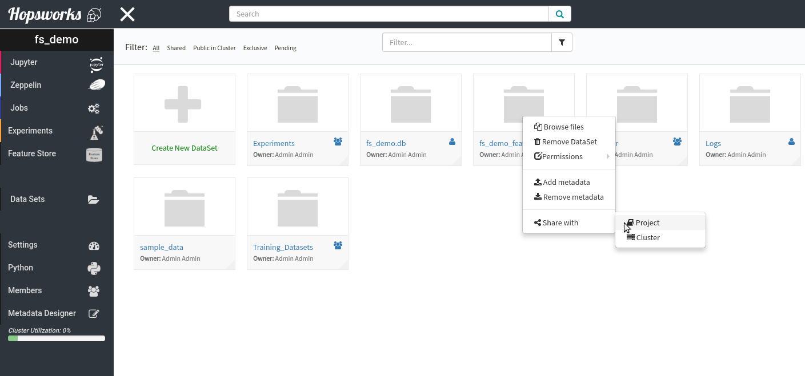

    Feature stores can be shared across project boundaries.

When you have multiple feature stores shared with your project you can select which one to view in the feature registry:

.. _hopsworks_featurestore_select_fs.png: ../_images/select_fs.png
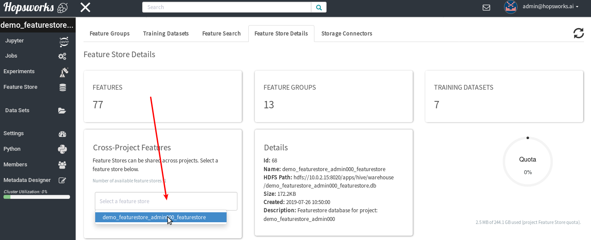

    Selecting a feature store in the feature registry.

Technical Details on the Architecture
-------------------------------------

The architecture of the feature store in hopsworks is depicted in the image below.

.. _hopsworks_featurestore_architecture.png: ../_images/arch_w_pandas_numpy.png
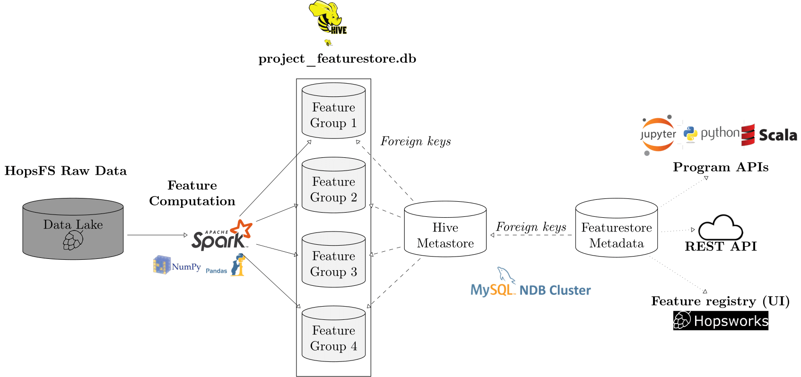

    Architecture of Hops Feature Store.

A feature store consists of five main components:

* The feature engineering jobs, the jobs used to compute the features and insert into the feature store.
* The storage layer for storing the feature data.
* The metadata layer used for storing code to compute features, versioning, analysis data, and documentation.
* The API, used for reading/writing features from/to the feature store.
* The feature registry, a user interface (UI) service where data scientists can share, discover, and order computation of features.

.. _hopsworks_featurestore_stack.png: ../_images/fs_stack.png
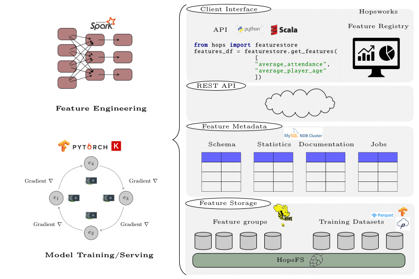

    Feature Store Component Hierarchy.

Connecting from Amazon SageMaker
--------------------------------
Connecting to the Feature Store from Amazon SageMaker requires a Feature Store API key to be stored in the AWS Secrets Manager or Parameter Store. Additionally, read access to this API key needs to be given to the AWS role used by SageMaker and hops-util-py needs to be installed on SageMaker.

**Generating an API Key and storing it in the AWS Secrets Manager**

In Hopsworks, click on your username in the top-right corner and select *Settings* to open the user settings. Select *Api keys*. Give the key a name and select the *featurestore* and *project* scopes before creating the key. Copy the key into your clipboard for the next step.

.. _hopsworks_api_key.png: ../_images/api_key.png
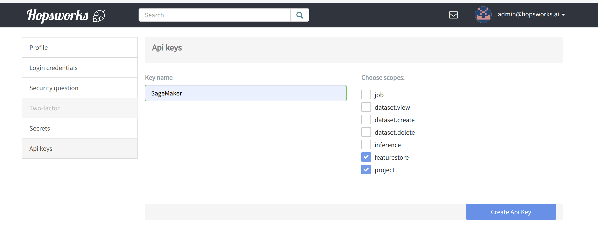

**(Alternative 1) Storing the API Key in the AWS Secrets Manager**

In the AWS management console ensure that your active region is the region you use for SageMaker. Go to the *AWS Secrets Manager* and select *Store new secret*. Select *Other type of secrets* and add *api-key* as the key and paste the API key created in the previous step as the value. Click next.

.. _hopsworks_secrets_manager.png: ../_images/secrets_manager.png
.. figure:: ../imgs/feature_store/secrets_manager.png
    :alt: Hopsworks feature store secrets manager step 1
    :target: `hopsworks_secrets_manager.png`_
    :align: center
    :scale: 20 %
    :figclass: align-center

As secret name enter *hopsworks/role/[MY_SAGEMAKER_ROLE]* replacing [MY_SAGEMAKER_ROLE] with the AWS role used by the SageMaker instance that should access the Feature Store. Select next twice and finally store the secret. Then click on the secret in the secrets list and take note of the *Secret ARN*.

.. _hopsworks_secrets_manager2.png: ../_images/secrets_manager2.png
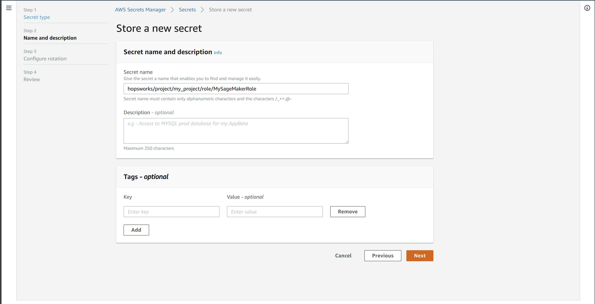

**(Alternative 1) Granting access to the secret to the SageMaker notebook role**

In the AWS management console go to *IAM*, select *Roles* and then the role that is used when creating SageMaker notebook instances. Select *Add inline policy*. Choose *Secrets Manager* as service, expand the *Read* access level and check *GetSecretValue*. Expand Resources and select *Add ARN*. Paste the ARN of the secret created in the previous step. Click on *Review*, give the policy a name und click on *Create policy*.

.. _hopsworks_aws_policy.png: /_images/aws_policy.png
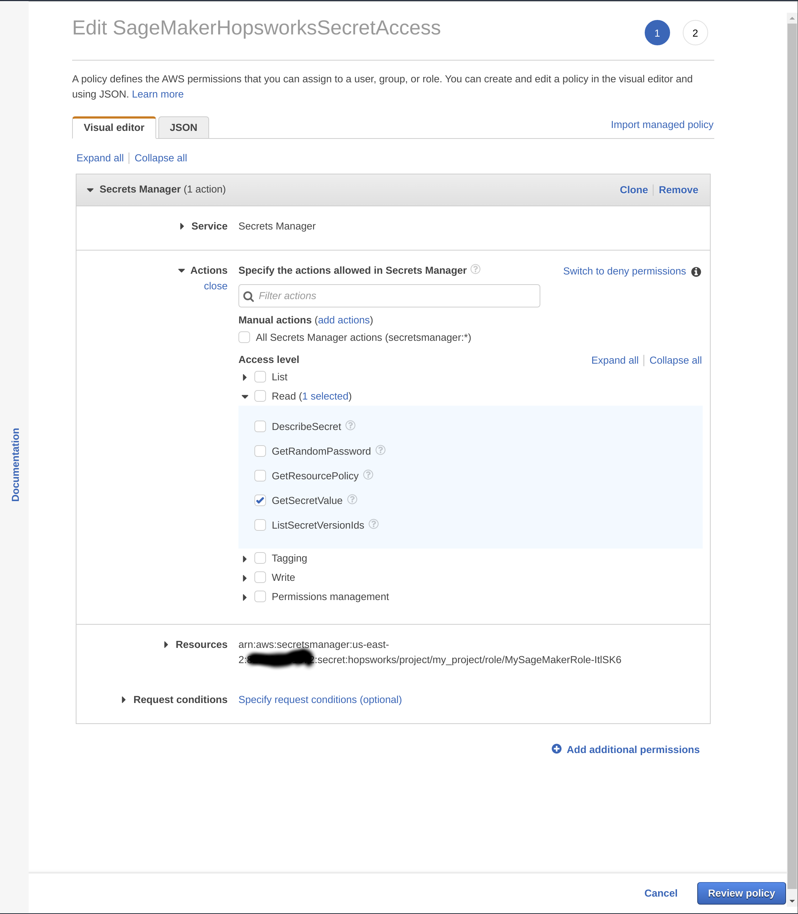

**(Alternative 2) Storing the API Key in the AWS Systems Manager Parameter Store**

In the AWS management console ensure that your active region is the region you use for SageMaker. Go to the *AWS Systems Manager* choose *Parameter Store* and select *Create Parameter*. As name enter */hopsworks/role/[MY_SAGEMAKER_ROLE]/type/api-key* replacing [MY_SAGEMAKER_ROLE] with the AWS role used by the SageMaker instance that should access the Feature Store. Select *Secure String* as type and create the parameter.

.. _hopsworks_parameter_store.png: ../_images/parameter_store.png
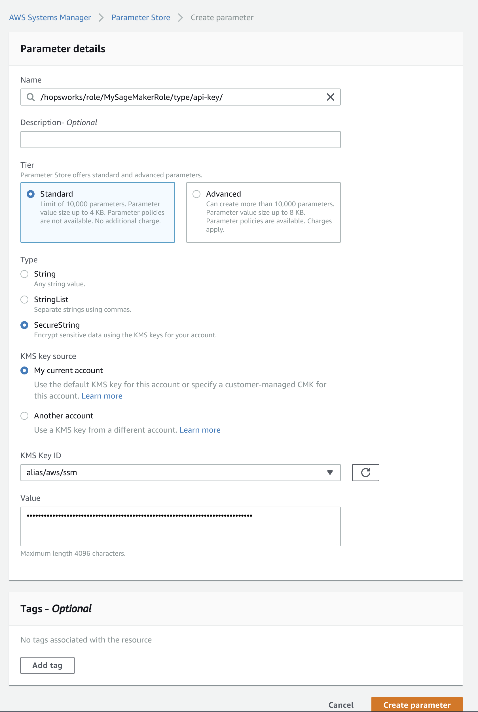

**(Alternative 2) Granting access to the secret to the SageMaker notebook role**

In the AWS management console go to *IAM*, select *Roles* and then the role that is used when creating SageMaker notebook instances. Select *Add inline policy*. Choose *Systems Manager* as service, expand the *Read* access level and check *GetParameter*. Expand Resources and select *Add ARN*. Fill in the region of the *Systems Manager* as well as the name of the parameter **WITHOUT the leading slash** e.g. *hopsworks/role/[MY_SAGEMAKER_ROLE]/type/api-key* and click *Add*. Click on *Review*, give the policy a name und click on *Create policy*.

.. _hopsworks_aws_policy2.png: ../_images/aws_policy2.png
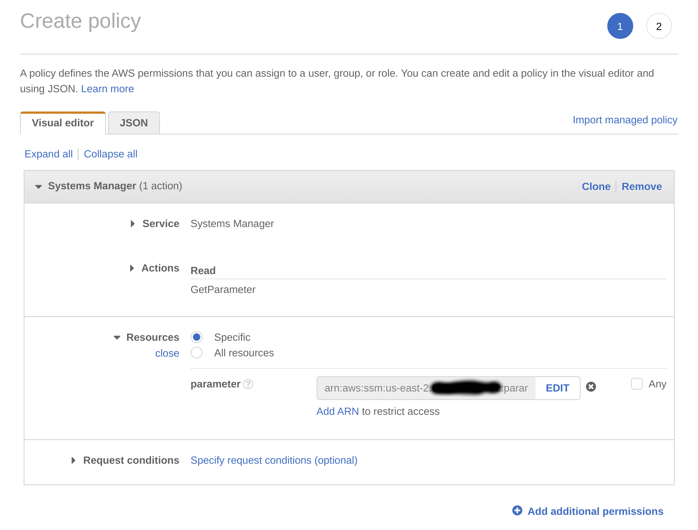

**Installing hopsworks-cloud-sdk and connecting to the Feature Store**

To be able to access the Hopsworks Feature Store, the hopsworks-cloud-sdk library needs to be installed. One way of achieving this is by opening a Python notebook in SageMaker and installing the latest hopsworks-cloud-sdk. Note that the library will not be persistent. For information around how to permanently install a library to Sagemaker see `Install External Libraries and Kernels in Notebook Instances <https://docs.aws.amazon.com/sagemaker/latest/dg/nbi-add-external.html>`_. ::

    !pip install hopsworks-cloud-sdk

You can now connect to the Feature Store::

    import hops.featurestore as fs
    fs.connect('my_instance.us-east-2.compute.amazonaws.com', 'my_project', secrets_store = 'secretsmanager')

If you have trouble connecting, then ensure that the Security Group of your Hopsworks instance on AWS is configured to allow incoming traffic from your SageMaker instance. See `VPC Security Groups <https://docs.aws.amazon.com/vpc/latest/userguide/VPC_SecurityGroups.html>`_. for more information. If your Sagemaker instances are not in the same VPC as your Hopsworks instance and the Hopsworks instance is not accessible from the internet then you will need to configure `VPC Peering on AWS <https://docs.aws.amazon.com/vpc/latest/peering/what-is-vpc-peering.html>`_.

Connecting from Databricks notebooks
------------------------------------

**Setting up roles and API keys**

Follow the steps described in `Connecting from Amazon SageMaker`_ for setting up Hopsworks API keys and AWS roles and access to secrets. **Note that only the parameter store (Alternative 2) is currently being supported for Databricks.** Ensure to use the role that is specified in the *Advanced Options* when creating a Spark cluster in Databricks.

**Installing hopsworks-cloud-sdk**

The feature store library needs to be installed to connect to it. In the Databricks UI, go to *Clusters* and select your cluster. Select *Libraries* and then *Install New*. As *Library Source* choose *PyPI* and fill in *hopsworks-cloud-sdk* into the *Package* field.

**Mounting a bucket for storing certificates**

Hopsworks relies on certificates being available in the Databricks cluster in order to connect to some services inside Hopsworks. To ensure that these certificates can be distributed to all nodes in a Databricks cluster, Hopsworks relies on mounting an S3 bucket with read/write permission using the databricks file system. Please follow Databrick's guide for setting up a mount: `Mount S3 Buckets with DBFS <https://docs.databricks.com/data/data-sources/aws/amazon-s3.html#mount-s3-buckets-with-dbfs>`_

**Connecting to the Feature Store**

In the Databricks notebooks connected to the prepared cluster use the following code to connect to the feature store::

    import hops.featurestore as fs
    fs.connect('my_instance.us-east-2.compute.amazonaws.com', 'my_project', cert_folder='/dbfs/mnt/my_mount_name')

If you have trouble connecting, then ensure that the Security Group of your Hopsworks instance on AWS is configured to allow incoming traffic from your SageMaker instance. See `VPC Security Groups <https://docs.aws.amazon.com/vpc/latest/userguide/VPC_SecurityGroups.html>`_. for more information. If the Hopsworks instance is not accessible from the internet then you will need to configure `VPC Peering <https://docs.databricks.com/administration-guide/cloud-configurations/aws/vpc-peering.html>`_.

Want to Learn More?
-------------------

We have provided a large number of example notebooks, available here_. Go to Hopsworks and try them out! You can do this either by taking one of the built-in *tours* on Hopsworks, or by uploading one of the example notebooks to your project and run it through the Jupyter service. You can also have a look at HopsML_, which enables large-scale distributed deep learning on Hops.

.. _here: https://github.com/logicalclocks/hops-examples
.. _HopsML: ../../hopsml/hopsML.html
.. _jobs: ./jobs.html
.. _featurestore_example_notebooks: https://github.com/Limmen/hops-examples/tree/HOPSWORKS-721/notebooks/featurestore
.. _API-Docs-Python: http://hops-py.logicalclocks.com/
.. _API-Docs-Scala: http://snurran.sics.se/hops/hops-util-javadoc/
.. _hudi: http://hudi.apache.org/

Frequently Asked Questions (FAQ)
--------------------------------------------------------------------------

General
~~~~~~~~~~~~~~~~~~~~~~

**What is a featurestore?**

A feature store is a data management layer for machine learning. It is a place to store curated, versioned, access-controlled, and documented features. The idea with the feature store is to make features for machine learning a first-class citizen in the data lake of the organization, and to democratize access to feature data. Instead of storing features in ad-hoc files spread across the organization, the features are centralized in the feature store.

Centralizing features and making feature data a first-class citizen comes with many benefits, such as: (1) feature reuse; (2) feature discoverability; (3) feature backfilling and pre-computation; (4) improved documentation and analysis of features; and (5) software engineering principles applied to features, such as versioning, documentation and access control.

**How is a Featurestore different from a Data Lake?**

The featurestore is a data management layer explicitly designed for machine learning — with built-in integrations for machine learning frameworks and support for common machine learning use-cases — as opposed to a traditional data lake which is more general. A common setup is to use a data lake as the input-source for computing features that in turn are stored in the featurestore.

**When is a Featurestore useful for me and my organization?**

A featurestore is useful when you have a team of data scientists larger than three or four people, or expect that your data scientist team will grow in the future. The featurestore makes it possible for data scientists and engineers to cooperate and perform collaborative data science. The featurestore encourages feature reuse, as well as following software engineering principles in machine learning workflows.

**What are some non-goals for Hopsworks Featurestore?**

- The featurestore is not intended as a general database to replace your data warehouse.
- The featurestore will not compute or define the feature data for you.
- The featurestore will not replace your existing machine learning frameworks.

**What is the difference between Hopsworks Platform and Hopsworks Featurestore?**

The Hopsworks platform is a superset of the Hopsworks Featurestore. The Featurestore uses about 66% of Hopsworks’ services, but Hopsworks also provides infrastructure for training of models (using Jupyter notebooks and GPUs), real-time serving of models, ML pipelines orchestrated by Airflow, the HopsFS distributed file system, support for Spark/Beam/Flink, Kafka, and project-based multi-tenancy models for managing sensitive data on a shared cluster.

**How is a Featurestore used by Data Engineers, and Data Scientists, respectively?**

From talking with many organizations that work with data and machine learning, the feature store has a natural fit in the organizational structure, where it works as an interface between data engineers and data scientists.

Data Engineers *write* features into the feature store. Typically they will (1) read some raw or structured data from a data lake: (2) apply transformations on the data using som data processing framework like Spark; (3) store the transformed feature data in the feature store; (4) add documentation, versioning information, and statistics to the feature data in the feature store.

Data Scientists *read* features from the feature store. A data scientist tend to read features from the feature store for (1) training machine learning models and experimenting with different combination of features; and (2) serving features into machine learning models.

Installation
~~~~~~~~~~~~~~~~~~~~~~

**How can I try out Hopsworks Featurestore to evaluate it?**

Reach out to us and we’ll help you set it up: `https://www.logicalclocks.com/contact <https://www.logicalclocks.com/contact>`_.

**How can I use Hopsworks Featurestore on premise?**

Instructions for installing Hopsworks (which comes with the feature store) on premise are available here: `https://hopsworks.readthedocs.io/en/latest/installation_guide/platforms/baremetal.html <https://hopsworks.readthedocs.io/en/latest/installation_guide/platforms/baremetal.html>`_.

**How can I use Hopsworks Featurestore on Google Cloud Platform?**

Instructions for installing Hopsworks (which comes with the feature store) on Google Cloud Platform are available here: `https://hopsworks.readthedocs.io/en/latest/installation_guide/platforms/cloud.html <https://hopsworks.readthedocs.io/en/latest/installation_guide/platforms/cloud.html>`_.

**How can I use Hopsworks Featurestore on AWS?**

Instructions for installing Hopsworks (which comes with the feature store) on AWS are available here: `https://hopsworks.readthedocs.io/en/latest/installation_guide/platforms/cloud.html <https://hopsworks.readthedocs.io/en/latest/installation_guide/platforms/cloud.html>`_.

**How can I use Hopsworks Featurestore from Amazon Sagemaker?**

Documentation for accessing Hopsworks Featurestore from Amazon Sagemaker is available here: `https://hopsworks.readthedocs.io/en/latest/user_guide/hopsworks/featurestore.html#connecting-from-amazon-sagemaker <https://hopsworks.readthedocs.io/en/latest/user_guide/hopsworks/featurestore.html#connecting-from-amazon-sagemaker>`_.

**How can I use Hopsworks Featurestore from Databricks Platform?**

Documentation for accessing Hopsworks Featurestore from Databricks Platform is available here: `https://hopsworks.readthedocs.io/en/latest/user_guide/hopsworks/featurestore.html#connecting-from-databricks-notebooks <https://hopsworks.readthedocs.io/en/latest/user_guide/hopsworks/featurestore.html#connecting-from-databricks-notebooks>`_.

**How do I migrate to Hopsworks Featurestore?**

Logical Clocks (`https://www.logicalclocks.com <https://www.logicalclocks.com>`_) is the vendor of Hopsworks Featurestore and have experience in helping customers migrate from cloud infrastructure (such as S3 and GCP) as well as from on-premise installations (such as Hortonworks or Cloudera) to Hopsworks Featurestore. Reach out to us at `https://www.logicalclocks.com <https://www.logicalclocks.com>`_ for suggestions on how to migrate.

Usage
~~~~~~~~~~~~~~~~~~~~~~

**How can I access the Featurestore API from Python?**

The Python SDK can be installed with "`pip install hops`" (`https://pypi.org/project/hops/ <https://pypi.org/project/hops/>`_). After installation, the library can be imported inside your python script or Jupyter notebook:

.. code-block:: python

    from hops import featurestore

Inside a Hopsworks installation, the Python SDK is automatically configured and you can skip the installation step.

API documentation for the Java/Scala SDK for Hopsworks Featurestore is available here: http://hops-py.logicalclocks.com/.

If you are in a cloud environment (outside of Hopsworks) and are only interested in using the featurestore, a trimmed down version of the python API can be installed with: "`pip install hopsworks-cloud-sdk`" (https://pypi.org/project/hopsworks-cloud-sdk/).

**How can I access the Featurestore API from Scala?**

The Scala SDK can be included as a maven dependency:

.. code-block:: XML

    <dependency>
         <groupId>io.hops</groupId>
         <artifactId>hops-util</artifactId>
         <version>1.1.0-SNAPSHOT</version>
         <scope>provided</scope>
    </dependency>

To build the project from scratch, you can clone it from Logical Clocks github: `https://github.com/logicalclocks/hops-util <https://github.com/logicalclocks/hops-util>`_.

.. code-block:: bash

    git clone https://github.com/logicalclocks/hops-util
    cd hops-util
    mvn clean install

API documentation for the Java/Scala SDK for Hopsworks Featurestore is available here: `http://snurran.sics.se/hops/hops-util-javadoc/ <http://snurran.sics.se/hops/hops-util-javadoc/>`_.

**How does Hopsworks Featurestore Integrate with my machine learning framework?**

The featurestore is designed to work seamlessly with Tensorflow, Keras, PyTorch, and Scikit-Learn. Below are some examples of using the featurestore with different machine learning frameworks.

*Scikit Learn:*

.. code-block:: python

    from hops import featurestore
    train_df = featurestore.get_featuregroup("iris_features", dataframe_type="pandas")
    x_df = train_df[['sepal_length', 'sepal_width', 'petal_length', 'petal_width']]
    y_df = train_df[["label"]]
    X = x_df.values
    y = y_df.values.ravel()
    iris_knn = KNeighborsClassifier()
    iris_knn.fit(X, y)

*TensorFlow:*

.. code-block:: python

    from hops import featurestore
    features_df = featurestore.get_features(
        ["team_budget", "average_attendance", "average_player_age",
        "team_position", "sum_attendance",
         "average_player_rating", "average_player_worth", "sum_player_age",
         "sum_player_rating", "sum_player_worth", "sum_position",
         "average_position"
        ]
    )
    featurestore.create_training_dataset(features_df, "team_position_prediction", data_format="tfrecords")

    def create_tf_dataset():
        dataset_dir = featurestore.get_training_dataset_path("team_position_prediction")
        input_files = tf.gfile.Glob(dataset_dir + "/part-r-*")
        dataset = tf.data.TFRecordDataset(input_files)
        tf_record_schema = featurestore.get_training_dataset_tf_record_schema("team_position_prediction")
        feature_names = ["team_budget", "average_attendance", "average_player_age", "sum_attendance",
             "average_player_rating", "average_player_worth", "sum_player_age", "sum_player_rating", "sum_player_worth",
             "sum_position", "average_position"
            ]
        label_name = "team_position"

        def decode(example_proto):
            example = tf.parse_single_example(example_proto, tf_record_schema)
            x = []
            for feature_name in feature_names:
                x.append(example[feature_name])
            y = [tf.cast(example[label_name], tf.float32)]
            return x,y

        dataset = dataset.map(decode).shuffle(SHUFFLE_BUFFER_SIZE).batch(BATCH_SIZE).repeat(NUM_EPOCHS)
        return dataset
    tf_dataset = create_tf_dataset()

*PyTorch*:

.. code-block:: python

    from hops import featurestore
    df_train=...
    featurestore.create_training_dataset(df_train, "MNIST_train_petastorm", data_format="petastorm")

    from petastorm.pytorch import DataLoader
    train_dataset_path = featurestore.get_training_dataset_path("MNIST_train_petastorm")
    device = torch.device('cuda' if use_cuda else 'cpu')
    with DataLoader(make_reader(train_dataset_path, num_epochs=5, hdfs_driver='libhdfs', batch_size=64) as train_loader:
            model.train()
            for batch_idx, row in enumerate(train_loader):
                data, target = row['image'].to(device), row['digit'].to(device)

**How is a Featurestore used in a typical machine learning pipeline?**

A feature store is a data management layer to allow sharing, versioning, discovering, and documenting features for ML pipelines. One of the main motivations for a feature store is that, in large companies, there are hundreds of different types of models that should be trained on the available datasets. In this context, it is desirable to have the different data science-teams that are responsible for building the models to be able to reuse the same features and code.

Even though different models have different feature-sets, there is a substantial amount of overlap between the feature-sets. That's where the feature store fills an important use-case.
A feature store provides a central location to store features for documentation and reuse, which enables data scientists to share part of their machine learning pipelines.

**How is data stored in Hopsworks Featurestore?**

Feature data in the Hopsworks Featurestore is stored in Apache Hive for historical offline feature data (used for training machine learning models), and in MySQL Cluster for online feature data (for sub-millisecond queries to use in model serving).

- In the offline featurestore, feature data is stored as Hive tables on HopsFS with extended metadata stored in NDB. A single feature is represented as a column in a Hive table and a feature group (a logical grouping of features) is represented as an Hive table.
- In the online featurestore, feature data is stored as tables in MySQL Cluster. A single online-feature is represented as a column in the MySQL Cluster tables, and a feature group is represented as an individual MySQL Cluster table.

Training datasets can include features spanning multiple feature groups and are in general immutable, stored in data formats that can be read from machine learning frameworks, such as TFRecords, Petastorm, Parquet, Avro, ORC, CSV, TSV or raw images.

**What is the difference between a feature group and a training dataset?**

There are three abstractions for modeling the data in the feature store (1) a single feature; (2) a feature group; and (3) a training dataset. A feature group is a logical grouping of features that belong together — typically features that are computed in the same feature engineering process are stored in the same feature group. A training dataset is a grouping of features for a particular prediction task. Training datasets often contain features spanning multiple feature groups.

**How do I decide which features should be put in the same feature group?**

A Feature group is a logical grouping of features. Typically, features that are computed in the same feature engineering process are stored in the same feature group.

**How do I create training datasets from feature data?**

You can use the featurestore APIs provided in Scala and Python, or use plain SQL.

*Python API:*

.. code-block:: python

    features_df = featurestore.get_features(
        ["team_budget", "average_attendance", "average_player_age",
        "team_position", "sum_attendance",
         "average_player_rating", "average_player_worth", "sum_player_age",
         "sum_player_rating", "sum_player_worth", "sum_position",
         "average_position"
        ]
    )
    featurestore.create_training_dataset(features_df, "td_name")

*Scala API:*

.. code-block:: scala

    val features = List("team_budget", "average_attendance", "average_player_age", "team_position","sum_attendance", "average_player_rating", "average_player_worth", "sum_player_age","sum_player_rating", "sum_player_worth", "sum_position", "average_position")
    val featuresDf = Hops.getFeatures(features).read()

    Hops.createTrainingDataset("td_name").setDataframe(featuresDf).write()

*SQL API:*

.. code-block:: scala

    val featuresDf = spark.sql(“
    SELECT team_budget, average_position, sum_player_rating,
    average_attendance, average_player_worth, sum_player_worth,
    sum_position, sum_attendance, average_player_rating,
    team_position, sum_player_age, average_player_age
    FROM teams_features_1
    JOIN season_scores_features_1
    JOIN players_features_1
    JOIN attendances_features_1
    ON teams_features_1.`team_id`=season_scores_features_1.`team_id`
    AND teams_features_1.`team_id`=players_features_1.`team_id`
    AND teams_features_1.`team_id`=attendances_features_1.`team_id`
    ”)
    Hops.createTrainingDataset("td_name").setDataframe(featuresDf).write()

**How do I store validation and test datasets in the Featurestore?**

The *training dataset* abstraction in the featurestore can be used to store both validation and test datasets as well as training datasets for machine learning.

**What does the query planner in Hopsworks Featurestore do?**

The query-planner enables data scientists to query the featurestore with high-level APIs rather than using SQL directly. As an example, compare the two queries below, where the first one is using the query planner and the second one is using plain SQL:

.. code-block:: python

    features_df = featurestore.get_features(
        ["team_budget", "average_attendance", "average_player_age",
        "team_position", "sum_attendance",
         "average_player_rating", "average_player_worth", "sum_player_age",
         "sum_player_rating", "sum_player_worth", "sum_position",
         "average_position"
        ]
    )

.. code-block:: python

    features_df = spark.sql(“
    SELECT team_budget, average_position, sum_player_rating,
    average_attendance, average_player_worth, sum_player_worth,
    sum_position, sum_attendance, average_player_rating,
    team_position, sum_player_age, average_player_age
    FROM teams_features_1
    JOIN season_scores_features_1
    JOIN players_features_1
    JOIN attendances_features_1
    ON teams_features_1.`team_id`=season_scores_features_1.`team_id`
    AND teams_features_1.`team_id`=players_features_1.`team_id`
    AND teams_features_1.`team_id`=attendances_features_1.`team_id`
    ”)

**How can I perform data validation of feature data in Hopsworks Featurestore?**

Data validation in Hopsworks Featurestore is done using the Deequ library (`https://github.com/awslabs/deequ <https://github.com/awslabs/deequ>`_.), instructions are available here: `https://hopsworks.readthedocs.io/en/latest/user_guide/hopsworks/featurestore.html#the-feature-registry <https://hopsworks.readthedocs.io/en/latest/user_guide/hopsworks/featurestore.html#the-feature-registry>`_.

**How can I ingest data from Kafka into Hopsworks Featurestore?**

The featurestore API is built around Spark — to ingest data from Kafka, use Spark to read from Kafka and then use the Featurestore as a sink to write the data.

**What is the difference between the online and offline storage in Hopsworks Featurestore?**

There are two broad use-cases of the featurestore (1) using feature data for model training; and (2) using feature data for model serving. As these two use-cases have completely different requirements, the  feature store has two different storage backends: an offline-storage backend for storing potentially large amounts of feature data for model training and an online-storage backend for for low-latency access to feature data for online model serving.

When reading from the feature store for training/experimentation, there are requirements on the feature store such as:

- *Scale*; The feature store needs to be able to store and manage huge feature sets (multi-terabyte at least).
- *Flexibility*; Data scientists must be able to read from the feature store and use the data in different machine learning frameworks, like Tensorflow, Keras, Scikit learn, and PyTorch.
- *Analysis*; Data scientists need an understanding of the feature data to be able to make most use of it in their models. They should be able to analyze the features, view their distributions over time, their correlations with each other etc.
- *Point-in-time correctness*; It can be valuable to be able to extract the value of a feature at a specific point-in-time.

On the other hand, when reading from the feature store for serving models there are very specific requirements that differ from the requirements for training/serving:

- *Real-time*; for client-facing models, features must be available in real-time for making predictions to avoid destroying the user-experience for the user.
- *Online/Offline Consistency*;  when a feature is used for both training and serving, and stored in two different storage layers, you want to make sure that the value and semantics of the feature is consistent.

**What is the difference between an on-demand and cached feature group in Hopsworks featurestore?**

There are two types of feature groups in the Feature Store:

- *Cached Feature Group*: This type of feature group is the most common, it will store the computed features inside the Hopsworks Feature Store.
- *On-Demand Feature Groups*: This type of feature group is not stored in Hopsworks, rather it is computed on-demand. To create an on-demand feature group you must configure a JDBC connector and a SQL query to compute the features. On-demand feature groups are typically used when an organization have feature data available in external storage systems and don’t want to duplicate the data in Hopsworks feature store.

**What are different ways to query Hopsworks Featurestore?**

Currently, Hopsworks Featurestore can be queried in the following ways: SparkSQL, SQL over JDBC/ODBC, Python API, and Scala API.

**How can I apply custom feature logic to data stored in Hopsworks Featurestore?**

When using the feature store API to insert feature data in the featurestore, the user provides a Spark dataframe as an argument to the write operation. The spark dataframe is evaluated lazily, this means that the user has the freedom to apply custom feature logic to the data before inserting it in the featurestore. Below is an example of doing custom feature engineering before saving the feature data to the featurestore.

.. code-block:: python

    sum_houses_sold_df = houses_sold_data_spark_df.groupBy("area_id").sum()
    count_houses_sold_df = houses_sold_data_spark_df.groupBy("area_id").count()
    sum_count_houses_sold_df = sum_houses_sold_df.join(count_houses_sold_df, "area_id")
    sum_count_houses_sold_df = sum_count_houses_sold_df \
        .withColumnRenamed("sum(number_of_bidders)", "sum_number_of_bidders") \
        .withColumnRenamed("sum(sold_for_amount)", "sum_sold_for_amount") \
        .withColumnRenamed("count", "num_rows")

    featurestore.create_featuregroup(
        houses_sold_features_df,
        "houses_sold_featuregroup",
        description="aggregate features of sold houses per area"
    )

**How can I do time-travel operations on data in Hopsworks Featurestore?**

Hopsworks Featurestore supports Apache Hudi (https://hudi.apache.org/) for incremental data ingestion and time-travel operations, this is illustrated below.

.. code-block:: scala

    import io.hops.util.Hops
    Hops.createFeaturegroup(featuregroup_name)
                         .setHudi(true)
                         .setPartitionBy(partitionCols)
                         .setDataframe(sparkDf)
                         .setPrimaryKey(primaryKeyName).write()

    Hops.queryFeaturestore("SELECT id, value FROM featuregroup_name WHERE _hoodie_commit_time = X").read.show(5)

**Where can I find documentation and get support for Hopsworks Featurestore?**

Logical Clocks (https://www.logicalclocks.com/) is the vendor and creator of the Hopsworks Featurestore and provides enterprise support. Get in touch with us here: https://www.logicalclocks.com/contact.

Featurestore documentation is available here:

- *Official documentation*: https://hopsworks.readthedocs.io/en/latest/user_guide/hopsworks/featurestore.html
- *Code examples*: https://github.com/logicalclocks/hops-examples
- *Blogpost*: https://www.logicalclocks.com/blog/feature-store-the-missing-data-layer-in-ml-pipelines
- *Presentation at Bay Area AI*: video: https://www.youtube.com/watch?v=N1BjPk1smdg, slides: https://www.slideshare.net/dowlingjim/the-feature-store-in-hopsworks
- *Presentation at PyData Meetup*: slides: https://www.slideshare.net/dowlingjim/pydata-meetup-feature-store-for-hopsworks-and-ml-pipelines
- *Presentation at FOSDEM:* slides & video: https://archive.fosdem.org/2019/schedule/event/feature_store/
- *HopsML Meetup in Palo Alto*: slides: https://www.slideshare.net/KimHammar/hopsworks-hands-onfeaturestorepaloaltokimhammar23april2019
- *HopsML Meetup in Stockholm*: slides: https://www.slideshare.net/KimHammar/kim-hammar-feature-store-the-missing-data-layer-in-ml-pipelines-hopsml-meetup-stockholm
- *Spotify Meetup*: slides: https://www.slideshare.net/KimHammar/kim-hammar-spotify-ml-guild-meetup-feature-stores

**How can I use Hopsworks Featurestore for Model Inference?**

Online feature data in Hopsworks Featurestore is stored in a highly performant and scalable in-memory database called MySQL Cluster (NDB). From the Featurestore Python or Scala API you can insert data in the online featurestore and then query it from your serving-application using the JDBC connection.

.. code-block:: python

    featurestore.create_featuregroup(sample_df, "online_featuregroup_test", online=True, primary_key="id")

    df = featurestore.get_featuregroup("online_featuregroup_test", online=True)
    #primary key lookup in MySQL
    df = featurestore.sql("SELECT val_1 FROM online_featuregroup_test_1 WHERE id=999", online=True)
    storage_connector = featurestore.get_online_featurestore_connector()

**How can I use Petastorm in Hopsworks Featurestore?**

Hopsworks Featurestore supports Petastorm as a format for storing training datasets.
Petastorm is an open source data access library. The main motivation for this library is to make it easier for data scientists to work with big data stored in Hadoop-like data lakes. The benefits of Petastorm are the following:

- It enables to use a single data format that can be used for both Tensorflow and PyTorch datasets.

  - Petastorm datasets integrate very well in Apache Spark, the main processing engine used in Hopsworks. Petastorm datasets are built on top of Parquet, which has better support in Spark than for example TFRecords or HDF5.

  - A Petastorm dataset is self-contained, the data is stored together with its schema, which means that a data scientist can read a dataset into tensorflow or Pytorch without having to specify the schema to parse the data. As compared to TFRecords, where you need the schema at read-time, and if any discrepancy between your schema and the data on disk you might run into errors where you have to manually inspect protobuf files to figure out the serialization errors.

- When training deep learning models it is important that you can stream data in a way that does not starve your GPUs, Petastorm is designed to be performant and usable for deep learning from the beginning. Moreover, petastorm have support for partitioning data to optimize for distributed deep learning

**What is the difference between external and internal training datasets in Hopsworks Featurestore?**

There are two storage types for training datasets in the Feature Store:

- *HopsFS*: The default storage type for training datasets is HopsFS, a state-of-the-art scalable file system that comes bundled with the Hopsworks stack.

- *S3*: The feature store SDKs also provides the functionality to store training datasets external to a Hopsworks installation, e.g in S3. When training datasets are stored in S3, only the metadata is managed in Hopsworks and the actual data is stored in S3. To be able to create external training datasets, you must first configure a storage connector to S3.

The code-snippets below illustrates the different APIs for creating a training dataset stored in HopsFS vs a training dataset stored in S3, using the Scala SDK:

.. code-block:: scala

    //Training Dataset stored in HopsFS (default sink)
    Hops.createTrainingDataset(tdName).setDataframe(df).write()

    //External Training Dataset
    Hops.createTrainingDataset(tdName).setDataframe(df).setSink(s3Connector).write()

How can I compute statistics for feature data in Hopsworks Featurestore?
The featurestore APIs in Python and Scala have a list of functions for computing common statistics for features. For custom statistics, users can read features from Hopsworks featurestore in Spark, Pandas or Numpy data structures and apply custom statistics.

.. code-block:: python

    featurestore.update_featuregroup_stats(
        "featuregroup_name",
        featuregroup_version=1,
        featurestore=featurestore.project_featurestore(),
        descriptive_statistics=True,
        feature_correlation=True,
        feature_histograms=True,
        cluster_analysis=True,
        stat_columns=[col1, col2,...])

Performance
~~~~~~~~~~~~~~~~~~~~~~

**What performance can I expect for reading/writing from/to Hopsworks Featurestore?**

For reading/writing to the offline feature storage (Apache Hive), Hopsworks Featurestore relies on Spark — hence the performance depends on the size of your Spark cluster. For the online feature storage, Hopsworks provides sub-millisecond query latency (<5 ms).

**How can I scale Hopsworks Featurestore to my Cluster-size?**

By being built around two *distributed* databases — Apache Hive and MySQL Cluster — Hopsworks Feature Store is horizontally Scalable.

Security, Governance and Fault-Tolerance
~~~~~~~~~~~~~~~~~~~~~~~~~~~~~~~~~~~~~~~~~~~~

**How is access control managed in Hopsworks Featurestore?**

Hopsworks featurestore follows the multi-tenant and self-serviced model for access control used in Hopsworks, which is based on TLS certificates (https://www.logicalclocks.com/blog/introducing-hopsworks).

**How can I use Hopsworks Featurestore in an HA-environment?**

Logical Clocks provides support for deploying Hopsworks Featurestore in an HA-environment for enterprise customers. Contact us at https://www.logicalclocks.com/contact for a quote.

**How can I track governance of data in Hopsworks Featurestore?**

Hopsworks Featurestore integrates with the rest of Hopsworks platform to provide end-to-end provenance of feature data, machine learning experiments, and models. The governance framework in Hopsworks provides an API where users can ask queries such as:

- “What features were used to train this machine learning model?”, and

- “How did the feature data change between these two machine learning experiments?”.

Feature Store Use-Case Examples - Scalable and Consistent Data Management for Machine Learning
-------------------------------------------------------------------------

Machine learning is becoming ubiquitous in software applications and making new advanced use-cases possible, such as computer vision and self-driving cars. However, machine learning systems are only as good as the data they are trained on, and getting the data in the right format at the right time for training models and making predictions is a challenge.

    How to store feature data for training machine learning models at scale and without data quality issues?

    How to deliver data to machine learning models in production to make predictions in real-time?

    How to ensure that the feature data used to train models is consistent with feature data used to make predictions in production? I.e how to ensure online/offline consistency?

    How to share feature data between experiments?

As opposed to traditional software applications, the control and behavior of machine learning (ML) applications is decided by data and not by humans. This means that there is a need for a different set of tools and systems for managing and ensuring the consistency of ML applications, with a focus on *data management*. Moreover, considering that ML applications are taking over several critical aspects of our lives, such as health-care applications and self-driving cars; it is vital to secure the quality of the data - as it influences the decisions made by the ML applications.

In the past years, several companies in the forefront of applied ML have identified the need for an advanced storage platform for ML, often referred to as a feature store [1-8]. ML systems are trained using sets of features. A feature can be as simple as the value of a column in a database record, or it can be a complex value that is computed from diverse sources. A feature store is a central vault for storing documented and curated features. The feature store makes the feature data a first-class citizen in the data lake and provides strong guarantees in terms of access control, feature analysis, versioning, point-in-time correctness, consistency, and real-time query latency.

The only open-source feature store available in the world is Hopsworks Feature Store (released in 2018). Below is an example use-case from one of our clients that have been using Hopsworks Feature Store in production for over a year.

Feature Store Use-Case
~~~~~~~~~~~~~~~~~~~~~~~~~~~~~~~~~~~~~~~~~~~~

Hopsworks Feature Store is general in the sense that it has connectors for various different types of storage engines and ingestion frameworks, such as: Kafka, S3, Databricks, HDFS, Hive, MySQL, SAP, DB2, etc. This means that the feature store can be integrated in your current data landscape.

This tutorial will focus on a particular organization using the feature store that had an existing data lake in HDFS. This tutorial will explain how they complemented their existing data lake with Hopsworks Feature Store to make their machine learning work-flows more effective.

In this example, the organization had an existing data lake in HDFS that was updated with data from production systems every night (see figure below). Once the data was inserted in the data lake, it was available to data scientists and data engineers in the organization for analysis and machine learning. However, the data in the data lake could not be used directly for machine learning use-cases as feature engineering had not yet been applied to the data. Although the data in the data lake had some structure, from a data scientists perspective, it contained **"raw"** data — not feature data.

.. _snapshot_load.png: ../_images/snapshot_load.png
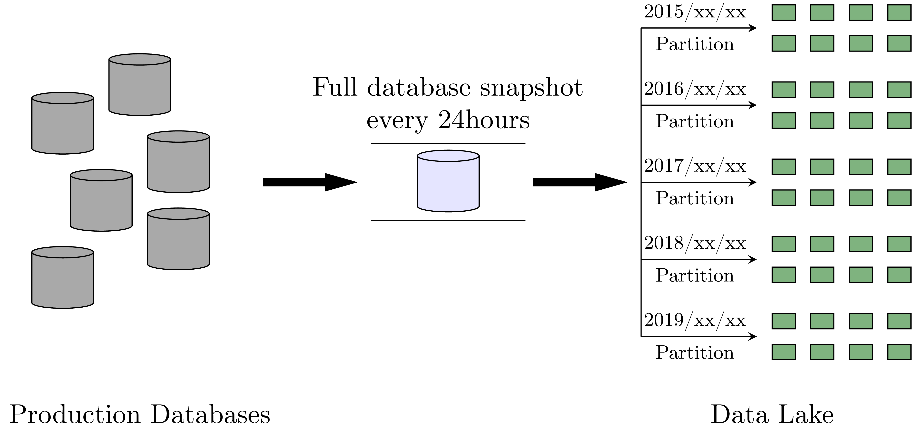

    A Data Lake is a typical place to put structured general-purpose data, before any feature engineering has been applied to the data.

In order to use the data lake for machine learning, data scientists and data engineers in the organization were required to do feature engineering on the data in the data lake before they could use the data in machine learning experiments. In fact, in retrospect, *data scientists and data engineers were spending most of their time in the phase of feature engineering, much more than the time they spent on actual model development* — feature engineering became the bottleneck.

.. _bottleneck.png: ../_images/bottleneck.png
.. figure:: ../imgs/feature_store/bottleneck.png
    :alt: Feature Engineering Bottleneck
    :target: `bottleneck.png`_
    :align: center
    :figclass: align-center
    :scale: 5 %

    Without a Feature Store, feature engineering tend to become a bottleneck in the machine learning work-flow.

Another problem that is common without a feature store is that if an organization have many data scientists, perhaps spread across different teams, this results in siloed feature data (see figure below). This is exactly what happened for this organization. The organization had in total over 30 data scientists spread out geographically across several offices. Due to the geographical distribution and no central feature store, each data scientist in the organization was maintaining their own feature pipeline, with little or no possibility of feature reuse.

.. _siloed_f.png: ../_images/siloed_f.png
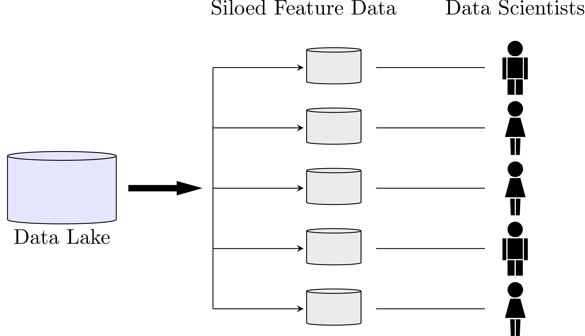

    Without a feature store, many organizations have problems with feature data being put in silos without any provision, documentation, or quality validation.

By complementing the organization's data lake with a feature store — a data management layer **specifically designed for the machine learning use-case** — the organization was able to harmonize the siloed feature data in a single place. By centralizing the feature data, data scientists were able to reuse and share features with each other. Moreover, the feature store improved the quality of the organization's feature data by applying software engineering principles to the feature data; such as versioning, validation, lineage, and access control.

The feature store typically works as an *interface between data engineers and data scientists*. Data engineers write data processing pipelines that compute features and inserts them in the feature store. Data scientists use machine learning frameworks such as TensorFlow or Keras to read from the feature store and run machine learning experiments (see figure below).

.. _de_ds_interface.png: ../_images/de_ds_interface.png
.. figure:: ../imgs/feature_store/de_ds_interface.png
    :alt: Feature Store: Interface between data engineers and data scientists
    :target: `de_ds_interface.png`_
    :align: center
    :figclass: align-center
    :scale: 8 %

**Data Engineers: Writing to the Feature Store**

Data engineers can use the feature store as a sink for their data pipelines that compute features for machine learning. The feature store can store any type of feature data, whether it is time-window aggregations, embeddings, images, text, or sound. For writing to the feature store, data engineers can use their framework of choice, for example Spark, Flink, Numpy, or Pandas.

**Data Scientists: Using feature data in ML Experiments**:

Data scientists can read from the feature store for doing machine learning experiments using their favorite machine learning framework, such as TensorFlow, Keras, Sci-kit learn, or PyTorch.

References
~~~~~~~~~~~~~~~~~~~~~~~~~~~~~~~~~~~~~~~~~~~~
- [1] Scaling Machine Learning as a Service (Uber), http://proceedings.mlr.press/v67/li17a.html

- [2] Applied Machine Learning at Facebook: A Datacenter Infrastructure Perspective, https://research.fb.com/publications/applied-machine-learning-at-facebook-a-datacenter-infrastructure-perspective/

- [3] TFX: A TensorFlow-Based Production-Scale Machine Learning Platform (Google), https://www.kdd.org/kdd2017/papers/view/tfx-a-tensorflow-based-production-scale-machine-learning-platform

- [4] Horizontally Scalable ML Pipelines with a Feature Store (Logical Clocks), https://www.sysml.cc/doc/2019/demo_7.pdf

- [5] Distributed Time Travel for Feature Generation (Netflix),
https://medium.com/netflix-techblog/distributed-time-travel-for-feature-generation-389cccdd3907

- [6] Yoda: Scaling Machine Learning at Careem, https://medium.com/@akamal8/yoda-scaling-machine-learning-careem-d4bc8b1be195

- [7] Zipline: Airbnb’s Machine Learning Data Management Platform, https://databricks.com/session/zipline-airbnbs-machine-learning-data-management-platform

- [8] Introducing Feast: an open source feature store for machine learning (Google and GO-JEK),
https://cloud.google.com/blog/products/ai-machine-learning/introducing-feast-an-open-source-feature-store-for-machine-learning

- [9] Hidden Technical Debt in Machine Learning Systems (Google), https://papers.nips.cc/paper/5656-hidden-technical-debt-in-machine-learning-systems.pdf
