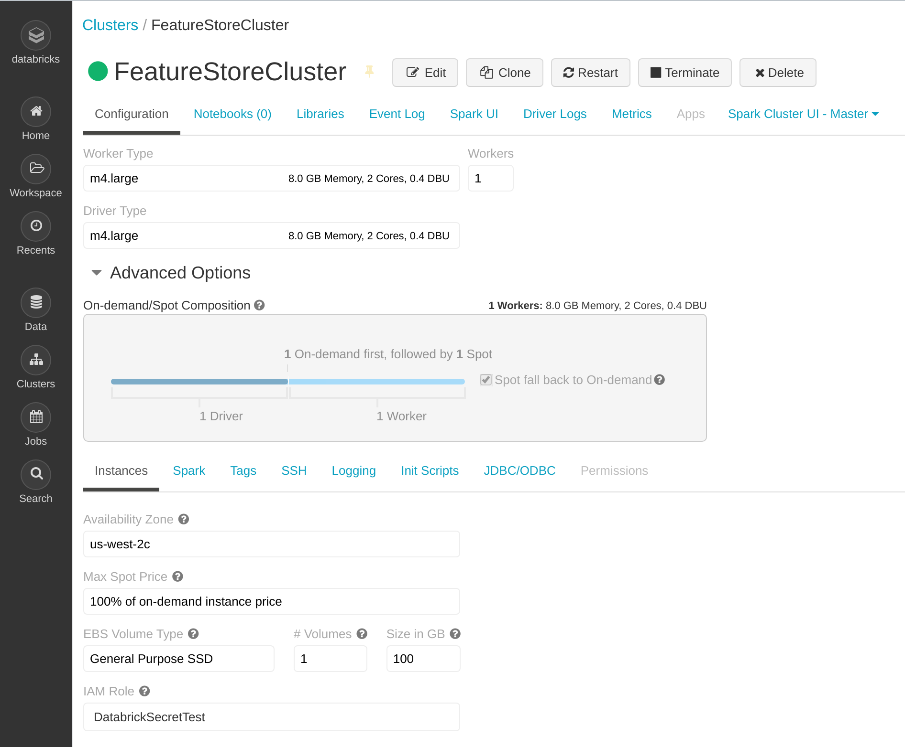
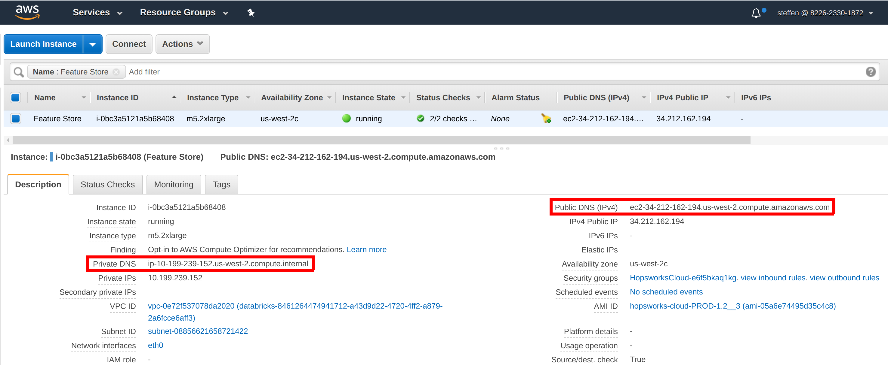
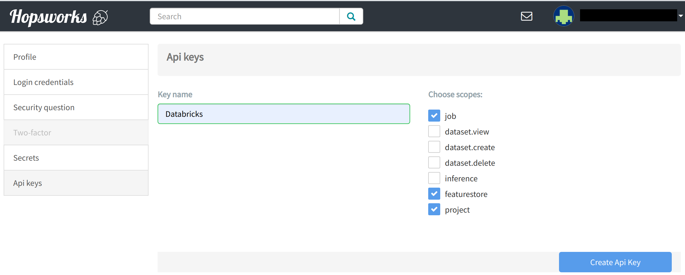
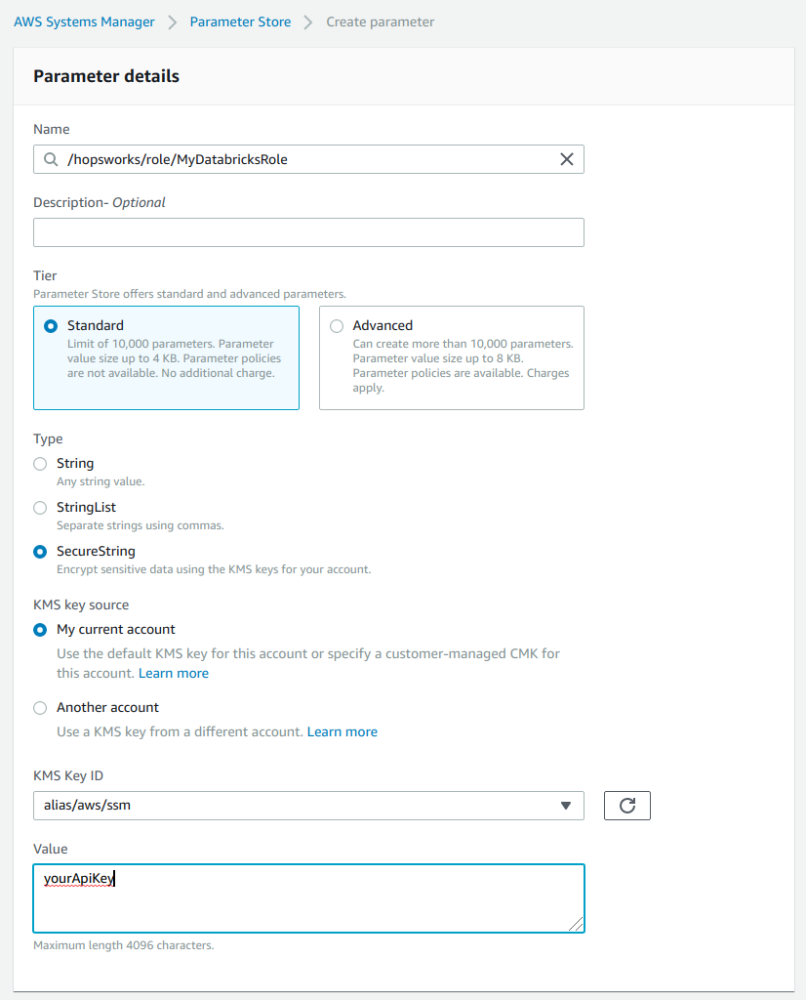
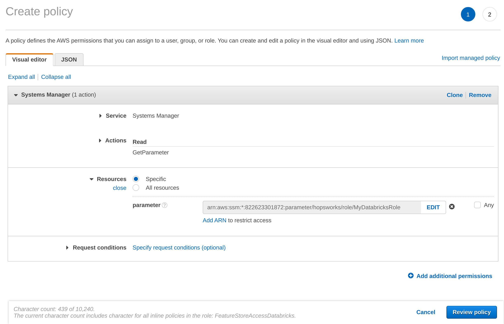
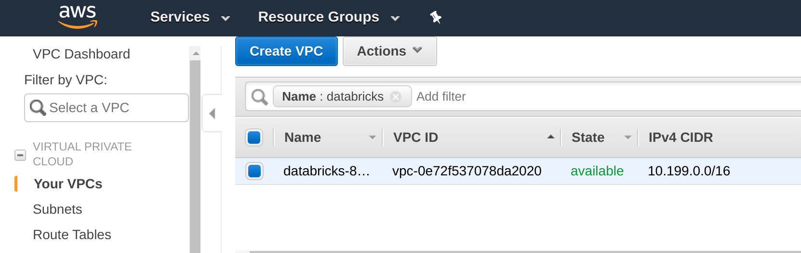
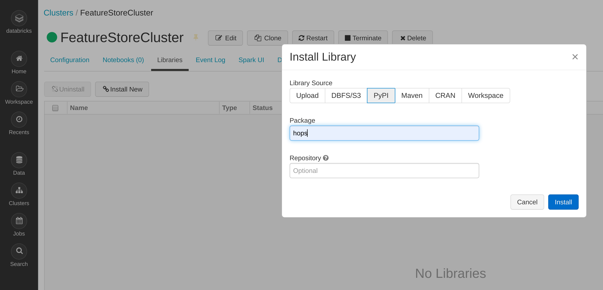
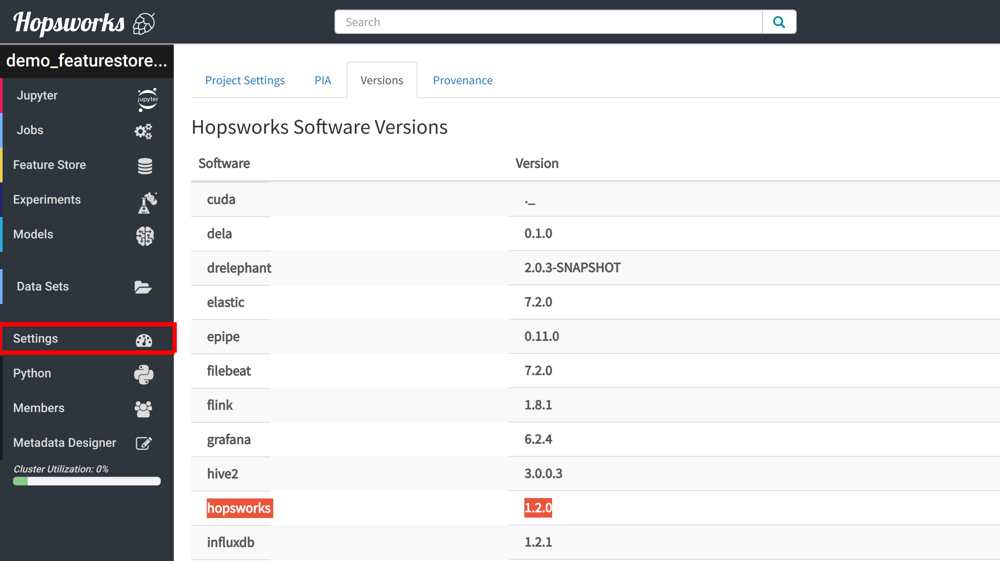
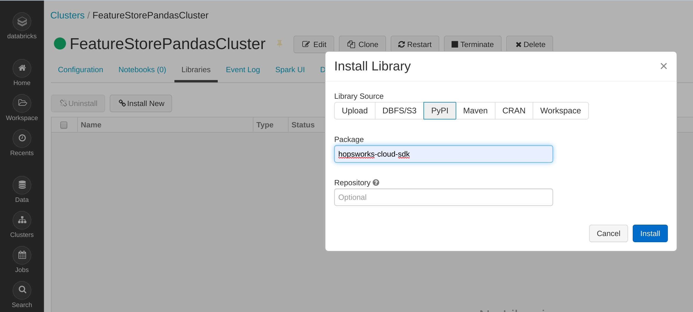
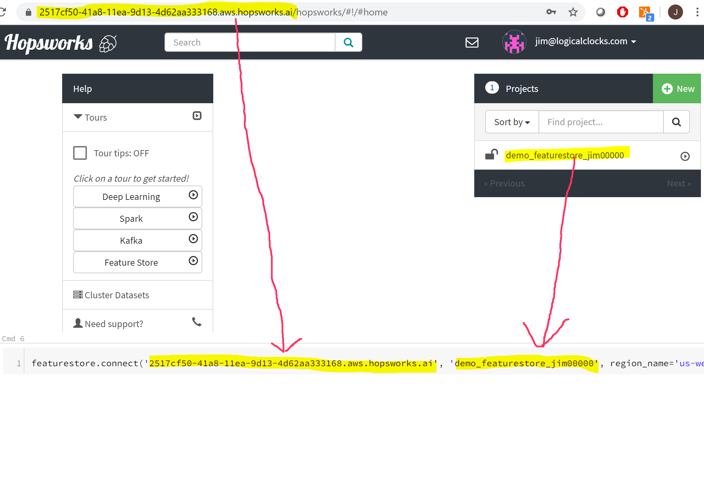

.. _databricks:

Using the Feature Store from Databricks
=======================================

Connecting to the Feature Store from Databricks requires setting up a Feature Store API Key for Databricks and installing 
a Feature Store SDK on your Databricks cluster. This guide explains step by step how to connect to the Feature Store from Databricks.

The Feature Store offers a Python API and a Spark DataFrames API. The Python API is easy to set up and get started with but does not
offer full functionality. If you want to seamlessly integrate with Spark and read and write DataFrame to the Feature Store then you should
use the Spark DataFrames API.

.. contents:: :local:

Step 1: Prerequisites
---------------------
For this guide you need to know the *AWS Region*, *Availability Zone* and *IAM Role* of your Databricks cluster as well as the
*Public/Private DNS* name of your Feature Store instance. The following steps show how to
gather this information.

.. include-1-start

Step 1.1: Identifying your Databricks Region, Availability Zone and IAM Role
~~~~~~~~~~~~~~~~~~~~~~~~~~~~~~~~~~~~~~~~~~~~~~~~~~~~~~~~~~~~~~~~~~~~~~~~~~~~

The *Availability Zone* and *IAM Role* of your Databricks cluster can be found in the configuration section of your Databricks cluster.
The *Region* of you Databricks cluster is part of the availability zone. In the example, the *Availability Zone* is
*us-west-2c* which means the *Region* is *us-west-2*. Alternatively, these values can be chosen when creating a new Databricks cluster:

.. _databricks_zone_and_role.png: ../../../_images/databricks_zone_and_role.png

.. include-1-stop

Step 1.2: Identifying your Feature Store instance
~~~~~~~~~~~~~~~~~~~~~~~~~~~~~~~~~~~~~~~~~~~~~~~~~

The *Public DNS* and *Private DNS* of your Feature Store instance deployed on AWS can be found in EC2 on the AWS Management Console:

.. _hopsworks_instance.png: ../../../_images/hopsworks_instance.png

.. include-2-start

Step 2: Generating an API Key
-----------------------------

In Hopsworks, click on your username in the top-right corner and select *Settings* to open the user settings.
Select *Api keys*. Give the key a name and select the *job*, *featurestore* and *project* scopes before creating the key.
Copy the key into your clipboard for the next step.

.. _databricks_api_key.png: ../../../_images/databricks_api_key.png

.. include-2-stop

Step 3: Storing the API Key
---------------------------

Option 1: Using the AWS Systems Manager Parameter Store
~~~~~~~~~~~~~~~~~~~~~~~~~~~~~~~~~~~~~~~~~~~~~~~~~~~~~~~

**Storing the API Key in the AWS Systems Manager Parameter Store**

In the AWS Management Console, ensure that your active region is the region you use for Databricks.
Go to the *AWS Systems Manager* choose *Parameter Store* and select *Create Parameter*.
As name enter */hopsworks/role/[MY_DATABRICKS_ROLE]/type/api-key* replacing [MY_DATABRICKS_ROLE] with the
AWS role used by the Databricks cluster that should access the Feature Store. Select *Secure String* as
type and create the parameter.

.. _databricks_parameter_store.png: ../../../_images/databricks_parameter_store.png

**Granting access to the secret to the Databricks notebook role**

In the AWS Management Console, go to *IAM*, select *Roles* and then the role that is used when creating Databricks clusters.
Select *Add inline policy*. Choose *Systems Manager* as service, expand the *Read* access level and check *GetParameter*.
Expand Resources and select *Add ARN*. Enter the region of the *Systems Manager* as well as the name of the parameter
**WITHOUT the leading slash** e.g. *hopsworks/role/[MY_DATABRICKS_ROLE]/type/api-key* and click *Add*. Click on *Review*,
give the policy a name und click on *Create policy*.

.. _databricks_parameter_store_policy.png: ../../../_images/databricks_parameter_store_policy.png

Option 2: Using the AWS Secrets Manager
~~~~~~~~~~~~~~~~~~~~~~~~~~~~~~~~~~~~~~~

**Storing the API Key in the AWS Secrets Manager**

.. include-3-start

In the AWS management console ensure that your active region is the region you use for Databricks.
Go to the *AWS Secrets Manager* and select *Store new secret*. Select *Other type of secrets* and add *api-key*
as the key and paste the API key created in the previous step as the value. Click next.

.. _databricks_secrets_manager_step_1.png: ../../../_images/databricks_secrets_manager_step_1.png
.. figure:: ../../../imgs/feature_store/databricks_secrets_manager_step_1.png
    :alt: Storing a Feature Store API Key in the Secrets Manager Step 1
    :target: `databricks_secrets_manager_step_1.png`_
    :align: center
    :figclass: align-center

As secret name, enter *hopsworks/role/[MY_DATABRICKS_ROLE]* replacing [MY_DATABRICKS_ROLE] with the AWS role used
by the Databricks instance that should access the Feature Store. Select next twice and finally store the secret.
Then click on the secret in the secrets list and take note of the *Secret ARN*.

.. _databricks_secrets_manager_step_2.png: ../../../_images/databricks_secrets_manager_step_2.png
.. figure:: ../../../imgs/feature_store/databricks_secrets_manager_step_2.png
    :alt: Storing a Feature Store API Key in the Secrets Manager Step 2
    :target: `databricks_secrets_manager_step_2.png`_
    :align: center
    :figclass: align-center

**Granting access to the secret to the Databricks notebook role**

In the AWS Management Console, go to *IAM*, select *Roles* and then the role that is used when creating Databricks clusters.
Select *Add inline policy*. Choose *Secrets Manager* as service, expand the *Read* access level and check *GetSecretValue*.
Expand Resources and select *Add ARN*. Paste the ARN of the secret created in the previous step.
Click on *Review*, give the policy a name und click on *Create policy*.

.. _databricks_secrets_manager_policy.png: ../../../_images/databricks_secrets_manager_policy.png
.. figure:: ../../../imgs/feature_store/databricks_secrets_manager_policy.png
    :alt: Configuring the access policy for the Secrets Manager
    :target: `databricks_secrets_manager_policy.png`_
    :align: center
    :figclass: align-center

.. include-3-stop

Step 4 (Option 1): Using the Spark DataFrames API
-------------------------------------------------
.. warning:: 
 - The Spark DataFrames API requires your Databricks cluster to be able to reach the private network of your Feature Store cluster.
 - See `Step 4 (Option 2): Using the Python API`_. for an alternative that does not require private networking.

Step 4.1: Ensuring up network connectivity
~~~~~~~~~~~~~~~~~~~~~~~~~~~~~~~~~~~~~~~~~~
The Spark DataFrames API needs to be able to connect directly to the IP on which the Feature Store is listening.
This means that if you deploy the Feature Store on AWS you will either need to deploy the Feature Store in the same VPC as your Databricks
cluster or to set up `VPC Peering <https://docs.databricks.com/administration-guide/cloud-configurations/aws/vpc-peering.html>`_
between your Databricks VPC and the Feature Store VPC.

**Option 1: Deploying the Feature Store in the Databricks VPC**

When deploying the Feature Store, select the Databricks *VPC* and *Availability Zone* as the VPC and Availability Zone of your Feature Store cluster.
Identify your Databricks VPC by searching for VPCs containing Databricks in their name in your Databricks AWS region in the AWS Management Console:

.. _databricks_vpc.png: ../../../_images/databricks_vpc.png

**Option 2: Setting up VPC peering**
Follow the guide `VPC Peering <https://docs.databricks.com/administration-guide/cloud-configurations/aws/vpc-peering.html>`_ to set up VPC peering
between you Feature Store cluster and Databricks. Get your Feature Store *VPC ID* and *CIDR* by searching for you Feature Store VPC
in the AWS Management Console:

.. _hopsworks_vpc.png: ../../../_images/hopsworks_vpc.png
.. figure:: ../../../imgs/feature_store/hopsworks_vpc.png
    :alt: Identifying your Feature Store VPC
    :target: `hopsworks_vpc.png`_
    :align: center
    :figclass: align-center

Step 4.2: Configuring the Security Group
~~~~~~~~~~~~~~~~~~~~~~~~~~~~~~~~~~~~~~~~

The Feature Store *Security Group* needs to be configured to allow traffic from your Databricks clusters to be able to connect to the Feature Store.
Open your feature store instance under EC2 in the AWS Management Console and ensure that ports *443*, *9083*, *9085*, *8020* and *50010* are reachable
from the Databricks Security Group:

.. _databricks_security_group_overview.png: ../../../_images/databricks_security_group_overview.png
.. figure:: ../../../imgs/feature_store/databricks_security_group_overview.png
    :alt: Hopsworks Feature Store Security Group
    :target: `databricks_security_group_overview.png`_
    :align: center
    :figclass: align-center

Connectivity form the Databricks Security Group can be allowed by opening the Security Group, adding a port to the Inbound rules and searching for *dbe-worker*
in the source field. Selecting any of the *dbe-worker* Security Groups will be sufficient:

.. _databricks_security_group_details.png: ../../../_images/databricks_security_group_details.png
.. figure:: ../../../imgs/feature_store/databricks_security_group_details.png
    :alt: Hopsworks Feature Store Security Group details
    :target: `databricks_security_group_details.png`_
    :align: center
    :figclass: align-center

Step 4.3: Installing the hops SDK
~~~~~~~~~~~~~~~~~~~~~~~~~~~~~~~~~

.. include-4-start

In the Databricks UI, go to *Clusters* and select your cluster. Select *Libraries*.
Make sure that hopsworks-cloud-sdk is not installed, make sure to uninstall it if that's the case.
Then *Install New*. As *Library Source* choose *PyPI* and enter *hops~=YOUR_HOPSWORKS_VERSION*
into the *Package* field (YOUR_HOPSWORKS_VERSION needs to match the major version of Hopsworks):

.. _databricks_install_hops.png: ../../../_images/databricks_install_hops.png

You can find your Hopsworks version under Settings/Versions inside your Hopsworks project:

.. _hopsworks_version.png: ../../../_images/hopsworks_version.png

.. include-4-stop

Step 4.4: Configuring Databricks to use the Feature Store
~~~~~~~~~~~~~~~~~~~~~~~~~~~~~~~~~~~~~~~~~~~~~~~~~~~~~~~~~

After installing the hops library, restart the cluster and open a Databricks notebooks connected to this cluster.
Execute the following statements in this notebook:

.. code-block:: python

 import hops.featurestore as fs
 fs.setup_databricks(
    'my_instance.region.compute.internal', # Private DNS of your Feature Store instance
    'my_project',                          # Name of your Hopsworks Feature Store project
    region_name='my_aws_region',           # AWS region in which you stored the API Key
    secrets_store='secretsmanager',        # Either parameterstore or secretsmanager
    hostname_verification=True)            # Disable for self-signed certificates  

This will return two configurations that you need to add to your Databricks cluster configuration:

.. include-5-start

.. hlist:

* Go to *Clusters*, select your cluster and click *Edit*. 
* Select *Configuration* and *Advanced Options*. 
* Select *Init Scripts* and copy the init script path returned by *setup_databricks* in *Init Script Path* and click *Add*:

    .. _databricks_init_script.png: ../../../_images/databricks_init_script.png
    .. figure:: ../../../imgs/feature_store/databricks_init_script.png
        :alt: Configuring the init script of the Databricks cluster
        :target: `databricks_init_script.png`_
        :align: center
        :figclass: align-center

* Select *Spark* and copy the spark configuration returned by *setup_databricks* in *Spark Config*:

    .. _databricks_spark_config.png: ../../../_images/databricks_spark_config.png
    .. figure:: ../../../imgs/feature_store/databricks_spark_config.png
        :alt: Configuring Spark on the Databricks cluster
        :target: `databricks_spark_config.png`_
        :align: center
        :figclass: align-center

* Once you have set these two configurations, click *Confirm and Restart*.

.. include-5-stop

Step 4.5: Connecting to the Feature Store
~~~~~~~~~~~~~~~~~~~~~~~~~~~~~~~~~~~~~~~~~

.. include-6-start

.. warning::

    It is possible to connect to a project different from the one you used when calling *setup_databricks* or when last running the cluster. 
    However, Spark is reusing the connections to Hive and the Name Node. So you may need to restart the cluster if you want to change the project you are connected to.

In the Databricks notebooks connected to the prepared cluster, use the following code to connect to the feature store:

.. include-6-stop

.. code-block:: python

 import hops.featurestore as fs
 fs.connect(
    'my_instance.region.compute.internal', # Private DNS of your Feature Store instance
    'my_project',                          # Name of your Hopsworks Feature Store project
    region_name='my_aws_region',           # AWS region in which you stored the API Key
    secrets_store='secretsmanager',        # Either parameterstore or secretsmanager
    hostname_verification=True)            # Disable for self-signed certificates   

.. note::

    If you have trouble connecting, then ensure that the Security Group of your Hopsworks instance on AWS is configured to allow
    incoming traffic from your Databricks clusters. See
    `VPC Security Groups <https://docs.aws.amazon.com/vpc/latest/userguide/VPC_SecurityGroups.html>`_. for more information.
    If the Hopsworks instance is not accessible from the Internet, then you will need to configure
    `VPC Peering <https://docs.databricks.com/administration-guide/cloud-configurations/aws/vpc-peering.html>`_.

Step 4 (Option 2): Using the Python API
---------------------------------------
.. note:: 
 - The Python API offers an easy way to get started with the Feature Store but does not seamlessly integrate with Spark.
 - If you want to access the Feature Store using Spark DataFrames, see `Using the Spark DataFrames API`_.

Step 4.1: Installing hopsworks-cloud-sdk
~~~~~~~~~~~~~~~~~~~~~~~~~~~~~~~~~~~~~~~~

The feature store library needs to be installed to connect to it. In the Databricks UI, go to *Clusters* and select your cluster.
Select *Libraries* and then *Install New*. As *Library Source* choose *PyPI* and enter *hopsworks-cloud-sdk~=YOUR_HOPSWORKS_VERSION*
into the *Package* field (YOUR_HOPSWORKS_VERSION needs to match the major version of Hopsworks):

.. _databricks_install_cloud.png: ../../../_images/databricks_install_cloud.png

You can find your Hopsworks version under Settings/Versions inside your Hopsworks project:

.. _hopsworks_version.png: ../../../_images/hopsworks_version.png

Step 4.2: Creating a DBFS folder to store certificates
~~~~~~~~~~~~~~~~~~~~~~~~~~~~~~~~~~~~~~~~~~~~~~~~~~~~~~

The Hopsworks Feature Store relies on certificates being available in the Databricks cluster to connect to some services inside Hopsworks.
To ensure that these certificates can be distributed to all nodes in a Databricks cluster, Hopsworks relies on them being stored
in the `Databricks file system <https://docs.databricks.com/data/databricks-file-system.html>`_.
For this purpose, you should create a certs folder in DBFS. This can be done by executing the following statement
in a Databricks notebook connected to the prepared cluster:

.. code-block:: python

    dbutils.fs.mkdirs("dbfs:/certs/")

Step 4.3: Connecting to the Feature Store
~~~~~~~~~~~~~~~~~~~~~~~~~~~~~~~~~~~~~~~~~

.. _feature-store-connect-databricks.png: ../../../_images/feature-store-connect-databricks.png

In the Databricks notebooks connected to the prepared cluster, use the following statements to connect to the Feature Store:

.. code-block:: python

    import hops.featurestore as fs
    fs.connect(
        'my_instance',                  # DNS of your Feature Store instance
        'my_project',                   # Name of your Hopsworks Feature Store project
        cert_folder='/dbfs/certs/',     # The certificate folder as created earlier
        region_name='my_aws_region',    # AWS region in which you stored the API Key
        secrets_store='secretsmanager', # Either parameterstore or secretsmanager
        hostname_verification=True)     # Disable this self-signed certificates   

.. note::

    If you have trouble connecting, then ensure that the Security Group of your Hopsworks instance on AWS is configured to allow
    incoming traffic from your Databricks clusters. See
    `VPC Security Groups <https://docs.aws.amazon.com/vpc/latest/userguide/VPC_SecurityGroups.html>`_. for more information.
    If the Hopsworks instance is not accessible from the Internet, then you will need to configure
    `VPC Peering <https://docs.databricks.com/administration-guide/cloud-configurations/aws/vpc-peering.html>`_.

Step 5: Next steps
------------------
Check out our other guides for how to get started with Hopsworks and the Feature Store:

.. hlist:

* `Feature Store Quick Start notebook <https://github.com/logicalclocks/hops-examples/blob/master/notebooks/featurestore/databricks/FeatureStoreQuickStartDatabricks.ipynb>`_
* `Feature Store Tour notebook <https://github.com/logicalclocks/hops-examples/blob/master/notebooks/featurestore/FeaturestoreTourPython.ipynb>`_
* Get started with the :ref:`feature-store`
* Get started with Machine Learning on Hopsworks: :ref:`hops-ml`
* Get started with Hopsworks: :ref:`userguide`
* Code examples and notebooks: `hops-examples <https://github.com/logicalclocks/hops-examples>`_
