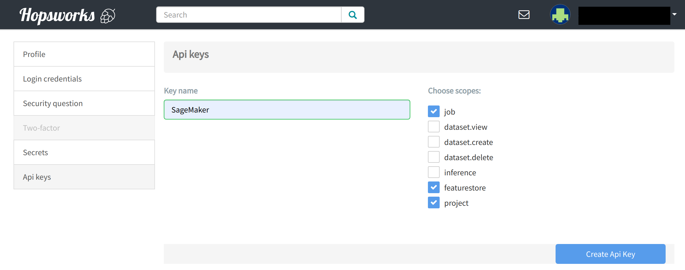
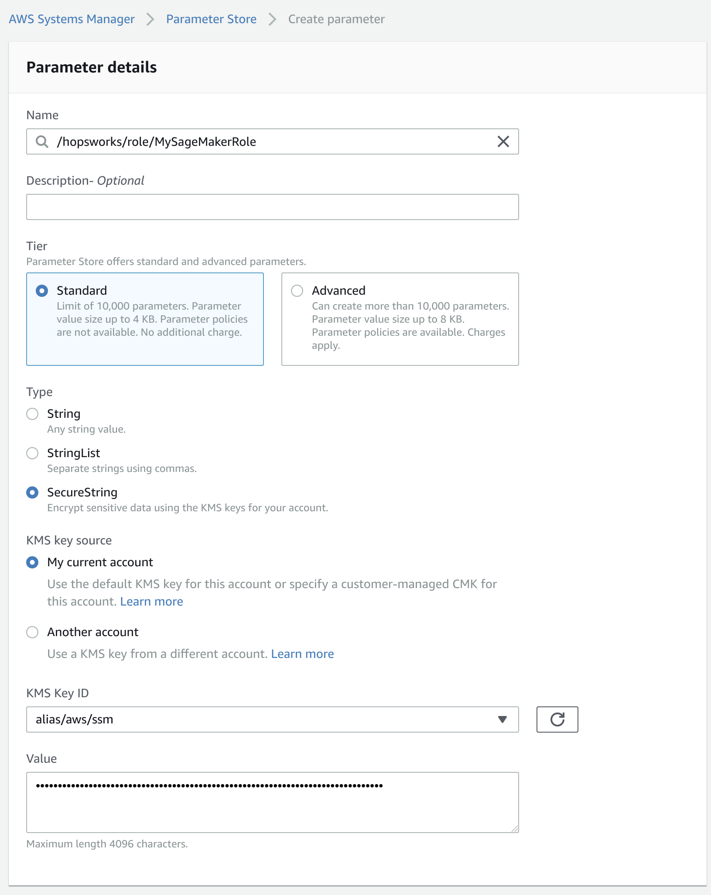

Using the Feature Store from AWS SageMaker
==========================================

Connecting to the Feature Store from SageMaker requires setting up a Feature Store API Key for SageMaker
and installing the SDK on SageMaker. This guide explains step by step how to connect to the Feature
Store from SageMaker.

.. contents:: :local:

Step 1: Generating an API key
-----------------------------

.. include-1-start

In Hopsworks, click on your username in the top-right corner and select *Settings* to open the user settings. 
Select *Api keys*. Give the key a name and select the *job*, *featurestore* and *project* scopes before creating the key. 
Copy the key into your clipboard for the next step.

.. _sagemaker_api_key.png: ../../../_images/sagemaker_api_key.png

.. include-1-stop

Step 2: Storing the API Key
---------------------------

Identifying your SageMaker role
~~~~~~~~~~~~~~~~~~~~~~~~~~~~~~~

.. include-2.1-start

You need to know the IAM role used by your SageMaker instance to set up the API key for it. You can find it
in the overview of you SageMaker notebook instance of the AWS Management Console.

In this example, the name of the role is *AmazonSageMaker-ExecutionRole-20190511T072435*.

.. _sagemaker-role.png: ../../../_images/sagemaker-role.png
.. figure:: ../../../imgs/feature_store/sagemaker-role.png
    :alt: Identifying your SageMaker role
    :target: `sagemaker-role.png`_
    :align: center
    :figclass: align-center

.. include-2.1-stop

Option 1: Using the AWS Systems Manager Parameter Store
~~~~~~~~~~~~~~~~~~~~~~~~~~~~~~~~~~~~~~~~~~~~~~~~~~~~~~~

**Storing the API Key in the AWS Systems Manager Parameter Store**

In the AWS Management Console, ensure that your active region is the region you use for SageMaker.
Go to the *AWS Systems Manager* choose *Parameter Store* and select *Create Parameter*.
As name, enter */hopsworks/role/[MY_SAGEMAKER_ROLE]* replacing [MY_SAGEMAKER_ROLE]
with the AWS role used by the SageMaker instance that should access the Feature Store.
Select *Secure String* as type and create the parameter.

.. _sagemaker_parameter_store.png: ../../../_images/sagemaker_parameter_store.png

**Granting access to the Parameter Store to the SageMaker notebook role**

In the AWS Management Console, go to *IAM*, select *Roles* and then the role that is used when
creating SageMaker notebook instances. Select *Add inline policy*. Choose *Systems Manager* as service,
expand the *Read* access level and check *GetParameter*. Expand Resources and select *Add ARN*.
Enter the region of the *Systems Manager* as well as the name of the parameter **WITHOUT the leading slash**
e.g. *hopsworks/role/[MY_SAGEMAKER_ROLE]* and click *Add*. Click on *Review*, give the policy
a name und click on *Create policy*.

.. _sagemaker_aws_policy2.png: ../../../_images/sagemaker_aws_policy2.png
.. figure:: ../../../imgs/feature_store/sagemaker_aws_policy2.png
    :alt: Configuring the access policy for the Parameter Store
    :target: `sagemaker_aws_policy2.png`_
    :align: center
    :figclass: align-center

Option 2: Using the AWS Secrets Manager
~~~~~~~~~~~~~~~~~~~~~~~~~~~~~~~~~~~~~~~

**Storing the API Key in the AWS Secrets Manager**

.. include-2-start

In the AWS Management Console, ensure that your active region is the region you use for SageMaker.
Go to the *AWS Secrets Manager* and select *Store new secret*. Select *Other type of secrets* and add
*api-key* as the key and paste the API key created in the previous step as the value. Click next.

.. _sagemaker_secrets_manager.png: ../../../_images/sagemaker_secrets_manager.png
.. figure:: ../../../imgs/feature_store/sagemaker_secrets_manager.png
    :alt: Storing the Feature Store API Key in the Secrets Manager Step 1
    :target: `sagemaker_secrets_manager.png`_
    :scale: 40 %
    :align: center
    :figclass: align-center

As secret name, enter *hopsworks/role/[MY_SAGEMAKER_ROLE]* replacing [MY_SAGEMAKER_ROLE] with the AWS
role used by the SageMaker instance that should access the Feature Store. Select next twice and finally
store the secret. Then click on the secret in the secrets list and take note of the *Secret ARN*.

.. _sagemaker_secrets_manager2.png: ../../../_images/sagemaker_secrets_manager2.png
.. figure:: ../../../imgs/feature_store/sagemaker_secrets_manager2.png
    :alt: Storing the Feature Store API Key in the Secrets Manager Step 2
    :target: `sagemaker_secrets_manager2.png`_
    :align: center
    :scale: 35 %
    :figclass: align-center

**Granting access to the SecretsManager to the SageMaker notebook role**

In the AWS Management Console, go to *IAM*, select *Roles* and then the role that is used when creating
SageMaker notebook instances. Select *Add inline policy*. Choose *Secrets Manager* as service, expand the
*Read* access level and check *GetSecretValue*. Expand Resources and select *Add ARN*. Paste the ARN of
the secret created in the previous step. Click on *Review*, give the policy a name und click on *Create policy*.

.. _sagemaker_aws_policy.png: ../../../_images/sagemaker_aws_policy.png
.. figure:: ../../../imgs/feature_store/sagemaker_aws_policy.png
    :alt: Configuring the access policy for the Secrets Manager
    :target: `sagemaker_aws_policy.png`_
    :align: center
    :figclass: align-center

.. include-2-stop

Step 3: Installing hopsworks-cloud-sdk
--------------------------------------

.. include-3-start

To be able to access the Hopsworks Feature Store, the hopsworks-cloud-sdk library needs to be installed.
One way of achieving this is by opening a Python notebook in SageMaker and installing the
hopsworks-cloud-sdk. The major version of hopsworks-cloud-sdk needs to match the major version
of Hopsworks. Note that the library will not be persistent. For information around how to permanently
install a library to SageMaker, see
`Install External Libraries and Kernels in Notebook Instances <https://docs.aws.amazon.com/sagemaker/latest/dg/nbi-add-external.html>`_.

.. code-block:: bash

    !pip install hopsworks-cloud-sdk~=YOUR_HOPSWORKS_VERSION

You can find your Hopsworks version under Settings/Versions inside your Hopsworks project:

.. _hopsworks_version.png: ../../../_images/hopsworks_version.png
.. figure:: ../../../imgs/feature_store/hopsworks_version.png
    :alt: Creating a Feature Store API Key
    :target: `hopsworks_version.png`_
    :align: center
    :figclass: align-center

.. include-3-stop

Step 4: Connecting to the Feature Store
---------------------------------------

.. include-4-start

You can connect to the Feature Store by executing connect:

.. code-block:: python

    import hops.featurestore as fs
    fs.connect(
        'my_instance',                      # DNS of your Feature Store instance
        'my_project',                       # Name of your Hopsworks Feature Store project
        secrets_store = 'secretsmanager')   # Either parameterstore or secretsmanager

.. note::

    If you have trouble connecting, then ensure that the Security Group of your Hopsworks instance on AWS is configured
    to allow incoming traffic from your SageMaker instance on ports *443*, *9083* and *9085*. See
    `VPC Security Groups <https://docs.aws.amazon.com/vpc/latest/userguide/VPC_SecurityGroups.html>`_.
    for more information. If your SageMaker instances are not in the same VPC as your Hopsworks instance and the Hopsworks
    instance is not accessible from the internet then you will need to configure
    `VPC Peering on AWS <https://docs.aws.amazon.com/vpc/latest/peering/what-is-vpc-peering.html>`_.

.. include-4-stop