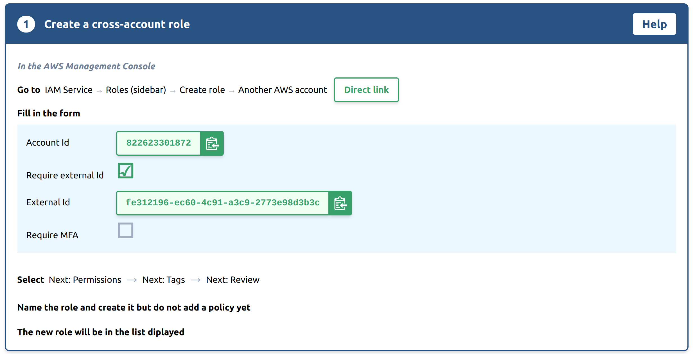
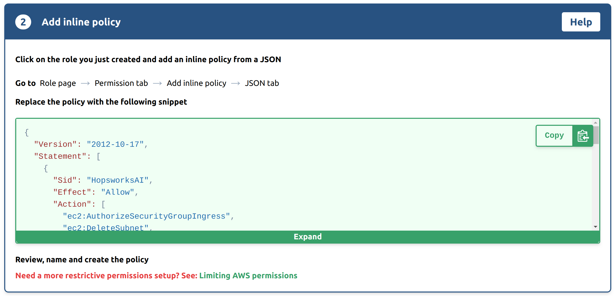
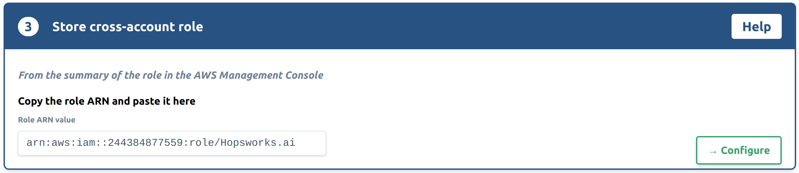
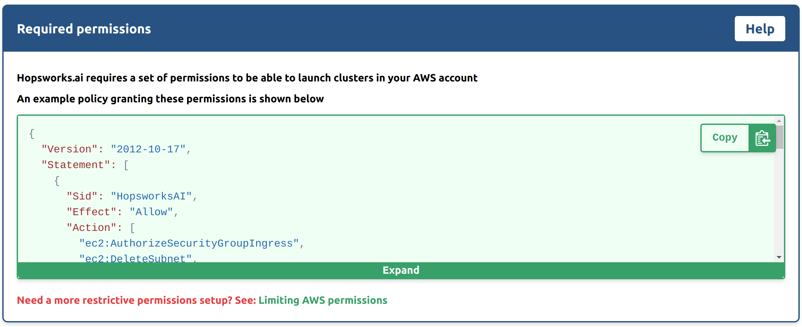
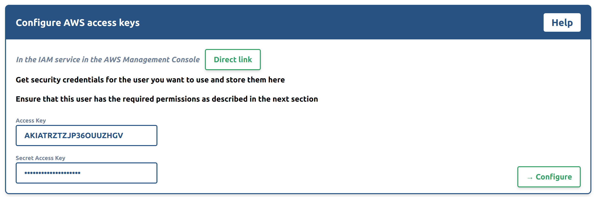
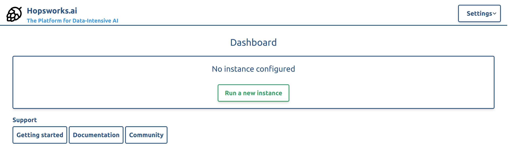
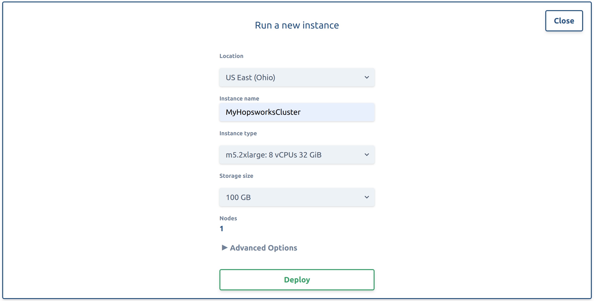
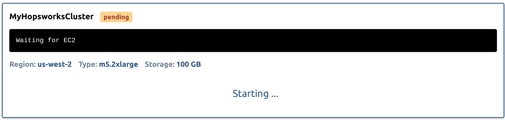
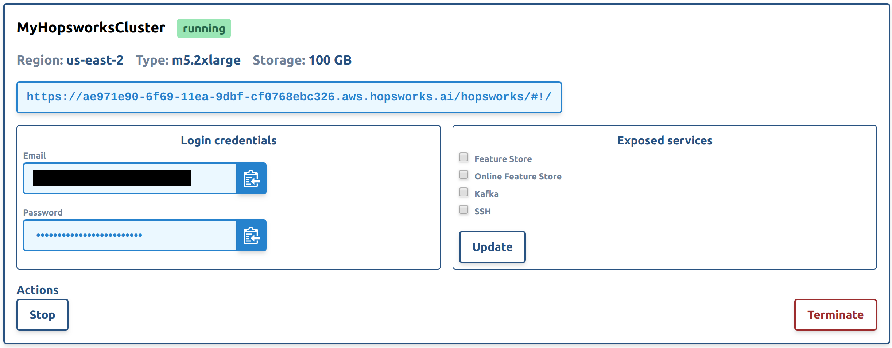
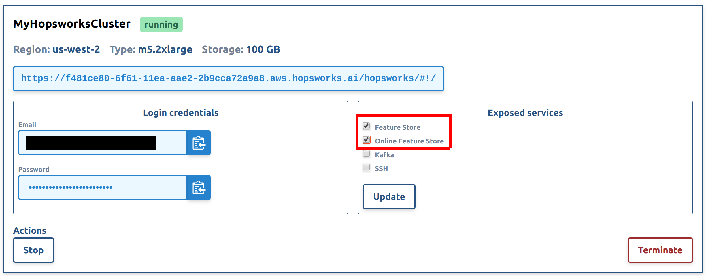

Getting started with Hopsworks.ai
=================================

Hopsworks.ai is our managed platform for running Hopsworks and the Feature Store
in the cloud. It integrates seamlessly with third party platforms such as Databricks,
SageMaker and KubeFlow. This guide shows how to set up Hopsworks.ai with your organization's AWS account.

.. contents:: :local:

Step 1: Connecting your AWS account
-----------------------------------

Hopsworks.ai deploys Hopsworks clusters to your AWS account. To enable this you have to
give us permission to do so. This can be either achieved by using AWS cross-account roles or
AWS access keys. We strongly recommend the usage of cross-account roles whenever possible due
to security reasons.

.. contents:: :local:

Option 1: Using AWS Cross-Account Roles
~~~~~~~~~~~~~~~~~~~~~~~~~~~~~~~~~~~~~~~

To create a cross-account role for Hopsworks.ai, you need our AWS account id and the external
id we created for you. You can find this information on the first screen of the cross-account
configuration flow. Take note of the account id and external id and go to the *Roles* section
of the *IAM* service in the AWS Management Console and select *Create role*.

.. _create-role-instructions.png: ../../../_images/create-role-instructions.png

Select *Another AWS account* as trusted entity and fill in our AWS account id and the external
id generated for you:

.. _create-role-aws-step-1.png: ../../../_images/create-role-aws-step-1.png
.. figure:: ../../../imgs/hopsworksai/create-role-aws-step-1.png
    :alt: Creating the cross-account role step 1
    :target: `create-role-aws-step-1.png`_
    :align: center
    :figclass: align-center

Go to the last step of the wizard, name the role and create it:

.. _create-role-aws-step-2.png: ../../../_images/create-role-aws-step-2.png
.. figure:: ../../../imgs/hopsworksai/create-role-aws-step-2.png
    :alt: Creating the cross-account role step 2
    :target: `create-role-aws-step-2.png`_
    :align: center
    :figclass: align-center

As a next step, you need to create an access policy to give Hopsworks.ai permissions to manage
clusters in your organization's AWS account. By default, Hopsworks.ai is automating all steps required to launch
a new Hopsworks cluster. If you want to limit the required AWS permissions, see :ref:`restrictive-permissions`.

Copy the permission JSON from the instructions:

.. _role-permissions-instructions.png: ../../../_images/role-permissions-instructions.png

Identify your newly created cross-account role in the *Roles* section of the *IAM* service in the
AWS Management Console and select *Add inline policy*:

.. _role-permissions-aws-step-1.png: ../../../_images/role-permissions-aws-step-1.png
.. figure:: ../../../imgs/hopsworksai/role-permissions-aws-step-1.png
    :alt: Adding the inline policy step 1
    :target: `role-permissions-aws-step-1.png`_
    :align: center
    :figclass: align-center

Replace the JSON policy with the JSON from our instructions and continue in the wizard:

.. _role-permissions-aws-step-2.png: ../../../_images/role-permissions-aws-step-2.png
.. figure:: ../../../imgs/hopsworksai/role-permissions-aws-step-2.png
    :alt: Adding the inline policy step 2
    :target: `role-permissions-aws-step-2.png`_
    :align: center
    :figclass: align-center

Name and create the policy:

.. _role-permissions-aws-step-3.png: ../../../_images/role-permissions-aws-step-3.png
.. figure:: ../../../imgs/hopsworksai/role-permissions-aws-step-3.png
    :alt: Adding the inline policy step 3
    :target: `role-permissions-aws-step-3.png`_
    :align: center
    :figclass: align-center

Copy the *Role ARN* from the summary of your cross-account role:

.. _role-permissions-aws-step-4.png: ../../../_images/role-permissions-aws-step-4.png
.. figure:: ../../../imgs/hopsworksai/role-permissions-aws-step-4.png
    :alt: Adding the inline policy step 4
    :target: `role-permissions-aws-step-4.png`_
    :align: center
    :figclass: align-center

Paste the *Role ARN* into Hopsworks.ai and select *Configure*:

.. _save-role.png: ../../../_images/save-role.png

Option 2: Using AWS Access Keys
~~~~~~~~~~~~~~~~~~~~~~~~~~~~~~~

You can either create a new IAM user or use an existing IAM user to create access keys for Hopsworks.ai.
If you want to create a new IAM user, see `Creating an IAM User in Your AWS Account <https://docs.aws.amazon.com/IAM/latest/UserGuide/id_users_create.html>`_.

.. warning::
  
  We recommend using Cross-Account Roles instead of Access Keys whenever possible, see `Option 1: Using AWS Cross-Account Roles`_

Hopsworks.ai requires a set of permissions to be able to launch clusters in your AWS account.
The permissions can be granted by attaching an access policy to your IAM user.
By default, Hopsworks.ai is automating all steps required to launch a new Hopsworks cluster.
If you want to limit the required AWS permissions, see :ref:`restrictive-permissions`.

The required permissions are shown in the instructions. Copy them if you want to create a new access policy:

.. _access-key-permissions-instructions.png: ../../../_images/access-key-permissions-instructions.png

Add a new *Inline policy* to your AWS user:

.. _access-keys-aws-step-1.png: ../../../_images/access-keys-aws-step-1.png
.. figure:: ../../../imgs/hopsworksai/access-keys-aws-step-1.png
    :alt: Configuring the access key on AWS step 1
    :target: `access-keys-aws-step-1.png`_
    :align: center
    :figclass: align-center

Replace the JSON policy with the JSON from our instructions and continue in the wizard:

.. _role-permissions-aws-step-2.png: ../../../_images/role-permissions-aws-step-2.png
.. figure:: ../../../imgs/hopsworksai/role-permissions-aws-step-2.png
    :alt: Adding the inline policy step 2
    :target: `role-permissions-aws-step-2.png`_
    :align: center
    :figclass: align-center

Name and create the policy:

.. _role-permissions-aws-step-3.png: ../../../_images/role-permissions-aws-step-3.png
.. figure:: ../../../imgs/hopsworksai/role-permissions-aws-step-3.png
    :alt: Adding the inline policy step 3
    :target: `role-permissions-aws-step-3.png`_
    :align: center
    :figclass: align-center

In the overview of your IAM user, select *Create access key*:

.. _access-keys-aws-step-2.png: ../../../_images/access-keys-aws-step-2.png
.. figure:: ../../../imgs/hopsworksai/access-keys-aws-step-2.png
    :alt: Configuring the access key on AWS step 2
    :target: `access-keys-aws-step-2.png`_
    :align: center
    :figclass: align-center

Copy the *Access Key ID* and the *Secret Access Key*:

.. _access-keys-aws-step-3.png: ../../../_images/access-keys-aws-step-3.png
.. figure:: ../../../imgs/hopsworksai/access-keys-aws-step-3.png
    :alt: Configuring the access key on AWS step 3
    :target: `access-keys-aws-step-3.png`_
    :align: center
    :figclass: align-center

Paste the *Access Key ID* and the *Secret Access Key* into Hopsworks.ai and select *Configure*:

.. _save-access-key.png: ../../../_images/save-access-key.png

Step 2: Deploying a Hopsworks cluster
-------------------------------------

In Hopsworks.ai, select *Run a new instance*:

.. _create-instance.png: ../../../_images/create-instance.png

Configure the instance by selecting the location, instance type and optionally the VPC,
subnet and security group. Select *Deploy*.

.. note::
    We recommend that you always configure an SSH key under advanced options to ensure you can troubleshoot the instance if necessary.

.. _configure-instance.png: ../../../_images/configure-instance.png

The instance will start. This might take a couple of minutes:

.. _booting.png: ../../../_images/booting.png

As soon as the instance has started, you will be able to log in to your new Hopsworks instance with the username
and password provided. We recommend that you change that password after your first login.
You are also able to stop or terminate the instance.

.. _running.png: ../../../_images/running.png

Step 3: Outside Access to the Feature Store
-------------------------------------------

By default, only the Hopsworks UI is exposed (made available to clients on external networks, like the Internet)
by your Hopsworks instance. To integrate with external platforms and
access APIs for services such as the Feature Store, you have to expose them.

Expose services by selecting them and pressing *Update*. This will update the *Security Group* attached to the 
Hopsworks instance to allow incoming traffic on the relevant ports.

.. _open-ports.png: ../../../_images/open-ports.png

Step 4: Next steps
------------------

Check out our other guides for how to get started with Hopsworks and the Feature Store:

.. hlist:

* Get started with the :ref:`feature-store`
* Get started with Machine Learning on Hopsworks: :ref:`hops-ml`
* Get started with Hopsworks: :ref:`userguide`
* Code examples and notebooks: `hops-examples <https://github.com/logicalclocks/hops-examples>`_