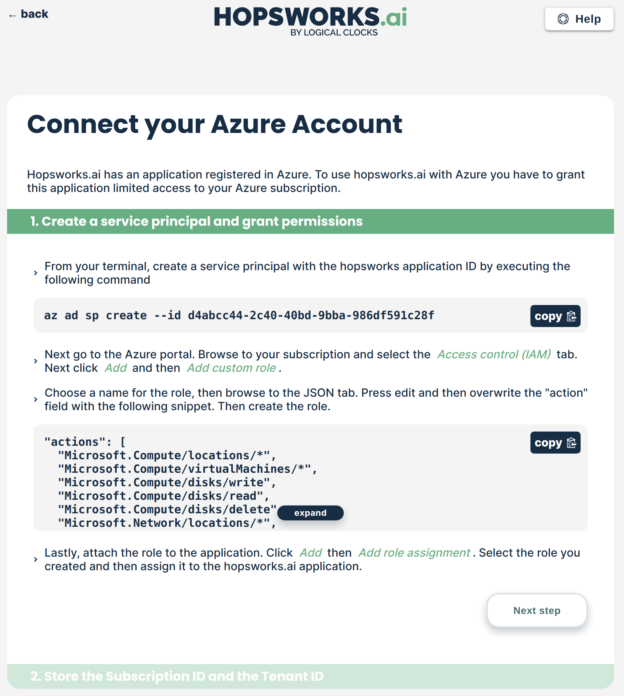
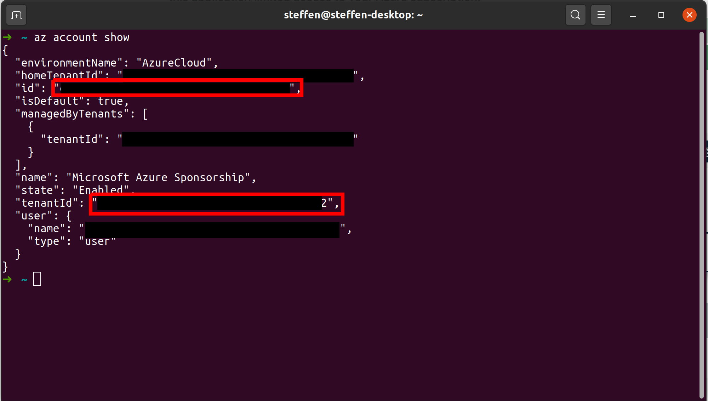
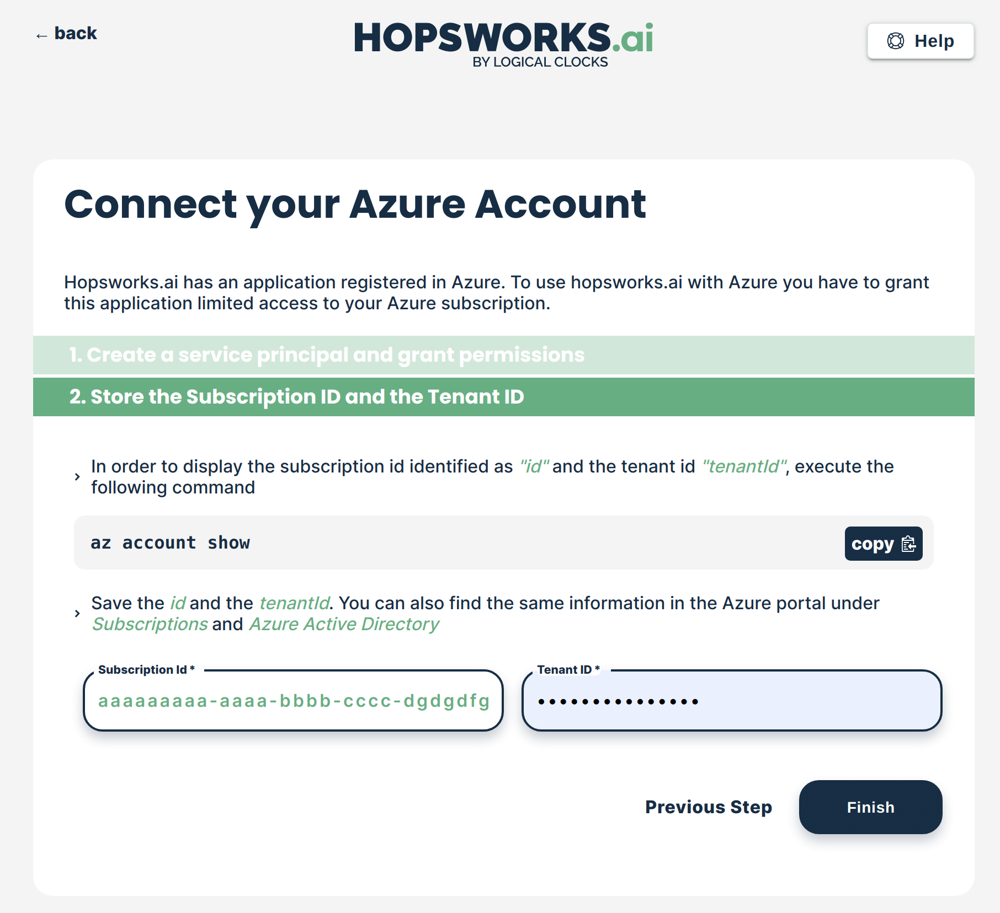
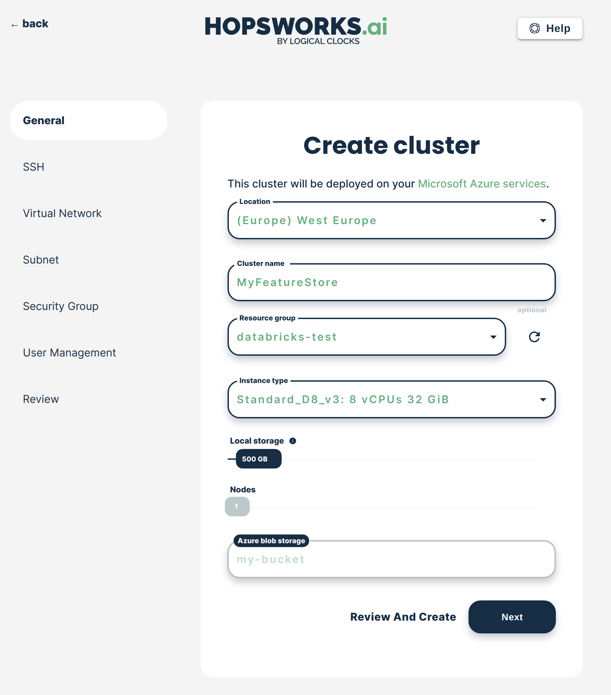

.. _getting-started-hopsworks-ai-azure:

Getting started with Hopsworks.ai (Azure)
=========================================

Hopsworks.ai is our managed platform for running Hopsworks and the Feature Store
in the cloud. It integrates seamlessly with third party platforms such as Databricks,
SageMaker and KubeFlow. This guide shows how to set up Hopsworks.ai with your organization's Azure account.

.. contents:: :local:

Step 1: Connecting your Azure account
-----------------------------------

Hopsworks.ai deploys Hopsworks clusters to your Azure account. To enable this, you have to
create a service principal and a custom role for Hopsworks.ai granting access
to either a subscription or resource group.

Step 1.1: Creating a service principal for Hopsworks.ai
~~~~~~~~~~~~~~~~~~~~~~~~~~~~~~~~~~~~~~~~~~~~~~~~~~~~~~~

On Hopsworks.ai, go to *Settings/Cloud Accounts* and choose to *Configure* Azure:

.. _connect-azure-0.png: ../../../_images/connect-azure-0.png
.. figure:: ../../../imgs/hopsworksai/connect-azure-0.png
    :alt: Cloud account settings
    :target: `connect-azure-0.png`_
    :align: center
    :figclass: align-center

Select *Add subscription key*:

.. _connect-azure-0.1.png: ../../../_images/connect-azure-0.1.png
.. figure:: ../../../imgs/hopsworksai/connect-azure-0.1.png
    :alt: Add subscription keys
    :target: `connect-azure-0.1.png`_
    :align: center
    :figclass: align-center

The Azure account configuration will show you the required steps and permissions.
Ensure that you have the Azure CLI installed (`Install the Azure CLI <https://docs.microsoft.com/en-us/cli/azure/install-azure-cli>`_)
and are logged in (`Sign in with Azure CLI <https://docs.microsoft.com/en-us/cli/azure/authenticate-azure-cli>`_).

Copy the Azure CLI command from the first step and open a terminal:

.. _connect-azure-1.png: ../../../_images/connect-azure-1.png

Paste the command into the terminal and execute it:

.. _connect-azure-2.png: ../../../_images/connect-azure-2.png
.. figure:: ../../../imgs/hopsworksai/connect-azure-2.png
    :alt: Add service principal
    :target: `connect-azure-2.png`_
    :align: center
    :figclass: align-center

At this point, you might get the following error message.
This means that your Azure user does not have sufficient permissions to add the service principal.
In this case, please ask your Azure administrator to add it for you or give you the required permissions.

.. code-block:: bash

    $ az ad sp create --id d4abcc44-2c40-40bd-9bba-986df591c28f
    When using this permission, the backing application of the service principal being created must in the local tenant

Step 1.2: Creating a custom role for Hopsworks.ai
~~~~~~~~~~~~~~~~~~~~~~~~~~~~~~~~~~~~~~~~~~~~~~~~~

Proceed to the Azure Portal and open either a *Subscription* or *Resource Group* that you want to use for Hopsworks.ai.
Select *Add* and choose *Add custom role*. Granting access to a *Subscription* will grant access to all *Resource Groups*
in that *Subscription*. If you are uncertain if that is what you want, then start with a *Resource Group*.

.. _connect-azure-3.png: ../../../_images/connect-azure-3.png
.. figure:: ../../../imgs/hopsworksai/connect-azure-3.png
    :alt: Add custom role
    :target: `connect-azure-3.png`_
    :align: center
    :figclass: align-center

Name the role and proceed to *Assignable scopes*:

.. _connect-azure-4.png: ../../../_images/connect-azure-4.png
.. figure:: ../../../imgs/hopsworksai/connect-azure-4.png
    :alt: Name custom role
    :target: `connect-azure-4.png`_
    :align: center
    :figclass: align-center

Ensure the scope is set to the *Subscription* or *Resource Group* you want to use.
You can change it here if required. Proceed to the JSON tab:

.. _connect-azure-5.png: ../../../_images/connect-azure-5.png
.. figure:: ../../../imgs/hopsworksai/connect-azure-5.png
    :alt: Review assignable scope
    :target: `connect-azure-5.png`_
    :align: center
    :figclass: align-center

Select *Edit* and replace the *actions* part of the JSON with the one from Hopsworks.ai Azure account configuration workflow:

.. _connect-azure-5.1.png: ../../../_images/connect-azure-5.1.png
.. figure:: ../../../imgs/hopsworksai/connect-azure-5.1.png
    :alt: Hopsworks.ai permission list
    :target: `connect-azure-5.1.png`_
    :align: center
    :figclass: align-center

Press *Save*, proceed to *Review + create* and create the role:

.. _connect-azure-6.png: ../../../_images/connect-azure-6.png
.. figure:: ../../../imgs/hopsworksai/connect-azure-6.png
    :alt: Update permission JSON
    :target: `connect-azure-6.png`_
    :align: center
    :figclass: align-center

Step 1.3: Assigning the custom role to Hopsworks.ai
~~~~~~~~~~~~~~~~~~~~~~~~~~~~~~~~~~~~~~~~~~~~~~~~~~~

Back in the *Subscription* or *Resource Group* overview, select *Add* and choose *Add role assignment*:

.. _connect-azure-7.png: ../../../_images/connect-azure-7.png
.. figure:: ../../../imgs/hopsworksai/connect-azure-7.png
    :alt: Add role assignment
    :target: `connect-azure-7.png`_
    :align: center
    :figclass: align-center

Choose the custom role you just created, select *User, group, or service principal* to *Assign access to*
and select the *hopsworks.ai* service principal. Press *Save*:

.. _connect-azure-8.png: ../../../_images/connect-azure-8.png
.. figure:: ../../../imgs/hopsworksai/connect-azure-8.png
    :alt: Configure Hopsworks.ai as role assignment
    :target: `connect-azure-8.png`_
    :align: center
    :figclass: align-center

Go back to the Hopsworks.ai Azure account configuration workflow and proceed to the next step. Copy the CLI command shown:

.. _connect-azure-9.png: ../../../_images/connect-azure-9.png
.. figure:: ../../../imgs/hopsworksai/connect-azure-9.png
    :alt: Configure subscription and tenant id
    :target: `connect-azure-9.png`_
    :align: center
    :figclass: align-center

Paste the CLI command into your terminal and execute it. Note that you might have multiple entries listed here.
If so, ensure that you pick the subscription that you want to use.

.. _connect-azure-10.png: ../../../_images/connect-azure-10.png

Copy the value of *id* and paste it into the *Subscription id*
field on Hopsworks.ai. Go back to the terminal and copy the value of *tenantId*. Ensure to NOT use the *tenantId* under *managedByTenants*.
Paste the value into the *Tenant ID* field on Hopsworks.ai and press *Finish*.

Congratulations, you have successfully connected you Azure account to Hopsworks.ai.

.. _connect-azure-10.1.png: ../../../_images/connect-azure-10.1.png

Step 2: Deploying a Hopsworks cluster
-------------------------------------

In Hopsworks.ai, select *Create cluster*:

.. _create-instance.png: ../../../_images/create-instance.png
.. figure:: ../../../imgs/hopsworksai/create-instance.png
    :alt: Create a Hopsworks cluster
    :target: `create-instance.png`_
    :align: center
    :figclass: align-center

Select the *Location*, *Resource Group*, *Instance type* and *Local storage* size, name the cluster and press *Next*:

.. _connect-azure-11.png: ../../../_images/connect-azure-11.png

Select the *SSH* that you want to use to access cluster instances:

.. _connect-azure-12.png: ../../../_images/connect-azure-12.png
.. figure:: ../../../imgs/hopsworksai/connect-azure-12.png
    :alt: Choose SSH key
    :target: `connect-azure-12.png`_
    :align: center
    :figclass: align-center

Select the *Virtual Network* or choose to automatically create a new one:

.. _connect-azure-13.png: ../../../_images/connect-azure-13.png
.. figure:: ../../../imgs/hopsworksai/connect-azure-13.png
    :alt: Choose virtual network
    :target: `connect-azure-13.png`_
    :align: center
    :figclass: align-center

Select the *Subnet* or choose to automatically create a new one:

.. _connect-azure-14.png: ../../../_images/connect-azure-14.png
.. figure:: ../../../imgs/hopsworksai/connect-azure-14.png
    :alt: Choose subnet
    :target: `connect-azure-14.png`_
    :align: center
    :figclass: align-center

Select the *Security group* or choose to automatically create a new one:

.. _connect-azure-15.png: ../../../_images/connect-azure-15.png
.. figure:: ../../../imgs/hopsworksai/connect-azure-15.png
    :alt: Choose security group
    :target: `connect-azure-15.png`_
    :align: center
    :figclass: align-center

Choose the user management you want. Select *Managed* to manage users via Hopsworks.ai, *LDAP* to integrate with your
organization's LDAP or *Disabled* to manage users manually from within Hopsworks:

.. _connect-azure-16.png: ../../../_images/connect-azure-16.png
.. figure:: ../../../imgs/hopsworksai/connect-azure-16.png
    :alt: Choose user management type
    :target: `connect-azure-16.png`_
    :align: center
    :figclass: align-center

Review all information and select *Create*:

.. _connect-azure-17.png: ../../../_images/connect-azure-17.png
.. figure:: ../../../imgs/hopsworksai/connect-azure-17.png
    :alt: Review cluster information
    :target: `connect-azure-17.png`_
    :align: center
    :figclass: align-center

The cluster will start. This might take a couple of minutes:

.. _booting.png: ../../../_images/booting.png
.. figure:: ../../../imgs/hopsworksai/booting.png
    :alt: Booting Hopsworks cluster
    :target: `booting.png`_
    :align: center
    :figclass: align-center

As soon as the cluster has started, you will be able to log in to your new Hopsworks cluster with the username
and password provided. You will also able to stop or terminate the cluster.

.. _running.png: ../../../_images/running.png
.. figure:: ../../../imgs/hopsworksai/running.png
    :alt: Running Hopsworks cluster
    :target: `running.png`_
    :align: center
    :figclass: align-center

Step 3: Outside Access to the Feature Store
-------------------------------------------

By default, only the Hopsworks UI is made available to clients on external networks, like the Internet.
To integrate with external platforms and access APIs for services such as the Feature Store, you have to open the service's ports.

Open ports by going to *Services* tab, selecting a service and pressing *Update*. This will update the *Security Group* attached to the 
Hopsworks cluster to allow incoming traffic on the relevant ports.

.. _open-ports.png: ../../../_images/open-ports.png
.. figure:: ../../../imgs/hopsworksai/open-ports.png
    :alt: Outside Access to the Feature Store
    :target: `open-ports.png`_
    :align: center
    :figclass: align-center

Step 4: Next steps
------------------

Check out our other guides for how to get started with Hopsworks and the Feature Store:

.. hlist:

* Get started with the :ref:`feature-store`
* Get started with Machine Learning on Hopsworks: :ref:`hops-ml`
* Get started with Hopsworks: :ref:`userguide`
* Code examples and notebooks: `hops-examples <https://github.com/logicalclocks/hops-examples>`_
