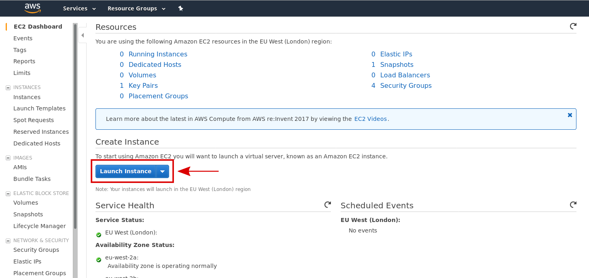
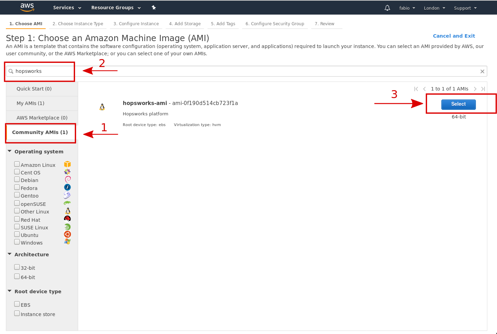
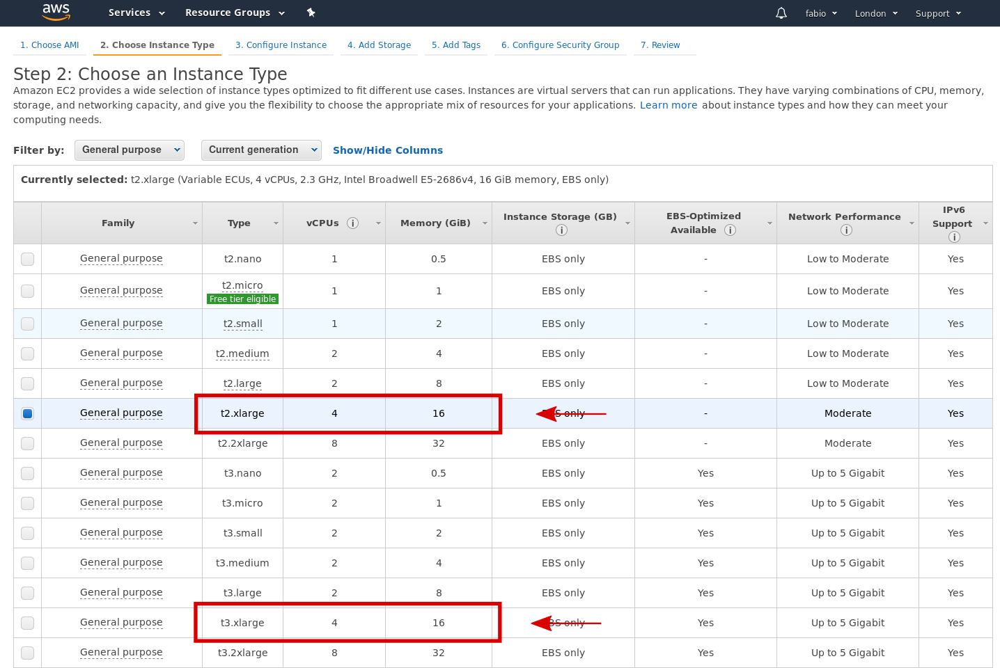
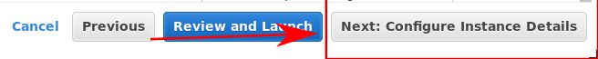
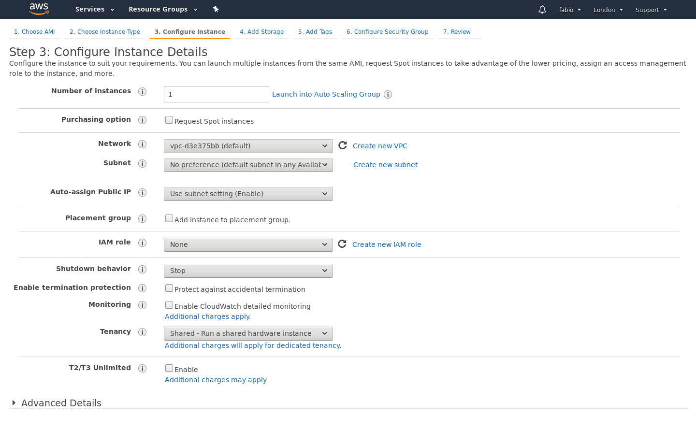
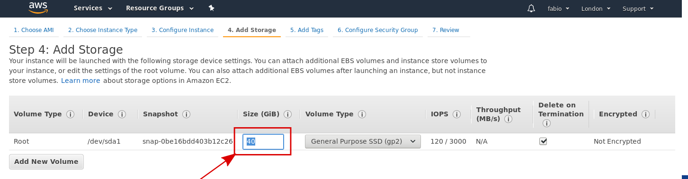
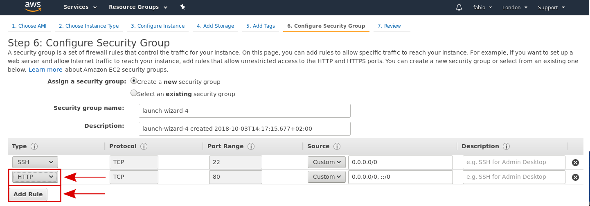
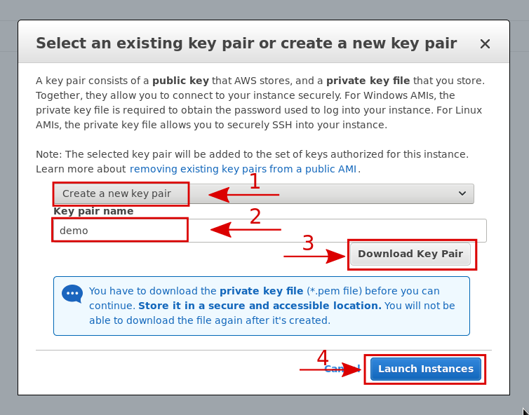

====================================
Hopsworks Amazon Machine Image (AMI)
====================================

We provide an Amazon Machine Image (AMI) of the latest version of Hopsworks. To start using the AMI log into your AWS account_ (or create a new one). 
The AMI is currently available in the London and Ohio regions. 

.. _account: https://eu-west-2.console.aws.amazon.com/ec2/v2/home?region=eu-west-2#Home:

Once you are logged in, click on `Launch Instance` to launch a machine instance based on the AMI.

.. _ami1.png: ../../_images/ami/ami1.png 

    Start the launching process

**Step 1** requires you to select the AMI. Select `Community AMIs` (1) and search for `hopsworks` (2). 
Click select on the desired version (3) to progress with the launch.

.. _ami3.png: ../../_images/ami/ami3.png 

    Select the Hopsworks AMI

In **step 2** you have to select which instance type you want to use. Currently the AMI is not configured to use GPUs. So you can run the AMI on instances of type *T* (general purpose) or *C* (compute optimized). Make sure the instance you launch has at least 16 GB of memory and 4 vCPUs available.
We suggest using either the *t2.xlarge* or the *t3.xlarge*. Select the type and proceed with the instance configuration.

.. _ami4.png: ../../_images/ami/ami4.png 

    Select the instance type

Click on *Next: Configure Instance Details* to proceed to step 3.

.. _ami9.png: ../../_images/ami/ami9.png 

    Procede with the next step 

**Step 3** requires you to configure the instance details. You can leave the default values and proceed with configuring storage.

.. _ami5.png: ../../_images/ami/ami5.png 

    
    Configure the instance details

In **step 4** you will be asked to configure the disk space. You can change the size of the Root volume as you wish, however we recommend you configure the volume with at least 40 GB of space.

.. _ami6.png: ../../_images/ami/ami6.png 

    Configure the storage 

In **step 5** you can add tags to your instance. You can skip this step.

In **step 6** you need to configure the security group. Make sure you allow incoming traffic from outside on both port 22 (for SSH connections) and on port 80 (for HTTP connections). Click *Add Rule* and select HTTP from the drop-down menu.

.. _ami7.png: ../../_images/ami/ami7.png 

    Configure the security group

Once you are done with the configuration, you can launch you instance by clicking *Review and Launch* and finally on *Launch*. 

.. _ami10.png: ../../_images/ami/ami10.png 

    Review configuration and launch

In this **final step** AWS will ask you which key you want to use to SSH into the machine. 
Create a new pair (1), give it a name (2) and download the key (3). Finally click Launch Instances (4)

.. _ami8.png: ../../_images/ami/ami8.png 

    Create and download the SSH key

As the popup says, you won't be able to re-downoad the same key in the future.

Please refer to the AWS documentation_ for more information on how to launch an EC2 instance: 

.. _documentation: https://docs.aws.amazon.com/AWSEC2/latest/UserGuide/launching-instance.html

The instance is now starting. Go back to the instance panel (Instances entry in the left panel) to check the launch progress. 

.. _ami2.png: ../../_images/ami/ami2.png 
.. figure:: ../../imgs/ami/ami2.png
    :alt: Instances panel 
    :target: `ami2.png`_
    :align: center
    :figclass: align-center

    Instances panel

Once the status is *running* you can SSH into the machine using the Public IP you find on the instances page. 
It's likely that the key you just downloaded has the wrong permission. Set the permission of the key file to 400 with the following command: 

.. code-block:: shell 

    chmod 400 <demo.pem> *Replace demo.pem with your key name*

After that you can ssh into the instance:

.. code-block:: shell 

    ssh -i <key path> ubuntu@<public ip>    *Replace demo.pem with your key name*

If you are on Windows you can use PuTTY_.

.. _PuTTY: https://docs.aws.amazon.com/AWSEC2/latest/UserGuide/putty.html?icmpid=docs_ec2_console

Once you log into the instance, you will find in the home directory of the ubuntu user (`/home/ubuntu`) a script called `start-services.sh`. Run the script.

.. code-block:: shell

    ./start-services.sh

The script will ask you to type in the email to register the instance and will start all the services (this step might take few minutes).

Once all the services are up and running, open the browser and visit `http://<public_ip>/hopsworks` where `public_ip` is the public ip of your instance.  

You can log into Hopsworks using the following credentials:

- username : admin@kth.se
- password : admin

Going further
-------------

You can now start using the platform! For more information on the different services the platform provides see :doc:`/user_guide/hopsworks`

For more complex installations (i.e. GPU support, multi-machine setup) refer to the :ref:`installation` page.
