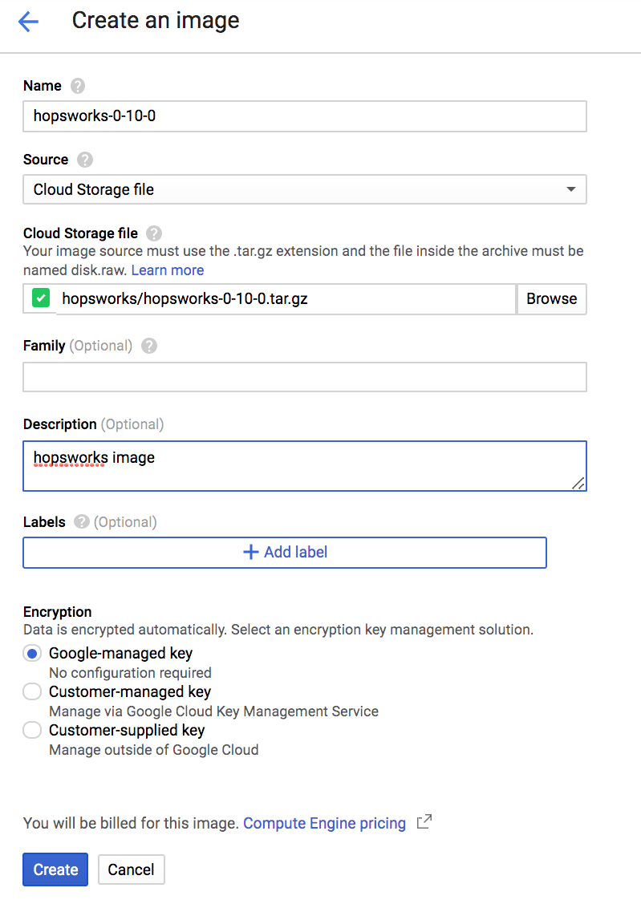
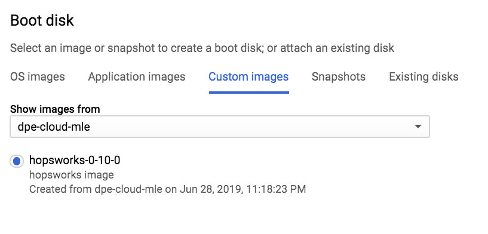
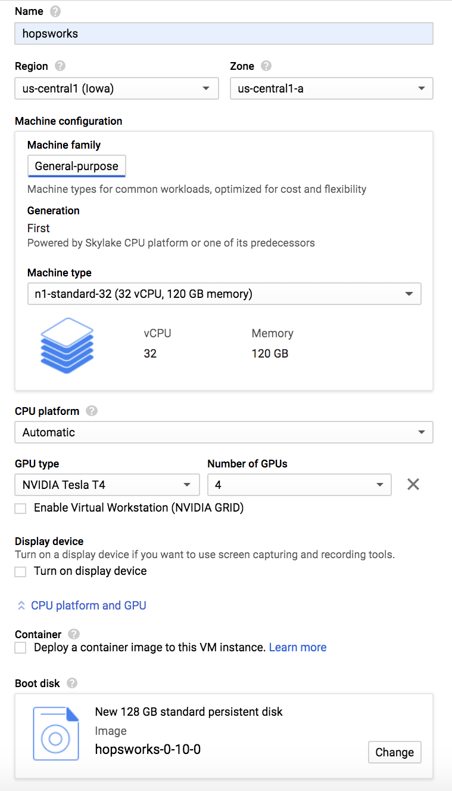

========================================================================
Hopsworks Google Cloud Platform Image
========================================================================

We provide a GCP image of the latest version of Hopsworks.

To start using the image log into your GCP account_ (or create a new one). 
We have created a `custom image`_ for you and this guide will help you setup HopsWorks in Google Cloud Platform.

.. _account: https://console.cloud.google.com/compute/

.. _`custom image`: https://cloud.google.com/compute/docs/images

Once you are logged in, click on `Launch Instance` to launch a machine instance based on the image.

**Step 1** Project setup. 
---------------------------------------

Before you can run any of the samples in this repository, you'll need to setup your GCP account and environment. The main steps are:

- Have a GCP account_ and create/select a GCP project on GCP Console.
- Enable the billing for your GCP project. Click here_ for more information.

.. _here: https://cloud.google.com/billing/docs/how-to/modify-project

Before you can create a Compute Instance with HopsWorks, you need to first import the Public Image. 

**Step 2** Create a Hopsworks Image.
----------------------------------------------------

Open Google Cloud Console > Compute Engine > Create Image 
**Name**: hopsworks-0-10
**Source: Cloud Storage File:** hopsworks/hopsworks-0-10-0.tar.gz
*Leave the other fields as default.*
Click on the **Create** button

.. _gcp1.png: ../../_images/gcp1.png

    Create an Image

**Note:** The image import process may take between 25-30 minutes, you can go grab a coffee and come back! You need to do this only once.

Once is image is created, you can go ahead and create a Compute Instance.
    

**Step 3** Create Compute Instance.
----------------------------------------------------

Open Google Cloud Console > Compute Engine > Create instance

**Name:** hopsworks-0-10
**Region:** Select your region
**Zone:** Select your zone
**Machine type:** n1-standard-32
**Boot disk:** Click change and select Custom Images tab, from there select:
**Hopsworks-0-10-0**

.. _gcp3.png: ../../_images/gcp3.png

    Boot Disk

**Boot disk size:** 64GB
**GPU:** 4 NVIDIA TESLA T4
**Firewall:** Check Allow HTTPS

.. _gcp2.png: ../../_images/gcp2.png

    Configure the Instance

Click on the Create button
---------------------------------------

Image creation will take a couple of minutes, once image is created you can access the Hopsworks UI by entering the Public address of Compute Instance:

https:/<Public IP Address>/hopsworks/#!/login

Username: admin@hopsworks.ai
Password:  admin

You should be able to land into Hopsworks main page!

The instance is now starting. Go back to the instance panel (Instances entry in the left panel) to check the launch progress. 

Once the status is *running* you can SSH into the machine using the Public IP you find on the instances page. 

Once all the services are up and running, open the browser and visit `https://<public_ip>/hopsworks` where `public_ip` is the public ip of your instance.  

You can log into Hopsworks using the following credentials:

- username : admin@hopsworks.ai
- password : admin

Costs
-------------

The cost of running this tutorial varies by section.
The estimated price to install Hopsworks, is approximately USD $35 per day. This cost is estimated based on the following specifications:
1 preemptible VM instance: n1-standard-32 (vCPUs: 32, RAM 120GB)
4 NVIDIA Tesla T4 GPU
These costs were estimated by using the pricing calculator.

Going further
--------------------------

You can now start using the platform! For more information on the different services the platform provides see :doc:`/user_guide/hopsworks`

For more complex installations (i.e. GPU support, multi-machine setup) refer to the :ref:`installation` page.
