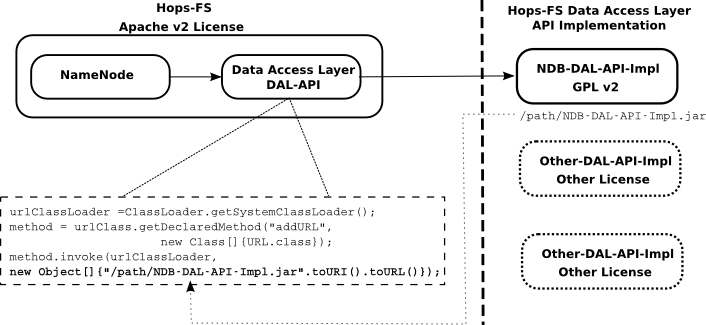

HopsFS
^^^^^^^^^^^^^^^^^^^^^^^^^^^^

.. figure:: imgs/hopsfs.png
   :alt: HopsFS Architecture

Hops-FS is a new implementation of the the Hadoop Filesystem (HDFS) based on `Apache Hadoop`_ 2.0.4-alpha, that supports multiple stateless NameNodes, where the metadata is stored in an in-memory distributed database (MySQL Cluster). Hops-FS enables more scalable clusters than Apache HDFS (up to ten times larger clusters), and enables NameNode metadata to be both customized and analyzed, because it can now be easily accessed via a SQL API.

.. figure:: imgs/hopsfs-arch.png
   :alt: HopsFS vs Apache HDFS Architecture
	 

Hops-FS maintains the same semantics of Apache HDFS, so that all the existing application and systems using
Apache HDFS can easily migrate to Hops-FS. Hops-FS supports most of the `configuration`_ parameters defined for Apache HDFS 

Unsupported HDFS Features, Configurations, and Commands
===============

Unsupported Features
---------------------

* **Secondary NameNode**
	The secondary NameNode is no longer supported. Hops-FS supports multiple NameNodes and all the NameNodes are active.
* **EditLog**
	The write ahead log (EditLog) is not needed as all the metadata mutations are stored in the highly available data store.
* **FSImage**
	We don’t need to store checkpoints of the metadata (FSImage) as NameNodes in Hops-FS are stateless and metadata is stored in the external metadata store.
* **Quorum Based Journaling**
	Replaced by the external metadata store.
* **NameNode Federation**
	NameNode federations are no longer supported.
* **Viewfs**
	Viewfs is used by federated HDFS to view a namespace that contains multiple federated NameNodes.
* **ZooKeeper**
	HDFS uses ZooKeeer for coordination services. Hops-FS has replaced ZooKeeper with a coordination service built on distributed shared memory.

Unsupported Configurations
---------------------

We have replaced HDFS 2.x’s Primary-Secondary Replication model with shared atomic trans-
actional memory. This means that we no longer use the parameters in HDFS that are based on
the (eventually consistent) replication of edit log entries from the Primary NameNode to the
Secondary NameNode using a set of quorum-based replication servers.

* **dfs.namenode.secondary.***
	None of the secondary NameNode attributes are used.
* **dfs.namenode.checkpoint.***
	None of the checkpoint attributes are used.
* **dfs.image.***
	None of the FSImage attributes are used.
* **dfs.journalnode.***
	None of the hadoop’s journaling attributes are used.
* **dfs.ha.***
	None of the hadoop high availability attributes are used.
* **dfs.nameservices.***
	None of the hadoop federation attributes are used.
* **dfs.namenode.num.extra.edits.***
	None of the edit logs attributes are used.
* **dfs.namenode.name.dir.***
	FSImage is not supported anymore.
* **dfs.namenode.edits.***
	None of the edit log attributes are used.

Unsupported Commands
---------------------

* **hdfs haadmin ***
	None of high availability admin commands are supported since we don’t support Apache Hadoop high availability solution.
* **hdfs dfsadmin -saveNamespace** 
	The Namespace is already stored in a database, a dump could be created to save it to file instead.
* **hdfs dfadmin -metaSave**
* **hdfs dfadmin -restoreFailedStorage**
* **hdfs dfadmin -rollEdits**
* **hdfs dfadmin -fetchImage**

There are some commands which we have disabled for now, but we could support in the future:

* **hdfs dfsadmin rollingUpgrade ***
* **hdfs dfadmin -allowSnapshot**
* **hdfs dfadmin -disallowSnapshot**

HopsFs Configurations
===============

NameNode Configurations
----------------------

* **dfs.block.pool.id**
	Due to shared state among the NameNodes, Hops-FS only support one block pool. Set this property to set a custom value for block pool. Default block pood id is HOP BLOCK POOL 123.
* **dfs.name.space.id**
	Due to shared state among NameNodes, Hops-FS only support one name space. Set this property to set a custom value for name space. Default name space id is 911.
	

Leader Election
~~~~~~~~~~~~~~~~

* **dfs.leader.check.interval**
	The length of the period in seconds on which NameNodes run the leader election protocol. One of the active NameNodes is chosen as a leader to perform housekeeping operations. All NameNodes periodically update a counter in the database to mark that they are active. All NameNodes also periodically check for changes in the membership of the NameNodes. By default the period is to one second. Increasing the time interval would lead to slow failure detection.
* **dfs.leader.missed.hb**
	This property specifies when a NameNode is declared dead. By default a NameNode is declared dead if it misses a HeartBeat. Higher values of this property would lead to slower failure detection.

Resolving Cache 
~~~~~~~~~~~~~~~

Each NameNode caches the path metadata (inode ids) in a resolving cache for later use. Note
this is not same as transaction cache used in the HopsFS NameNode Dal Implementation layer.
Resolving Cache entries have longer life than the individual transaction caches.
We support different implementations for the resolving cache; INodeMemcache, PathMem-
cache, OptimalMemcache and InMemory.

We support different implementations for the resolving cache; INodeMemcache, PathMem-
cache, OptimalMemcache and InMemory.

1. **INodeMemcache**
	for each path component “INode” we associate a key (parentId, Name) with a value INodeId.
2. **PathMemcache**
	for each path, we associate a key md5(path) with list of INodeIds.
3. **OptimalMemcache**
	sits in a middle ground between INodeMemcache and PathMemcache. We divide the path into parentPath and file then we associate md5(parentPath) with list of INodeIds till parent, and associate (fileparentId, fileName) with fileINodeId.
4. **InMemory**
	The same as INodeMemcache, but instead of using Memcache, we use a ConcurrentLinkedHashMap with LRU.

Common configuration:

* **dfs.resolvingcache.enabled**
	Enables/Disables the resolving cache for the NameNode.
* **dfs.resolvingcache.type**
	Resolving cache type, could be INode, Path, Optimal, InMemory. Default is InMemory.

Memcache specific configuration:

* **dfs.resolvingcache.memcached.server.address**
	Memcached server address.
* **dfs.resolvingcache.memcached.connectionpool.size**
	Number of connections to the memcached server.
* **dfs.resolvingcache.memcached.key.expiry**
	It determines when the memcached entries expire. The default value is 0, that is, the entries never expire. Whenever the NameNode encounters an entry that is no longer valid, it updates it.

InMemory cache specific configuration:

* **dfs.resolvingcache.inmemory.maxsize**
Max number of entries that could be in the cache before the LRU algorithm kick in.

PartitionKey 
~~~~~~~~~~~~~~~

* **dfs.ndb.setpartitionkey.enabled**
	Partition hints can be used to start transactions on a specific MySQL datanodes. If this parameters is set to false then the transactions will start on random MySQL Cluster datanodes. For performance reasons it is better to start the transactions on the datanodes that hold the data for the transaction.
* **dfs.ndb.setrandompartitionkey.enabled**
	If there is no parition key found, just use a random number to start the transaction on a random NDB datanode.

Quota Management 
~~~~~~~~~~~~~~~~

* **dfs.quota.enabled**
	Quota can be en/disabled. By default quota is enabled.

* **dfs.namenode.quota.update.interval**
	In order to boost the performance and increase the parallelism of metadata operations the quota updates are applied asynchronously. The quota update manager applies the outstanding quota updates after every dfs.namenode.quota.update.interval milliseconds.
* **dfs.namenode.quota.update.limit**
	The maximum number of outstanding quota updates that are applied in each round.

Distributed unique ID generator
~~~~~~~~~~~~~~~~~~~~~~~~~~~~~~~

ClusterJ APIs do not support any means to auto generate primary keys. Unique key generation is left to the application. Each NameNode has an ID generation daemon. ID generator keeps pools of pre-allocated IDs. The ID generation daemon keeps track of IDs for inodes, blocks and quota entities.

* *Batch Sizes*
	When the ID generator is about to run out of the IDs it pre-fetches a batch of new IDs. The batch size is specified by the following parameters:

	- **dfs.namenode.quota.update.id.batchsize** 
		Prefetch batch size for Quota Updates. As there are lot of quota updates in the system the default value is set to 100,000.
	- **dfs.namenode.inodeid.batchsize**
		 Prefetch batch size for inode IDs.
	- **dfs.namenode.blockid.batchsize**
		 Prefetch batch size for block IDs.
* *Update Threshold*
	These parameters define when the ID generator should pre-fetch new batch of IDs. Values for these parameter are defined as percentages i.e. 0.5 means prefetch new batch of IDs if 50% of the IDs have been consumed by the NameNode.

	- **dfs.namenode.quota.update.updateThreshold**
		Threshold value for quota IDs.
	- **dfs.namenode.inodeid.updateThreshold** 
		Threshold value for inode IDs.
	- **dfs.namenode.blockid.updateThreshold**
		 Threshold value for block IDs.
* **dfs.namenode.id.updateThreshold**
	It defines how often the IDs Monitor should check if the ID pools are running low on pre-allocated IDs.

Transaction Statistics 
~~~~~~~~~~~~~~~~~~~~~~~

* **dfs.transaction.stats.enabled**
	Each NameNode collect statistics about currently running transactions. The statistics willbe written in a comma separated file format, that could be parsed afterwards to get an aggregated view over all or specific transactions. By default transaction stats is disabled.

* **dfs.transaction.stats.detailed.enabled**
	If enabled, The NameNode will write a more detailed and human readable version of the statistics. By default detailed transaction stats is disabled.

.. code-block:: none

	Transaction: LEADER_ELECTION
	----------------------------------------
	VariableContext
		HdfsLeParams[PK] H=4 M=1
	N=0 M=1 R=0
	Hits=4(4) Misses=1(1)
	Detailed Misses: PK 1(1)
	----------------------------------------
	----------------------------------------
	HdfsLESnapshot
		All[FT] H=0 M=1
		ById[PK] H=1 M=0
	N=1 M=0 R=0
	Hits=1(0) Misses=1(0)
	Detailed Misses: FT 1(0)
	----------------------------------------
	Tx. N=1 M=1 R=0
	Tx. Hits=5(4) Misses=2(1)
	Tx. Detailed Misses: PK 1(1) FT 1(0)

* **dfs.transaction.stats.dir**
	The directory where the stats are going to be written. Default directory is /tmp/hopsstats.
* **dfs.transaction.stats.writerround**
	How frequent the NameNode will write collected statistics to disk. Time is in seconds. Default is 120 seconds.

Client Configurations
----------------------

* **dfs.namenodes.rpc.addresses**
	HopsFs support multiple active NameNodes. A client can send a RPC request to any of the active NameNodes. This parameter specifies a list of active NameNodes in the system. The list has following format [hdfs://ip:port, hdfs://ip:port, ]. It is not necessary that this list contain all the active NameNodes in the system. Single valid reference to an active NameNode is sufficient. At the time of startup the client will obtain the updated list of all the NameNodes in the system from the given NameNode. If this list is empty then the client will connect to ’fs.default.name’.

* **dfs.namenode.selector-policy**
	The clients uniformly distribute the RPC calls among the all the NameNodes in the system based on the following policies. 
	- ROUND ROBIN
	- RANDOM
	- RANDOM_STICKY
	By default NameNode selection policy is set of ROUND ROBIN

* **dfs.clinet.max.retires.on.failure**
	The client will retry the RPC call if the RPC fails due to the failure of the NameNode. This property specifies how many times the client would retry the RPC before throwing an exception. This property is directly related to number of expected simultaneous failures of NameNodes. Set this value to 1 in case of low failure rates such as one dead NameNode at any given time. It is recommended that this property must be set to value >= 1.
* **dfs.client.max.random.wait.on.retry**
	A RPC can fail because of many factors such as NameNode failure, network congestion etc. Changes in the membership of NameNodes can lead to contention on the remaining NameNodes. In order to avoid contention on the remaining NameNodes in the system the client would randomly wait between [0,MAX VALUE] ms before retrying the RPC. This property specifies MAX VALUE; by default it is set to 1000 ms.
* **dfs.client.refresh.namenode.list**
	All clients periodically refresh their view of active NameNodes in the system. By default after every minute the client checks for changes in the membership of the NameNodes. Higher values can be chosen for scenarios where the membership does not change frequently.

Data access layer configuration parameters
------------------------------------------

* **com.mysql.clusterj.connectstring**
	Address of management server of MySQL NDB Cluster.
* **com.mysql.clusterj.database**
	Name of the database that contains the metadata tables.
* **com.mysql.clusterj.connection.pool.size**
	This is the number of connections that are created in the ClusterJ connection pool. If it is set to 1 then all the sessions share the same connection; all requests for a SessionFactory with the same connect string and database will share a single SessionFactory. A setting of 0 disables pooling; each request for a SessionFactory will receive its own unique SessionFactory. We set the default value of this parameter to 3.
* **com.mysql.clusterj.max.transactions**
	Maximum number transactions that can be simultaneously executed using the clusterj client. The maximum support transactions are 1024.
* **io.hops.metadata.ndb.mysqlserver.host**
	Address of MySQL server. For higher performance we use MySQL Server to perform a aggregate queries on the file system metadata.
* **io.hops.metadata.ndb.mysqlserver.port**
	If not specified then default value of 3306 will be used.
* **io.hops.metadata.ndb.mysqlserver.username**
	A valid user name to access MySQL Server.
* **io.hops.metadata.ndb.mysqlserver.password**
	MySQL Server user password
* **io.hops.metadata.ndb.mysqlserver.connection pool size**
	Number of NDB connections used by the MySQL Server. The default is set to 10. 

* *Session Pool* 
	For performance reasons the data access layer maintains a pools of pre-allocated ClusterJ session objects. Following parameters are used to control the behavior the session pool.

	- **io.hops.session.pool.size**
		Defines the size of the session pool. The pool should be at least as big as the number of active transactions in the system. Number of active transactions in the system can be calculated as (num rpc handler threads +sub tree ops threds pool size). The default value is set to 1000.
	- **io.hops.session.reuse.count**
		 Session is used N times and then it is garbage collected. The default value is set to 5000.

Erasure Coding
==============

Licensing
==============

We combine Apache and GPL licensed code, from Hops and MySQL Cluster, respectively, by
providing a DAL API (similar to JDBC). We dynamically link our DAL implementation for
MySQL Cluster with the Hops code. Both binaries are distributed separately.
Hops derives from Hadoop and, as such, it is available under the Apache version 2.0 open-
source licensing model. MySQL Cluster and its client connectors, on the other hand, are li-
censed under the GPL version 2.0 licensing model. Similar to the JDBC model, we have in-
troduced a Data Access Layer (DAL) API to bridge our code licensed under the Apache model
with the MySQL Cluster connector libraries, licensed under the GPL v2.0 model. The DAL
API is licensed under the Apache v2.0 model. The DAL API is statically linked to both Hops
and our client library for MySQL Cluster that implements the DAL API. Our client library
that implements the DAL API for MySQL Cluster, however, is licensed under the GPL v2.0
model, but static linking of Apache v2 code to GPL V2 code is allowed, as stated in the MySQL
FOSS license exception. The FOSS License Exception permits use of the GPL-licensed MySQL
Client Libraries with software applications licensed under certain other FOSS licenses without
causing the entire derivative work to be subject to the GPL. However, to comply with the terms
of both licensing models, the DAL API needs to generic and different implementations of it
for different databases are possible. Although, we only currently support MySQL Cluster, you
are free to develop your own DAL API client and run Hops on a different database, see figure
3.4. The main requirements for the database are support for transactions, read/write locks and
at least read-committed isolation.

.. _Apache Hadoop: http://hadoop.apache.org/releases.html
.. _configuration: http://hadoop.apache.org/docs/current/hadoop-project-dist/hadoop-hdfs/hdfs-default.xml