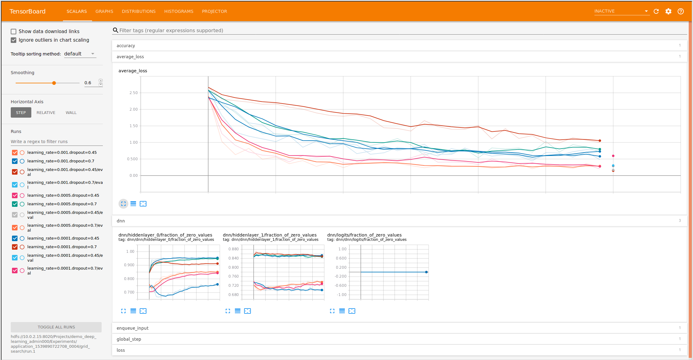
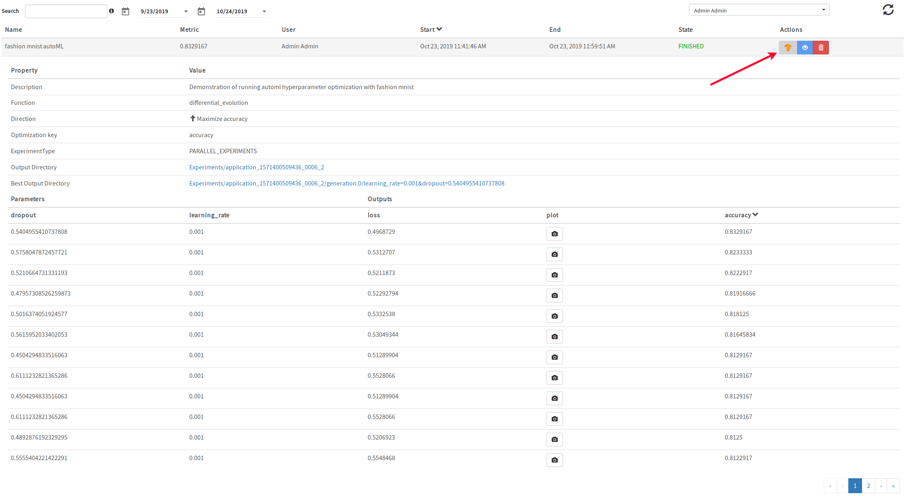

===========
Experiments
===========
.. highlight:: python

In HopsML we offer a rich experiment API for data scientists to run their Machine Learning code, whether it be TensorFlow, Keras, PyTorch or another framework with a Python API. HopsML provides features such as automatic versioning of notebooks and the python environment, parallel hyperparameter tuning algorithms, and managed TensorBoard. With the `Maggy <https://maggy.readthedocs.io>`_ framework, we also provide asynchronous algorithms for parallel hyperparameter tuning and parallel ablation studies.

Hopsworks uses PySpark to manage the allocation of resources, such as CPU, Memory and GPUs. PySpark is also used to transparently distribute the Python function, defining the experiment, to Executors that then execute the function. When using deep learning, Executors typically have been allocated a GPU on which the function is executed. Certain hyperparameter optimization algorithms such as random search and grid search, are easily parallelized such that Executors can each run separate trials with different hyperparameter combinations. By default, we enable Dynamic Executors, so that if a particular Executor sits idle for configurable period of time (default 60 seconds), it will be reclaimed by the cluster.

Python Library
-------------------

The Hopsworks Python Library named `hops` provides support for running Python applications that interact with Hopsworks and/or leverage PySpark for distribution on the Hopsworks platform. It simplifies interacting with services such as Feature Store, Model Repository, Serving, Inference and TensorBoard. The `experiment` module provides a rich API for running versioned Machine Learning experiments, whether it be a simple single-process Python application or Distributed Training over many machines.

Documentation: hops-py_ 

Experiment examples: hops-examples_ 

Reading from HopsFS (HDFS)
##########################

**Step 1**. The first step is to ingest data to your experiment. First get the root path to your project in HopsFS. This is easily done by using the hdfs module as below.

::

    ... Experiment code ...

    from hops import hdfs
    project_root_path = hdfs.project_path()

    ... Experiment code ...

The path returned is to the root directory in Hopsworks of your project.

.. _datasets-browser.gif: ../_images/datasets-browser.gif
.. figure:: ../imgs/datasets-browser.gif
    :alt: Data Sets browser
    :target: `datasets-browser.gif`_
    :align: center
    :figclass: align-center

    Data Sets browser (click image to enlarge)

**Step 2**. Append the relative path of your dataset to the root path. Assuming you uploaded a file named ``train.tfrecords`` in the Resources dataset, the path pointing to that particular dataset would then be.

::

    ... Experiment code ...

    from hops import hdfs
    project_root_path = hdfs.project_path()
    tfrecords_dataset = project_root_path + "Resources/train.tfrecords"

    ... Experiment code ...

**Step 2 (optional)**. Not all python libraries have support for HDFS (for example, numpy cannot read files directly from HDFS). In those cases, users should instead download the dataset from HDFS to the local filesystem.

::

    ... Experiment code ...

    from hops import hdfs
    project_root_path = hdfs.project_path()
    tfrecords_dataset = project_root_path + "Resources/train.tfrecords"

    # downloads train.tfrecords to current working directory
    # the local file path is returned
    tfrecords_dataset = hdfs.copy_to_local(tfrecords_dataset)

    ... Experiment code ...

**Step 2 (optional)**. If you have your data in an s3 bucket you can read the data using TensorFlow by
setting environment variables AWS_ACCESS_KEY_ID, AWS_SECRET_ACCESS_KEY, AWS_SESSION_TOKEN (which can be set using the assume role API
in Hops util. See :doc:`../user_guide/hopsworks/assume-role` for a full code example.) and AWS_REGION
then 

::

    ... Experiment code ...

    tfrecords_dataset = ["s3://resource/train/train.tfrecords"]

    ... Experiment code ...

**Step 3**. Use the path as any other path in your experiment.

::

    ... Experiment code ...
    
    dataset = tf.data.TFRecordDataset(tfrecords_dataset)
    
    ... Experiment code ...
    
    
The programming model: Wrap your Machine Learning code in a function
####################################################################

To be able to run your TensorFlow code on GPUs in Hopsworks, the code for the whole program needs to be provided and put inside the wrapper function. Everything, from importing libraries to reading data and defining the model and running the program, needs to be put inside a wrapper function. The arguments of the wrapper function maps directly to the name of your hyperparameters.

::

    # Hyperparameter are learning rate and dropout
    def training(learning_rate, dropout):
        # Experiment code (including reading data, defining model, starting training...)
    
   

Experiment
----------

The simple Experiment abstraction corresponds to a single Python ML program, for example any hyperparameters or other configuration is hard-coded in the code itself.

See experiment_ for full examples, below is a pseudo-code snippet.

::

    def code_to_run():
        import tensorflow as tf
        # Import hops helper modules
        from hops import hdfs
        from hops import tensorboard
        dropout = 0.5
        learning_rate = 0.001
        
        # Point to tfrecords dataset in your project
        dataset = tf.data.TFRecordDataset(hdfs.project_path() + '/Resources/train.tfrecords')
        
        logdir = tensorboard.logdir()
        
        # Dummy training code... replace with actual
        metric = model.train(learning_rate, dropout, logdir...)
        return metric
    
    from hops import experiment
    experiment.launch(code_to_run)

    
Parallel Experiments
--------------------

Hyperparameter optimization is critical to achieve the best accuracy for your model. HopsML hyperparameter optimization provides parallelized versions of grid-search, random-search and other autoML algorithms that automatically search for hyperparameters to iteratively improve evaluation metrics for your models, for example, model accuracy.

See parallel_experiment_ for full examples.

**Grid search**

To define the hyperparameters, create a dictionary with the keys matching the arguments of your wrapper function, and a list of values for each hyperparameter.

::
  
    args_dict = {'learning_rate': [0.001, 0.0005, 0.0001], 'dropout': [0.45, 0.7]}

    def training(learning_rate, dropout):
        # Training code
        metric = model.eval(learning_rate, dropout)
        return metric

.. csv-table:: Job number and hyperparameters
   :header: "Job number", "Learning rate", "Dropout"
   :widths: 20, 20, 10

   "1", "0.001", "0.45"
   "2", "0.001", "0.7"
   "3", "0.0005", "0.45"
   "4", "0.0005", "0.7"
   "5", "0.0001", "0.45"
   "6", "0.0001", "0.7"

After defining the training code, the hyperparameter combinations and the direction to optimize (Direction.MIN or Direction.MAX) the next step is to start the actual training. This is done using the *experiment* module from the hops python library.

::

    from hops import experiment
    from hops.experiment import Direction
    experiment.grid_search(training, args_dict, direction=Direction.MAX)

Its input argument is simply the wrapper function and the dictionary with the hyperparameters. `experiment.grid_search` will simply run the wrapper function and generate the grid of hyperparameters and inject the value of each hyperparameter that you have specified. The above hyperparameters can simply be visualized in the same TensorBoard to provide a detailed overview.

.. _grid_search.png: ../_images/grid_search.png

Differential Evolution
----------------------

In evolutionary computation, differential evolution (DE) is a method that optimizes a problem by iteratively trying to improve a candidate solution with regard to a given measure of quality. A neural network can be thought of as an optimization problem, given a set of hyperparameters and a lower and upper bound for each hyperparameter value there should be a configuration for which the `quality` (accuracy on the testing set) is highest.

In HopsML, we support differential evolution, and a search space for each hyperparameter needs to be defined. To define the search space, simply create a dictionary with the keys matching the arguments of your wrapper function, and a list with two values corresponding to the lower and upper bound of the search space. The wrapper function can either return a single value or a dict of metrics to reflect how the experiment performed for the given hyperparameters.
If multiple metrics are returned then it should be in a dict, also optimization_key needs to be set to indicate the value of which key should reflect the performance of the hyperparameter combination. You can then specify the direction to optimize: Direction.MIN or Direction.MAX.

::
  
    search_dict = {'learning_rate': [0.001, 0.0001], 'dropout': [0.45, 0.7]}

    def training(learning_rate, dropout):
        # model.eval corresponds to your own code, which results in accuracy and loss for the model
        acc, loss = model.eval(learning_rate, dropout)
        return {'accuracy': acc, 'loss': loss, 'plot': 'image_file.png'}
        
After defining the training code and the hyperparameter bounds, the next step is to tune some hyperparameters for the differential evolution algorithm and start the actual training. This is done using the *experiment* module from the hops python library.

::

    from hops import experiment
    from hops.experiment import Direction
    experiment.differential_evolution(training, search_dict, direction=Direction.MAX, optimization_key='accuracy')
    
    
Provided that you selected a wide enough search space for every hyperparameter you should see a gradual improvement as you train for an increasing number of generations. 

**Generation 1**

.. _generation0.png: ../_images/generation0.png
.. figure:: ../imgs/generation0.png
   :alt: Dataset browser
   :target: `generation0.png`_
   :align: center
   :figclass: align-center

**Generation 2**

.. _generation1.png: ../_images/generation1.png
.. figure:: ../imgs/generation1.png
   :alt: Dataset browser
   :target: `generation1.png`_
   :align: center
   :figclass: align-center
 
**Generation 3**

.. _generation2.png: ../_images/generation2.png
.. figure:: ../imgs/generation2.png
   :alt: Dataset browser
   :target: `generation2.png`_
   :align: center
   :figclass: align-center   
    

Distributed Training
--------------------

**What is Distributed Training?**

Compared to Experiment and Parallel Experiments, Distributed Training involves making use of multiple machines with potentially multiple GPUs per machine in order to train the model.

HopsML supports all the Distribution Strategies in TensorFlow. Making distributed training with TensorFlow or Keras as simple as invoking a function with your code in order to setup the cluster and start the training.

In TensorFlow without Hopsworks, setting up distributed training with one of the Distribution Strategies requires finding out the IP address of every machine in the cluster and the free port that will be used by each worker process. After that an environment variable named TF_CONFIG needs to be exported and every process started manually on each machine. TF_CONFIG contains information about where all the other workers are in the cluster in addition to what role the current process is playing in the training (worker, parameter server or chief). All this is done automatically by HopsML, in addition to reserving the specified number of GPUs for your worker and chief processes, parameter servers are run on CPU. Each process runs on a Dynamic Spark executor which is reclaimed by the resource manager when training is finished.

See distributed_training_ for full examples.

See distribution_strategies_ for DistributionStrategy github page.

Viewing TensorBoard while an Experiment is running
##################################################

When you run your job using the experiment API a TensorBoard will be started automatically. To interact with TensorBoard, import the tensorboard module from the hops python library. In addition to writing summaries and your TensorBoard events of course.

::

    ... TensorFlow code ...

    from hops import tensorboard
    logdir = tensorboard.logdir()

    ... TensorFlow code ...
    
**Navigate to TensorBoard in Hopsworks**
After launching your job using experiment, you can monitor training by observing the TensorBoard.

.. _jupyter.png: ../_images/jupyter.png
.. figure:: ../imgs/jupyter.png
   :alt: Navigate to TensorBoard 1
   :target: `jupyter.png`_
   :align: center
   :figclass: align-center

.. _overview.png: ../_images/overview.png
.. figure:: ../imgs/overview.png
   :alt: Navigate to TensorBoard 2
   :target: `overview.png`_
   :align: center
   :figclass: align-center

Execution Logs
########################

**Navigate to Logs in Hopsworks**
After launching your job using experiment, you can navigate to Hopsworks to view execution logs.

.. _logs.png: ../_images/logs.png
.. figure:: ../imgs/logs.png
   :alt: Logs location
   :target: `logs.png`_
   :align: center
   :figclass: align-center

.. _viewlogs.png: ../_images/viewlogs.png
.. figure:: ../imgs/viewlogs.png
   :alt: View execution logs
   :target: `viewlogs.png`_
   :align: center
   :figclass: align-center

Experiments service
-------------------

Experiments service provides a unified view of all the experiments run using the experiment API in the hops python library. As shown in the figure, it provides an overview of the experiment results and the ability to compare hyperparameters and metrics to find the best model.
Users do not need to register experiments themselves in any explicit way, it is enough to use any of the `experiment` module's functions for the experiment to be registered and tracked.

The experiment program (notebook or python file) and Anaconda environment yaml file is automatically versioned when an experiment is registered. The artifacts are placed in the *Experiment Directory*.

All print statements performed in the wrapper function are saved in a log file for each experiment and is accessed by pressing the camera icon under Outputs.

.. _experiments_service.png: ../_images/experiments_service.png
.. figure:: ../imgs/experiments_service.png
    :alt: TensorBoard
    :target: `experiments_service.png`_
    :align: center
    :figclass: align-center

In the wrapper function, users can return images or files they want to associate with the experiment by returning the local file path to the image. Attached files can then be viewed in the experiments service.

.. _experiment_plot.png: ../_images/experiment_plot.png
.. figure:: ../imgs/experiment_plot.png
    :alt: TensorBoard
    :target: `experiment_plot.png`_
    :align: center
    :figclass: align-center

A TensorBoard can be shown for the experiment by clicking on the TensorFlow icon. TensorBoard can visualize the experiment results (for example, the accuracy of training) both while the experiment is running as well as after the experiment has completed.

The TensorBoard is opened in a separate tab in your browser, which means you may need to allow the popup to appear in your browser (typically you get a notification icon in the searchbar for your browser - click on it to allow the popup).

.. _tensorboard_experiment_service.png: ../_images/tensorboard_experiment_service.png

.. _tensorboard.png: ../_images/tensorboard.png
.. figure:: ../imgs/tensorboard.png
    :alt: TensorBoard
    :target: `tensorboard.png`_
    :align: center
    :figclass: align-center

.. _hops-py: http://hops-py.logicalclocks.com/hops.html#module-hops.experiment
.. _hops-examples: https://github.com/logicalclocks/hops-examples/tree/master/notebooks/ml

.. _experiment: https://github.com/logicalclocks/hops-examples/tree/master/notebooks/ml/Experiment
.. _parallel_experiment: https://github.com/logicalclocks/hops-examples/tree/master/notebooks/ml/Parallel_Experiments
.. _distributed_training: https://github.com/logicalclocks/hops-examples/tree/master/notebooks/ml/Distributed_Training
.. _distribution_strategies: https://github.com/tensorflow/tensorflow/tree/master/tensorflow/python/distribute

