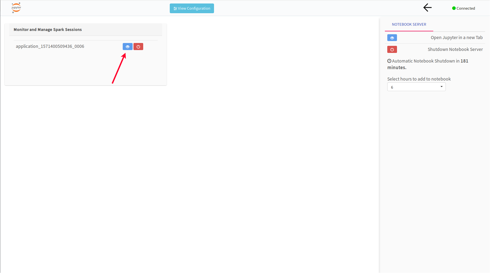
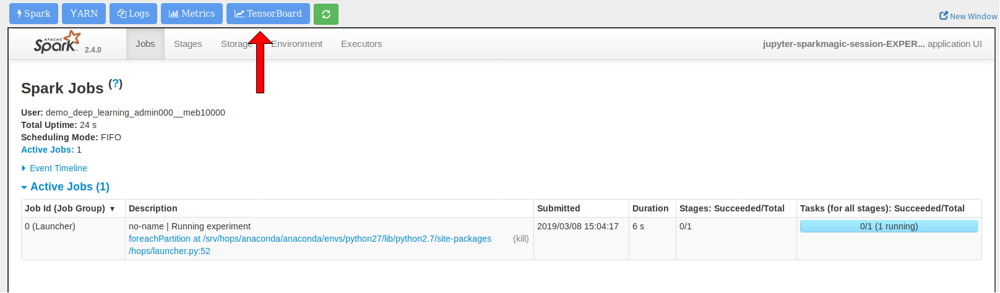
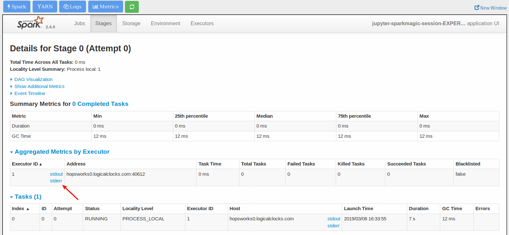
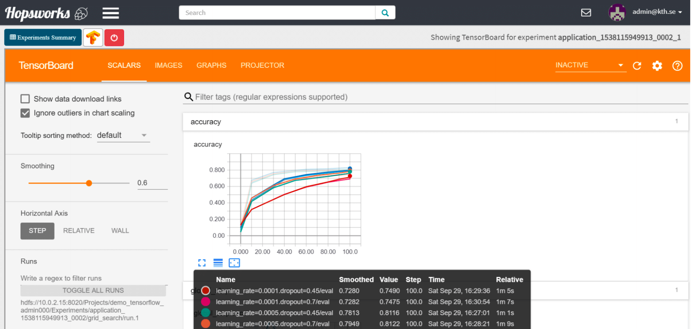

===========================
The Experiments abstraction
===========================
.. highlight:: python

In PySpark, Hops runs a different experiment on each executor – not all of the experiments will finish at the same time. Some experiments may finish early, some later. And GPUs cannot currently be shared (multiplexed) by concurrent applications. Population-based approaches for AutoML, typically proceed in stages or iterations, meaning all experiments wait for other experiments to finish, resulting in idle GPU time. That is, GPUs lie idle waiting for other experiments to finish.

As such, we have the problem of how to free up the GPUs as soon as its experiment is finished. Hops leverages dynamic executors in PySpark/YARN to free up the GPU(s) attached to an executor immediately if it sits idle waiting for other experiments to finish, ensuring that (expensive) GPUs are held no longer than needed.

Hops Python Library
-------------------

The Hops Python Library simply named *hops* is used for running Python applications and consequently a library which is used throughout the entire pipeline. It simplifies interacting with services such as Kafka, Model Serving and TensorBoard. The experiment module provides a rich API for running versioned Machine Learning experiments, whether it be a simple single-process Python application or RingAllReduce over many machines.

Documentation: hops-py_ 

Experiment examples: hops-examples_ 

Reading from HopsFS (HDFS)
##########################

**Step 1**. The first step is to ingest data to your experiment. The first step is to get the root path to your project in HopsFS. This is easily done by using the hdfs module as below.

::

    ... Experiment code ...

    from hops import hdfs
    project_root_path = hdfs.project_path()

    ... Experiment code ...
    
The path returned is to the root directory in Hopsworks of your project.

.. _datasets-browser.png: ../_images/datasets-browser.png
.. figure:: ../imgs/datasets-browser.png
   :alt: Dataset browser
   :target: `datasets-browser.png`_
   :align: center
   :figclass: align-center

**Step 2**. Append the relative path of your dataset to the root path. Assuming you uploaded a file named ``train.tfrecords`` in the Resources dataset, the path pointing to that particular dataset would then be.

::

    ... Experiment code ...

    from hops import hdfs
    project_root_path = hdfs.project_path()
    tfrecords_dataset = project_root_path + "Resources/train.tfrecords"

    ... Experiment code ...

**Step 3**. Use the path as any other path in your experiment. Keep in mind that the API you are using to read the dataset must support reading from HDFS. Alternatively you could use ``hdfs.copy_to_local("Resources/train.tfrecords", "")`` which will download the dataset to your executor so it can be used by any API.

::

    ... Experiment code ...
    
    dataset = tf.data.TFRecordDataset(tfrecords_dataset)
    
    ... Experiment code ...
    
    
The programming model: Wrap your Machine Learning code in a function
####################################################################

To be able to run your TensorFlow code on Hops, the code for the whole program needs to be provided and put inside a wrapper function. Everything, from importing libraries to reading data and defining the model and running the program, needs to be put inside a wrapper function. The arguments of the wrapper function would map directly to the name of your hyperparameters.

::

    # Hyperparameter are learning rate and dropout
    def training(learning_rate, dropout):
        # Experiment code (including reading data, defining model, starting training...)
    
   

Experiment
----------

The simple Experiment abstraction corresponds to a single Python ML program, for example any hyperparameters or other configuration is hard-coded in the code itself.

See experiment_ for full examples, below is a pseudo-code snippet.

::

    def code_to_run():
        import tensorflow as tf
        # Import hops helper modules
        from hops import hdfs
        from hops import tensorboard
        dropout = 0.5
        learning_rate = 0.001
        
        # Point to tfrecords dataset in your project
        dataset = tf.data.TFRecordDataset(hdfs.project_path() + '/Resources/train.tfrecords')
        
        logdir = tensorboard.logdir()
        
        # Dummy training code... replace with actual
        metric = model.train(learning_rate, dropout, logdir...)
        return metric
    
    from hops import experiment
    experiment.launch(code_to_run)

    
Parallel Experiments
--------------------

Hyperparameter optimization is critical to achieve the best accuracy for your model. With HopsML, hyperparameter optimization is easier than ever. We provide grid-search or state-of-the-art evolutionary optimization which will automatically learn what hyperparameters are the best and iteratively improve metrics such as model accuracy.
See parallel_experiment_ for full examples.

**Grid search**

To define the hyperparameters, simply create a dictionary with the keys matching the arguments of your wrapper function, and a list of values for each hyperparameter.

::
  
    args_dict = {'learning_rate': [0.001, 0.0005, 0.0001], 'dropout': [0.45, 0.7]}

    def training(learning_rate, dropout):
        # Training code
        metric = model.eval(learning_rate, dropout)
        return metric

.. csv-table:: Job number and hyperparameters
   :header: "Job number", "Learning rate", "Dropout"
   :widths: 20, 20, 10

   "1", "0.001", "0.45"
   "2", "0.001", "0.7"
   "3", "0.0005", "0.45"
   "4", "0.0005", "0.7"
   "5", "0.0001", "0.45"
   "6", "0.0001", "0.7"

After defining the training code, the hyperparameter combinations and the direction to optimize ('min' or 'max') the next step is to start the actual training. This is done using the *experiment* module from the hops python library.

::

    from hops import experiment
    experiment.grid_search(training, args_dict, direction='max')

Its input argument is simply the wrapper function and the dictionary with the hyperparameters. `experiment.grid_search` will simply run the wrapper function and generate the grid of hyperparameters and inject the value of each hyperparameter that you have specified.

Differential Evolution
----------------------

In evolutionary computation, differential evolution (DE) is a method that optimizes a problem by iteratively trying to improve a candidate solution with regard to a given measure of quality. A neural network can be thought of as an optimization problem, given a set of hyperparameters and a lower and upper bound for each hyperparameter value there should be a configuration for which the `quality` (accuracy on the testing set) is highest.

In HopsML, we support differential evolution, and a search space for each hyperparameter needs to be defined. To define the search space, simply create a dictionary with the keys matching the arguments of your wrapper function, and a list with two values corresponding to the lower and upper bound of the search space. Compared to grid search, a metric needs to be returned by your code that will correspond to the fitness value of your configuration. You can then specify the direction to optimize, 'min' or 'max'.

::
  
    search_dict = {'learning_rate': [0.001, 0.0001], 'dropout': [0.45, 0.7]}

    def training(learning_rate, dropout):
        # model.eval corresponds to your own code, which results in a metric
        metric = model.eval(learning_rate, dropout)
        return metric
        
After defining the training code and the hyperparameter bounds, the next step is to tune some hyperparameters for the differential evolution algorithm and start the actual training. This is done using the *experiment* module from the hops python library.

::

    from hops import experiment
    experiment.evolutionary_search(training, args_dict_grid, direction='max')
    
    

Distributed Training
--------------------

**What is Distributed Training?**

Compared to Experiment and Parallel Experiments, Distributed Training involves making use of multiple machines with potentially multiple GPUs per machine in order to train the model.

HopsML supports the newly released MirroredStrategy, ParameterServerStrategy and CollectiveAllReduceStrategy in TensorFlow. Making distributed training with TensorFlow or Keras as simple as invoking a function with your code in order to setup the cluster and start the training.

See distributed_training_ for full examples.

Working with TensorBoard
########################

When you run your job using the experiment API a TensorBoard will be started automatically. To interact with TensorBoard, import the tensorboard module from the hops python library. In addition to writing summaries and your TensorBoard events of course.

::

    ... TensorFlow code ...

    from hops import tensorboard
    logdir = tensorboard.logdir()

    ... TensorFlow code ...
    
**Navigate to TensorBoard in Hopsworks**
After launching your job using experiment, you can monitor training by observing the TensorBoard.

.. _jupyter.png: ../_images/jupyter.png

.. _overview.png: ../_images/overview.png

Execution Logs
########################

**Navigate to Logs in Hopsworks**
After launching your job using experiment, you can navigate to Hopsworks to view execution logs.

.. _logs.png: ../_images/logs.png
.. figure:: ../imgs/logs.png
   :alt: Logs location
   :target: `logs.png`_
   :align: center
   :figclass: align-center

.. _viewlogs.png: ../_images/viewlogs.png

Experiments service
-------------------

.. _tensorboard.png: ../_images/tensorboard.png

We have prepared several notebooks in the TensorFlow tour on Hopsworks with examples for running parallel experiments on Hops.

.. _hops-py: http://hops-py.logicalclocks.com
.. _hops-examples: https://github.com/logicalclocks/hops-examples/tree/master/tensorflow/notebooks

.. _experiment: https://github.com/logicalclocks/hops-examples/tree/master/tensorflow/notebooks/Experiment
.. _parallel_experiment: https://github.com/logicalclocks/hops-examples/tree/master/tensorflow/notebooks/Parallel_Experiments
.. _distributed_training: https://github.com/logicalclocks/hops-examples/tree/master/tensorflow/notebooks/Distributed_Training

https://github.com/logicalclocks/hops-examples/tree/master/tensorflow/notebooks/Distributed_Training
