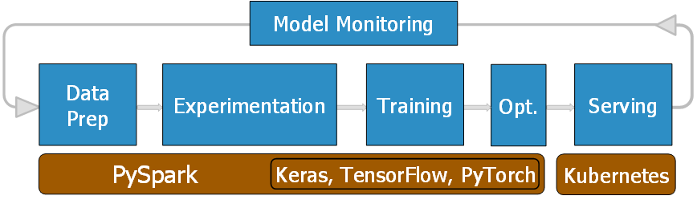
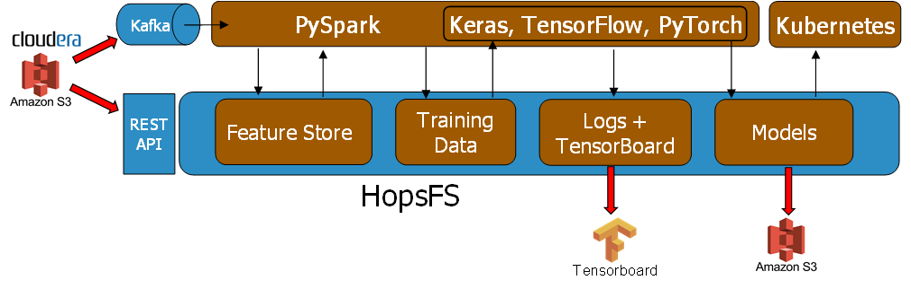
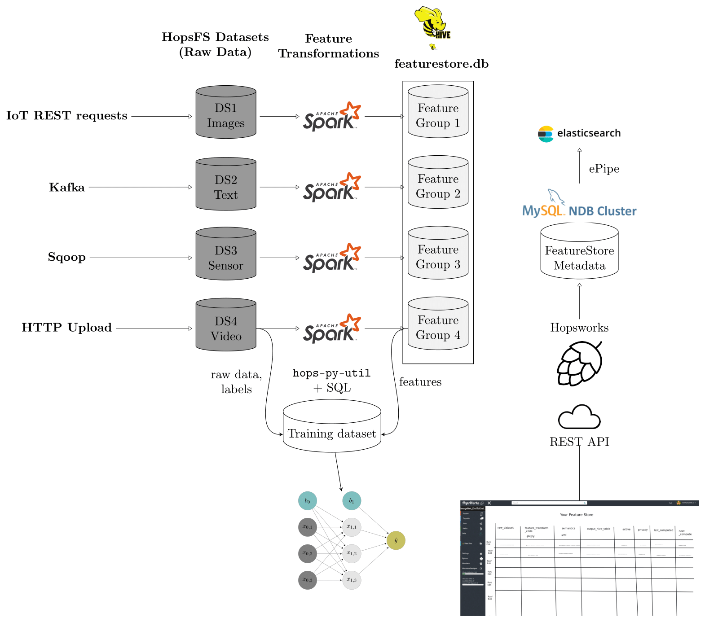
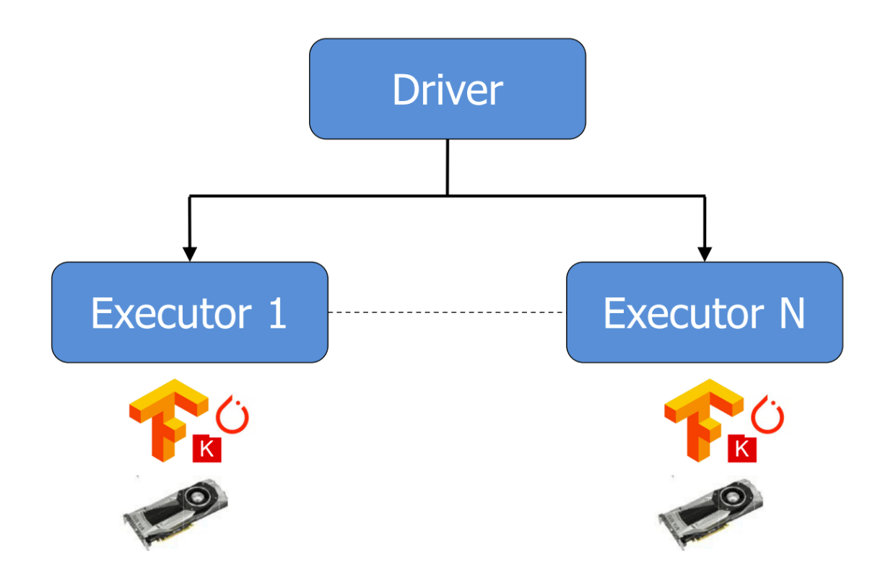
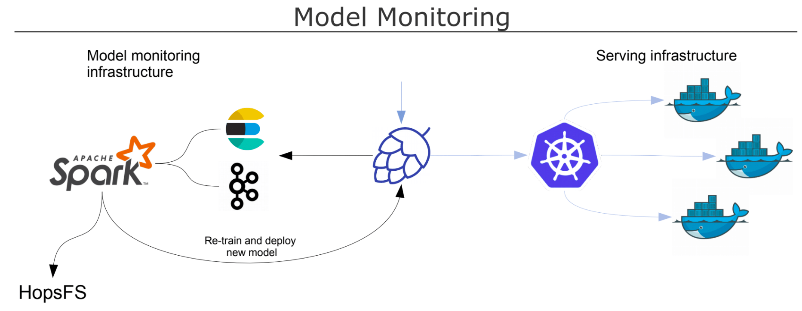
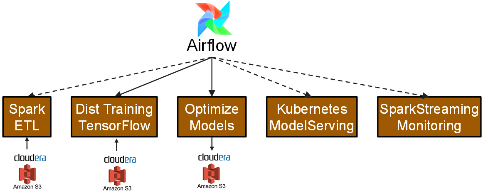

HopsML
======

Python-First ML Pipelines
------------

HopsML is a Python-first framework for building machine learning pipelines. HopsML is enabled by unique support for project-specific conda environments in Hopsworks. As every project in Hopsworks has its own conda environment, replicated at all data processing hosts in the cluster, Data Scientists can simply 'pip install' Python libraries in Hopsworks and immediately use them in their PySpark/TensorFlow/PyTorch applications, enabling interactive application development. This contrasts with an immutable infrastructure approach, where Data Scientists need to write Dockerfiles and write YML files describing cluster specifications just to install a Python library. The other unique aspect of HopsML is the use of HopsFS (a distributed filesystem) to coordinate the different steps in a pipeline. HopsFS integrates seamlessly with Estimator APIs in TensorFlow/Keras, enabling the transparent management and aggregation of logs, checkpoints, TensorBoard events, and models across many Executors in a cluster. HopsML extends these Estimator artifacts with versioned notebooks and Python environments, enabling a view of *experiments* that have been run and now can be easily reproduced.

.. _hopsml-pipeline.png: ../_images/hopsml-pipeline.png

A machine learning (ML) pipeline is a series of processing steps that:

- optionally ingests (raw) input data from external sources,
- wrangles the input data in an ETL job (data cleaning/validation, feature extraction, etc) to generate clean training data,
- trains a model (using GPUs) with the clean training data,
- validates and optimizes the model,
- deploys the model to production,
- monitors model performance in production.

HopsML pipelines are written as a different programs for each stage in the pipeline, and the pipeline itself is written as a Airflow DAGs (directed acyclic graph).
Typically all programs in the pipeline are written in Python, although Scala/Java ca be used at the ETL stage, in particular when dealing with large volumes of input data.

For ML pipelines processing small amounts of data, developers can write a Keras/TensorFlow/PyTorch application to perform both ETL and training in a single program, although developers should be careful that the ETL stage is not so CPU intensive that GPUs cannot be fully utilized when training. For example, in an image processing pipeline, if the same Keras/TensorFlow/PyTorch application is used to both decode/scale/rotate images as well as train a deep neural network (DNN), the application will probably be CPU-bound or I/O bound, and GPUs will be underutilized.

For ML pipelines processing large amounts of data, developers can write a seperate Spark or PySpark application to perform ETL and generate training data. When that application has completed, Airflow will then schedule a PySpark application with Keras/TensorFlow/PyTorch to train the DNN, on possibly many GPUs. The training data will be read from a distributed filesystem (HopsFS), and all logs, TensorBoard events, checkpoints, and the model will be written to the same distributed filesystem. When training has completed, Airflow can schedule a simple Python/Bash job to optimize the trained model (e.g., quantize model weights, remove batch norm layers,  shrink models for mobile devices), using either Nvidia's TensorRT library or TensorFlow's *transform_graph* utility. The optimized model (a .pb (protocol buffers) file in TensorFlow) can then be deployed directly from HopsFS to a model serving server (TensorFlow serving Server on Kubernetes) using a REST call on Hopsworks. Finally, Airflow can start a Spark Streaming job to monitor the deployed model by consuing logs for the deployed model from Kafka.
	       
.. _hopsml-hopsfs-pipeline.png: ../_images/hopsml-hopsfs-pipeline.png

	       
HopsML uses HopsFS, a next-generation version of HDFS, to coordinate the different steps of an ML pipeline. Input data for pipelines can come from external sources, such as an existing Hadoop cluster or a S3 datalake, a feature store, or existing training datasets. External datasources can push data to HopsFS using either the Hopsworks REST-API or using Kafka in Hopsworks.

During a ML pipeline HopsFS acts as a central coordinator for sharing data between the different stages. Examples of such data include features from the store, existing training data, PySpark/TensorFlow application logs, Tensorboard events (aggregate from many different executors/GPUs), output models, checkpoints, partial/full results from hyperparameter optimization. 

	       
Hops Python Library
-------------------

The Hops Python Library simply named *hops* is used for running Python applications and consequently a library which is used throughout the entire pipeline. It simplifies interacting with services such as Kafka, Model Serving and TensorBoard. The experiment module provides a rich API for running versioned Machine Learning experiments, whether it be a simple single-process Python application or RingAllReduce over many machines.

Documentation: hops-py_ 

Code examples: hops-examples_ 

Data Collection
---------------

The datasets that you are working with will reside in your project in HopsFS. Data can be uploaded to your project in a number of ways, such as using the hops-cli client, the REST API or the uploader in the Hopsworks UI. HopsFS is the filesystem of Hops, it is essentially an optimized fork of Apache HDFS, and is compliant with any API that can read data from an HDFS path, such as TensorFlow, Spark and Pandas.

Data Transformation & Verification
----------------------------------

It is important to validate the datasets used in your pipeline, for example imbalanced classes may lead to Machine Learning models being biased towards more frequently occurring labels in the dataset.  Therefore it is of outmost importance for input data to be balanced and representative of the domain from which the data came. One of the big steps toward ensuring the correctness of data is through data quality and validation checks. Machine Learning models, as have been observed empirically and in papers_, reduce their generalization error for larger datasets. Therefore it is also critical to have a data wrangling and validation engine which scales for ever increasing datasets. The solution for this is to go distributed in order to process every single record, but still have a rich API for perform quality checks and manipulating the data. The pipeline makes use of Spark to provide these capabilities.

Spark Dataframes can be used to transform and validate large datasets in a distributed manner. For example schemas can be used to validate the datasets. Useful insights can be calculated such as class imbalance, null values for fields and making sure values are inside certain ranges. Datasets can be transformed by dropping or filtering fields.

For visualizations on datasets, see spark-magic_ or facets_ examples here. 

Feature Store
------------------

    "A feature store allows teams to share, discover, and use a highly curated set of features for their machine learning problems"
        Michelangelo_ by Uber

.. _Michelangelo: https://eng.uber.com/michelangelo

Hopsworks provides a feature store to curate, store, and document features for use in ML pipelines. The feature store requires a change data engineers and data scientists extract features and use features from data sources. Feature engineering now becomes a separate, documented step that enables:

1. Feature Reuse/Collaboration,
2. Feature Documentation,
3. Feature Backfilling,
4. Feature Versioning,
5. DRY (not repeat yourself) feature engineering.

.. _hopsworks_feature_store.png: ../_images/hopsworks_feature_store.png

	       

Experimentation
---------------

This section will give an overview of running Machine Learning experiments on Hops.

In HopsML we offer a rich experiment_ API for data scientists to run their Machine Learning code, whether it be TensorFlow, Keras PyTorch or another framework with a Python API. To mention some of features it provides versioning of notebooks and other resources, AutoML algorithms that will find the best hyperparameters for your model and managing TensorBoard.

Hops uses PySpark to manage resource allocation of CPU, Memory and GPUs. PySpark is also used to transparently distribute the Python code making up the experiment to Executors which executes it. Certain hyperparameter optimization algorithms such as random search and grid search are parallelizable by nature, which means that different Executors will run different hyperparameter combinations. If a particular Executor sits idle it will be reclaimed by the cluster, which means that GPUs will be optimally used in the cluster. This is made possible by Dynamic Spark Executors.

.. _pyspark_tf.png: ../_images/pyspark_tf.png

Hops supports cluster-wide Conda for managing Python library dependencies. Hops supports the creation of projects, and each project has its own conda environment, replicated at all hosts in the cluster. When you launch a PySpark job, it uses the local conda environment for that project. This way, users can install whatever libraries they like using conda and pip package managers, and then use them directly inside Spark Executors. It makes programming PySpark one step closer to the single-host experience of programming Python.

HopsML comes with a novel Experiments service for overviewing history of Machine Learning experiments.

.. _tensorboard.png: ../_images/tensorboard.png
.. figure:: ../imgs/tensorboard.png
    :alt: TensorBoard
    :target: `tensorboard.png`_
    :align: center
    :scale: 80 %	    
    :figclass: align-center

See experiments_ for more information.

See jupyter_ for development using Jupyter notebooks.

Serving
-------

In the pipeline we support a scalable architecture for serving of TensorFlow and Keras models. We use the TensorFlow Serving server running on Kubernetes to scale up the number of serving instances dynamically and handle load balancing. There is support for using either the grpc client or the REST API to send inference requests. Furthermore we also support a monitoring system that logs the inference requests and allows users to implement custom functionality for retraining of models.

.. _serving_architecture.png: ../_images/serving_architecture.png

See model_serving_ and inferencing_ for more information.

.. _experiments: ./experiment.html
.. _model_serving: ./model_serving.html
.. _inferencing: ../user_guide/tensorflow/inference.html
.. _hops-py: http://hops-py.logicalclocks.com
.. _experiment: http://hops-py.logicalclocks.com/hops.html#module-hops.experiment
.. _hops-examples: https://github.com/logicalclocks/hops-examples/tree/master/tensorflow/notebooks
.. _spark-magic: https://github.com/logicalclocks/hops-examples/blob/master/tensorflow/notebooks/Plotting/Data_Visualizations.ipynb
.. _facets: https://github.com/logicalclocks/hops-examples/blob/master/tensorflow/notebooks/Plotting/facets-overview.ipynb
.. _papers: https://arxiv.org/abs/1707.02968
.. _jupyter: ../user_guide/hopsworks/jupyter.html

Pipeline Orchestration
-------

HopsML pipelines are typically run as Airflow DAGs, written in Python. An Airflow pipline is a directed acyclic graph (DAG) of tasks to be executed, orchestration rules, failure handling logic, and notifications. Airflow DAGs can be scheduled to run periodically, for example, once per hour, or Airflow can wait for an event (with sensors) before executing a task - for example, wait for _SUCCESS file in a parquet directory before understanding that the Parquet file(s) are finished being written.
Typical tasks in a production Airflow ML pipeline on Hops involve Data Prep as a PySpark job, training using HopsML (PySpark + TensorFlow), model optimization using a PySpark job or a bash job, and model deployment as either a Python program or bash script.

.. _hopsml-airflow.png: ../_images/hopsml-airflow.png

