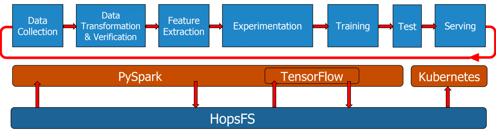

HopsML
======

The Pipeline
------------

.. _pipeline.png: ../_images/pipeline.png

    
    
Hops Python Library
-------------------

The Hops Python Library simply named *hops* is used for running Python applications and consequently a library which is used throughout the entire pipeline. It simplifies interacting with services such as Kafka, Model Serving and TensorBoard. The experiment module provides a rich API for running versioned Machine Learning experiments, whether it be a simple single-process Python application or RingAllReduce over many machines.

Documentation: hops-py_ 

Code examples: hops-examples_ 

Data Collection
---------------

The datasets that you are working with will reside in your project in HopsFS. Datasets can be uploaded to your Hopsworks project or be shared from another project. HopsFS is the filesystem of Hops, it is essentially a fork of Apache HDFS and is compliant with any API that can read data from an HDFS path, such as TensorFlow. In your TensorFlow code you can simply replace local file paths to the corresponding path in HDFS. More information is available `here <https://www.tensorflow.org/deploy/hadoop>`_.

Data can also be ingested using Kafka or Spark Streaming.

Data Transformation & Verification
----------------------------------

It is important to validate the datasets used in your pipeline, for example imbalanced classes may lead to Machine Learning models being biased towards more frequently occurring labels in the dataset.  Therefore it is of outmost importance for input data to be balanced and representative of the domain from which the data came. One of the big steps toward ensuring the correctness of data is through data quality and validation checks. Machine Learning models, as have been observed empirically and in papers_, reduce their generalization error for larger datasets. Therefore it is also critical to have a data wrangling and validation engine which scales for ever increasing datasets. The solution for this is to go distributed in order to process every single record, but still have a rich API for perform quality checks and manipulating the data. The pipeline makes use of Spark to provide these capabilities.

Spark Dataframes can be used to transform and validate large datasets in a distributed manner. For example schemas can be used to validate the datasets. Useful insights can be calculated such as class imbalance, null values for fields and making sure values are inside certain ranges. Datasets can be transformed by dropping or filtering fields.

For visualizations on datasets See spark-magic_ or facets_ here. 

Feature Extraction
------------------

This part of the pipeline is still in development. The plan is to release a Feature Store.

Experimentation
---------------

This section will give an overview of running Machine Learning experiments on Hops.

In HopsML we offer a rich experiment_ API for data scientists to run their Machine Learning code, whether it be TensorFlow, Keras PyTorch or another framework with a Python API. To mention some of features it provides versioning of notebooks and other resources, AutoML algorithms that will find the best hyperparameters for your model and managing TensorBoard.

Hops uses PySpark to manage resource allocation of CPU, Memory and GPUs, in addition to transparently distribute the python code to run. In PySpark, Hops runs a different experiment on each executor – not all of the experiments will finish at the same time. Some experiments may finish early, some later. And GPUs cannot currently be shared (multiplexed) by concurrent applications. Population-based approaches for AutoML, typically proceed in stages or iterations, meaning all experiments wait for other experiments to finish, resulting in idle GPU time. That is, GPUs lie idle waiting for other experiments to finish.

.. _pyspark_tf.png: ../_images/pyspark_tf.png
.. figure:: ../imgs/pyspark_tf.png
    :alt: Increasing throughput
    :target: `pyspark_tf.png`_
    :align: center
    :figclass: align-center

In PySpark, Hops runs a different experiment on each executor – not all of the experiments will finish at the same time. Some experiments may finish early, some later. And GPUs cannot currently be shared (multiplexed) by concurrent applications. Population-based approaches for AutoML, typically proceed in stages or iterations, meaning all experiments wait for other experiments to finish, resulting in idle GPU time. That is, GPUs lie idle waiting for other experiments to finish.

As such, we have the problem of how to free up the GPUs as soon as its experiment is finished. Hops leverages dynamic executors in PySpark to free up the GPU(s) attached to an executor immediately if it sits idle waiting for other experiments to finish, ensuring that (expensive) GPUs are held no longer than needed.

Each Spark executor runs a local TensorFlow process. Hops also supports cluster-wide Conda for managing python library dependencies. Hops supports the creation of projects, and each project has its own conda environment, replicated at all hosts in the cluster. When you launch a PySpark job, it uses the local conda environment for that project. This way, users can install whatever libraries they like using conda and pip, and then use them directly inside Spark Executors. It makes programming PySpark one step closer to the single-host experience of programming Python.

.. _tensorboard.png: ../_images/tensorboard.png
.. figure:: ../imgs/tensorboard.png
    :alt: TensorBoard
    :target: `tensorboard.png`_
    :align: center
    :figclass: align-center

See experiments_ for more information.

See jupyter_ for development using Jupyter notebooks.

Serving
-------

In the pipeline we support a scalable architecture for serving of TensorFlow and Keras models. We use the TensorFlow Serving running on K8s to scale up the number of serving instances dynamically and handle load balancing.

.. _serving_architecture.png: ../_images/serving_architecture.png
.. figure:: ../imgs/serving_architecture.png
    :alt: TensorBoard
    :target: `serving_architecture.png`_
    :align: center
    :figclass: align-center

See model_serving_ for more information.

.. _experiments: ./experiment.html
.. _model_serving: ./model_serving.html
.. _hops-py: http://hops-py.logicalclocks.com
.. _experiment: http://hops-py.logicalclocks.com/hops.html#module-hops.experiment
.. _hops-examples: https://github.com/logicalclocks/hops-examples/tree/master/tensorflow/notebooks
.. _spark-magic: https://github.com/logicalclocks/hops-examples/blob/master/tensorflow/notebooks/Plotting/Data_Visualizations.ipynb
.. _facets: https://github.com/logicalclocks/hops-examples/blob/master/tensorflow/notebooks/Plotting/facets-overview.ipynb
.. _papers: https://arxiv.org/abs/1707.02968
.. _jupyter: ../user_guide/hopsworks/jupyter.html
