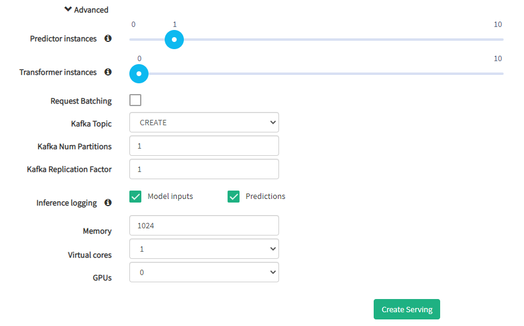

.. _kfserving:

========================
KFServing
========================
.. highlight:: python

Hopsworks provides support for serving models with KFServing, Kubeflow's model deployment and serving toolkit.
KFServing is an open-source multi-framework model serving tool for serverless inference on Kubernetes, and is part of the Kubeflow ecosystem for machine learning on Kubernetes.

KFServing is based on the Knative serverless paradigm and relies on Istio as the service mesh to configure the necessary components that make model servers reachable within the Kubernetes cluster and externally.
Serving models with KFServing brings additional advantages compared to regular Kubernetes deployments such as scale-to-zero capabilities, fine-grained inference request logging or support for more complex serving pipelines using transformers to pre- and post-process the model inputs and predictions at inference time.

**Supported frameworks**
Currently, only the deployment of Tensorflow models is supported on Hopsworks using KFServing, while work is in progress for Scikit-Learn and PyTorch models.

Export your model
-----------------

The first step to serving your model is to train it and export it as a servable model to the Hopsworks Model Registry in your Hopsworks project.
This can be done by using the `model module`_ from the Hops python library.

An example code snippet, taken from https://examples.hopsworks.ai/ml/experiment/tensorflow/mnist/ , shows how to export a Tensorflow model to the Hopsworks Model Registry:

.. code-block:: python

    from hops import model as hops_model
    ...
    tf.saved_model.save(model, export_path)
    ...  
    hops_model.export(export_path, "<model-name>", ..)

Tensorflow models
=================

In case of Tensorflow models, you can save your model using the `SavedModelBuilder`_. 

When you export a TensorFlow model using the hops library, the model's .pb file and variables directory are stored in the Models dataset in your Hopsworks project.
The Models dataset is the location where the data for your project's model registry is stored. Inside the dataset, the directory structure should mirror what is expected by TensorFlow Serving.

.. code-block:: shell

    Models
    └── mnist
        ├── 1
        │   ├── saved_model.pb
        │   └── variables
        │       ├── variables.data-00000-of-00001
        │       └── variables.index
        └── 2
            ├── saved_model.pb
            └── variables
                ├── variables.data-00000-of-00001
                └── variables.index

TensorFlow Serving expects the model directory (in this case *mnist*) to contain one or more sub-directories.
The name of each sub-directory is a number representing the version of the model, the higher the version, the more recent the model.
Inside each version directory TensorFlow Serving expects a file named *saved_model.pb*, which contains the model graph, and a directory called *variables* which contains the weights of the model.

Model Serving with KFServing
-----------------------------

To start serving your model with KFServing, create a serving definition in the Hopsworks Model Serving service or using the `Hops python library`_, enabling the KFServing parameter.
To achieve this, the process is similar than serving models on Kubernetes with some additional configuration related to KFServing.
Please, see :ref:`tf_model_serving` or :ref:`python_model_serving` to learn how to serve models on Hopsworks, depending on your Machine Learning framework.

**Step 1.**

To start serving your model with KFServing, create a serving definition in the Hopsworks Model Serving service or using the `Hops python library`_, enabling the KFServing flag.

.. _kfserving_serving1.png: ../_images/serving/kfserving_serving1.png

Once you enable KFServing, you can optionally select a transformer script to be deployed together with the model server for pre- and post-processing of model inputs and predictions.
The transformer script has to implement the `Transformer` class as well as the methods `preprocess` and `postprocess`. Both methods receive a dictionary containing the model input or predictions, and must also return a dictionary with the transformed values.
See an example using KFServing with a transformer `here <https://github.com/logicalclocks/hops-examples/blob/master/notebooks/ml/serving/kfserving/tensorflow/model_serving_kfserving_with_transformer_tensorflow.ipynb>`_.

.. code-block:: python

    class Transformer(object):
        def __init__(self):
            print("[Transformer] Initializing...")
            # Initialization code goes here

        def preprocess(self, inputs):
            # Transform the request inputs here. The object returned by this method will be used as model input.
            return inputs

        def postprocess(self, outputs):
            # Transform the predictions computed by the model before returning a response.
            return outputs

The transformer script should be stored in the Models dataset in your Hopsworks project.
You can add the script file by clicking on the "Browse" button next to *Transformer*. This will open a popup window that will allow you to browse your project and select the file.
 
.. _kfserving_serving2.png: ../_images/serving/kfserving_serving2.png

Transformers are executed in the conda environment for the project.
That is, any Python libraries installed in your project's conda environment are available for use in your Transformer program.
If you want to use a new Python library in your Transformer, you should first install it using the :ref:`python_environment` service, before deploying your model to KfServing.
It is good practice to test your transformer code beforehand to make sure it will run correctly once it is deployed.
For example, you can test the transformer code in a Job or Jupyter notebook in the same Project as Jobs/Notebooks have the same Python libraries (Conda environment) as used in the Transformer.

Moreover, transformers scale independently and can make use of the CPU or GPU regardless of how model servers are configured since they are deployed in a different Kubernetes pod.
One of the potential use cases of transformers is to solve the Training/Serving skew problem, where the features used to create the training data have the same transformations applied to them as the features (model inputs) used in serving.
Another use case for Transformers is to enrich model input with features retrieved from an (Online) Feature Store `HSFS <https://docs.hopsworks.ai/latest/>`_. (See an example for credit card fraud detection `here <https://github.com/logicalclocks/hops-examples/tree/master/notebooks/use_cases/credit_card_fraud_detection>`_).

When a transformer script is selected, the artifact version is set to "CREATE". Each time a model is deployed using KFServing with a transformer, a new artifact is generated with an incremental version in a directory named `Artifacts` under the model version directory in `Models` dataset.
An artifact can be seen as a package containing all the necessary files to deploy a model (e.g., model files, environment, transformer script,...).
When only the model is served, that is, no transformer component is being deployed, the artifact version is `MODEL-ONLY`. 
*MODEL-ONLY* artifacts are shared between all model deployments without transformer that have the same model version number.

If you have already created an artifact with a transformer, you can select an existing artifact version using the dropdown menu next to "Artifact version" and double-check the name of the transformer script file.

.. _kfserving_serving3.png: ../_images/serving/kfserving_serving3.png

By clicking on *Advanced* you can access the advanced configuration for your serving instance.
In particular, you can configure (1) the minimum number of replicas for both the model server and the transformer, (2) the Kafka topic and inference logging mode on which the inference requests will be logged, (3) whether to process requests in batches or not and (4) the resouce configuration for the Docker container running the model server. 
When the minimum number of replicas is set to 0, the corresponding component (i.e transformer or model server) will scale to zero after a configurable number of seconds (~30s by default).

By default, a new Kafka topic is created for each new model deployment (*CREATE*) and both model inputs and predictions will be logged.
You can turn off logging your inference requests and responses by selecting *NONE* from the dropdown menu. Also, you can enable logging of model inputs and predictions independently.
When you log model inputs, you log the input to the model, after the transformer has executed on the input.
When you log predictions, you log the output (prediction) of the model.

Moreover, you can re-use an existing Kafka topic as long as its schema meets the requirement of the inference logger.

.. _kfserving_serving4.png: ../_images/serving/kfserving_serving4.png

Finally click on *Create Serving* to create the serving instance.

For the python API, import the `serving` module from the `Hops python library`_ and use the helper functions.

.. code-block:: python

    from hops import serving
    from hops import model

    model_path = "Resources/mnist/"
    model.export(model_path, "mnist", model_version=2, overwrite=True)

    if serving.exists("mnist"):
        serving.delete("mnist")

    model_path = "Models/mnist/2/"
    transformer_path=hdfs.project_path() + "/Resources/mnist-normalizer-transformer.py" # or .ipynb

    serving.create_or_update("mnist", # define a name for the serving instance
                            model_path, model_version=2, # set the path and version of the model to be deployed
                            kfserving=True, # whether to serve the model using KFServing or the default tool in the current Hopsworks version
                            topic_name="CREATE", # (optional) set the topic name or CREATE to create a new topic for inference logging
                            inference_logging="ALL", # with KFServing, select the type of inference data to log into Kafka, e.g., MODEL_INPUTS, PREDICTIONS or ALL
                            transformer=transformer_path, 
                            instances=1, # with KFServing, set 0 instances to leverage scale-to-zero capabilities
                            transformer_instances=0, # with KFServing, set 0 instances to leverage scale-to-zero capabilities
                            )
    
    serving.start("mnist")

**Step 2.**

After having created the serving instance, a new entry is added to the list.

.. _kfserving_serving5.png: ../_images/serving/kfserving_serving5.png

Click on the *Run* button to start the model serving instance. After a few seconds the instance will be up and running, ready to start processing incoming inference requests.

You can see more details of the serving instance by *clicking* on the *detailed information* button. This will show with additional information such as the endpoints and port to reach the model server, Kafka topic for inference logging, or number of instances currently running.

.. _serving10.png: ../_images/serving/serving10.png
.. figure:: ../imgs/serving/serving10.png
   :alt: See detailed information
   :target: `serving10.png`_
   :align: center
   :figclass: align-center

   Overview button

.. _kfserving_serving6.png: ../_images/serving/kfserving_serving6.png

   
    Detailed information   

You can check the logs of the model deployment by *clicking* on the *logs* button.
This will bring you to the Kibana UI, from which you will be able to read and search in near real-time the logs printed by the model serving components.

.. _serving8.png: ../_images/serving/serving8.png
.. figure:: ../imgs/serving/serving8.png
   :alt: Click logs button
   :target: `serving8.png`_
   :align: center
   :figclass: align-center

   Logs button

Logs can be filtered by different fields such as *serving component* (i.e predictor or transformer), *container name* (i.e container within the serving component), *model name*, *project* or *serving*, among other fields. 

.. _kfserving_serving7.png: ../_images/serving/kfserving_serving7.png

   Kibana UI

**Step 3.**

After a while your model will become stale and you will have to re-train it and export it again. To update your serving instance to serve the newer version of the model or update the transformer script, click on the edit button. You don't need to stop your serving instance, you can update the model version, artifact version or transformer script file while the serving server is running.

.. _serving6.png: ../_images/serving/serving6.png
.. figure:: ../imgs/serving/serving6.png
   :alt: Edit the serving instance
   :target: `serving6.png`_
   :align: center
   :figclass: align-center

   Update the serving instance

From the dropdown menu you can select the newer version (1) and click *Update serving* (2). After a couple of seconds the model server will be serving the newer version of your model, artifact or transformer script file.

.. _kfserving_serving8.png: ../_images/serving/kfserving_serving8.png

   Update the model version, artifact version or transformer file

Where do I go from here?
========================

Take a look at the :doc:`inference` documentation to see how you can send inference requests to the serving server serving your model.
 
.. _Hops python library: https://hops-py.logicalclocks.com
.. _Hops java/scala library: https://github.com/logicalclocks/hops-util
.. _model module: https://hops-py.logicalclocks.com/hops.html#module-hops.model
.. _SavedModelBuilder: https://www.tensorflow.org/serving/serving_basic