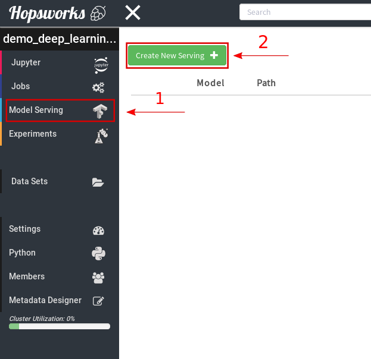
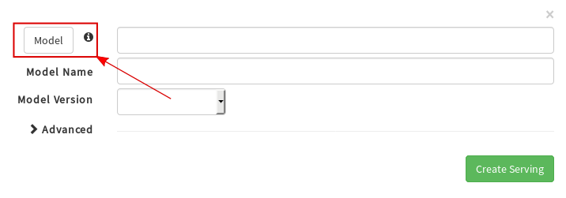
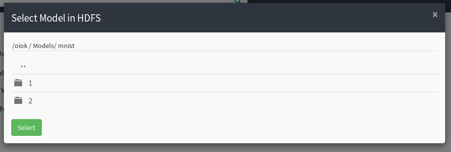
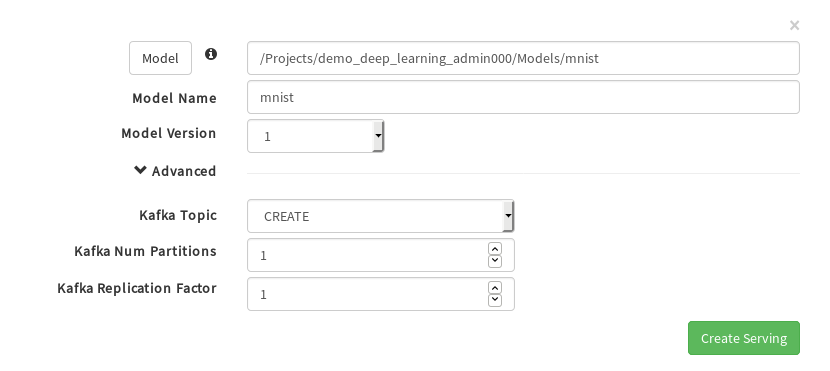
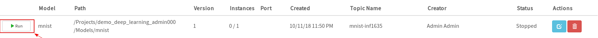
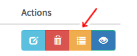
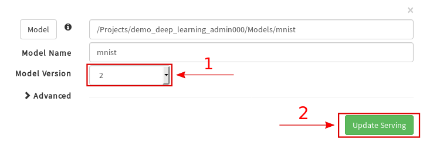

========================
TensorFlow Model Serving
========================
.. highlight:: python

Hopsworks supports TensorFlow Serving, a flexible, high-performance serving system for machine learning models, designed for production environments.

Export your model
-----------------

The first step to serving your model is to export it as a servable model. This is typically done using the SavedModelBuilder after having trained your model. For more information please see: https://www.tensorflow.org/serving/serving_basic

Model Serving in Hopsworks
--------------------------

**Step 1.**

The first step is to train and export a servable TensorFlow model to your Hopsworks project.

To demonstrate this we provide an example notebook which is also included in the TensorFlow tour.
https://github.com/hopshadoop/hops-examples/blob/master/tensorflow/notebooks/Serving/train_and_export_model.ipynb

In order to serve a TensorFlow model on Hopsworks, the .pb file and the variables folder should be placed in the Models dataset in your Hopsworks project. Inside the dataset, the folder structure should mirror what is expected by TensorFlow Serving.

.. code-block:: shell 

    Models
    └── mnist
        ├── 1
        │   ├── saved_model.pb
        │   └── variables
        │       ├── variables.data-00000-of-00001
        │       └── variables.index
        └── 2
            ├── saved_model.pb
            └── variables
                ├── variables.data-00000-of-00001
                └── variables.index

TensorFlow serving expects the model directory (in this case *mnist*) to contain one or more sub-directories.
The name of each sub-directory is a number representing the version of the model, the higher the version, the more recent the model.
Inside each version directory TensorFlow serving expects a file named *saved_mode.pb*, which contains the model graph, and a directory called *variables* which contains the weights of the model.

**Step 2.**

To start serving your model, create a serving definition in the Hopsworks Model Serving service. Select on the Model Serving service on the left panel (1) and then select on *Create new serving* (2).
   
.. _serving1.png: ../_images/serving/serving1.png

    
Next click on the model button to select from your project the model you want to serve.

.. _serving2.png: ../_images/serving/serving2.png

This will open a popup window that will allow you to browse your project and select the directory containing the model you want to serve. You should select the model directory, meaning the directory containing the sub-directories with the different versions of your model. In the example below we have exported two versions of the *mnist* model. In this step we select the *mnist* directory containing the two versions. The *select* button will be enabled (it will turn green) when you browse into a valid model directory. 
   
.. _serving3.png: ../_images/serving/serving3.png

    
After clicking *select* the popup window close and the information in the create serving menu will be filled in automatically. 
By default Hopsworks picks the latest available version to server. You can switch to a specific version using the dropdown menu. 
You can also change the name of the model, remember that model namesshould be **unique** in your project.

.. _serving4.png: ../_images/serving/serving4.png
.. figure:: ../imgs/serving/serving4.png
   :alt: Select the version 
   :target: `serving4.png`_
   :align: center
   :figclass: align-center

By clicking on *Advanced* you can access the advanced configuration for your serving instance. In particular you can configure the Kafka topic on which the inference requests will be logged into (see the inference for more information). 
By default a new Kafka topic is created for each new serving (*CREATE*). You can avoid logging your inference requests by selecting *NONE* from the dropdown menu.  
You can also re-use an existing Kafka topic as long as its schema meets the requirement of the inference logger.

At this stage you can also configure the TensorFlow Serving server to process the requests in batches.  

.. _serving5.png: ../_images/serving/serving5.png

Finally click on *Create Serving* to create the serving instance.

**Step 3.**

After having created the serving instance, a new entry is added to the list. 

.. _serving6.png: ../_images/serving/serving6.png

Click on the *Run* button to start the serving instance. After a few seconds the instance will be up and running, ready to start processing incoming inference requests.

You can check the logs of the TensorFlow Serving instance by *clicking* on the *logs* button. This will bring you to the Kibana UI, from which you will be able to see if the the serving instance managed to load the model correctly.
 
.. _serving8.png: ../_images/serving/serving8.png

   Log button

.. _serving9.png: ../_images/serving/serving9.png
.. figure:: ../imgs/serving/serving9.png
   :alt: Start the serving
   :target: `serving9.png`_
   :align: center
   :figclass: align-center   

   Kibana UI

**Step 4.**

After a while your model will become stale and you will have to re-train it and export it again. To update your serving instance to serve the newer version of the model, click on the edit button. You don't need to stop your serving instance, you can update the model version while the serving server is running.

.. _serving6.5.png: ../_images/serving/serving6.5.png
.. figure:: ../imgs/serving/serving6.5.png
   :alt: Update the serving instance 
   :target: `serving6.5.png`_
   :align: center
   :figclass: align-center

   Update the serving instance

From the dropdown menu you can select the newer version (1) and click *Update serving* (2). After a couple of seconds the model server will be serving the newer version of your model.

.. _serving7.png: ../_images/serving/serving7.png

   Update the version

Where do I go from here?
========================

Take a look at the :doc:`inference` documentation to see how you can send inference requests to the serving server serving your model.
