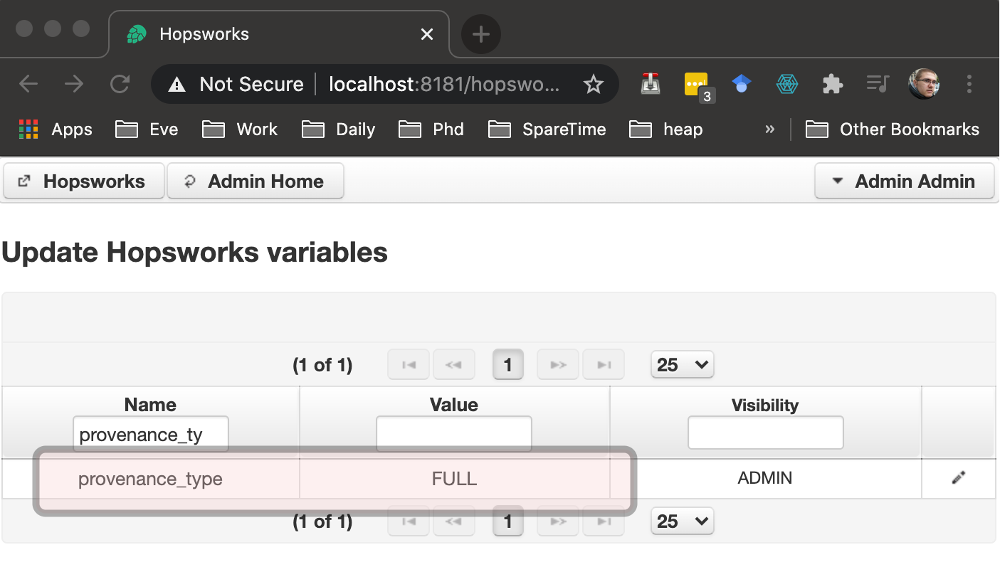
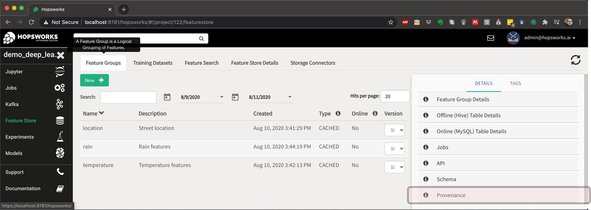
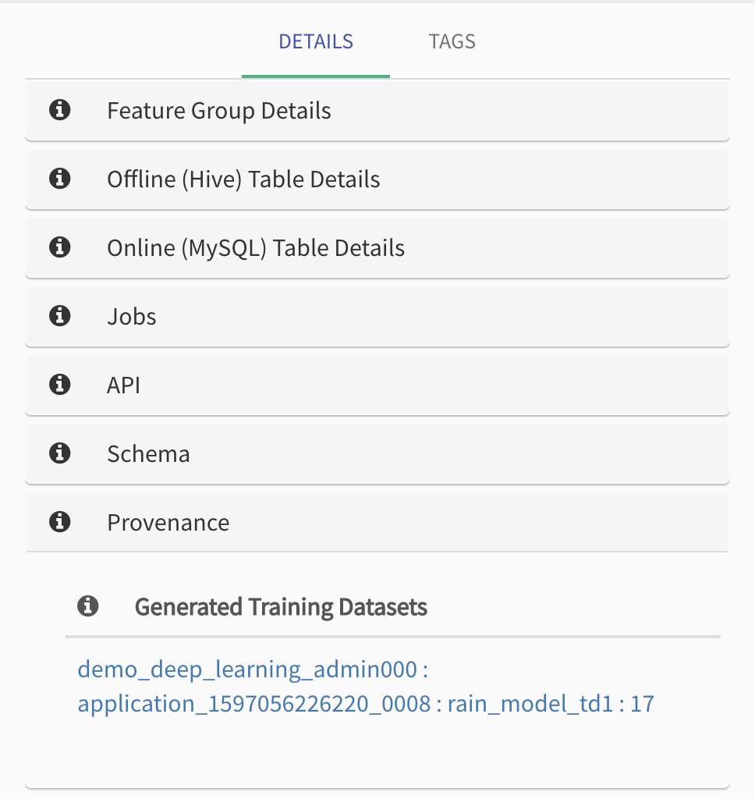
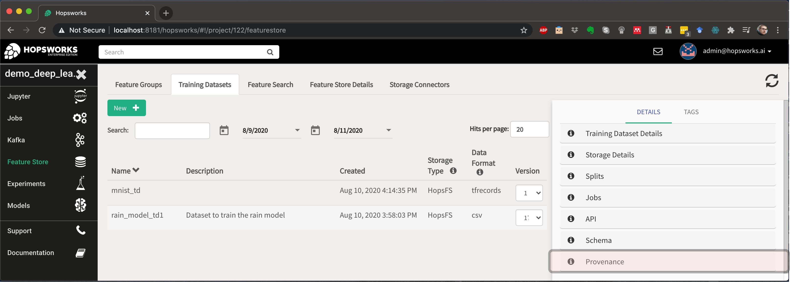
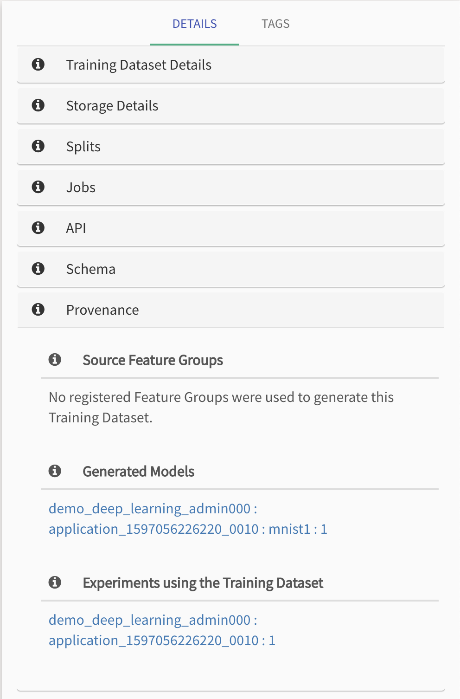
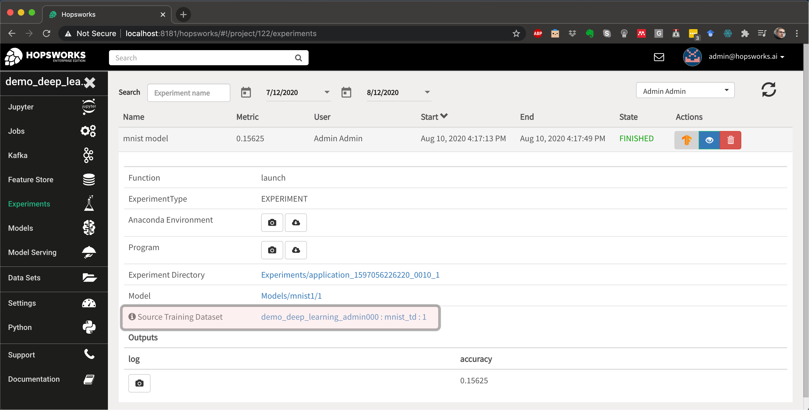
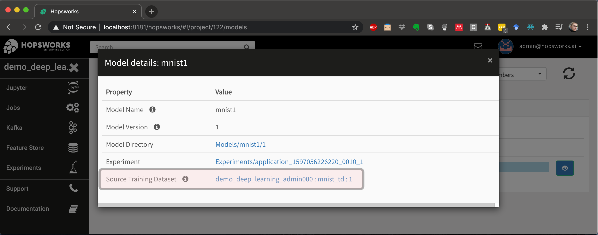

Provenance
==========
The provenance layer in Hopsworks allows for the tracking of file(HopsFS) and application(Yarn) operations in order to provide users with aditional details.
There are currently four types of provenance:

* DISABLED
* META - enables search of projects/datasets.
* MIN - enables search of featuregroups/training datasets/features including attached tags.
* FULL - allows linking of feature groups/training datasets/experiments/models.

**Note:** Linking of ML artifacts (FULL provenance) is a Hopsworks Enterprise feature.

Temporary provisions (These will be updated soon)

* Provenance can only be set cluster wide, by an administrator, under Hopsworks :numref:`Variables<prov_cluster_var>`.  The variable of interest is **provenance_type** and it can take the values *DISABLED / META / MIN / FULL*.
* Changing provenance type only affects newly created projects. 
* There is currently no way to change/clean provenance for old projects. The only workaround for the moment is to delete and recreate the project under a different cluster provenance setup.

.. _prov_cluster_var: 

   Provenance Cluster Variable

Provenance Links
----------------
For Feature Groups we can expand :numref:`Provenance <prov_links_fgs>` with further more :numref:`Details <prov_links_fgs_details>` including:

* Training Datasets generated from this Feature Group

.. _prov_links_fgs: 

   Feature Group Provenance Links

.. _prov_links_fgs_details:

   
   Feature Group Provenance Links - Details

For Training Datasets we can expand :numref:`Provenance <prov_links_tds>` with further more :numref:`Details <prov_links_tds_details>` including:

* Feature Groups used to create this Traininig Dataset
* Experiments using this Training Dataset
* Models generated by an Experiment using the current Training Dataset. 

.. _prov_links_tds.png: ../imgs/hopsml/provenance/prov_links_tds.png

   Training Dataset Provenance Links

.. _prov_links_tds_details.png: ../imgs/hopsml/provenance/prov_links_tds_details.png

   
   Training Dataset Provenance Links - Details

For Experiments :numref:`Provenance <prov_links_experiments>` adds:

* Training Dataset used in this Experiment

.. _prov_links_experiments: 

   Experiment Provenance Links

For Models :numref:`Provenance <prov_links_models>` adds:

* Training Dataset used to generate this Model

.. _prov_links_models:

   
   Model Provenance Links