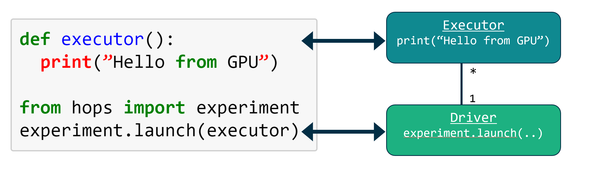

HopsML
======

Python Programs in HopsML
------------

Hops uses PySpark to distribute the execution of Python programs in a cluster. PySpark applications consist of two main components, a Driver and one to many Executors. The Driver and the Executors can be started on potentially any host in the cluster and use both the network and the HDFS filesystem to coordinate.

Restructuring Python Programs as PySpark Programs
----------------------------------

If you want to run a Python program, e.g.,  to train a neural network on a GPU on Hops, you will need to restructure your code. The reason for this is that your single Python process needs to be restructured as a PySpark program, see the figure below.

.. _hopsml-pyspark.png: ../_images/hopsml-pyspark.png

The good news is that all you will need to do to get started is to move your code inside a function, see table below. You need to define a function - this code will get run on the Executors, and you need to invoke that function from the Driver (the main part of your Python program). 

Logging in the Driver
---------

Logging in the Executor
---------

Plotting with Sparkmagic in Jupyter
---------

References
---------

- https://github.com/logicalclocks/hops-examples/blob/master/tensorflow/notebooks/Plotting/Data_Visualizations.ipynb 
- https://github.com/jupyter-incubator/sparkmagic/blob/master/examples/Magics%20in%20IPython%20Kernel.ipynb 

