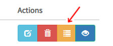

.. _python_model_serving:

========================
Python Model Serving
========================
.. highlight:: python

Hopsworks supports serving models trained with python-based frameworks (i.e Scikit-Learn, XGBoost,...) using Flask servers. The Flask servers can be put behind a load-balancer for scaling up and down dynamically based on load.

The steps are similar for any python-based framework. The rest of the document takes Scikit-Learn as an example.

Export your model
----------------------------------

The first step to serving your model is to train it and export it as a servable model in your Hopsworks project.
In case of Scikit-Learn models, this is typically done using the `joblib` library which allows you to export the model as a pickle (.pkl) file.

.. code-block:: python

    from sklearn.neighbors import KNeighborsClassifier
    from sklearn.metrics import accuracy_score
    from sklearn.externals import joblib
    iris_knn = KNeighborsClassifier()
    iris_knn.fit(X, y)
    y_pred = iris_knn.predict(X_test)
    acc = accuracy_score(y, y_pred)
    joblib.dump(iris_knn, "iris_knn.pkl")
    model.export("iris_knn.pkl", "irisflowerclassifier", metrics={'accuracy': acc})

To demonstrate this we provide an example notebook which is also included in the Deep Learning Tour on Hopsworks (see here_.)

Serving Python-based Models on Hopsworks
--------------------------------------------

**Step 1.**

In order to serve a python-based model on Hopsworks, a python script that handles requests should be stored in the Models dataset (in the subdirectory that contains the version of your model) in your Hopsworks project. The python script should implement the `Predict` class and the methods `predict`, `classify` and `regress`.

Assuming a Scikit-Learn model exported as a pickle file with name `iris_knn.pkl`, an example of the Predict class would look like the following:

.. code-block:: python

    from sklearn.externals import joblib
    from hops import hdfs
    import os

    class Predict(object):

        def __init__(self):
            """ Initializes the serving state, reads a trained model from HDFS"""
            self.model_path = "Models/iris_knn.pkl"
            print("Copying Scikit-Learn model from HDFS to local directory")
            hdfs.copy_to_local(self.model_path)
            print("Reading local Scikit-Learn model for serving")
            self.model = joblib.load("./iris_knn.pkl")
            print("Initialization Complete")

        def predict(self, inputs):
            """ Serves a prediction request usign a trained model"""
            return self.model.predict(inputs).tolist() # Numpy Arrays are not JSON serializable

        def classify(self, inputs):
            """ Serves a classification request using a trained model"""
            return "not implemented"

        def regress(self, inputs):
            """ Serves a regression request using a trained model"""
            return "not implemented"

**Step 2.**

To start serving your model, create a serving definition in the Hopsworks Model Serving service or using the Python API.

For using the Model Serving service, select the Model Serving service on the left panel (1) and then select on *Create new serving* (2).

.. _serving1.png: ../_images/serving/serving1.png
.. figure:: ../imgs/serving/serving1.png
   :alt: New serving definition
   :target: `serving1.png`_
   :align: center
   :width: 400px
   :height: 400px
   :figclass: align-center

Next, select "Python" and click on the "Browse" button next to `Python Script` to select a python script from your project that you want to serve.
It is best practice to store this script in the "Models" dataset.

.. _sklearn_serving1.png: ../_images/serving/sklearn_serving1.png
.. figure:: ../imgs/serving/sklearn_serving1.png
   :alt: Create serving
   :target: `sklearn_serving1.png`_
   :align: center
   :figclass: align-center

This will open a popup window that will allow you to browse your project and select the script file that you want to serve. Once a python script is selected, fields such as `Serving name`, `Model version` and `Artifact version` will be autocompleted based on the script path.

An artifact can be seen as a package containing all the necessary files to deploy a model (e.g., model files, scripts, dependencies, transformer scripts).
When a serving service is created, an artifact is generated in a directory named `Artifacts` under the model version directory in the `Models` dataset.
When only the model is served, that is, no transformer component is deployed, the artifact version is `MODEL-ONLY`.
This artifact version is shared between all model deployments without transformer that have the same model version number.
Otherwise, when a transformer component is deployed together with the model, the artifact version is associated with the model.
That is, the artifact version for a model can be incremented without having to increment the model version. 
For example, if a model named 'mnist' is version '1', and the artifact version is '1', you get an artifact named 'mnist_1_1'.
You can upgrade the artifact to version '2', giving you a new artifact named 'mnist_1_2'.

Otherwise, when a transformer component is deployed together with the model, the artifact version is set incrementally.

*NOTE:* Currently, serving python-based models does not support KFServing and, hence, do not support transformer components.

By clicking on *Advanced* you can access the advanced configuration for your serving instance. In particular, you can configure (1) the minimum number of replicas for the model server, (2) the Kafka topic on which the inference requests will be logged into (see :ref:`inference` for more information) and (3) the resouce configuration for the Docker container running the model server. 
By default, a new Kafka topic is created for each new serving (*CREATE*). You can avoid logging your inference requests by selecting *NONE* from the dropdown menu.
You can also re-use an existing Kafka topic as long as its schema meets the requirement of the inference logger.

.. _sklearn_serving2.png: ../_images/serving/sklearn_serving2.png
.. figure:: ../imgs/serving/sklearn_serving2.png
   :alt: Advanced configuration
   :target: `sklearn_serving2.png`_
   :align: center
   :figclass: align-center

Finally click on *Create Serving* to create the serving instance.

For using the python API, import the `serving` module from the hops library (API-Docs-Python_) and use the helper functions.

.. code-block:: python

    from hops import serving
    from hops import model

    # Resources/iris path containing .pkl and .py script to export as a model
    model_path = "Resources/iris"
    model.export(model_path, "IrisFlowerClassifier", model_version=1, overwrite=True)

    if serving.exists("IrisFlowerClassifier"):
        serving.delete("IrisFlowerClassifier")
    
    script_path = "Models/IrisFlowerClassifier/1/iris_flower_classifier.py"
    serving.create_or_update("IrisFlowerClassifier", # define a name for the serving instance
        script_path, model_version=1, # set the path and version of the model to be deployed
        topic_name="CREATE", # topic name or CREATE to create a new topic for inference logging, otherwise NONE
        instances=1 # number of replicas
        )

    serving.start("IrisFlowerClassifier")

**Step 3.**

After having created the serving instance, a new entry is added to the list.

.. _sklearn_serving3.png: ../_images/serving/sklearn_serving3.png
.. figure:: ../imgs/serving/sklearn_serving3.png
   :alt: Start the serving
   :target: `sklearn_serving3.png`_
   :align: center
   :figclass: align-center

Click on the *Run* button to start the serving instance. After a few seconds the instance will be up and running, ready to start processing incoming inference requests.

You can see more details of the serving instance by *clicking* on the *detailed information* button. This will show additional information such as the endpoints and port to reach the model server, Kafka topic for inference logging, or number of instances currently running.

.. _serving10.png: ../_images/serving/serving10.png
.. figure:: ../imgs/serving/serving10.png
   :alt: See detailed information
   :target: `serving10.png`_
   :align: center
   :figclass: align-center

   Overview button

.. _sklearn_serving5.png: ../_images/serving/sklearn_serving5.png

   
    Detailed information   

You can check the logs of the model deployment by *clicking* on the *logs* button.
This will bring you to the Kibana UI, from which you will be able to read and search in near real-time the logs printed by the model serving server.

.. _serving8.png: ../_images/serving/serving8.png

   Logs button

.. _sklearn_serving4.png: ../_images/serving/sklearn_serving4.png
.. figure:: ../imgs/serving/sklearn_serving4.png
   :alt: View the logs
   :target: `sklearn_serving4.png`_
   :align: center
   :figclass: align-center

   Kibana UI

**Step 4.**

To edit your serving, click on the edit button.

.. _serving6.png: ../_images/serving/serving6.png

   Update the serving instance

Where do I go from here?
================================================

Take a look at the :doc:`inference` documentation to see how you can send inference requests to the serving server serving your model.

.. _API-Docs-Python: http://hops-py.logicalclocks.com/
.. _here: https://github.com/logicalclocks/hops-examples
