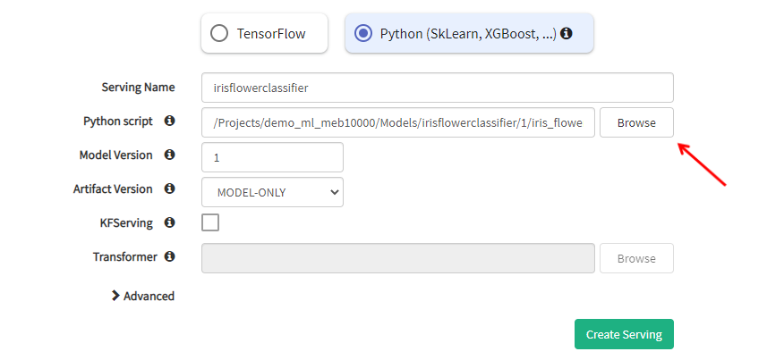
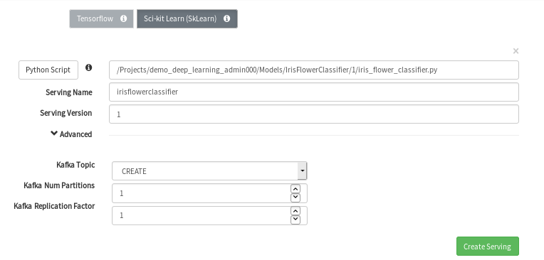
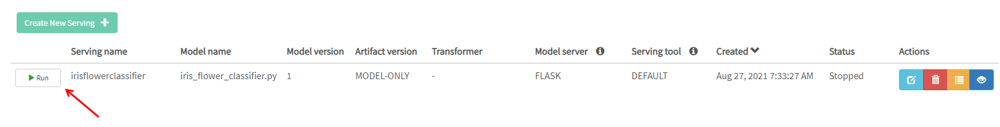
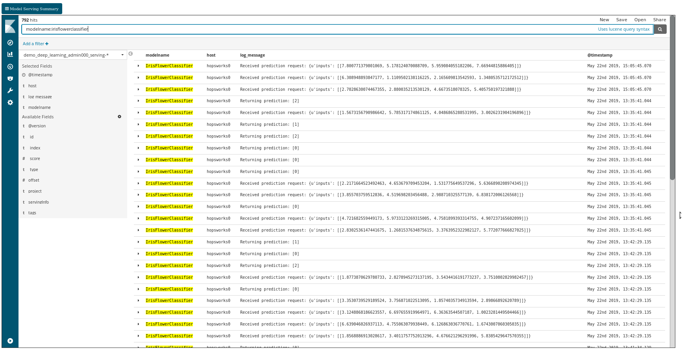

========================
SkLearn Model Serving
========================
.. highlight:: python

Hopsworks supports serving of SkLearn models using Flask servers. The Flask servers can be put behind a load-balancer for scaling up and down dynamically based on load.

Export your model
----------------------------------

The first step to serving your model is to export it as a servable model. This is typically done using the `joblib` library

.. code-block:: python

    from sklearn.neighbors import KNeighborsClassifier
    from sklearn.externals import joblib
    iris_knn = KNeighborsClassifier()
    iris_knn.fit(X, y)
    joblib.dump(iris_knn, "iris_knn.pkl")
    hdfs.copy_to_hdfs("iris_knn.pkl", "Resources", overwrite=True)

Serving SkLearn Models in Hopsworks
--------------------------------------------

**Step 1.**

The first step is to train and export a servable SkLearn model to your Hopsworks project.

To demonstrate this we provide an example notebook which is also included in the Deep Learning Tour on Hopsworks (see here_.)

In order to serve a SkLearn model on Hopsworks, the .pkl model file a python script that handles requests should be placed in the Models dataset in your Hopsworks project. The python script should implement the `Predict` class and the methods `predict`, `classify` and `regress`, like this:

.. code-block:: python

    from sklearn.externals import joblib
    from hops import hdfs
    import os

    class Predict(object):

        def __init__(self):
            """ Initializes the serving state, reads a trained model from HDFS"""
            self.model_path = "Models/iris_knn.pkl"
            print("Copying SKLearn model from HDFS to local directory")
            hdfs.copy_to_local(self.model_path)
            print("Reading local SkLearn model for serving")
            self.model = joblib.load("./iris_knn.pkl")
            print("Initialization Complete")

        def predict(self, inputs):
            """ Serves a prediction request usign a trained model"""
            return self.model.predict(inputs).tolist() # Numpy Arrays are not JSON serializable

        def classify(self, inputs):
            """ Serves a classification request using a trained model"""
            return "not implemented"

        def regress(self, inputs):
            """ Serves a regression request using a trained model"""
            return "not implemented"

**Step 2.**

To start serving your model, create a serving definition in the Hopsworks Model Serving service or using the Python API.

For using the Model Serving service, select the Model Serving service on the left panel (1) and then select on *Create new serving* (2).

.. _serving1.png: ../_images/serving/serving1.png
.. figure:: ../imgs/serving/serving1.png
   :alt: New serving definition
   :target: `serving1.png`_
   :align: center
   :width: 400px
   :height: 400px
   :figclass: align-center

Next, select "SkLearn serving" and click on the "Python Script" button to select a python script from your project that you want to serve. It is a best practice that his script is put inside the "Models" directory.

.. _sklearn_serving1.png: ../_images/serving/sklearn_serving1.png

This will open a popup window that will allow you to browse your project and select the script file that you want to serve.

By clicking on *Advanced* you can access the advanced configuration for your serving instance. In particular you can configure the Kafka topic on which the inference requests will be logged into (see the inference for more information).
By default a new Kafka topic is created for each new serving (*CREATE*). You can avoid logging your inference requests by selecting *NONE* from the dropdown menu.
You can also re-use an existing Kafka topic as long as its schema meets the requirement of the inference logger.

.. _sklearn_serving2.png: ../_images/serving/sklearn_serving2.png

Finally click on *Create Serving* to create the serving instance.

For using the python API, import the `serving` module from the hops library (API-Docs-Python_) and use the helper functions.

.. code-block:: python

    from hops import serving
    from hops import model

    # Resources/iris path containing .pkl and .py script to export as a model
    model_path = "Resources/iris"

    model.export(model_path, "IrisFlowerClassifier", model_version=1, overwrite=True)

    script_path = "Models/IrisFlowerClassifier/1/iris_flower_classifier.py"
    if serving.exists("IrisFlowerClassifier"):
        serving.delete_serving("IrisFlowerClassifier")
    serving.create_or_update_serving(script_path, "IrisFlowerClassifier", serving_type="SKLEARN", model_version=1)
    serving.start_serving("IrisFlowerClassifier")

**Step 3.**

After having created the serving instance, a new entry is added to the list.

.. _sklearn_serving3.png: ../_images/serving/sklearn_serving3.png

Click on the *Run* button to start the serving instance. After a few seconds the instance will be up and running, ready to start processing incoming inference requests.

You can check the logs of the SkLearn Serving instance by *clicking* on the *logs* button. This will bring you to the Kibana UI, from which you will be able to see if the the serving instance managed to load the model correctly.

.. _serving8.png: ../_images/serving/serving8.png
.. figure:: ../imgs/serving/serving8.png
   :alt: Start the serving
   :target: `serving8.png`_
   :align: center
   :figclass: align-center

   Log button

.. _sklearn_serving4.png: ../_images/serving/sklearn_serving4.png

   Kibana UI

**Step 4.**

To edit your serving, click on the edit button.

.. _serving6.5.png: ../_images/serving/serving6.5.png
.. figure:: ../imgs/serving/serving6.5.png
   :alt: Update the serving instance
   :target: `serving6.5.png`_
   :align: center
   :figclass: align-center

   Update the serving instance

Where do I go from here?
================================================

Take a look at the :doc:`inference` documentation to see how you can send inference requests to the serving server serving your model.

.. _API-Docs-Python: http://hops-py.logicalclocks.com/
.. _here: https://github.com/logicalclocks/hops-examples
