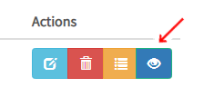

.. _tf_model_serving:

========================
TensorFlow Model Serving
========================
.. highlight:: python

Hopsworks supports TensorFlow Serving, a flexible, high-performance serving system for machine learning models, designed for production environments.

Export your model
-----------------

The first step to serving your model is to train it and export it as a servable model to the Hopsworks Model Registry in your Hopsworks project.
This can be done by using the `model module`_ from the Hops python library after saving your model using the `SavedModelBuilder`_.

An example code snippet, taken from https://examples.hopsworks.ai/ml/experiment/tensorflow/mnist/ , shows how to export a Tensorflow model to the Hopsworks Model Registry:

.. code-block:: python

    from hops import model as hops_model
    ...
    tf.saved_model.save(model, export_path)
    ...  
    hops_model.export(export_path, "<model-name>", ..)

    
An end-to-end example notebook is included in the `TensorFlow tour`_.

When you export a TensorFlow model using the hops library, the model's .pb file and variables directory are stored in the Models dataset in your Hopsworks project.
The Models dataset is the location where the data for your project's model registry is stored. Inside the dataset, the directory structure should mirror what is expected by TensorFlow Serving.

.. code-block:: shell

    Models
    └── mnist
        ├── 1
        │   ├── saved_model.pb
        │   └── variables
        │       ├── variables.data-00000-of-00001
        │       └── variables.index
        └── 2
            ├── saved_model.pb
            └── variables
                ├── variables.data-00000-of-00001
                └── variables.index

TensorFlow serving expects the model directory (in this case *mnist*) to contain one or more sub-directories.
The name of each sub-directory is a number representing the version of the model, the higher the version, the more recent the model.
Inside each version directory TensorFlow serving expects a file named *saved_model.pb*, which contains the model graph, and a directory called *variables* which contains the weights of the model.

Model Serving in Hopsworks
--------------------------

**Step 1.**

To start serving your model, create a serving definition in the Hopsworks Model Serving service or using the `Hops python library`_.

For using the Model Serving service, select the Model Serving service on the left panel (1) and then select on *Create new serving* (2).

.. _serving1.png: ../_images/serving/serving1.png
.. figure:: ../imgs/serving/serving1.png
   :alt: New serving definition
   :target: `serving1.png`_
   :align: center
   :width: 400px
   :height: 400px
   :figclass: align-center

Next, select "Tensorflow" and click either on the "Browse" button or on the dropdown list next to *Model* to select the model you want to serve from your project.

.. _tensorflow_serving1.png: ../_images/serving/tensorflow_serving1.png

Clicking on the "Browse" button will open a popup window that allows you to browse your project and select the directory containing the model.
You should select the model directory, meaning the directory containing the sub-directories with the different versions of your model.
In the example below, we have exported two versions of the *mnist* model.
In this step, we select the *mnist* directory containing the two versions. The *select* button will be enabled (it will turn green) when you enter a valid model directory.

.. _serving3.png: ../_images/serving/serving3.png
.. figure:: ../imgs/serving/serving3.png
   :alt: Select model directory
   :target: `serving3.png`_
   :align: center
   :figclass: align-center

After clicking *select* the popup window closes and the information in the create serving menu will be filled in automatically.

By default, Hopsworks picks the latest available version to serve. You can select a specific version using the dropdown menu.
You can also change the name of the model, remember that model names should be **unique** in your project.

Tensorflow models can be served using KFServing as the serving tool managing the Tensorflow Serving server by enabling the *KFServing* checkbox.
When serving a model with KFServing, you can deploy more complex serving pipelines including a transformer component to pre- and post-process the model inputs and outputs at inference time.
Each time a model deployment is created containing a transformer, a new artifact is generated with a higher version number in a directory named `Artifacts` under the model version directory in `Models` dataset.
An artifact can be seen as a package containing all the necessary files to deploy a model (e.g., model files, scripts, environment, transformer scripts,...).
When only the model is served, that is, no transformer component is being deployed, the artifact version is `MODEL-ONLY`. 
*MODEL-ONLY* artifacts are shared between all services for the same model version without transformers.

For more details about KFServing on Hopsworks and transformers, please see :ref:`kfserving`.

By clicking on *Advanced* you can access the advanced configuration for your serving instance. In particular, you can configure (1) the minimum number of replicas for the model server, (2) the Kafka topic on which the inference requests will be logged into (see :ref:`inference` for more information), (3) whether to process requests in batches or not and (4) the resouce configuration for the Docker container running the model server. 
By default, a new Kafka topic is created for each new model deployment (*CREATE*). You can turn off logging your inference requests by selecting *NONE* from the dropdown menu.
You can also re-use an existing Kafka topic as long as its schema meets the requirement of the inference logger.

When serving a model with KFServing, you can also configure the minimum number of replicas and enable fine-grained inference request logging by selecting a checkbox to enable logging of model inputs or predictions independently.

.. _tensorflow_serving2.png: ../_images/serving/tensorflow_serving2.png

Finally click on *Create Serving* to create the serving instance.

For using the python API, import the `serving` module from the `Hops python library`_ and use the helper functions.

.. code-block:: python

    from hops import serving
    from hops import model

    model_path = "Resources/mnist/"
    model.export(model_path, "mnist", model_version=2, overwrite=True)

    if serving.exists("mnist"):
        serving.delete("mnist")

    model_path = "Models/mnist/2/"
    serving.create_or_update("mnist", # define a name for the serving instance
        model_path, model_version=2, # set the path and version of the model to be deployed
        kfserving=False, # whether to serve the model using KFServing or the default tool in the current Hopsworks version
        topic_name="CREATE", # topic name or CREATE to create a new topic for inference logging, otherwise NONE
        inference_logging="ALL", # ALL for default deployments. With KFServing, fine-grained inference logging is supported, e.g., MODEL_INPUTS, PREDICTIONS or ALL
        instances=1, # number of replicas or 0 to enable scale-to-zero capabilities (KFServing only)
        )

    serving.start("mnist")

**Step 2.**

After having created the serving instance, a new entry is added to the list.

.. _tensorflow_serving3.png: ../_images/serving/tensorflow_serving3.png

Click on the *Run* button to start the serving instance. After a few seconds the instance will be up and running, ready to start processing incoming inference requests.

You can see more details of the serving instance by *clicking* on the *detailed information* button. This will show additional information such as the endpoints and port to reach the model server, Kafka topic for inference logging, or number of instances currently running.

.. _serving10.png: ../_images/serving/serving10.png

   Overview button

.. _tensorflow_serving5.png: ../_images/serving/tensorflow_serving5.png

   
    Detailed information   

You can check the logs of the model deployment by *clicking* on the *logs* button.
This will bring you to the Kibana UI, from which you will be able to read and search in near real-time the logs printed by the model serving server.

.. _serving8.png: ../_images/serving/serving8.png
.. figure:: ../imgs/serving/serving8.png
   :alt: Click logs button
   :target: `serving8.png`_
   :align: center
   :figclass: align-center

   Logs button

.. _tensorflow_serving9.png: ../_images/serving/tensorflow_serving9.png

   Kibana UI

**Step 3.**

After a while your model will become stale and you will have to re-train it and export it again. To update your serving instance to serve the newer version of the model, click on the edit button. You don't need to stop your serving instance, you can update the model version while the serving server is running.

.. _serving6.png: ../_images/serving/serving6.png
.. figure:: ../imgs/serving/serving6.png
   :alt: Edit the serving instance
   :target: `serving6.png`_
   :align: center
   :figclass: align-center

   Update the serving instance

From the dropdown menu you can select the newer version (1) and click *Update serving* (2). After a couple of seconds the model server will be serving the newer version of your model.

.. _tensorflow_serving7.png: ../_images/serving/tensorflow_serving7.png

   Update the version

Where do I go from here?
========================

Take a look at the :doc:`inference` documentation to see how you can send inference requests to the serving server serving your model.

.. _Hops python library: https://hops-py.logicalclocks.com
.. _Hops java/scala library: https://github.com/logicalclocks/hops-util
.. _model module: https://hops-py.logicalclocks.com/hops.html#module-hops.model
.. _SavedModelBuilder: https://www.tensorflow.org/serving/serving_basic
.. _Tensorflow tour: https://github.com/logicalclocks/hops-examples/blob/master/notebooks/ml/end_to_end_pipeline/tensorflow/end_to_end_tensorflow.ipynb