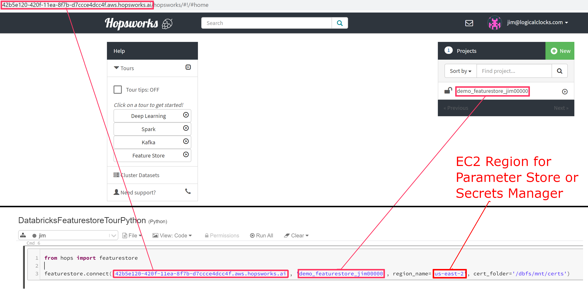

Integrating with Databricks
===========================

Connecting from Databricks notebooks
------------------------------------
Connecting to the Feature Store from a Databricks cluster requires a Feature Store API key to be stored in the AWS Parameter Store or Secrets Manager. 
Read access to this API key needs to be given to the AWS role used by the Databricks cluster. 
Finally, a helper library needs to be installed on the Databricks cluster to connect to the Feature Store.

There exist two helper libraries: hopsworks-cloud-sdk and hops. 
Hopsworks-cloud-sdk does not require a Spark environment (and is easier to set up) but does not provide some advanced spark-based functionality present in hops. If you intend to use the hops library follow the instructions in "Setting up roles and API keys" then jump directly to "Installing hops library".

**Generating an API Key and storing it in the AWS Secrets Manager**

In Hopsworks, click on your username in the top-right corner and select *Settings* to open the user settings. Select *Api keys*. Give the key a name and select the *featurestore* and *project* scopes before creating the key. Copy the key into your clipboard for the next step.

.. _hopsworks_api_key.png: ../../_images/api_key.png
.. figure:: ../../imgs/cloud/api_key.png
    :alt: Hopsworks feature store api key
    :target: `hopsworks_api_key.png`_
    :align: center
    :scale: 30 %
    :figclass: align-center

**(Alternative 1, step 1) Storing the API Key in the AWS Systems Manager Parameter Store**

In the AWS management console ensure that your active region is the region you use for Databricks. Go to the *AWS Systems Manager* choose *Parameter Store* and select *Create Parameter*. As name enter */hopsworks/role/[MY_DATABRICKS_ROLE]/type/api-key* replacing [MY_DATABRICKS_ROLE] with the AWS role used by the Databricks cluster that should access the Feature Store. Select *Secure String* as type and create the parameter.

.. _hopsworks_parameter_store.png: ../../_images/parameter_store.png
.. figure:: ../../imgs/cloud/parameter_store.png
    :alt: Hopsworks feature store parameter store
    :target: `hopsworks_parameter_store.png`_
    :align: center
    :scale: 20 %
    :figclass: align-center

**(Alternative 1 step 2) Granting access to the secret to the Databricks notebook role**

In the AWS management console go to *IAM*, select *Roles* and then the role that is used when creating Databricks clusters. Select *Add inline policy*. Choose *Systems Manager* as service, expand the *Read* access level and check *GetParameter*. Expand Resources and select *Add ARN*. Fill in the region of the *Systems Manager* as well as the name of the parameter **WITHOUT the leading slash** e.g. *hopsworks/role/[MY_DATABRICKS_ROLE]/type/api-key* and click *Add*. Click on *Review*, give the policy a name und click on *Create policy*.

.. _hopsworks_aws_policy2.png: ../../_images/aws_policy2.png
.. figure:: ../../imgs/cloud/aws_policy2.png
    :alt: Hopsworks feature store set policy
    :target: `hopsworks_aws_policy2.png`_
    :align: center
    :scale: 30 %
    :figclass: align-center

**(Alternative 2 step 1) Storing the API Key in the AWS Secrets Manager**

In the AWS management console ensure that your active region is the region you use for Databricks. Go to the *AWS Secrets Manager* and select *Store new secret*. Select *Other type of secrets* and add *api-key* as the key and paste the API key created in the previous step as the value. Click next.

.. _hopsworks_secrets_manager.png: ../../_images/secrets_manager.png
.. figure:: ../../imgs/cloud/secrets_manager.png
    :alt: Hopsworks feature store secrets manager step 1
    :target: `hopsworks_secrets_manager.png`_
    :align: center
    :scale: 20 %
    :figclass: align-center

As secret name enter *hopsworks/role/[MY_DATABRICKS_ROLE]* replacing [MY_DATABRICKS_ROLE] with the AWS role used by the Databricks instance that should access the Feature Store. Select next twice and finally store the secret. Then click on the secret in the secrets list and take note of the *Secret ARN*.

.. _hopsworks_secrets_manager2.png: ../../_images/secrets_manager2.png
.. figure:: ../../imgs/cloud/secrets_manager2.png
    :alt: Hopsworks feature store secrets manager step 2
    :target: `hopsworks_secrets_manager2.png`_
    :align: center
    :scale: 30 %
    :figclass: align-center

**(Alternative 2 step 2) Granting access to the secret to the Databricks notebook role**

In the AWS management console go to *IAM*, select *Roles* and then the role that is used when creating Databricks clusters. Select *Add inline policy*. Choose *Secrets Manager* as service, expand the *Read* access level and check *GetSecretValue*. Expand Resources and select *Add ARN*. Paste the ARN of the secret created in the previous step. Click on *Review*, give the policy a name und click on *Create policy*.

.. _hopsworks_aws_policy.png: ../../_images/aws_policy.png
.. figure:: ../../imgs/cloud/aws_policy.png
    :alt: Hopsworks feature store set policy
    :target: `hopsworks_aws_policy.png`_
    :align: center
    :scale: 30 %
    :figclass: align-center

**Installing hopsworks-cloud-sdk**

The feature store library needs to be installed to connect to it. In the Databricks UI, go to *Clusters* and select your cluster. Select *Libraries* and then *Install New*. As *Library Source* choose *PyPI* and fill in *hopsworks-cloud-sdk* into the *Package* field.

**Creating a DBFS folder to store certificates**

Hopsworks relies on certificates being available in the Databricks cluster to connect to some services inside Hopsworks. To ensure that these certificates can be distributed to all nodes in a Databricks cluster, Hopsworks relies on them being stored in the `Databricks file system <https://docs.databricks.com/data/databricks-file-system.html>`_.
For this purpose, you should create a cert folder in DBFS. This can be done by running the following in a Databricks notebook connected to the prepared cluster::

    dbutils.fs.mkdirs("dbfs:/certs/")

**Connecting to the Feature Store**

.. _feature-store-connect-databricks.png: ../../_images/feature-store-connect-databricks.png

In the Databricks notebooks connected to the prepared cluster, use the following commands to connect to the feature store (see screenshot above for how to change 'myinstance' to the hostname of your Hopsworks feature store and how to change 'my_project' to the project containing your feature store)::

    import hops.featurestore as fs
    fs.connect('my_instance', 'my_project', region_name='my_aws_region', cert_folder='/dbfs/certs/')

+------------------------------------------------------------------------------------------------------------------------------------------------------------------------+
| Replace *my_instance* by the address of your instance, *my_project* by the name of your project and *my_aws_region* by the AWS region in which you stored the API Key. |
+------------------------------------------------------------------------------------------------------------------------------------------------------------------------+

If you have trouble connecting, then ensure that the Security Group of your Hopsworks instance on AWS is configured to allow incoming traffic from your Databricks clusters. See `VPC Security Groups <https://docs.aws.amazon.com/vpc/latest/userguide/VPC_SecurityGroups.html>`_. for more information. If the Hopsworks instance is not accessible from the internet then you will need to configure `VPC Peering <https://docs.databricks.com/administration-guide/cloud-configurations/aws/vpc-peering.html>`_.

**Installing hops library**

.. warning:: 
 - This is an advanced setup, if you are not sure that you need it or if you are not sure of what you are doing, please use hopsworks-cloud-sdk. 
 - Hopsworks-cloud-sdk needs to be able to connect directly to the ip on which the hops name node and hive metastore are listening. This means that if you deploy Hopsworks on AWS you will either need to start Hopsworks in the same VPC as your Databricks cluster or to set up `VPC Peering <https://docs.databricks.com/administration-guide/cloud-configurations/aws/vpc-peering.html>`_ between your Databricks cluster and the Hopsworks one.

In the Databricks UI, go to *Clusters* and select your cluster. Select *Libraries*. Make sure that hopsworks-cloud-sdk is not installed, make sure to uninstall it if that's the case. Then *Install New*. As *Library Source* choose *PyPI* and fill in *hops* into the *Package* field.

**Setting up the cluster to use hops**

After installing the hops library, restart the cluster and open a Databrick notebooks connected to this cluster. Run the following command in this notebook::

 import hops.featurestore as fs
 fs.setup_databricks('my_instance', 'my_project', region_name='my_aws_region')

+------------------------------------------------------------------------------------------------------------------------------------------------------------------------+
| Replace *my_instance* by the address of your instance, *my_project* by the name of your project and *my_aws_region* by the AWS region in which you stored the API Key. |
+------------------------------------------------------------------------------------------------------------------------------------------------------------------------+

This will return two configurations that you need to add to your cluster configuration. To set them go to *Clusters*, select your cluster and click *Edit*. 
Then, select *Configuration* and *Advanced Options*. 

For the first configuration select *Init Scripts* and copy the init script path returned by *setup_databricks* in *Init Script Path* and click *Add*.

For the second configuration select *Spark* and copy the spark configuration returned by *setup_databricks* in *Spark Config*.

Once you have set these two configurations, click *Confirm and Restart*.

**Connecting to the Feature Store**

In the Databricks notebooks connected to the prepared cluster use the following code to connect to the feature store::

 import hops.featurestore as fs
 fs.connect('my_instance', 'my_project', region_name='my_aws_region')

+------------------------------------------------------------------------------------------------------------------------------------------------------------------------+
| Replace *my_instance* by the address of your instance, *my_project* by the name of your project and *my_aws_region* by the AWS region in which you stored the API Key. |
+------------------------------------------------------------------------------------------------------------------------------------------------------------------------+

.. note::
    It is possible to connect to a project different from the one you used when calling *setup_databricks* or when last running the cluster. 
    However, Spark is reusing the connections to Hive and the Name Node. So you may need to restart the cluster if you want to change the project you are connected to.

If you have trouble connecting, then ensure that the Security Group of your Hopsworks instance on AWS is configured to allow incoming traffic from your Databricks instance. See `VPC Security Groups <https://docs.aws.amazon.com/vpc/latest/userguide/VPC_SecurityGroups.html>`_. for more information. If the Hopsworks instance is not accessible from the internet then you will need to configure `VPC Peering <https://docs.databricks.com/administration-guide/cloud-configurations/aws/vpc-peering.html>`_.