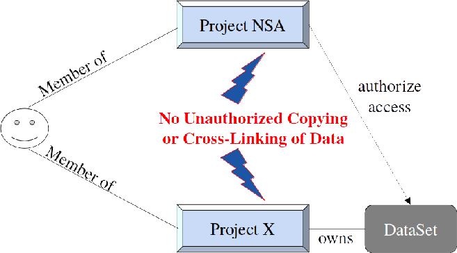
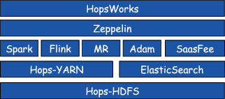
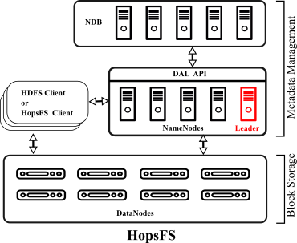

******************
Hops Overview
******************

Audience
*****************

This document is structured as four different guides, each aimed at different types of readers:

* Data Scientists

  * Installation Guide (optional - it's easy)
  * User Guide
  
* Hadoop Administrators

  * Installation Guide
  * Administration Guide
  
* Data Curators

  * User Guide

* Hops Developers

  * Installation Guide  (optional)
  * User Guide  (you should know how it is used!)
  * Developer Guide  

    
Revision History
*****************

    .. csv-table:: 
       :header: "Date", "Release", "Description"
       :widths: 10, 10, 30

       "Nov 2015", "2.4.0", "First release of Hops Documentation."

.. raw:: latex

    \newpage

Hops Introduction
**********************       

Hops is a next-generation distribution of Apache Hadoop that supports

* Hadoop-as-a-Service,
* Project-Based Multi-Tenancy,
* secure sharing of DataSets across projects,
* extensible and searchable metadata using Elasticsearch.

HopsWorks is the User Interface to Hops. HopsWorks covers:

**Users**

* User authorization (with optional 2-factor authentication)

  
**Projects and DataSets**
  
* project-based multi-tenancy with dynamic roles (think GitHub projects, but you can't read/write data outside your project);
* the ability to share DataSets securely between projects (enabling reuse of DataSets without copying);
* fast DataSet navigation (due to our metadata layer);
* import/export of data using the Browser for the *Data Owner* role.

**Analytics**
  
* interactive analytics with Apache Zepplin for Spark and Flink;
* batch-based YARN job submission (including Spark, MapReduce, Flink, Adam, and SaasFee);

**MetaData Management**
 
* design your own extended metadata using an intuitive UI;
* enter extended metadata using an intuitive UI;  

**Free-text search**

* `Global free-text search` for projects and DataSets in the cluster;  
* `Project-based free-text search` of all files and extended metadata within a project;

The key innovation that enables these features is a new architecture for scale-out, consistent metadata for both the Hadoop Filesystem (HDFS) and YARN (Hadoop's Resource Manager). The new metadata layer enables us to support multiple stateless NameNodes and TBs of metadata stored in MySQL Clustepr Network Database (NDB). NDB is a distributed, relational, in-memory, open-source database. This enabled us to provide services such as tools for designing extended metadata (whose integrity with filesystem data is ensured through foreign keys in the database), and also extending HDFS' metadata to enable new features such as erasure-coded replication, reducing storage requirements by 50\% compared to triple replication in Apache HDFS. Extended metadata has enabled us to implement quota-based scheduling for YARN, where projects can be given quotas of CPU hours/minutes and memory, thus enabling resource usage in Hadoop-as-a-Service to be accounted and enforced.

Hops builds on YARN to provide support for application and resource management. All YARN frameworks can run on Hops, but currently we only provide UI support for general data-parallel processing frameworks such as Apache Spark, Apache Flink, and MapReduce. We also support frameworks used by BiobankCloud for data-parallel bioinformatics workflows, including SAASFEE and Adam. In future, other frameworks will be added to the mix.

HopsWorks
*********

HopsWorks is the UI front-end to Hops. It supports user authentication through either a native solution, LDAP, or two-factor authentication. There are both user and adminstrator views for HopsWorks.
HopsWorks implements a perimeter security model, where command-line access to Hadoop services is restricted, and all jobs and interactive analyses are run from the HopsWorks UI and Apache Zeppelin (an iPython notebook style web application).

HopsWorks provides first-class support for DataSets and Projects. Each DataSet has a home project. Each project has a number of default DataSets:

-  *Resources*: contains programs and small amounts of data
-  *Logs*: contains outputs (stdout, stderr) for YARN applications

HopsWorks implements dynamic role-based access control for projects. That is, users do not have static global privileges. A user's privileges depend on what the user's active project is. For example, the user may be a *Data Owner* in one project, but only a *Data Scientist* in another project. Depending on which project is active, the user may be a *Data Owner* or a *Data Scientist*.
   

Dynamic Roles ensures strong multi-tenancy between projects in HopsWorks.
	 
The following roles are supported:
	 
**A Data Scientist can**

* run interactive analytics through Apache Zeppelin
* run batch jobs (Spark, Flink, MR)
* upload to a restricted DataSet (called *Resources*) that contains only programs and resources 

**A Data Owner can**

* upload/download data to the project,
* add and remove members of the project
* change the role of project members
* create and delete DataSets
* import and export data from DataSets
* design and update metadata for files/directories/DataSets	 

HopsWorks is built on a number of services, illustrated below:

   HopsWorks Layered Architecture.
   
HopsFS
******

HopsFS is a new implementation of the the Hadoop Filesystem (HDFS) based on `Apache Hadoop`_ 2x, that supports multiple stateless NameNodes, where the metadata is stored in an in-memory distributed database (NDB). HopsFS enables more scalable clusters than Apache HDFS (up to ten times larger clusters), and enables NameNode metadata to be both customized and analyzed, because it can now be easily accessed via a SQL API.

   Apache HDFS versus HopsFS Architetures.
	 
We have replaced HDFS 2.x's Primary-Secondary Replication model with shared atomic transactional memory. This means that we no longer use the parameters in HDFS that are based on the (eventually consistent) replication of edit log entries from the Primary NameNode to the Secondary NameNode using a set of quorum-based replication servers. Similarly, HopsFS, does not uses ZooKeeper and implements leader election and membership service using the transactional shared memory.

.. _Apache Hadoop: http://hadoop.apache.org/releases.html

HopsYarn
********

HopsYARN introduces a new metadata layer for Apache YARN, where the cluster state is stored in a distributed, in-memory, transactional database. Apart from improved scalabilty, HopsYARN enables us to provide quotas for Projects, in terms of how many CPU minutes and memory are available for use by each project. Quota-based scheduling is built on the capacity scheduler, so we can still prioritize certain projects over others.

.. figure:: ./imgs/hops-yarn.png
   :alt: Hops-YARN Architecture
   :scale: 70
   :figclass: align-center

   Hops YARN Architecture.
	      
**Apache Spark**
We support Apache Spark for both interactive analytics and jobs.

**Apache Zeppelin**
Apache Zeppelin is built-in to HopsWorks.
We have extended Zeppelin with access control, ensuring only users in the same project can access and share the same Zeppelin notebooks. We will soon provide source-code control for notebooks using GitHub.

**Apache Flink Streaming**
Apache Flink provides a dataflow processing model and is highly suitable for stream processing. We support it in HopsWorks.

**Other Services**
Hopsworks is a web application that runs on a highly secure Glassfish server. ElasticSearch is used to provide free-text search services. MySQL

BiobankCloud
********************

BiobankCloud extends HopsWorks with platform-specific support for Biobanking and Bioinformatics.
These services are:

* Consent form management for projects (studies);
* Charon, a service for securely sharing data between clusters using public clouds;
* SaasFee (cuneiform), a YARN-based application for building scalable bioinformatics pipelines.

.. figure:: imgs/biobankcloud-actors.png
   :alt: Actors in a BiobankCloud Ecosystem within the context of the EU GPDR.
   :scale: 80
   :figclass: align-center

   BiobankCloud Actors.
