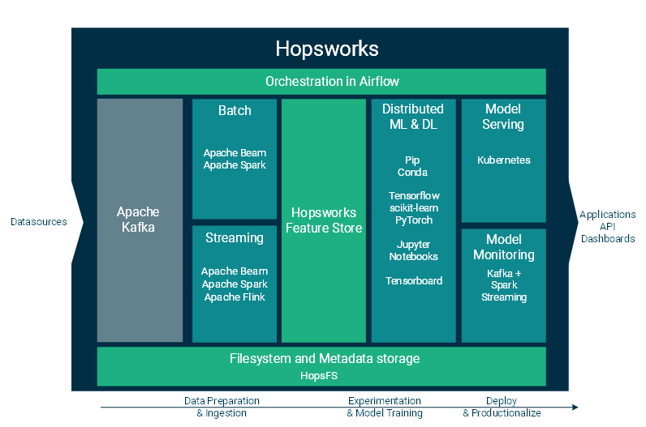
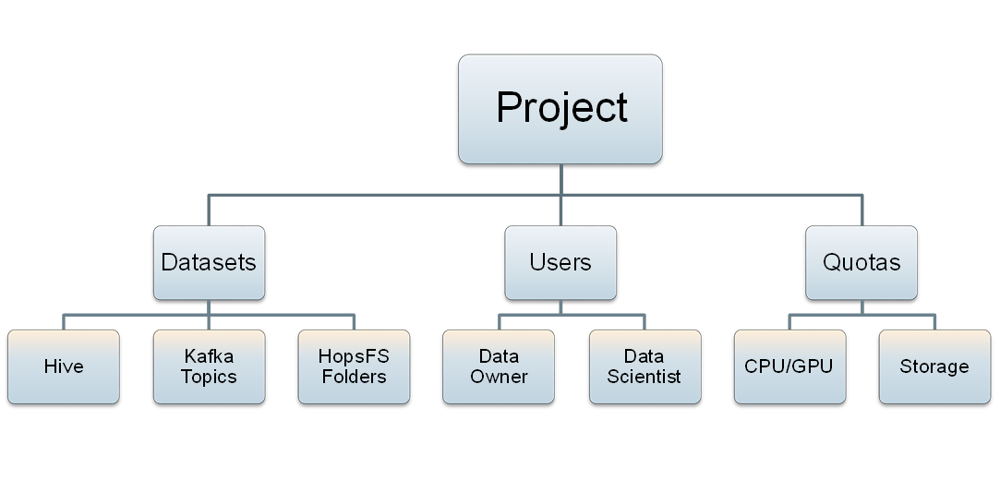
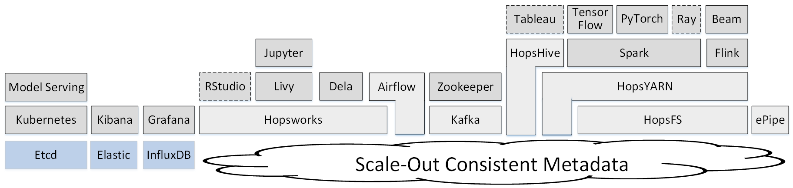
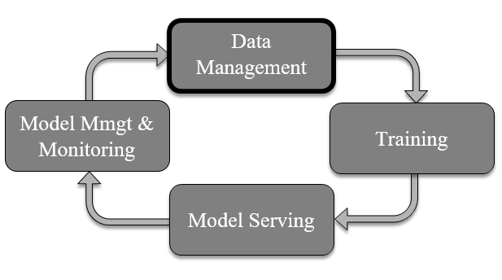

===========================
What is Hopsworks?
===========================

  Hopsworks unifies a number of open-source analytics and ML frameworks behind a unified REST API.

Hopsworks is a managed platform for scale-out data science, with support for both GPUs and Big Data, in a familiar development environment. Hopsworks can be used either through its User-Interface or via a REST API. Hopsworks unique features are:

* a user-friendly UI for development with the latest open-source platforms for Data Science (Jupyter, Conda, etc),
* Github-like Projects to manage teams/products/workflows/data,
* managed GPUs as a Resources - scale out Deep Learning training and hyperparameter optimization,
* the world's fastest, most-scalable distributed hierarchical filesystem,
* a REST API for the whole Hopsworks Platform,
* a TLS Certificate based security model with extensive auditing and data provenance capabilities,
* end-to-end support for Python-based Deep Learning workflows with: a Feature Store, Data and Model Validation, Model Serving on Kubernetes, workflow orchestration in Airflow.

Hopsworks supports the following open-source platforms for Data Science:

* development: Jupyter, plugin to IDEs (vi the REST API), Conda/Pip;
* machine learning frameworks: TensorFlow, Keras, PyTorch, ScikitLearn;  
* data analytics and BI: SparkSQL, Hive;
* stream processing: Spark streaming, Flink, Kafka;
* model serving: Kubernetes/Docker.

  
Concepts: Projects, Datasets, Users
------------------------------------------------

Hopsworks provides a new stronger, GDPR-coompliant security model for managing sensitive data in a shared data platform. Hopsworks' security model is built around Projects, which are analogous to Github repositories. A project contains datasets, users, and programs (code). Sensitive datasets can be sandboxed inside a project, so that users are prevented from exporting that data from the project or cross-linking that data with data in other projects. Note, this capability is provided in competitor data platforms by creating a whole new cluster for the sensitive dataset. In Hopsworks, sharing data does not involve copying data.
Datasets can still be securely shared between projects, without the need for duplicating the dataset. Supported datasets in Hopsworks include Hive databases, Kafka topics, and subtrees in HopsFS (HDFS). 
Hopsworks implements its project-based multi-tenancy security model by supporting TLS certificates (instead of Kerberos) for user authenticawtion, with a new certificate created for every use in every project. Hopsworks also provides role-based access control within projects, with pre-defined DataOwner and DataScientists roles provided for GDPR compliance (Data owners are responsible for the data and access to the data, while Data Scientists are processors of the data).

.. figure:: ../../imgs/projects/hopsworks-projects-medium.png
  :alt: Projects in Hopsworks
  :scale: 60
  :figclass: align-center

  Just like Github is made up of repositories, Hopsworks is made up of lots of *Projects*. A Project is, in turn, a collection of users, data assets, and programs (code). 

  Projects also have quotas associated with them - CPU/GPU and how much data they can store.
 
  

Unified Scale-Out Metadata
------------------------------------------------

  Hopsworks includes open-source frameworks for scalable data science in a single, secure platform.

Hopsworks is enabled by a unified, scale-out metadata layer - a strongly consistent in-memory data layer that stores metadata for everything from Projects/Users/Datasets in Hopsworks, Filesystem metadata in HopsFS, Kafka ACLs, and YARN quota information. Hopsworks' metadata layer is kept consistent by mutating it using transactions and its integrity is ensured using foreign keys.

HopsML - Machine Learning Lifecycle
------------------------------------------------

  Hopsworks manages the full machine learning lifecycle.

Hopsworks provides HopsML as a set of services and platforms to support the full machine learning lifecycle, including:

* data management with HopsFS, Hive, Kafka, and Elasticsearch;
* training machine learning models on both GPUs and CPUs, including distributed training on GPUs;
* serving of models in production using Kubernetes, with Hopsworks providing authorized, audited access to scale-out models on TensorFlowServing, SparkML, or ScikitLearn;
* model management and monitoring with a Spark Streaming application analyzing model usage in near-realtime.
    

Security
---------------------

Hopsworks' security model is designed to support the processing of sensitive Datasets in a shared (multi-tenant) cluster. The solution is based on Projects. Within a Project, a user may have one of two different roles, a *Data Owner* - who is like a superuser, and a *Data Scientist* - who is allowed to run programs (do analysis), but not allowed to:

* copy data either in or out of the Project,
* cross-link the data in the Project with data in other Projects (even if she is a member of the other projects).

That is, the Project acts like a sandbox for the data within it.  

To realize this security model, Hopsworks implements dynamic role-based access control for projects. That is, users do not have static global roles. A user's privileges depend on what the user's active project is. For example, the user may be a *Data Owner* in one project, but only a *Data Scientist* in another project. Depending on which project is active, the user may be a *Data Owner* or a *Data Scientist*. The *Data Owner* role is strictly a superset of the *Data Scientist* role - everything a *Data Scientist* can do, a *Data Owner* can do.

.. figure:: ../../imgs/dynamic_roles.png
  :alt: Dynamic Roles ensures strong multi-tenancy in Hopsworks
  :scale: 60
  :figclass: align-center

  Dynamic Roles ensures strong multi-tenancy between projects in Hopsworks.

**A Data Scientist can**

* run applications (Jobs, Jupyter)
* upload programs to a restricted number of DataSets (*Resources*, *Jupyter*)

**A Data Owner can**

* upload/download data to the project,
* add and remove members of the project
* change the role of project members
* create and delete DataSets
* import and export data from DataSets
* design and update metadata for files/directories/DataSets

