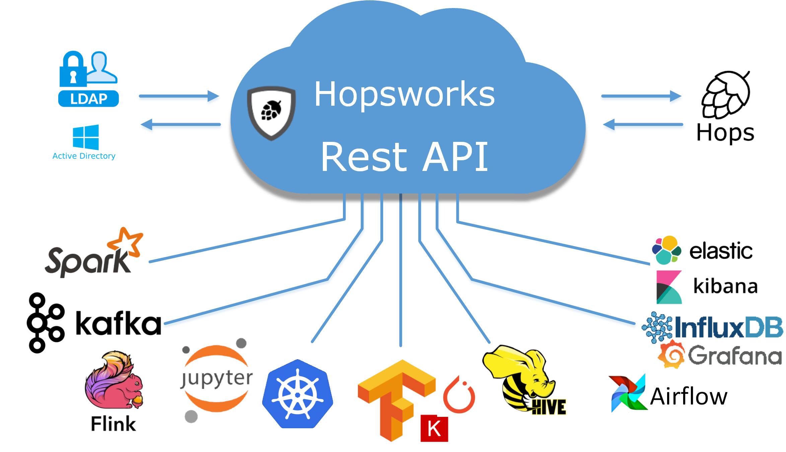

===========================
What is Hopsworks?
===========================

  Hopsworks unifies a number of open-source analytics and ML frameworks behind a unified REST API.

Hopsworks is a full-stack platform for scale-out data science, with support for both GPUs and Big Data, in a familiar development environment. Hopsworks unique features are:

* User-friendly UI for Data Science with Jupyter supported by TensorFlow/Keras/PyTorch/PySpark,
* Github-like Projects to manage teams/products/workflows/data/libraries,
* Python-first platform - each project has its own conda environment in the cluster,
* Managed GPUs-as-a-Resource - efficiently share GPUs between teams and scale-out training and  hyperparameter optimization to tens/hundreds of GPUs,
* World's fastest, most-scalable HDFS (HopsFS),
* Programmatic access through a single REST API for the Hopsworks Platform,
* TLS-Certificate security model with extensive auditing, data provenance, and data governance capabilities,
* Python-based ML workflows with: a Feature Store, Data and Model Validation, Model Serving on Kubernetes, workflow orchestration in Airflow.

Hopsworks supports the following open-source platforms for Data Science:

* Development: Jupyter, Conda/pip, IDE plugins (via the REST API);
* Machine Learning: TensorFlow, Keras, PyTorch, scikit-learn; 
* Data Analytics/BI: Spark, SparkSQL/Parquet, Hive;
* Stream Processing: Spark-Streaming, Flink, Kafka;
* Model Serving: Kubernetes/Docker.

.. figure:: ../imgs/projects/hopsworks-metadata-layer.png
  :alt: Hopsworks frameworks
  :scale: 60
  :figclass: align-center

  Hopsworks unifies many open-source frameworks for scalable data science in a single, secure platform.

Concepts: Projects, Datasets, Users
=====================  

Hopsworks provides a new stronger, GDPR-coompliant security model for managing sensitive data in a shared data platform. Hopsworks' security model is built around Projects, which are analogous to Github repositories. A project contains datasets, users, and programs (code). Sensitive datasets can be sandboxed inside a project, so that users are prevented from exporting that data from the project or cross-linking that data with data in other projects. Note, this capability is provided in competitor data platforms by creating a whole new cluster for the sensitive dataset. In Hopsworks, sharing data does not involve copying data.
Datasets can still be securely shared between projects, without the need for duplicating the dataset. Supported datasets in Hopsworks include Hive databases, Kafka topics, and subtrees in HopsFS (HDFS). 
Hopsworks implements its project-based multi-tenancy security model by supporting TLS certificates (instead of Kerberos) for user authenticawtion, with a new certificate created for every use in every project. Hopsworks also provides role-based access control within projects, with pre-defined DataOwner and DataScientists roles provided for GDPR compliance (Data owners are responsible for the data and access to the data, while Data Scientists are processors of the data).

.. figure:: ../imgs/projects/hopsworks-projects-medium.png
  :alt: Projects in Hopsworks
  :scale: 60
  :figclass: align-center

  Just like Github is made up of repositories, Hopsworks is made up of lots of *Projects*. A Project is, in turn, a collection of users, data assets, and programs (code). 

.. figure:: ../imgs/projects/hopsworks-projects-detailed.png
  :alt: Detailed view of Projects in Hopsworks
  :scale: 60
  :figclass: align-center

  Projects also have quotas associated with them - CPU/GPU and how much data they can store.
 

