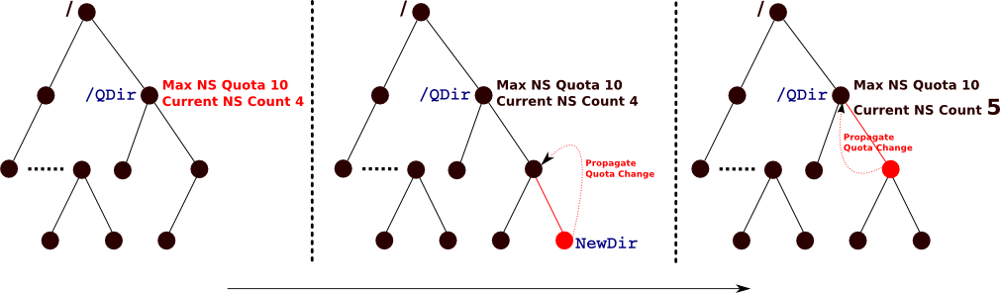

HopsFS User Guide
=================

HopsFS consist of the following types of nodes: NameNodes, DataNodes, and Clients. All the configurations parameters are defined in ``core-site.xml`` and ``hdfs-site.xml`` files. 

Currently Hops only supports non-secure mode of operations. As Hops is a fork of the Hadoop code  base, most of the `Hadoop configuration parameters` and features are supported in Hops. In the following sections we highlight differences between HDFS and HopsFS and point out new configuration parameters and the parameters that are not supported due to different metadata management scheme . 

.. _Unsupported_Features:
Unsupported HDFS Features
-------------------------

HopsFS is a drop-in replacement for HDFS and it supports most of the `configuration`_ parameters defined for Apache HDFS. As the architecture of HopsFS is fundamentally different from HDFS, some of the features such as journaling, secondary NameNode etc., are not required in HopsFS. Following is the list of HDFS features and configurations that are not applicable in HopsFS

.. _configuration: http://hadoop.apache.org/docs/current/hadoop-project-dist/hadoop-hdfs/hdfs-default.xml

* **Secondary NameNode**
	The secondary NameNode is no longer supported. HopsFS supports multiple active NameNodes. Thus **hdfs haadmin *** command; and **dfs.namenode.secondary.*** and **dfs.ha.*** configuration parameters are not supported in HopsFS.
* **Checkpoint Node and FSImage**
    HopsFS does not require checkpoint node as all the metadata is stored in NDB. Thus **hdfs dfsadmin -{saveNamespace | metaSave | restoreFailedStorage | rollEdits | fetchImage}** command; and **dfs.namenode.name.dir.***, **dfs.image.***, **dfs.namenode.checkpoint.*** configuration parameters are not supported in HopsFS.
* **Quorum Based Journaling** and **EditLog**
	The write ahead log (EditLog) is not needed as all the metadata mutations are stored in NDB. Thus **dfs.namenode.num.extra.edits.***, **dfs.journalnode.*** and **dfs.namenode.edits.*** configuration parameters are not supported in HopsFS.
* **NameNode Federation and ViewFS**
	In HDFS the namespace is statically partitioned among multiple namenodes to support large namespace. In essence these are independent HDFS clusters where ViewFS provides a unified view of the namespace. HDFS Federation and ViewFS are no longer supported as the namespace in HopsFS scales to billions of files and directories. Thus **dfs.nameservices.*** configuration parameters are not supported in HopsFS.
* **ZooKeeper**
	ZooKeeper is no longer required as the coordination and membership service. A coordination and membership management `service` is implemented using the transactional shared memory (NDB). 
	

As HopsFS is under heavy development some features such as rolling upgrades and snapshots are not yet supported. These features will be activated in future releases. 

NameNodes
---------

HopsFS supports multiple NameNodes. A NameNode is configured as if it is the only NameNode in the system. Using the database a NameNode discovers all the existing NameNodes in the system. One of the NameNodes is declared the leader for housekeeping and maintenance operations.  All the NameNodes in HopsFS are active. Secondary NameNode and Checkpoint Node configurations are not supported. See :ref:`section <Unsupported_Features>` for detail list of configuration parameters and features that are no longer supported in HopsFS. 

For each NameNode define ``fs.defaultFS`` configuration parameter in the ``core-site.xml`` file. In order to load NDB driver set the ``dfs.storage.driver.*`` parameters in the ``hdfs-site.xml`` file. These parameter are defined in detail :ref:`here <loading_ndb_driver>`. 

A detailed description of all the new configuration parameters for leader election, NameNode caches, distributed transaction handling, quota management, id generation and client configurations are defined :ref:`here<hopsFS_Configuration>`.

The NameNodes are started/stopped using the following commands (executed as HDFS superuser)::

    > $HADOOP_HOME/sbin/start-nn.sh

    > $HADOOP_HOME/sbin/stop-nn.sh

The Apache HDFS commands for starting/stopping NameNodes can also be used::
    
    > $HADOOP_HOME/sbin/hadoop-daemon.sh --script hdfs start namenode
     
    > $HADOOP_HOME/sbin/hadoop-daemon.sh --script hdfs stop namenode

Configuring HopsFS NameNode is very similar to configuring a HDFS NameNode. While configuring a single Hops NameNode, the configuration files are written as if it is the only NameNode in the system. The NameNode automatically detects other NameNodes using NDB. 

Formating the Filesystem
~~~~~~~~~~~~~~~~~~~~~~~~

Running the format command on any NameNode **truncates** all the tables in the database and inserts default values in the tables. NDB atomically performs the **truncate** operation which can fail or take very long time to complete for very large tables. In such cases run the **/hdfs namenode -dropAndCreateDB** command first to drop and recreate the database schema followed by the **format** command to insert default values in the database tables. In NDB dropping and recreating a database is much quicker than truncating all the tables in the database. 

NameNode Caches
~~~~~~~~~~~~~~~

In published Hadoop workloads, metadata accesses follow a heavy-tail distribution where 3% of files account for 80% of accesses. This means that caching recently accessed metadata at NameNodes could give a significant performance boost. Each NameNode has a local cache that stores INode objects for recently accessed files and directories. Usually, the clients read/write files in the same sub-directory. Using ``RANDOM_STICKY``  load balancing policy to distribute filesystem operations among the NameNodes lowers the latencies for filesystem operations as most of the path components are already available in the NameNode cache. See :ref:`HopsFS Client's <hopsfs-clients>` and :ref:`Cache Configuration Parameters <cache-parameters>` for more details. 

Adding/Removing NameNodes
~~~~~~~~~~~~~~~~~~~~~~~~~
As the namenodes are stateless any NameNode can be removed with out effecting the state of the system. All on going operations that fail due to stopping the NameNode are automatically forwarded by the clients to the remaining namenodes in the system.

Similarly, the clients automatically discover the newly started namenodes. See :ref:`client configuration parameters <client-conf-parameters>` that determines how quickly a new NameNode starts receiving requests from the existing clients. 

.. _hopsfs-clients:

DataNodes
---------
The DataNodes periodically acquire an updated list of NameNodes in the system and establish a connection (register) with the new NameNodes. Like clients, the DataNodes also uniformly distribute the filesystem operations among all the NameNodes in the system. Currently the DataNodes only support round-robin policy to distribute the filesystem operations. 

HopsFS DataNodes configuration is identical to HDFS DataNodes. In HopsFS a DataNode connects to all the NameNodes. Make sure that the ``fs.defaultFS`` parameter points to valid NameNode in the system. The DataNode will connect to the NameNode and obtain a list of all the active NameNodes in the system, and then connects/registers with all the NameNodes in the system. 

The DataNodes can started/stopped using the following commands (executed as HDFS superuser)::

   > $HADOOP_HOME/sbin/start-dn.sh

   > $HADOOP_HOME/sbin/stop-dn.sh   

The Apache HDFS commands for starting/stopping Data Nodes can also be used::
   
   > $HADOOP_HOME/sbin/hadoop-deamon.sh --script hdfs start datanode
  
   > $HADOOP_HOME/sbin/hadoop-deamon.sh --script hdfs stop datanode

HopsFS Clients
--------------
For load balancing the clients uniformly distributes the filesystem operations among all the NameNodes in the system. HopsFS clients support ``RANDOM``, ``ROUND_ROBIN``, and ``RANDOM_STICKY`` policies to distribute the filesystem operations among the NameNodes. Random and round-robin policies are self explanatory. Using sticky policy the filesystem client randomly picks a NameNode and forwards all subsequent operation to the same NameNode. If the NameNode fails then the clients randomly picks another NameNode. This maximizes the NameNode cache hits. 

In HDFS the client connects to the ``fs.defaultFS`` NameNode. In HopsFS, clients obtain the list of active NameNodes from the NameNode defined using ``fs.defaultFS`` parameter. The client then uniformly distributes the subsequent filesystem operations among the list of NameNodes. 

In ``core-site.xml`` we have introduced a new parameter ``dfs.namenodes.rpc.addresses`` that holds the rpc address of all the NameNodes in the system. If the NameNode pointed by ``fs.defaultFS`` is dead then the client tries to connect to a NameNode defined by the ``dfs.namenodes.rpc.addresses``. As long as the NameNode addresses defined by the two parameters contain at least one valid address the client is able to communicate with the HopsFS. A detailed description of all the new client configuration parameters are :ref:`here<client-conf-parameters>`.

Compatibility with HDFS Clients
---------------------------------------

HopsFS is fully compatible with HDFS clients, although they do not distribute operations over NameNodes, as they assume there is a single active NameNode. 

HopsFS Async Quota Management
-----------------------------

In HopsFS the commands and the APIs for quota management are identical to HDFS. In HDFS all Quota management operations are performed synchronously while in HopsFS Quota management is performed asynchronously for performance reasons. In the following example maximum namespace quota for ``/QDir`` is set to 10. When a new sub-directory or a file is created in this folder then the quota update information propagates up the filesystem tree until it reaches ``/QDir``. Each quota update propagation operation is implemented as an independent transaction. 

  HopsFS Quota Update
  
For write heavy workloads a user might be able to consume more diskspace/namespace than it is allowed before the filesystem recognizes that the quota limits have been violated. After the quota updates are applied the filesystem will not allow the use to further violate the quota limits. In most existing Hadoop clusters, write operations are a small fraction of the workload. Additionally, considering the size of the filesystem we think this is a small trade off for improving throughput for read operations that typically comprise 90-95% a typical filesystem workload. 

In HopsFS asynchronous quota updates are highly optimized. We batch the quota updates wherever possible.  :ref:`In the linked section  <quota-parameters>` there is a complete list of parameters that determines how aggressively asynchronous quota updates are applied.

