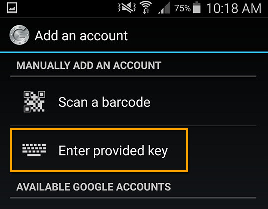
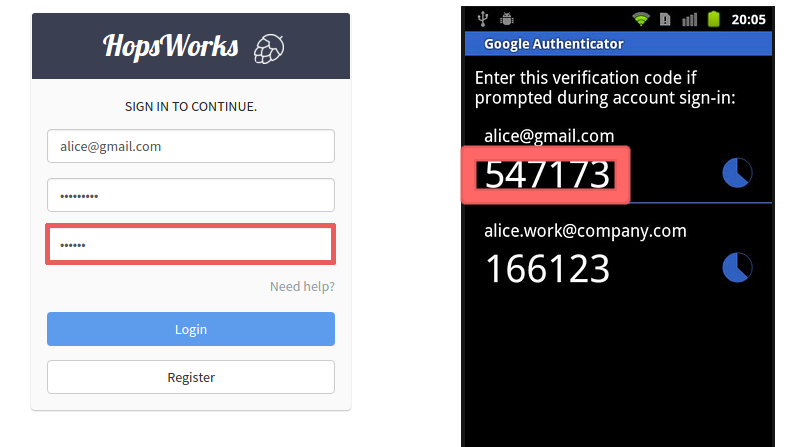

HopsWorks User Guide
====================

If you are using 2-Factor authentication, jump ahead to "First Login with 2-Factor Authentication".

First Login (no 2-Factor Authentication)
-----------------------------------------

.. figure:: ../imgs/login.png
    :alt: HopsWorks Login Page
    :width: 300px
    :height: 334px 
    :scale: 80
    :align: center
    :figclass: align-center
    
    HopsWorks Login Page
  

On initial installation, you can login with the default username and password.
::
   
    username: admin@kth.se
    password: admin

If you manage to login successfully, you will arrive on the landing page:

    :align: center
    :figclass: align-center
    
    HopsWorks Landing (Home) Page

In the landing page, you can see a box for projects, a search bar (to find projects and data sets), an audit trail, and user menu (to change user settings or log out).
    
**If it goes wrong**

If login does not succeed, something has gone wrong during installation. The possible sources of error and the Web Application Server (Glassfish) and
the database (MySQL Clusters).

**Actions**:

* Double-check that system meets the minimum system requirements for HopsWorks. Is there enough available disk space and memory?
* Re-run the installation, as something may have gone wrong during installation.
* Investigate Glassfish misconfiguration problems. Is Glassfish running? is the hopsworks.war application installed? Are the JDBC connections working? Is JavaMail configured correctly?
* Investigate MySQL Cluster misconfiguration problems. Are the mgm server, data nodes, and MySQL server running? Do the hops and hopsworks databases exist and are they populated with tables and rows? If not, something went wrong during installation.

.. raw:: latex

    \newpage
  
First Login with 2-Factor Authentication
----------------------------------------

For 2-Factor Authentication, you cannot login directly via the web browser. You first need to generate your 2nd factor credentials for the default account (`admin@kth.se`, `admin`). Login to the target machine where HopsWorks is installed, and run:

.. code-block:: bash
   
    sudo /bin/hopsworks-2fa

It should return something like:

.. code-block:: bash
		
    +--------------+------------------+
    | email        | secret           |
    +--------------+------------------+
    | admin@kth.se | V3WBPS4G2WMQ53VA |
    +--------------+------------------+

    
    Google Authenticator - Enter the Provided Key **V3WBPS4G2WMQ53VA** for `admin@kth.se` as a Time-Based Key.

    
You now need to start ``Google Authenticator`` on your smartphone. If you don't have 'Google Authenticator' installed, install it from your app store. It is available for free on:

* Android as ``Google Authenticator``
   
* iOS (Apple iPhone) as ``OTP Auth``), and

* Windows Phone as ``Microsoft Authenticator``).

After starting your Google Authenticator application, create an account (``set up account``), and add as the account email the default installation email address (``admin@kth.se``) and add as the ``provided key`` , the secret value returned by ``/bin/hopsworks-2fa`` (for example, 'V3WBPS4G2WMQ53VA'). The key is a ``time-based`` key, if you need to specify the type of provided key. This should register your second factor on your phone.

You can now go to the start-page on Google Authenticator to read the six-digit one-time password (OTP). Note that the OTP is updated every 30 seconds. On HopsWorks login page, you will need to supply the 6-digit number (OTP) shown for ``admin@kth.se`` when on the login page, along with the username and password.

    
    HopsWorks Two-Factor Authentication Login Page

Register a New Account on HopsWorks
-----------------------------------

The process for registering a new account is as follows:

#. Register your email address and details and use the camera from within Google Authenticator to store your 2nd factor credential;
#. Validate your email address by clicking on the link in the validation email you received;
#. Wait until an administrator has approved your account (you will receive a confirmation email).

.. figure:: ../imgs/user_registration.png
    :alt: HopsWorks User Registration
    :width: 400px
    :height: 534px	   
    :scale: 70
    :align: center
    :figclass: align-center
    
    HopsWorks User Registration Page

.. raw:: latex

    \newpage

.. figure:: ../imgs/two-factor-smartphone-qr-code.png
    :alt: HopsWorks QR Code needs to be scanned with Google/Microsoft Authenticator
    :width: 400px
    :height: 534px	   
    :scale: 70
    :align: center
    :figclass: align-center
    
    Two-factor authentication: Scan the QR Code with Google Authenticator

    
Register a new account with a valid email account. If you have two-factor authentication enabled, you will then need to scan the QR code to save it on your phone. If you miss this step, you will have to recover your smartphone credentials at a later stage.
    
In both cases, you should receive an email asking you to validate your account. The sender of the email will be either the default ``hopsworks@gmail.com`` or a gmail address that was supplied while installing HopsWorks. If you do not receive an email, wait a minute. If you still haven't received it, you should contact the administrator.

**Validate the email address used in registration**

If you click on the link supplied in the registration email, it will validate your account.
**You will not be able to login until an administrator has approved your account.** [#f1]_.

.. rubric:: Footnotes

.. [#f1] If you are an administrator, you can jump now to the Hops Administration Guide to see how to validate account registrations, if you have administrator privileges.

After your account has been approved, you can now go to HopsWork's login page and start your Google Authenticator application on your smartphone. On HopsWorks login page, you will need to enter

* the email address your registered with
* the password you registered with
* on Google Authenticator find the 6-digit number shown for the email address your registered with and enter it into HopsWorks.

Forgotten Password / Lost Smartphone
-------------------------------------

If you forget your password or lose your 2nd factor device (smartphone or yubikey), you will need to recover your credentials. On the login screen, click on **Need Help?** to recover your password or replace the QR code for your smartphone.

Update your Profile/Password
----------------------------

After you have logged in, in the upper right-hand corner of the screen, you will see your **email address with a caret icon**. Click on the caret icon, then click on the menu item ``Account``.
A dialog will pop-up, from where you can change your password and other parts of your profile. You cannot change your email address and will need to create a new account if you wish to change your email address. You can also logout by clicking on the ``sign out`` menu item.

If it goes wrong
----------------

Contact an administrator or go to the Administration Guide section of this document. If you are an administrator:

* Does your organization have a firewall that blocks outbound SMTP access? HopsWorks needs SMTP outbound access over TLS using SSL (port 587 or 465).
* Is the Glassfish server up and running? Can you login to the Glassfish Administration console (on port 4848)?
* Inside Glassfish, check the JavaMail settings. Is the gmail username/password correct? Are the SMTP server settings correct (hostname/ip, port, protocol (SSL, TLS))?

*User fails to receive an email to validate her account*

* This may be a misconfigured gmail address/password or a network connectivity issue.
* Does your organization have a firewall that blocks outbound SMTP access?
* For administrators: was the correct gmail username/password supplied when installing? 
* If you are not using a Gmail address, are the smtp server settings correct (ip-address or hostname, port, protocol (SSL, TLS))?

*User receives the validate-your-email message, but is not able to validate the account*

* Can you successfully access the HopsWorks homepage? If not, there may be a problem with the network or the webserver may be down.
* Is the Glassfish webserver running and hopsworks.war application installed, but you still can't logon? It may be that MySQL Cluster is not running.
* Check the Glassfish logs for problems and the Browser logs.
    

*User successfully validates the account, but still can't login*

The user account status may not be in the correct state, see next section for how to update user account status.

*User account has been disabled due to too many unsuccessful login attempts*

From the HopsWorks administration application, the administrator can re-enable the account by going to "User Administration" and taking the action "Approve account".

*User account has been disabled due to too many unsuccessful login attempts*

Contact your system administrator who will re-enable your account.
  
Create a New Project
--------------------

You can create a project by clicking on the ``New`` button in the *Projects* box. This will pop-up a dialog, in which you enter the project name, an optional description, and select an optional set of services to be used in the project. You can also select an initial set of members for the project, who will be given the role of Data Scientist in the project. Member roles can later be updated in the Project settings by the `project owner` or a member with the `data owner` role.

Delete a Project
----------------

Right click on the project to be deleted in the projects box. You have the options to:

* Remove and delete data sets;

  * If the user deletes the project, the files are moved to trash in HopsFS;
  
* Remove and keep data sets.

   
Data Set Browser
----------------

The Data Set tab enables you to browse Data Sets, files and directories in this project.
It is mostly used as a file browser for the project's HDFS subtree. You cannot navigate to
directories outside of this project's subtree.

Upload Data
-----------

Files can be uploaded using HopsWorks' web interface. Go to the
project you want to upload the file(s) to. You must have the **Data Owner**
role for that project to be able to upload files. In the **Data Sets**
tab, you will see a button ``Upload Files``.

.. tabularcolumns:: {|p{\dimexpr 0.3\linewidth-2\tabcolsep}|p{\dimexpr 0.7\linewidth-2\tabcolsep}|}

+------------------+----------------------------------------+
| **Option**       | **Description**                        |
+==================+========================================+
| **Upload File**  | You have to have the **Data Owner**    |
|                  | role to be able to upload files.       |
|                  | Click on the ``Upload File`` button to |
|                  | select a file from your local disk.    |
|                  | Then click **Upload All** to upload    |
|                  | the file(s) you selected.              |
|                  | You can also upload folders.           |
+------------------+----------------------------------------+

Compress Files
--------------

HopFS supports erasure-coding of files, which reduces storage requirements for large files by roughly 50%. If a file consists of 6 file blocks or more (that is, if the file is larger than 384 MB in size, for a default block size of 64 MB), then it can be compressed. Smaller files cannot be compressed. 

.. tabularcolumns:: {|p{\dimexpr 0.3\linewidth-2\tabcolsep}|p{\dimexpr 0.7\linewidth-2\tabcolsep}|}

+------------------+----------------------------------------+
| **Option**       | **Description**                        |
+==================+========================================+
| **compress**     | You have to have the **Data Owner**    |
| **file**         | role to be able to compress files.     |
|                  | Select a file from your project.       |
|                  | Right-click and select ``Compress``    |
|                  | to reduce the size of the file by      |
|                  | changing its replication policy from   |
|                  | triple replication to Reed-Solomon   |
|                  | erasure coding.                        |
+------------------+----------------------------------------+

Share a Data Set
----------------

Only a `data owner` or the `project owner` has privileges to share Data Sets. To share a Data Set, go to the `Data Sets Browser` in your project, and right-click on the Data Set to be shared and then select the ``Share`` option. A popup dialog will then prompt you to select (1) a target project with which the *Data Set* is to be Shared and whether the *Data Set* will be shared as read-only (**Can View**) or as read-write (**Can edit**). To complete the sharing process, a Data Owner in the target project has to click on the shared Data Set, and then click on ``Acccept`` to complete the process.

Free-text Search 
----------------

.. tabularcolumns:: {|p{\dimexpr 0.3\linewidth-2\tabcolsep}|p{\dimexpr 0.7\linewidth-2\tabcolsep}|}
   
+------------------+----------------------------------------+
|**Option**        | **Description**                        |
+==================+========================================+
| **Search from**  | On landing page, enter the search term |
| **Landing Page** | in the search bar and press return.    |
|                  | Returns project names and Data Set     |
|                  | names that match the entered term.     |
+------------------+----------------------------------------+
| **Search from**  | From within the context of a project,  |
| **Project Page** | enter the search term in the search bar|
|                  | and press return. The search returns   |
|                  | any files or directories whose name or |
|                  | extended metadata matches the search   |
|                  | term.                                  |
+------------------+----------------------------------------+

Jobs
----

The Jobs tabs is the way to create and run YARN applications. HopsWorks supports the following YARN applications:

* Apache Spark,
* Apache Flink,
* MapReduce (MR),
* Adam (a bioinformatics data parallel framework),
* SAASFEE (HiWAY/Cuneiform) (a bioinformatics data parallel framework).
      

.. tabularcolumns:: {|p{\dimexpr 0.3\linewidth-2\tabcolsep}|p{\dimexpr 0.7\linewidth-2\tabcolsep}|}

+------------------+-------------------------------------------+
| **Option**       | **Description**                           |
+==================+===========================================+
| **New Job**      | Create a Job for any of the following     |
|                  | YARN frameworks by clicking ``New Job``   |
|                  | : Spark/MR/Flink/Adam/Cuneiform.          |
|                  |                                           |
|                  | * Step 1: enter job-specific parameters   |
|                  |                                           |
|                  | * Step 2: enter YARN parameters.          |
|                  |                                           |
|                  | * Step 3: click on ``Create Job``.        |
+------------------+-------------------------------------------+
| **Run Job**      | After a job has been created, it can      |
|                  | be run by clicking on its ``Run`` button. |
+------------------+-------------------------------------------+

The logs for jobs are viewable in HopsWorks, as stdout and stderr files. These output files are also stored
in the ``Logs/<app-framework>/<log-files>`` directories.
After a job has been created, it can be **edited**, **deleted**, and **scheduled** by clickin on the ``More actions`` button.

Charon
---------------

Charon is a cloud-of-clouds filesystem that enables the sharing of data between Hops clusters using public clouds. To do share data with a target cluster, you need to:

* acquire the `cluster-id` of the target cluster and enter it as a `cluster-id` in the Charon service UI - you can read the `cluster-id` at the top of the page for the Charon service;

* enter a token-id that is used as a secret key between the source and target cluster;

* select a folder to share with the target `cluster-id`;

* copy files to the shared folder from HDFS that you wish to share with the target cluster;

* the files within that folder are copied to the public cloud(s), from where they are downloaded to the target cluster.

Apache Zeppelin
---------------

Apache Zeppelin is an interactive notebook web application for running Spark or Flink code on Hops YARN.
You can turn interpreters for Spark/Flink/etc on and off in the Zeppelin tab, helping, respectively, to reduce time required to execute a Note (paragraph) in Zeppelin or reclaim resources.
More details can be found at: https://zeppelin.incubator.apache.org/

Metadata Management
-------------------
Metadata enables **data curation**, that is, ensuring that data is properly catalogued and accessible to appropriate users.

Metadata in HopsWorks is used primarily to discover and and retrieve relevant data sets or files by users by enabling users to
attach arbitrary metadata to Data Sets, directories or files in HopsWorks. Metadata is associated with an individual file
or Data Set or directory. This extended metadata is stored in the same database as the metadata for HopsFS and foreign keys link
the extended metadata with the target file/directory/Data Set, ensuring its integrity.
Extended metadata is exported to Elastic Search, from where it can be queried and the associated Data Set/Project/file/directory
can be identified (and acted upon).

MetaData Designer
-----------------

Within the context of a project, click on the ``Metadata Designer`` button in the left-hand panel. It will bring up a metadata designer view that can be used to:

* Design a new Metadata Template
* Extend an existing Metadata Template
* Import/Export a Metadata Template
    
Within the Metadata Designer, you can define a Metadata template as one or more tables. Each table consists of a number of typed columns. Supported
column types are:

* string
* single-select selection box
* multi-select selection box

Columns can also have constraints defined on them. On a column, click on cog icon (configure), where you can make the field:

* searchable: included in the Elastic Search index;
* required: when entering metadata, this column will make it is mandatory for users to enter a value for this column.

  
MetaData Attachment and Entry
-----------------------------

Within the context of a project, click on the ``Data Sets`` tab. From here, click on a Data Set. Inside the Data Set, if you select any file or directory, the rightmost panel will display any extended metadata associated with the file or directory. If no extended metadata is assocated with the file/directory, you will see "No metadata template attached" in the rightmost panel. You can attach an existing metadata template to the file or directory by right-clicking on it, and selecting ``Add metadata template``. The metadata can then be selected from the set of *available templates* (designed or uploaded).

After one or more metadata templates have been attached to the file/directory, if the file is selected, the metadata templates are now visible in the rightmost panel. The metadata can be edited in place by clicking on the ``+`` icon beside the metadata attribute. More than one extended metadata value can be added for each attribute, if the attribute is a string attribute.

Metadata values can also be removed, and metadata templates can be removed from files/directories using the Data Set service.
