HopsWorks User Guide
====================

If you are using 2-Factor authentication, jump ahead to "First Login with 2-Factor Authentication".

First Login (without 2-Factor Authentication)
-----------------------------------------

.. figure:: ../imgs/login.png
    :alt: HopsWorks Login Page
    :width: 300px
    :height: 334px 
    :scale: 80
    :align: center
    :figclass: align-center
    
    HopsWorks Login Page
  

On initial installation, you can login with the default username and password.
::
   
    username: admin@kth.se
    password: admin

Upon successful login, you will arrive on the landing page:

.. figure:: ../imgs/landing-page-new.png
    :alt: HopsWorks Landing Page
    :scale: 100
    :align: center
    :figclass: align-center
    
    HopsWorks Landing (Home) Page

In the landing page, on the left you can see the Guided tours which
will guide you through launching a SparkPi application. On the top center
part is the search bar where you can search for public projects and
datasets. On the right side, your Projects are listed where you can
click and select them. Finally, on the upper right corner is your
personal menu and administration panel, and the notifications menu.
    
**If it goes wrong**

If login does not succeed, something has gone wrong during installation. The possible sources of error and the Web Application Server (Glassfish) and
the database (MySQL Clusters).

**Actions**:

* Double-check that system meets the minimum system requirements for
  HopsWorks. Is there enough available disk space and memory?
* Log in to Glassfish and make sure both hopsworks-ear and
  hopsworks-web are deployed.
* Default Glassfish credentials are:
  ::
     username: adminuser
     password: adminpw
     
* Investigate Glassfish misconfiguration problems. Glassfish log file
  is located at ``/srv/hops/domain1/logs/server.log``. Is Glassfish running? Are the JDBC connections working? Is JavaMail configured correctly?
* Investigate MySQL Cluster misconfiguration problems. Are the mgm
  server, data nodes, and MySQL server running? Do the hops and
  hopsworks databases exist and are they populated with tables and
  rows? If not, something went wrong during installation.
* Re-run the installation, as something may have gone wrong during installation.

.. raw:: latex

    \newpage
  
First Login with 2-Factor Authentication
----------------------------------------

HopsWorks supports two factor authentication for enhanced
protection. If your administrator has enabled 2 factor authentication,
then during registration opt-in for it.

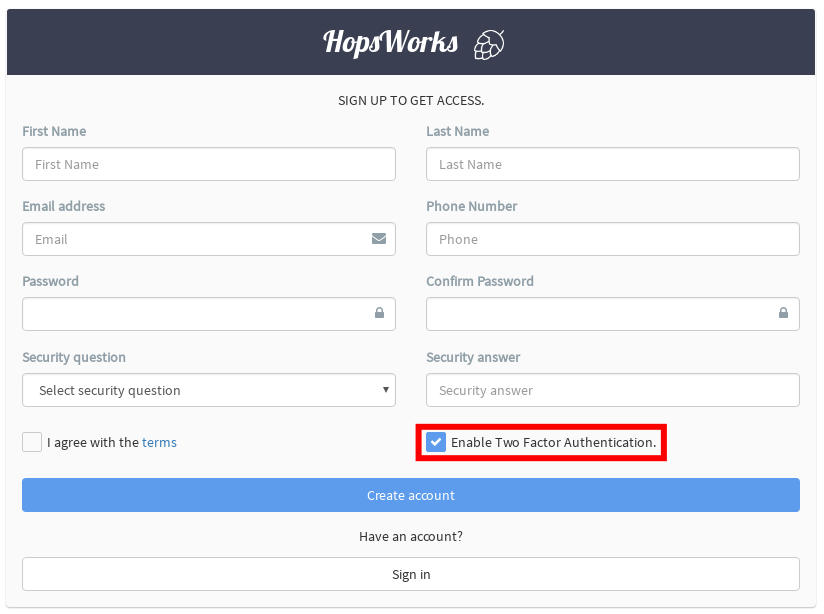

    HopsWorks registration with two factor authentication

You should have a one-time password generator installed at your
smartphone, such as `Google Authenticator`_. After you have clicked
the ``Register`` button, scan with your smartphone the QR code
presented to you. Next time you login again, it will prompt you both
for your password and for the six-digits one-time password generated by the
application at your smartphone.

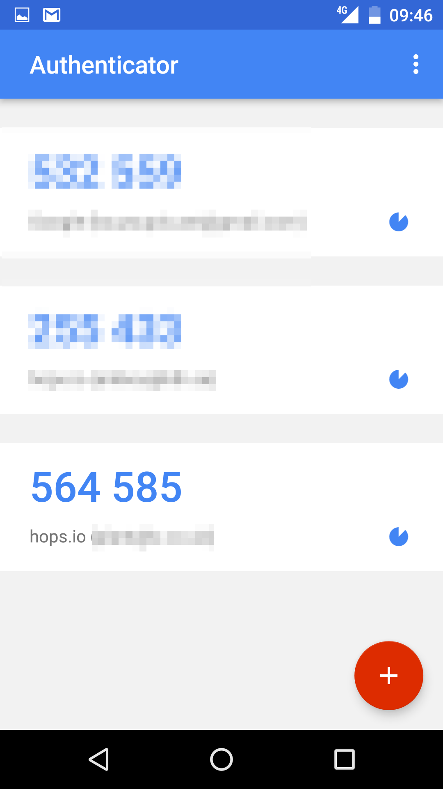

    Google authenticator one-time password

.. _`Google Authenticator`: https://support.google.com/accounts/answer/1066447?hl=en

Register a New Account on HopsWorks
-----------------------------------

The process for registering a new account is as follows:

#. Register your email address and details and use the camera from within Google Authenticator to store your 2nd factor credential;
#. Validate your email address by clicking on the link in the validation email you received;
#. Wait until an administrator has approved your account (you will receive a confirmation email).

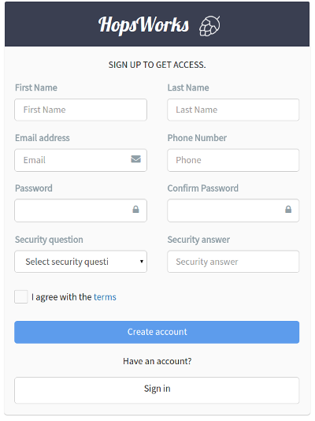
    
    HopsWorks User Registration Page

.. raw:: latex

    \newpage

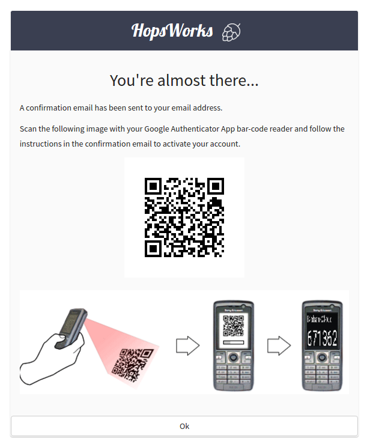
    
    Two-factor authentication: Scan the QR Code with Google Authenticator

    
Register a new account with a valid email account. If you have two-factor authentication enabled, you will then need to scan the QR code to save it on your phone. If you miss this step, you will have to recover your smartphone credentials at a later stage.
    
In both cases, you should receive an email asking you to validate your account. The sender of the email will be either the default ``hopsworks@gmail.com`` or a gmail address that was supplied while installing HopsWorks. If you do not receive an email, wait a minute. If you still haven't received it, you should contact the administrator.

**Validate the email address used in registration**

If you click on the link supplied in the registration email, it will validate your account.
**You will not be able to login until an administrator has approved your account.** [#f1]_.

.. rubric:: Footnotes

.. [#f1] If you are an administrator, you can jump now to the Hops Administration Guide to see how to validate account registrations, if you have administrator privileges.

After your account has been approved, you can now go to HopsWork's login page and start your Google Authenticator application on your smartphone. On HopsWorks login page, you will need to enter

* the email address your registered with
* the password you registered with
* on Google Authenticator find the 6-digit number shown for the email address your registered with and enter it into HopsWorks.

Forgotten Password / Lost Smartphone
-------------------------------------

If you forget your password or lose your 2nd factor device (smartphone or yubikey), you will need to recover your credentials. On the login screen, click on **Need Help?** to recover your password or replace the QR code for your smartphone.

Update your Profile/Password
----------------------------

After you have logged in, in the upper right-hand corner of the screen, you will see your **email address with a caret icon**. Click on the caret icon, then click on the menu item ``Account``.
A dialog will pop-up, from where you can change your password and other parts of your profile. You cannot change your email address and will need to create a new account if you wish to change your email address. You can also logout by clicking on the ``sign out`` menu item.

If it goes wrong
----------------

Contact an administrator or go to the Administration Guide section of this document. If you are an administrator:

* Does your organization have a firewall that blocks outbound SMTP access? HopsWorks needs SMTP outbound access over TLS using SSL (port 587 or 465).
* Is the Glassfish server up and running? Can you login to the Glassfish Administration console (on port 4848)?
* Inside Glassfish, check the JavaMail settings. Is the gmail username/password correct? Are the SMTP server settings correct (hostname/ip, port, protocol (SSL, TLS))?

*User fails to receive an email to validate her account*

* This may be a misconfigured gmail address/password or a network connectivity issue.
* Does your organization have a firewall that blocks outbound SMTP access?
* For administrators: was the correct gmail username/password supplied when installing? 
* If you are not using a Gmail address, are the smtp server settings correct (ip-address or hostname, port, protocol (SSL, TLS))?

*User receives the validate-your-email message, but is not able to validate the account*

* Can you successfully access the HopsWorks homepage? If not, there may be a problem with the network or the webserver may be down.
* Is the Glassfish webserver running and hopsworks-war, hopsworks-ear application installed, but you still can't logon? It may be that MySQL Cluster is not running.
* Check the Glassfish logs for problems and the Browser logs.
    

*User successfully validates the account, but still can't login*

The user account status may not be in the correct state, see next section for how to update user account status.

*User account has been disabled due to too many unsuccessful login attempts*

From the HopsWorks administration application, the administrator can re-enable the account by going to "User Administration" and taking the action "Approve account".

*User account has been disabled due to too many unsuccessful login attempts*

Contact your system administrator who will re-enable your account.
  
Create a New Project
--------------------

You can create a project by clicking on the ``New`` button in the
*Projects* box. This will pop-up a dialog, in which you enter the
project name, an optional description, and select an optional set of
services to be used in the project. You can also select an initial set
of members for the project, who will be given the role of Data
Scientist in the project. Member roles can later be updated in the
Project settings by the `project owner` or a member with the `data
owner` role. A valid project name can not contain spaces or special
characters such as __, /, \\, å, ä, etc.

As soon as you have created a new project and click on it on the
*Projects* box, you will see the project main page as illustrated in
the picture below.

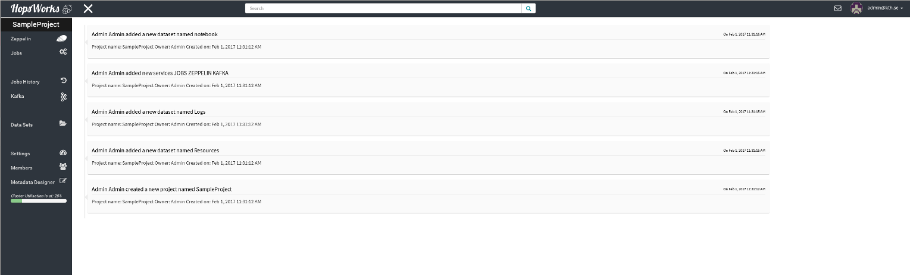
    
    Project main page

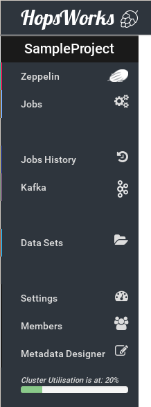
    
    Project Menu

On the left-hand side of the project main page is the Project
Menu. On the top section are the currently active services for your
project such as ``Zeppelin``, the ``Job`` launcher UI and ``History
service``, ``Kafka`` etc In the middle
section is the ``Data Sets`` browser menu where you can explore your
project's datasets. Finally, on the bottom section is various settings
for the project. From the ``Settings`` menu you can modify the
description of the project, the data retention period and see some
statistics. From the ``Members`` menu you can add new members to your
project and share your datasets or remove existing ones. Using the
``Metadata Designer`` you can attach more intuitive metadata to your
project. Also, in the project's menu you can always see the current
cluster utilization.
    
Delete a Project
----------------

Right click on the project to be deleted in the projects box. You have the options to:

* Remove and delete data sets;

  * If the user deletes the project, the files are moved to trash in HopsFS;
  
* Remove and keep data sets.

   
Data Set Browser
----------------

The Data Set tab enables you to browse Data Sets, files and directories in this project.
It is mostly used as a file browser for the project's HDFS subtree. You cannot navigate to
directories outside of this project's subtree. For a quick preview of
a file, go to the ``Datasets`` menu, navigate to a file, right click
on that file and choose the ``Preview`` option. A pop-up window will
appear with a small preview of the file. The picture below illustrates the Dataset Browser
with a new sample dataset. You can add new datasets pressing the
``Create New Dataset`` button. You can edit the datasets by right
clicking on them. A README file is auto-generated for every dataset.

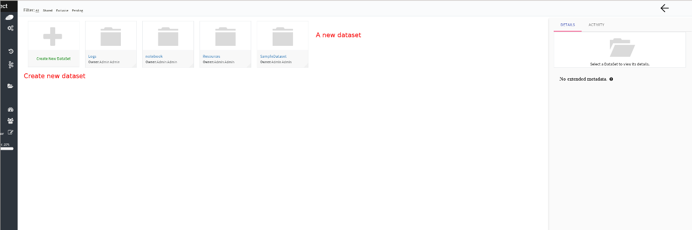
    
    Datasets Browser

Upload Data
-----------

Files can be uploaded using HopsWorks' web interface. Go to the
project you want to upload the file(s) to. You must have the **Data Owner**
role for that project to be able to upload files. In the **Data Sets**
tab, on the top left corner there is the *Upload* button.

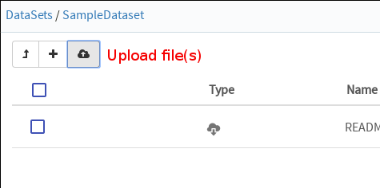
    
    Upload file(s)

After pressing on the *Upload* button, the following window will
appear which will let you select the files or folders from your local
hard drive by clicking on *Upload File* or *Upload Folder*. Next step
is to click *Upload all* which will upload your datasets. At any time
you can pause the uploading and resume it later. There is no limit at
the size of the files.

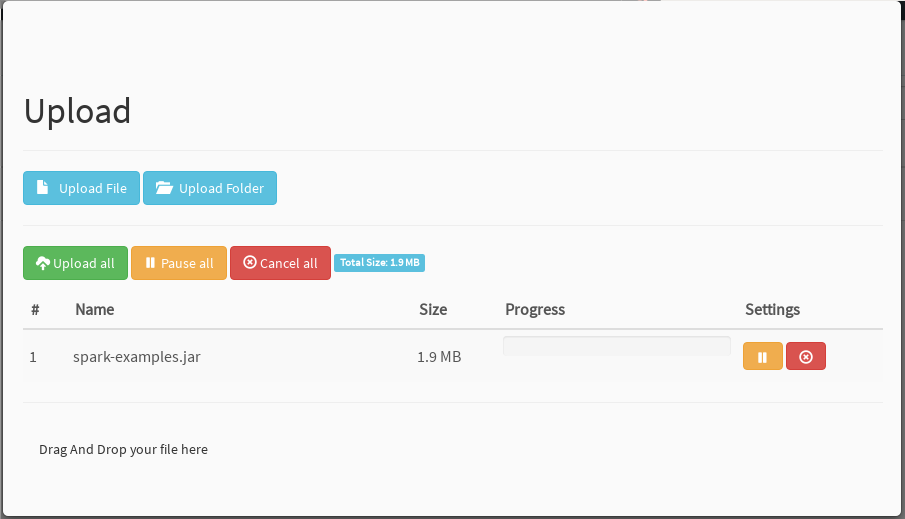
    
    Upload screen

Compress Files
--------------

HopFS supports erasure-coding of files, which reduces storage
requirements for large files by roughly 50%. If a file consists of 6
file blocks or more (that is, if the file is larger than 384 MB in
size, for a default block size of 64 MB), then it can be
compressed. Smaller files cannot be compressed.

.. tabularcolumns:: {|p{\dimexpr0.3\linewidth-2\tabcolsep}|p{\dimexpr 0.7\linewidth-2\tabcolsep}|}

+------------------+----------------------------------------+
| **Option**       | **Description**                        |
+==================+========================================+
| **compress**     | You have to have the **Data Owner**    |
| **file**         | role to be able to compress files.     |
|                  | Select a file from your project.       |
|                  | Right-click and select ``Compress``    |
|                  | to reduce the size of the file by      |
|                  | changing its replication policy from   |
|                  | triple replication to Reed-Solomon     |
|                  | erasure coding.                        |
+------------------+----------------------------------------+

Share a Data Set
----------------

Only a `data owner` or the `project owner` has privileges to share
Data Sets. To share a Data Set, go to the `Data Sets Browser` in your
project, and right-click on the Data Set to be shared and then select
the ``Share DataSet`` option. A popup dialog will then prompt you to
select (1) a target project with which the *Data Set* is to be Shared
and whether the *Data Set* will be shared as read-only (**Can View**)
or as read-write (**Can edit**). To complete the sharing process, a
Data Owner in the target project has to click on the shared Data Set,
and then click on ``Acccept`` to complete the process.

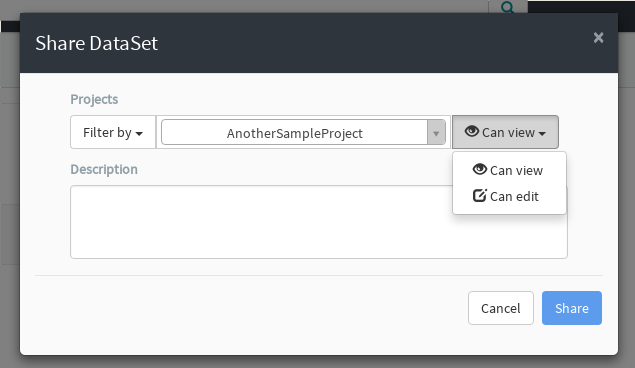
    
    Share dataset

Free-text Search 
----------------

.. tabularcolumns:: {|p{\dimexpr 0.3\linewidth-2\tabcolsep}|p{\dimexpr 0.7\linewidth-2\tabcolsep}|}
   
+------------------+----------------------------------------+
|**Option**        | **Description**                        |
+==================+========================================+
| **Search from**  | On landing page, enter the search term |
| **Landing Page** | in the search bar and press return.    |
|                  | Returns project names and Data Set     |
|                  | names that match the entered term.     |
+------------------+----------------------------------------+
| **Search from**  | From within the context of a project,  |
| **Project Page** | enter the search term in the search bar|
|                  | and press return. The search returns   |
|                  | any files or directories whose name or |
|                  | extended metadata matches the search   |
|                  | term.                                  |
+------------------+----------------------------------------+

Jobs
----

The Jobs tabs is the way to create and run YARN applications. HopsWorks supports the following YARN applications:

* Apache Spark
* Apache Flink
* Adam (a bioinformatics data parallel framework)

If you are a beginner it is **highly** advisable to click on the ``Tours``
button at landing page. It will guide you through launching your
first Spark application!

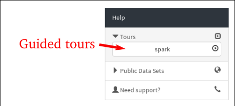
    
    Guided tours
    
To run a job upload the required jar files and libraries to your
dataset using the Dataset Browser. Click on the ``Jobs`` tab from the Project Menu and
follow the steps below:

* Step 1: Press the ``New Job`` button on the top left corner
* Step 2: Give a name for you job
* Step 3: Select one of the available job types
* Step 4: Select the jar file with your job that you have uploaded
  earlier
* Step 5: Give the main class and any possible arguments
* (Optional) Step 6: In the *Pre-configuration* you can choose existing
  configurations according to existing jobs history and our
  heuristics
* Step 6: In the *Configure and create* tab you can manually specify
  the configuration you desire for your job and dependencies for the jar
* Step 7: Click on the ``Create job`` button
* Step 8: Click on the ``Run`` button to launch your job

On the right-hand side you can view some information about your job
such as the Spark/Flink dashboard, YARN application UI, logs with
Kibana and metrics with Grafana.

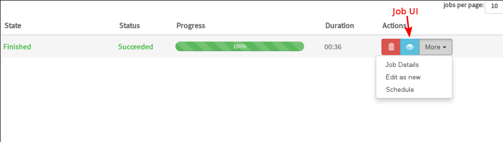
    
    Job UI

Job logs are available at the bottom of your screen by clicking on
them.

Logs visualization
------------------
HopsWorks aggregates the logs of the applications launched and uses
Kibana for visualization and discovery. To get access to your logs,
upon a job completion, click on the ``Job UI`` button and then on
``Logs`` tab. A sample output for the SparkPi job looks like the
following.

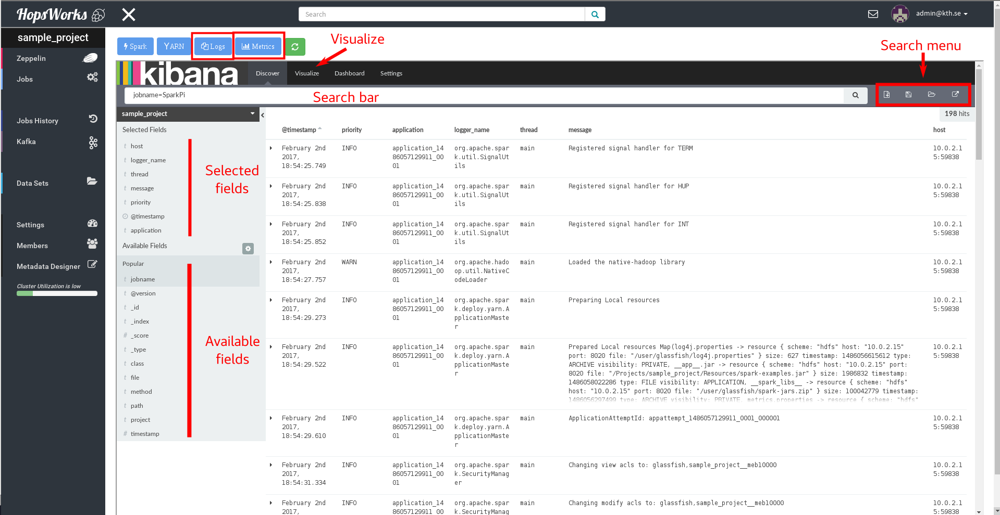
    
    Job logs with Kibana

At the top section of the left-hand side of the main screen are the
selected fields of the log that are shown on the main page. At the
bottom section are the rest of the available indexed fields. On the
top is the search bar where you can search for specific fields. For
example if you want to preview the warning messages type
``priority=WARN``. On the right side of the search bar you can save
your search query and load it later.

Also you can visualize certain fields of your logs by clicking on the
`Visualize` button. For example, assume we want to make a pie chart of
the severity of the log messages.

* Step 1: Click on the `Visualize` button
* Step 2: Select the `Pie chart`
* Step 3: Click `From a new search` and select your project's name
  from the drop-down menu
* Step 4: On the `buckets` section click `Split Slices`
* Step 5: The severity level is text so in the `Aggregation` drop-down
  select *Terms* and the `Field` we would like to visualize is the
  *priority* field
* Step 6: Click the green *Play* button on the top

The pie chart should look like the following. On the top right-hand
side is the legend. Hopefully most of your job's messages will be INFO
and a few WARN! On the top right corner is the visualization menu
where you can save, load or share the current chart.

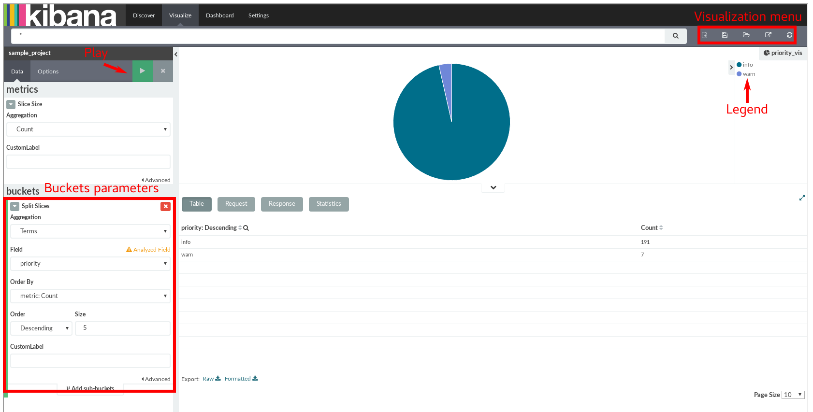
    
    Kibana visualization

Job metrics
-----------
We provide live monitoring of your application with Grafana where you
can view metrics such as JVM memory consumption, Garbage Collection
activity, HDFS activity, completed tasks etc. After you have launched
your job, click on the ``Job UI`` button on the right and select the
``Metrics`` tab. A sample dashboard is illustrated below.

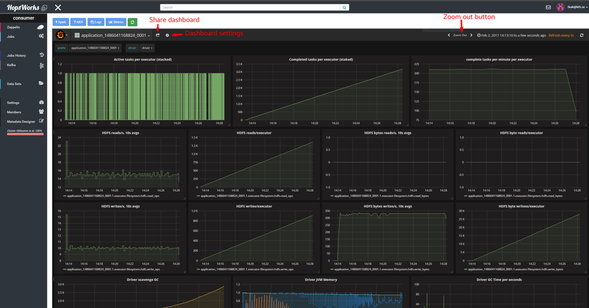
    
    Grafana dashboard

You can zoom in at any panel by left clicking, hold and drag across
the X axis. If you want to share the dashboard, click on the `Share
dashboard` button on the top which gives the options of sharing a
link, an interactive snapshot of your dashboard or exporting it in a
JSON format.

Apache Zeppelin
---------------

Apache Zeppelin is an interactive notebook web application for running Spark or Flink code on Hops YARN.
You can turn interpreters for Spark/Flink/Pythonetc on and off in the Zeppelin tab, helping, respectively, to reduce time required to execute a Note (paragraph) in Zeppelin or reclaim resources.
More details about Zeppelin can be found at:
https://zeppelin.incubator.apache.org/

To run a job through Zeppelin simply select your project and select
``Zeppelin`` from the project menu. The following screen will appear
where you can create a new notebook and see the status of supported
interpreters.

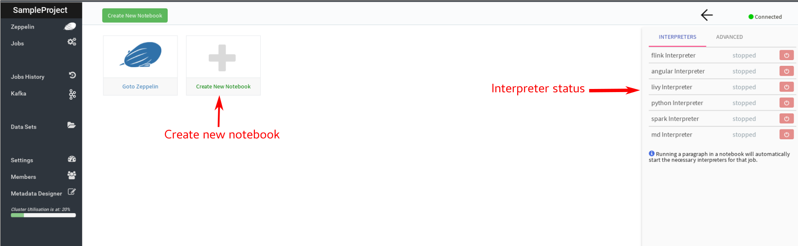
    
    Zeppelin main

In the following steps we will guide you through running a Zeppelin
tutorial in HopsWorks.

* Step 1: Download the *bank* dataset from `Zeppelin tutorial page`_
* Step 2: Unzip the downloaded file
* Step 3: Select your project and upload the *bank-full.csv* file to
  your dataset using the DataSets browser
* Step 4: Select the uploaded file and copy the file location in HDFS
  shown on top
* Step 5: Click on the ``Zeppelin`` tab from the menu on the left
* Step 6: Create a new notebook
* Step 7: Click on the newly created notebook and you will be
  redirected to Zeppelin where you can write your program. The default
  interpreter is Spark.
* Step 8: Copy the *Data Refine* code snippet from Zeppelin tutorial
  and replace the path to the dataset in HDFS
* Step 9: Click on the `Run` button on the right
* Step 10: Upon successful execution of our job, we move on to *Data
  Retrieval* section of Zeppelin tutorial, where we will visualize our
  data. Paste the code snippets and press the `Run` button. Notice the
  *%sql* header. This snippet will make use of Spark SQL.

.. _Zeppelin tutorial page: https://zeppelin.apache.org/docs/0.5.5-incubating/tutorial/tutorial.html

Your final page should look like the following

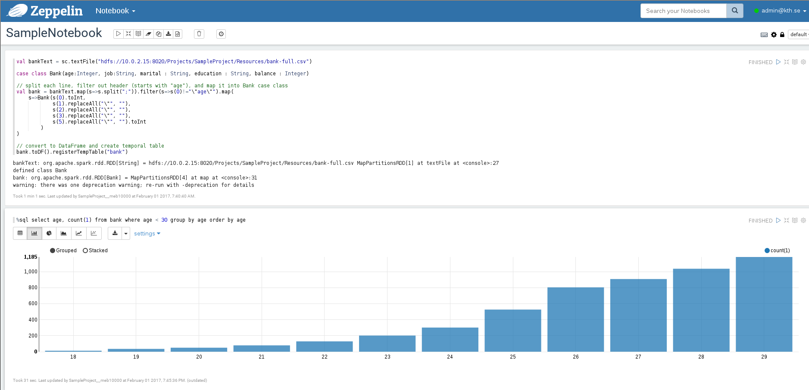
    
    Zeppelin tutorial

Clicking on the gear on the top right corner as indicated in the
picture below you can change the default interpreter binding. You can
choose among Spark, Livy, Flink, etc just by drag them on the top.

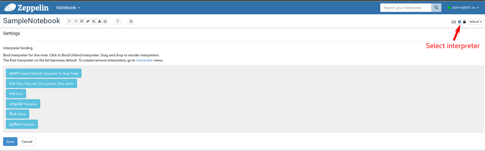
    
    Zeppelin interpreters

Apache Kafka
------------
In HopsWorks we provide Kafka-as-a-Service for streaming
applications. In the following section we will guide you through
creating a *Producer* job which will produce in a Kafka topic and a
simple *Consumer* job which will consume from that topic. Our service
is tightly coupled with our project-based model so only members of a
project can use a specific Kafka topic, unless specified as we see
later on.

To begin with you have to download and compile our utilities library
which will abstract away all the configuration boilerplate code such
as Kafka endpoints, topics etc

* Step 1: `git clone git@github.com:hopshadoop/hops-util.git` to clone
  the library
* Step 2: `cd hops-util/ && mvn package` to build it

Then you need to download and compile a sample Spark
streaming application.

* Step 1: `git clone
  git@github.com:hopshadoop/hops-kafka-examples.git` to clone our
  sample application
* Step 2: `cd hops-kafka-examples/ && mvn package` to build the
  project

Next step is to create a Kafka topic at HopsWorks that our application
will produce to and consume from.

* Step 1: From the project box on the landing page, select a project
* Step 2: Click on the `Kafka` tab and the topics page will appear

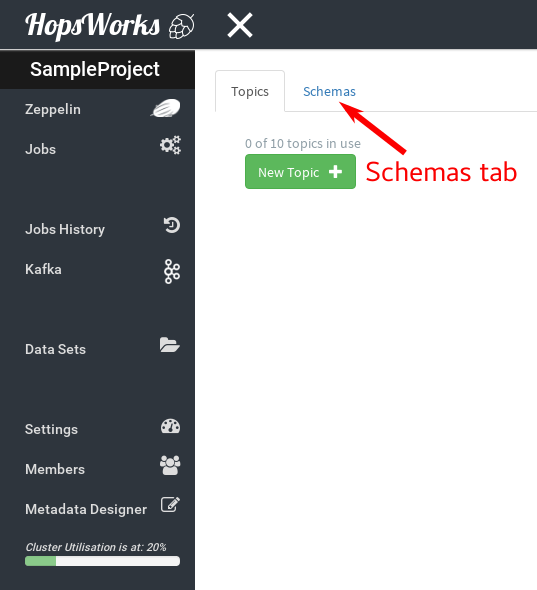
    
    Kafka topics & schemas

* Step 3: First we need to create a schema for our topic, so click on
  the `Schemas` tab and `New Avro Schema`. Copy the sample schema from
  `here`_ and paste it in the `Content` box. Click on the `Validate`
  button to validate the schema you provided and then `Create`.

* Step 4: Click on `New Topic`, give a topic name, select the
  schema you created at Step 3 and press `Create`.

* Step 5: Upload `hops-kafka-examples/spark/target/hops-spark-0.1.jar`
  and `hops-util/target/hops-util-0.1.jar` to a dataset
  
* Step 6: Click on the `Jobs` tabs at project menu and follow the
  instructions from the **Jobs** section. Create a new job for the
  Producer. Select `Spark` as job type and `hops-kafka-0.1.jar` as JAR
  file. The name of the main class is
  `io.hops.examples.spark.kafka.StreamingExample` and argument is
  `producer`. At the `Configure and create` tab, click on `Kafka`
  Services and select the Kafka topic you created at Step 4. Your job
  page should look like the following

.. figure:: ../imgs/kafka-producer.png
    :alt: Kafka producer job
    :scale: 100
    :align: center
    :figclass: align-center
    
    Kafka producer job

* Step 7: We repeat the instructions on Step 6 for the Consumer
  job. Type a different job name and as argument to the main class
  pass `consumer /Projects/YOUR_PROJECT_NAME/Resources/Data`. The rest
  remain the same as the Producer job.

* Step 8: `Run` both jobs. While the consumer is running you can check
  its execution log. Use the Dataset browser to navigate to the
  directory `/Resources/Data-APPLICATION_ID/`. Right click on the file
  `part-00000` and *Preview* the content.

  A sample output would look like the following

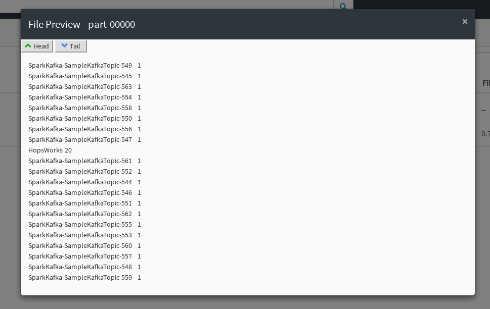
    
    Kafka output
    
.. _here: https://github.com/hopshadoop/hops-kafka-examples/tree/master/spark

A Kafka topic by default will be accessible only to members of a
specific project. In order to *share* the topic with another project
click on the ``Kafka`` service from the menu on the left. This will
bring you to Kafka main page as illustrated below. Then press the
the ``Share topic`` button on the appropriate topic and select the
name of the project you would like to share with.

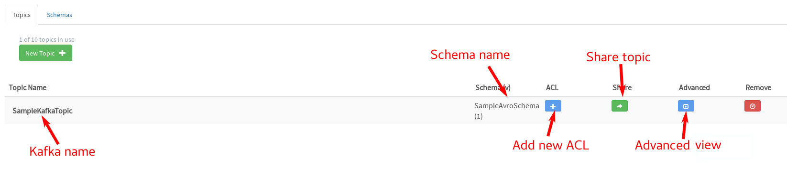
    
    Kafka main page

You can also fine grain access to Kafka topics by adding ACLs easily
through our UI. Once you have created a Kafka topic, click on the
``Kafka`` service and then on the *Add new ACL* button.

When creating a new ACL you are given the following options:

* **Permission Type** - Whether you will *allow* or *deny* access
  according to the ACL you are about to create
  
* **Operation Type** - The operation this ACL will affect:
  
  * *read* : Read from the topic
  * *write* : Write to the topic
  * *detail* : Get information about this topic
  * \* : All above

* **Role** - The user role this ACL will affect. It can be *Data
  scientist*, *Data owner* or both.

* **Host** - Originating host of the request to read, write or detail

* **Project name** - The name of project this ACL concerns in case you
  have shared the topic with another project

* **Member email** - Email of the user that this ACL will apply or *
  for everybody

When you are done with the ACL parameters click on the `Create`
button.

As an example assume that we have already created a Kafka topic for
our project and we have shared this topic with another project named
`another_sample_project`. We would like members of the other project
**NOT** to be able to produce on this topic. Then the ACL would look
like the following.

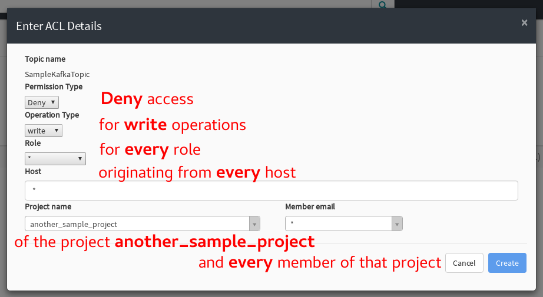
    
    Kafka ACL example

If you would like to see more details about your Kafka topic click on
the ``Advanced view`` button. In the picture below we
can see that there are three ACLs. The first is the default ACL which
is applied when a topic is created. The second was created when we
shared the topic with another project, allowing full access and
finally the third is the custom ACL we created before.

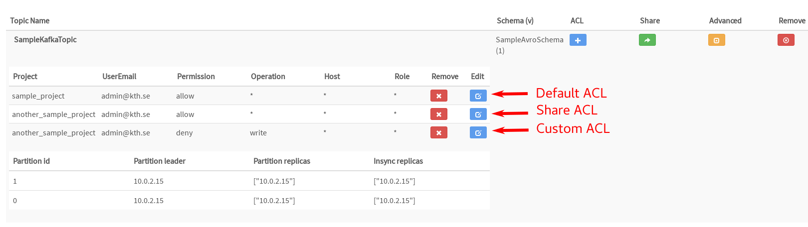
    
    Kafka topic details
    
Metadata Management
-------------------
Metadata enables **data curation**, that is, ensuring that data is properly catalogued and accessible to appropriate users.

Metadata in HopsWorks is used primarily to discover and retrieve relevant data sets or files by users by enabling them to
attach arbitrary metadata to Data Sets, directories or files in HopsWorks. Metadata is associated with an individual file
or Data Set or directory. This extended metadata is stored in the same database as the metadata for HopsFS and foreign keys link
the extended metadata with the target file/directory/Data Set, ensuring its integrity.
Extended metadata is exported to Elastic Search, from where it can be queried and the associated Data Set/Project/file/directory
can be identified (and acted upon).

MetaData Designer
-----------------

Within the context of a project, click on the ``Metadata Designer`` button in the left-hand panel. It will bring up a metadata designer view that can be used to:

* Design a new Metadata Template
* Extend an existing Metadata Template
* Import/Export a Metadata Template
    
Within the Metadata Designer, you can define a Metadata template as one or more tables. Each table consists of a number of typed columns. Supported
column types are:

* string
* single-select selection box
* multi-select selection box

Columns can also have constraints defined on them. On a column, click on cog icon (configure), where you can make the field:

* searchable: included in the Elastic Search index;
* required: when entering metadata, this column will make it is mandatory for users to enter a value for this column.

  
MetaData Attachment and Entry
-----------------------------

Within the context of a project, click on the ``Data Sets`` tab. From here, click on a Data Set. Inside the Data Set, if you select any file or directory, the rightmost panel will display any extended metadata associated with the file or directory. If no extended metadata is assocated with the file/directory, you will see "No metadata template attached" in the rightmost panel. You can attach an existing metadata template to the file or directory by right-clicking on it, and selecting ``Add metadata template``. The metadata can then be selected from the set of *available templates* (designed or uploaded).

After one or more metadata templates have been attached to the file/directory, if the file is selected, the metadata templates are now visible in the rightmost panel. The metadata can be edited in place by clicking on the ``+`` icon beside the metadata attribute. More than one extended metadata value can be added for each attribute, if the attribute is a string attribute.

Metadata values can also be removed, and metadata templates can be removed from files/directories using the Data Set service.
