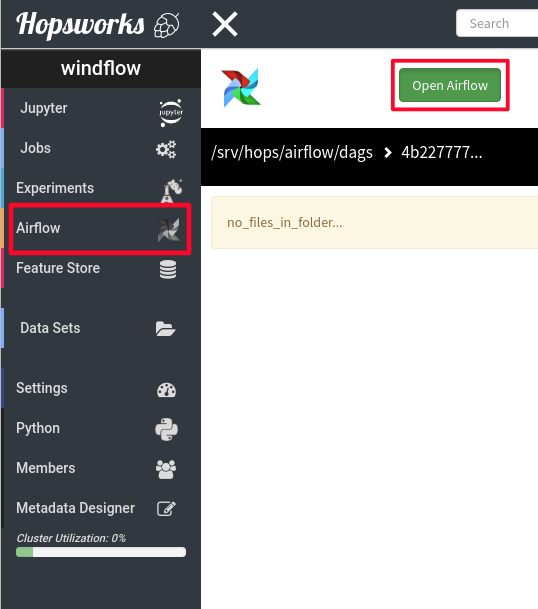
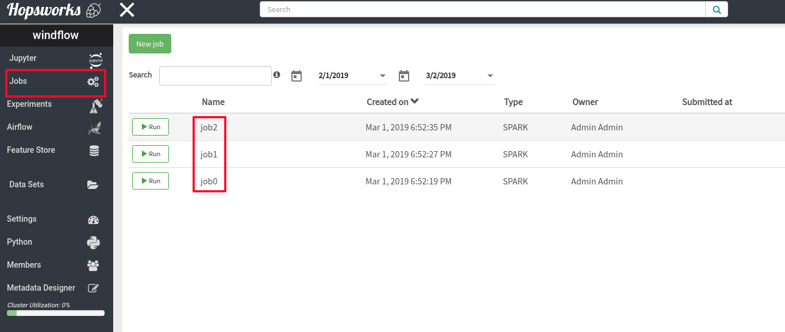
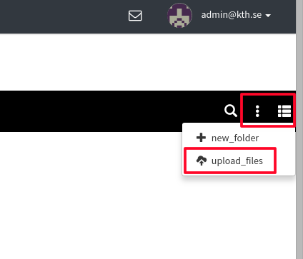
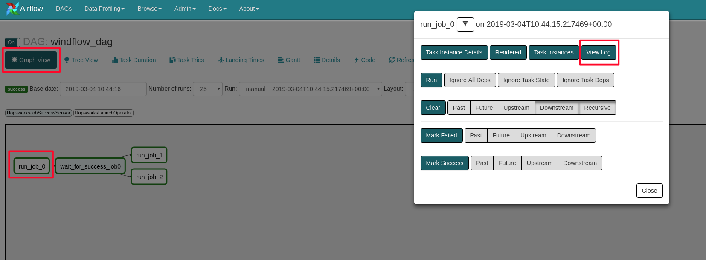

Apache Airflow
==============

Hopsworks version 0.9.0 introduces native support for `Apache
Airflow`_. Airflow is a platform to programmatically schedule
and monitor workflows. Using Hopsworks operators a user can launch and
monitor jobs in Hopsworks (almost) transparently.

.. _`Apache Airflow`: https://airflow.apache.org/index.html

Airflow introduction
--------------------
Airflow is built on top of three core concepts:

1. DAGs
2. Operators
3. Tasks

In Airflow a Directed Acyclic Graph (**DAG**) is a model of the tasks
you wish to run defined in Python. The model is organized in such a
way that clearly represents the dependencies among the tasks. For
example, task *B* and *C* should both run only after task *A* has finished.

A DAG constructs a model of the workflow and the tasks that should
run. So far a task is quite general, **operators** define what a task
should actually execute. Operators are usually (it is recommended)
atomic is a sense that they can stand on their own without sharing
state with others. They can have order dependencies though, operator
*B* should run after operator *A*.

Apache Airflow ships with a lot of operators for the most common (and
uncommon) operations. Such operators are:

- ``BashOperator`` Executes bash commands
- ``PythonOperator`` Executes arbitrary Python code
- ``SimpleHttpOperator`` Performs HTTP requests
- ``MySqlOperator``, ``PostgresOperator``, ... Connectors to execute
  SQL commands
- More specific such as ``SlackOperator``, ``HiveOperator`` and a lot
  more supplied by Airflow and/or the community

Hopsworks comes with some very basic, for the moment, Airflow
operators which will be discussed in detail later in this document.

Finally, **tasks** are instantiated operators in a specific point in
time. Think of classes and objects in OOP. Since workflows can be
scheduled to run repeatedly operators' result may vary. So tasks are
also defined by the time which ran. For example task *A* which ran
on Friday 1 March 2019 16:05 succeeded but the same task which ran one
day later failed.

Airflow in Hopsworks
--------------------

Hopsworks provides seamless integration with Apache Airflow. For projects
that have activated Airflow service, users can access it from the
micro-services panel on the left and then click on the `Open Airflow`
button as shown in image below. From the landing page you can upload
a DAG and let Airflow scheduler pick it as we will see later.

   Airflow landing page

Hopsworks has native support of Airflow using our home brewed plugin
which hides all the complexity from the user. Source code is available
here_. As the plugin matures, we will add more functionality but for
the moment we have the following operators.

.. _here: https://github.com/logicalclocks/airflow-chef/tree/master/files/default/hopsworks_plugin

Hopsworks operators are available by importing the module
``hopsworks_plugin.operators.hopsworks_operator``

HopsworksLaunchOperator
~~~~~~~~~~~~~~~~~~~~~~~

With this operator you can launch jobs on Hopsworks. Jobs should have
already been created from Jobs UI. For more information on how to create
jobs visit our :doc:`jobs` documentation. As this operator extends the
``BaseOperator`` of Airflow it inherits all of its arguments. The
extra arguments that **should** be passed to this operator are the following:

- ``job_name``: The name of the job created from Jobs UI
- ``project_id``: Numeric ID of the project job belongs to

The operator does **NOT** wait for job completion. It just sends the
request to Hopsworks to launch the job. To wait for completion there
are two special kind of operators called *sensors*.

HopsworksJobFinishSensor
~~~~~~~~~~~~~~~~~~~~~~~~

As we mentioned earlier, ``HopsworksLaunchOperator`` does not block
when it launches a job. Waiting for job completion should be another
task in the DAG. This sensor waits for a specific job to reach a final
state. A final state could be either **successful** or **failed**. The
required arguments for this sensor are the same as in
``HopsworksLaunchOperator``.

HopsworksJobSuccessSensor
~~~~~~~~~~~~~~~~~~~~~~~~~

This sensor is similar to the one above but it succeeds **only** if
the job launched reaches a successful final state. If a job fails,
then this sensor will fail too and the tasks that depend on the job
success will not be executed.

In the rest of this document we will see how to write a DAG in Python,
upload it to Hopsworks and monitor our tasks. It is **strongly**
advised to go through this section even if you are familiar with
Airflow.

Airflow primer
--------------

In this section we will demonstrate how to begin with Airflow in
Hopsworks. First we will create our jobs, then write our DAG, upload
it to Hopsworks and run it from Airflow.

Create jobs
~~~~~~~~~~~

The first thing we need to do is to create the jobs in Hopsworks from the
Jobs UI. There we will specify the jar file to run, application
arguments, dependencies, etc.

For the sake of example, we will create three jobs. All three will run
a Spark job, `SparkPi` and the job names will be **job0**, **job1**
and **job2**. From a *demo_spark_project* we can either copy the demo
job or upload `spark-examples.jar` file to our datasets. After we
finish creating the jobs, the Jobs UI will look like the following. It
is important to note the names of the jobs.

   Jobs UI after creating the jobs

Write and upload DAG
~~~~~~~~~~~~~~~~~~~~

Next step is to compose the workflow in Python. If it's the first time
you encounter Airflow DAGs you should look on Airflow documentation on
writing DAGs. We open our favourite editor and start defining our
tasks, some important parameters and the order of the tasks. In the
end our ``example_dag.py`` will look like the following.

.. code-block:: python
		
   import airflow
   from airflow import DAG

   from hopsworks_plugin.operators.hopsworks_operator import HopsworksLaunchOperator
   from hopsworks_plugin.sensors.hopsworks_sensor import HopsworksJobSuccessSensor

   args = {
       # Username in Hopsworks
       'owner': 'meb10000',
       'depends_on_past': False,
       'start_date': airflow.utils.dates.days_ago(2)
   }
 
   dag = DAG(
       dag_id = 'windflow_dag',
       default_args = args,
       schedule_interval = '@daily'
   )

   # Project ID extracted from URL
   PROJECT_ID = 6

   task1 = HopsworksLaunchOperator(dag=dag, task_id='run_job_0', job_name='job0', project_id=PROJECT_ID)
   task2 = HopsworksLaunchOperator(dag=dag, task_id='run_job_1', job_name='job1', project_id=PROJECT_ID)
   task3 = HopsworksLaunchOperator(dag=dag, task_id='run_job_2', job_name='job2', project_id=PROJECT_ID)

   sensor = HopsworksJobSuccessSensor(dag=dag,
                                      poke_interval=10,
                                      task_id='wait_for_success_job0',
                                      job_name='job0',
                                      project_id=PROJECT_ID)

   task1 >> sensor >> [task2, task3]
   

In the beginning of the file, we define some arguments for the
DAG. It is **very important** to set the owner to your username in
Hopsworks. For security reasons, Hopsworks will fail to execute the
tasks if your username is not correct. You can get your username by
clicking on the *Account* button on the top right drop-down menu.

Next we define the DAG name which can be anything, it is an identifier
used in Airflow. Also, we schedule the task to run once a day using
the annotation ``@daily``.

Another **very important** parameter is the project ID. In the current
version you must get the project ID from the URL. For example, when
you navigate to Airflow service in Hopsworks, the URL in your browser
would look like the following
``https://localhost:8181/hopsworks/#!/project/6/airflow``. Here the
project ID is **6**.

As we mentioned earlier, each `HopsworksLaunchOperator` has a
``job_name`` argument which is the name of the job in Hopsworks to
launch. Also, `HopsworksJobSuccessSensor` takes the name of the job
that it should wait for a successful final state.

Finally, we define the order of the tasks. ``task1`` will run first,
then DAG will wait until it finishes successfully and after the
``sensor`` task finishes, it launches ``task2`` and ``task3`` in
parallel.

Next step is to upload the DAG file written in Python to Hopsworks and
let Airflow scheduler load it. From the Projects side navigation bar
on the left, click on Airflow to navigate to Airflow landing page. This
is a file manager that will list all the DAG files uploaded for this
project. Users who are not members of the project cannot access
them. On the right-hand side of the file manager click on the three
vertical dots to upload your file as shown in the picture below. After
you upload it, it will appear on the landing page and after some
seconds it will also appear on Airflow web interface.

   Uploading DAG file to Hopsworks

An important note is that by default DAGs are `paused`. They will not
be executed unless you explicitly `unpause` it by clicking on the
toggle left of the DAG name in Airflow UI.

Run and monitor DAGs
~~~~~~~~~~~~~~~~~~~~

So far we've seen how to use Hopsworks operators to launch jobs on a
cluster, sensors to monitor the jobs and how to upload DAG files for
Airflow to pick them. In this final section we will give a very brief
Airflow introduction. For more information please visit Airflow
webpage. To open Airflow web UI, from Airflow landing page on
Hopsworks, click the `Open Airflow` green button on the top. This will
open Airflow in a new tab.

We filter DAGs my owner, so you will only see DAGs uploaded with your
username. Also, if you have administrative privileges in Hopsworks,
it holds true also in Airflow. Usually, tasks run in an interval but
you can always run them explicitly by clicking the play button on the
right of the DAG name. From this page you can also get an overview of
the tasks running, failed, queued for execution, etc. If tasks manage
to run correctly, you should see in Jobs UI, jobs running and
increased cluster utilization.

Clicking on a DAG name will show the monitoring page for the tasks
of that DAG. In the picture below we see a visual representation of
our example DAG and tasks status when we switch to the `Graph View` tab.

   Monitoring tasks of a DAG

We can monitor a specific task by clicking on the task name. From the
pop-up menu we can view the logs, cancel the task or the tasks that
are dependent on it, etc. From the view above, regarding our example
DAG, we can see that task `run_job_0` ran first, then our sensor
`wait_for_success_job0` ran which waited for a successful exit of
`job_0`. After the sensor has finished successfully the scheduler ran
tasks `run_job_1` and `run_job_2` in parallel. Since
``HopsworksLaunchOperator`` does NOT block for the job to finish, a
successful exit means that it managed to make a request to Hopsworks
to launch the job, not that the associated job finished correctly.

In order to delete a DAG from Airflow, first pause the DAG so it won't
be scheduled for execution. Then go to the file manager in Hopsworks,
switch to column view from the right corner, right click on the DAG
file and delete. Finally, go to Airflow UI and delete the entry.

Conclusion
----------

In this article we `introduced <#airflow-in-hopsworks>`_ Apache Airflow as a micro-service in
Hopsworks. We have seamlessly integrated it to our platform with our
custom authentication module and plugin - which for the moment provides
some basic operators. Future releases of Hopsworks will include more
operators allowing users to build more complex
workflows. Also, we `demonstrated <#airflow-primer>`_ how users can begin with Airflow by
launching basic jobs on the cluster and monitor their status.

