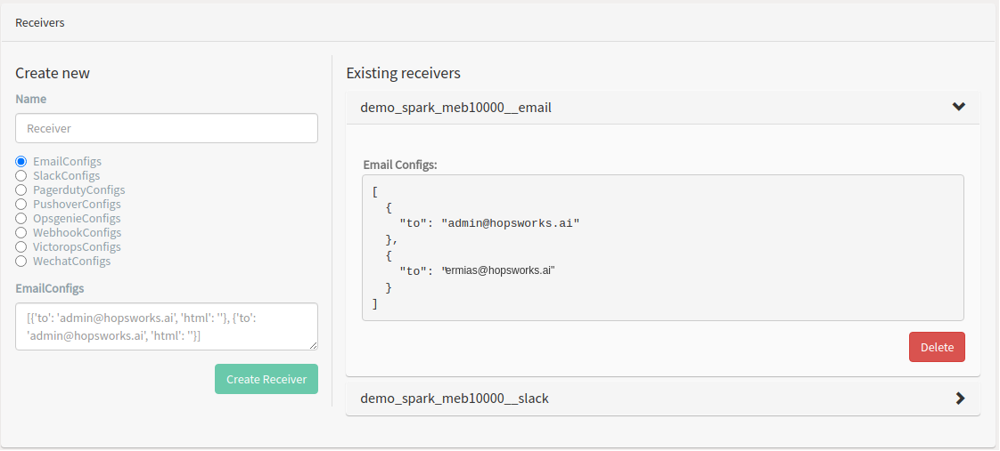
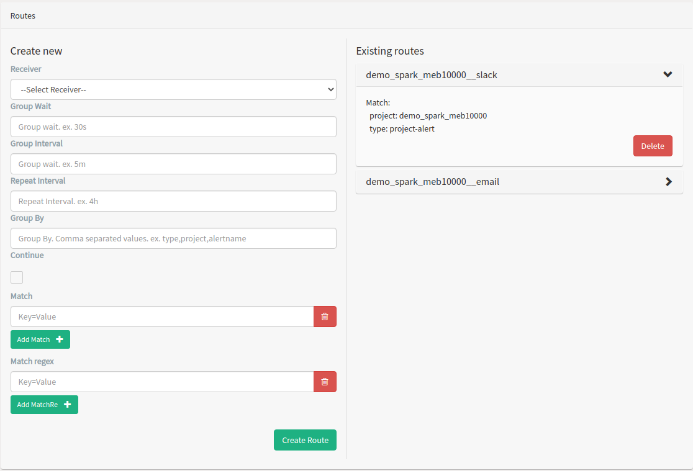
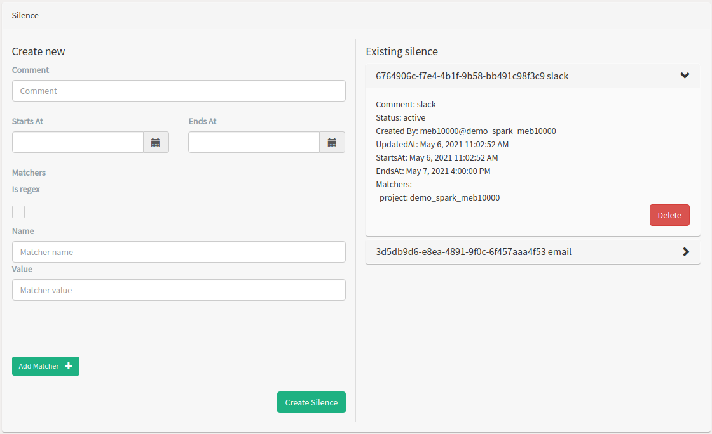
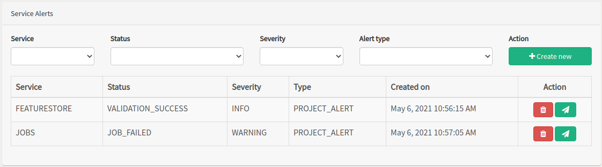
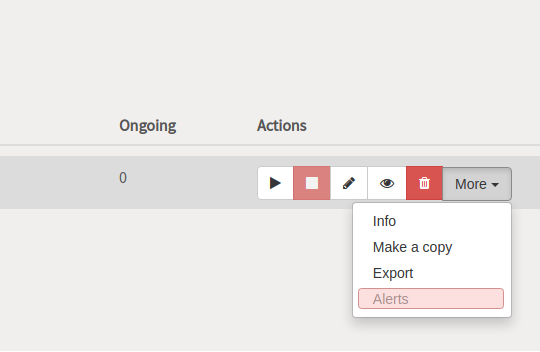
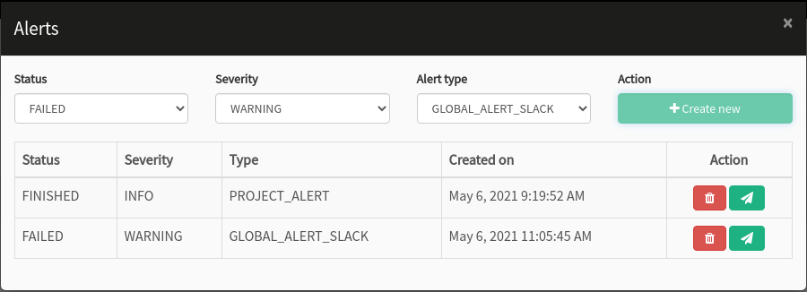
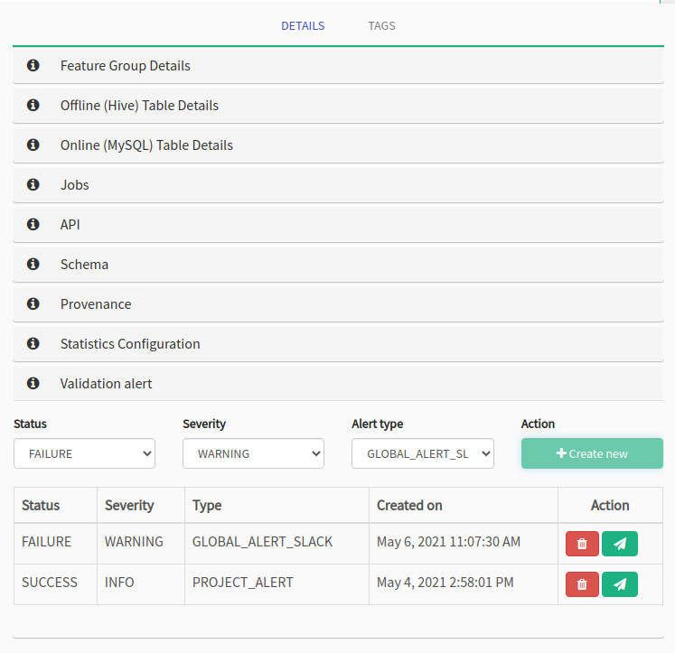
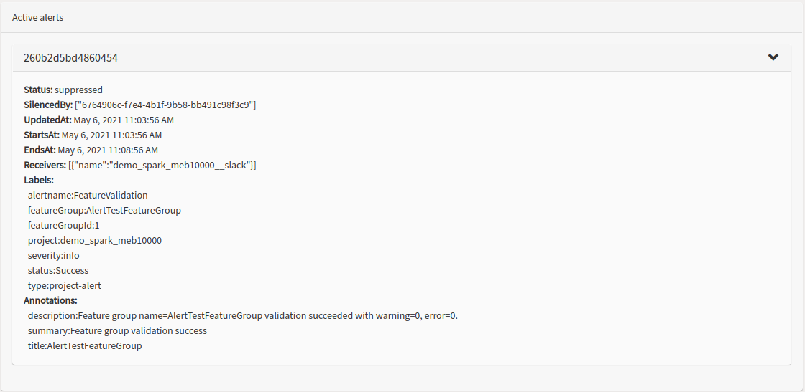

.. _Alert:
 
 
=================
Alerts
=================
 
Alerts can be sent from jobs and feature group validations. This is done by creating
job alert or feature group alert for specific job or feature group. Alternatively
alerts can be created for all jobs or feature group validations in a project.
 
In order to send alert routes and receivers need to be configured.
This is done from the project settings page.
 
 
Receivers
~~~~~~~~~
 
Receiver is a named configuration that supports notification methods
such as email, slack, PagerDuty, Pushover, Webhook, Victorops, Wechat or OpsGenie.
The configurations are given as a list of json objects.
Allowable values for the different configuration json objects are given below.
 
1. **Email configs**:
 
.. code-block:: json
 
   [{"to": "example@hopsworks.ai", ...}, {...}]
 
.. _emailConfigs:
 
For a complete list of available values for email config see `email config <https://prometheus.io/docs/alerting/latest/configuration/#email_config>`_.
 
2. **Slack configs**: list of available values for `slack config <https://prometheus.io/docs/alerting/latest/configuration/#slack_config>`_.
3. **Pagerduty configs**: list of available values for `pagerduty config <https://prometheus.io/docs/alerting/latest/configuration/#pagerduty_config>`_.
4. **Pushover configs**: list of available values for `pushover config <https://prometheus.io/docs/alerting/latest/configuration/#pushover_config>`_.
5. **Opsgenie configs**: list of available values for `opsgenie config <https://prometheus.io/docs/alerting/latest/configuration/#opsgenie_config>`_.
6. **Webhook configs**: list of available values for `webhook config <https://prometheus.io/docs/alerting/latest/configuration/#webhook_config>`_.
7. **Victorops configs**: list of available values for `victorops config <https://prometheus.io/docs/alerting/latest/configuration/#victorops_config>`_.
8. **Wechat configs**: list of available values for `wechat config <https://prometheus.io/docs/alerting/latest/configuration/#wechat_config>`_.
 
.. note::
 
   The links above contain the yaml formatted values.
  
   When converting the keys to json do not forget to replace Snake Case (underscores) to Camel Case.
 
The figure below shows existing receivers on the right and a form for creating new receivers.
 

 
  View existing receivers or create new receivers.
 
Routes
~~~~~~
Routes are used to match alerts to receivers. A receiver needs to exist in order to create a route.
Alerts are sent to receivers if they match all the equality (match) or regular expression
matchers (matchRe). Match and matchRe are given as a key value pair as shown in the figure below.
 
1. **Group wait**: How long to initially wait to send a notification for a group of alerts. Allows to collect more initial alerts for the same group. (Usually ~0s to few minutes.)
2. **Groupe interval**: How long to wait before sending a notification about new alerts that are added to a group of alerts for which an initial notification has already been sent. (Usually ~5m or more.)
3. **Repeat interval**: How long to wait before sending a notification again if it has already been sent successfully for an alert. (Usually ~3h or more).
4. **Group by**: The labels by which incoming alerts are grouped together.
5. **Continue**: If continue is set to false, it stops after the first matching route. If continue is true, the alert will continue matching against subsequent routes.
 
 

 
  View existing routes or create new routes.
 
Silences
~~~~~~~~
Silences can be used to mute alerts for a given time.
A silence is configured based on matchers, just like the routing tree.
Incoming alerts are checked whether they match all the equality or regular expression
matchers of an active silence. If they do, no notifications will be sent out for that alert.
 
Silences can be created from the project setting page.
 

 
  View existing silences or create new silence.
 
.. note::
 Deleting a silence will only set the status to expired. Expired silences will be automatically garbage collected after two weeks.
 
Project service alert
~~~~~~~~~~~~~~~~~~~~~~
Service alerts can be created for jobs and feature group validations. After creating an alert a test
alert can be sent by clicking on the paper airplane in the action column.
 

 
  View existing service alerts or create new service alerts.
 
1. **Service**: the service that will send the alert.
2. **Status**: what status (of a job execution or a feature group validation) should send an alert.
3. **Severity**: the severity of the alert. (info, warning, or critical).
4. **Alert type**: can be global or project alerts.
  Global alerts are sent to receivers configured by platform administrators.
  While project alerts are sent to the project's receivers. 
 
 
Job alert
~~~~~~~~~
Alerts can be created for a specific job by going to the jobs UI and clicking on the Alers menu of the
job you want to create alerts for.
 

 
  Job alert menu.
 
This will open a modal shown below.
 

 
  View existing job alerts or create new job alerts.
 
1. **Status**: what final status of the job's execution should send an alert. (Finished, Failed, Killed)
2. **Severity**: the severity of the alert. (info, warning, or critical).
3. **Alert type**: can be global or project alerts.
  Global alerts are sent to receivers configured by platform administrators.
  While project alerts are sent to the project's receivers.
 
Feature group validation alert
~~~~~~~~~~~~~~~~~~~~~~~~~~~~~~~
 
Feature group validation can also send alerts. To configure alerts for a specific feature group go to the
feature group's details page and click on the validation alerts accordion. 
 

 
  View existing feature group alerts or create new feature group alerts.
 
1. **Status**: what final status of the feature group validation should send an alert. (Failure, Success, or Warning)
2. **Severity**: the severity of the alert. (info, warning, or critical).
3. **Alert type**: can be global or project alerts.
  Global alerts are sent to receivers configured by platform administrators.
  While project alerts are sent to the project's receivers.
 
Active alerts
~~~~~~~~~~~~~
 
All active alerts can be seen in the project settings page.
This is especially useful if an alert fails to reach the intended receiver.
By expanding an active alert you can see if it is matching the correct receiver and if it is being
muted by a silence.
 
The figure below shows an alert that matched receiver 'demo_spark_meb1000' but is suppressed by a
silence with id '6764906c-f7e4-4b1f-9b58-bb491c98f3c9'.
 

 
  View active alerts.

