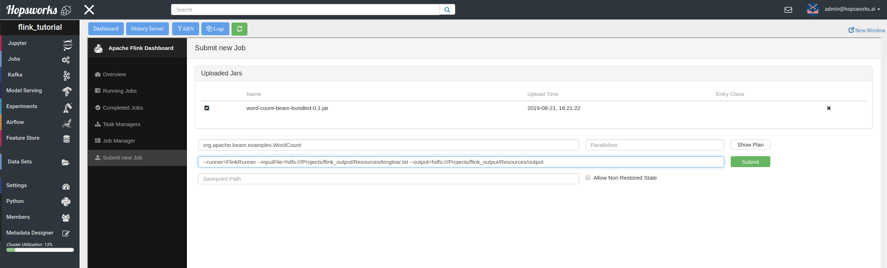

===========
Apache Beam
===========

Apache Beam is an open source, unified model for defining both batch and streaming data-parallel processing pipelines
(`link <https://beam.apache.org/get-started/beam-overview/>`__). Beam is a first-class citizen in Hopsworks, as the
latter provides the tooling and provides the setup for
users to directly dive into programming Beam pipelines without worrying about the lifecycle of all the underlying
Beam services and runners.

Portability Framework
---------------------

Of particular interest is the **Beam Portability Framework** (`link <https://beam.apache.org/roadmap/portability/>`__)
which enables users to write programs in different languages (Java, Python etc.) without worrying about the language
support of the underlying scheduler. Therefore in Hopsworks, users can write Jupyter notebooks in Python to implement
a Beam pipeline which will be executed on a Flink runner.

Users can with a few clicks their Portable Beam pipelines running. Hopsworks will take care off launching the Jupyter
notebook and then with the help of the `Hops python library`_ library, to start the Flink runner andd start and attach to it the
Beam JobService and lastly, return the Beam pipeline options. `This <https://www.slideshare
.net/TheofilosKakantousis/endtoend-ml-pipelines-with-beam-flink-tensorflow-and-hopsworks>`__ presentation contains
details on how Hopsworks deploys and manages Beam pipelines. In `Hops python library`_ page you can find instructions on the
Hopsworks Beam API that helps you get started writing Portable Beam pipelines in a Jupyter notebook.

Please note that you need to enable the **Python2.7** environment in your project for running Apache Beam, as the
latter does not support Python3.6 yet.

**Examples**

In hops-examples_ you can find the ``portability_wordcount_python .ipynb`` notebook to get you started building
Portable Beam pipelines in Hopsworks!

.. _hops-examples: https://github.com/logicalclocks/hops-examples

Legacy Runner
-------------

If you want to run a Java programs with legacy runner, you can do so by starting a Flink job and then submitting your
Beam fat jar as a Flink job. Regarding submitting Flink jobs, please refer to the Apache Flink page in this User Guide.

To build the fat jar, you need to follow the instructions under section `Get the WordCount code` from `here
<https://beam.apache.org/get-started/quickstart-java/>`__ and then add::

<dependency>
<groupId>org.apache.beam</groupId>
<artifactId>beam-sdks-java-io-hadoop-file-system</artifactId>
<version>${beam.version}</version>
<scope>runtime</scope>
</dependency>

in the ``flink-runner`` profile in ``pom.xml``. The profile should look like this::

<profile>
<id>flink-runner</id>
<!-- Makes the FlinkRunner available when running a pipeline. -->
<dependencies>
<dependency>
<groupId>org.apache.beam</groupId>
<!-- Please see the Flink Runner page for an up-to-date list of supported Flink versions and their artifact names:https://beam.apache.org/documentation/runners/flink/ -->
<artifactId>${flink.artifact.name}</artifactId>
<version>${beam.version}</version>
<scope>runtime</scope>
</dependency>
<dependency>
<groupId>org.apache.beam</groupId>
<artifactId>beam-sdks-java-io-hadoop-file-system</artifactId>
<version>${beam.version}</version>
<scope>runtime</scope>
</dependency>
</dependencies>
</profile>

You can then compile build the fat jar with ``mvn clean package -Pflink-runner -DskipTests``. The jar file is then
at ``target/word-count-beam-bundled-0.1.jar``.

The arguments of the programs can be found in the image below,

.. _beam-wordcount-java.png: ../../_images/beam-wordcount-java.png

.. _Hops python library: https://hops-py.logicalclocks.com