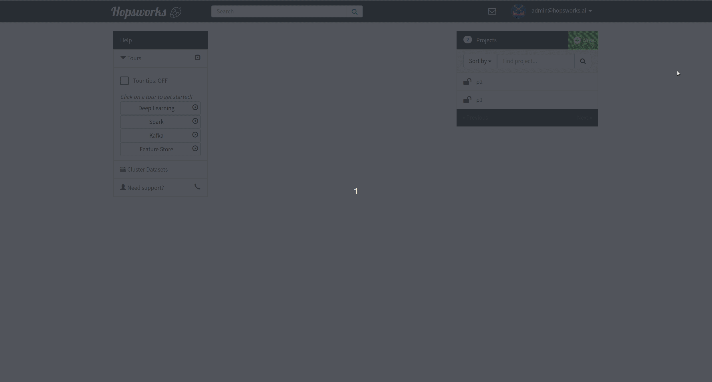

=================
Data Sets Browser
=================

The Data Set tab enables you to browse Data Sets, files and directories in this project.
It is mostly used as a file browser for the project's HDFS subtree. You cannot navigate to
directories outside of this project's subtree. For a quick preview of
a file, go to the ``Datasets`` menu, navigate to a file, right click
on that file and choose the ``Preview`` option. A pop-up window will
appear with a small preview of the file. The picture below illustrates the Dataset Browser
with a new sample dataset. You can add new datasets by pressing the
``Create New Dataset`` button. A valid data set name can only contain characters a-z, A-Z, 0-9 and special
characters '_', '-' and '.' but not '__' (double underscore). There are also reserved words that are not
allowed in data set names. A complete list of reserved words can be found in section :ref:`Data set name reserved words`.
You can edit the datasets by right clicking on them. A README file is auto-generated for every dataset.

.. _datasets-browser.gif: ../../_images/datasets-browser.gif

    Data Sets browser (click image to enlarge)

Data set name reserved words
============================

PROJECTS.