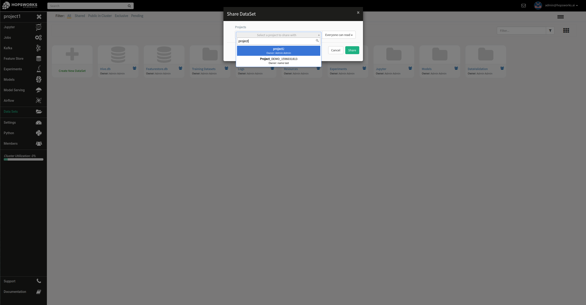
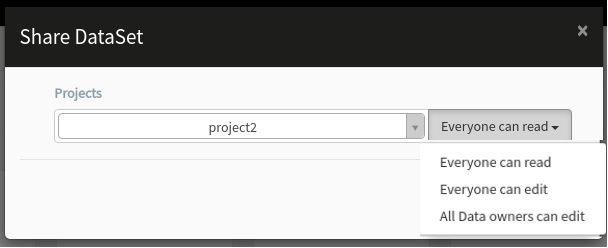
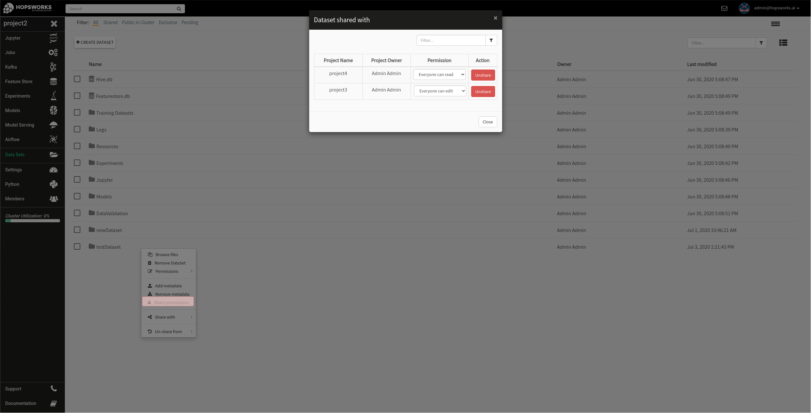
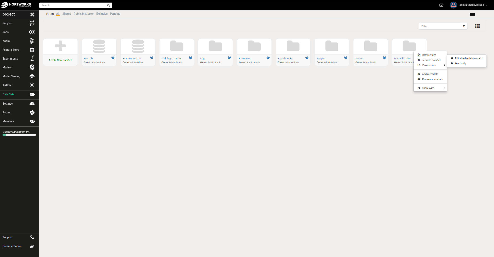
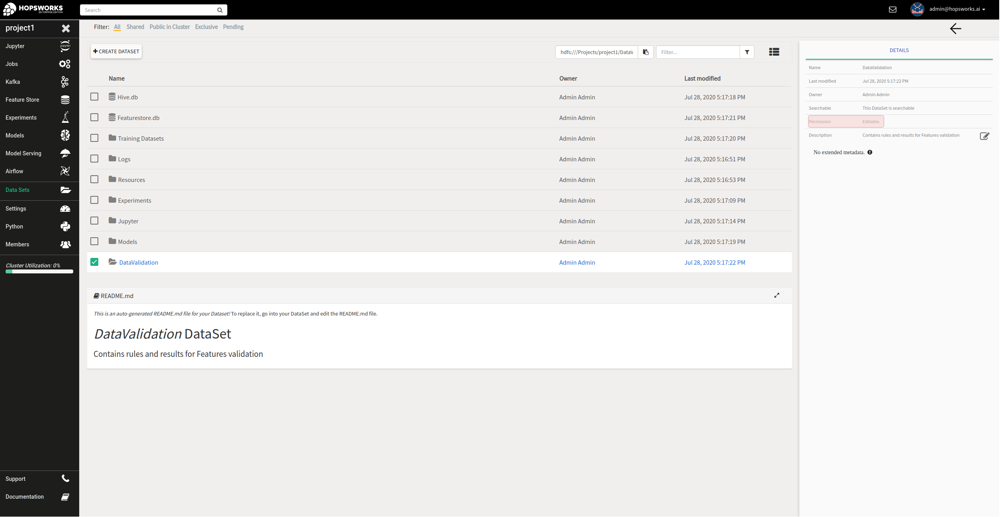

===================================
Data Set sharing and access-control
===================================
 
 
Share
-----
 
The basic principle of the Project - Data Set abstraction is that no data can be copied/moved outside of a
project's scope, making a project effectively a sandbox for data and programs. However, Data Sets can be shared with one
or more other projects and only `data owners` have privileges to share Data Sets. To share a Data Set, navigate to
the ``Data Sets`` browser from the services menu on the left, right-click on the Data Set to be shared and from the
``Share with`` option select either ``project`` or ``cluster``.
 
.. _share-ds-1.png: ../../_images/share-ds-1.png
.. figure:: ../../imgs/share-ds-1.png
   :alt: Share a Data Set
   :target: `share-ds-1.png`_
   :scale: 25%
   :align: center
   :figclass: align-center
 
   Share a Data Set
 
In the case of ``project``, a popup dialog will then prompt users to select a target project with which the *Data
Set* is to be shared with. It is also feasible to filter projects by name as shown in the image below.
 
.. _share.png: ../../_images/datasets/share.png

 
   Select a project to share the Data Set with
 
When sharing a Data Set you can also choose share permissions. Available permissions are shown in the image below.
 
.. _share-permission.png: ../../_images/datasets/share-permission.png

 
   Select share permission
 
- **Everyone can read**: gives read only access to all members of the project the Data Set is shared with.
- **Everyone can edit**: gives read/write access to all members of the project the Data Set is shared with.
- **Data owners can edit**: gives data owners write access and read only access to all other members of the project the Data Set is shared with.
 
To complete the sharing process, a Data Owner in the target project has to click on the shared Data Set,
and then click on ``Accept`` to complete the process, ``Reject`` to reject the shared Data Set or ``cancel`` for no
action.
 
.. _share-ds-3.png: ../../_images/share-ds-3.png
.. figure:: ../../imgs/share-ds-3.png
   :alt: Accept a shared Data Set
   :target: `share-ds-3.png`_
   :scale: 30%
   :align: center
   :figclass: align-center
 
   Accept a shared Data Set
 
Unshare
-------
 
Data Sets can be ``unshared`` by `data owners`, either from the parent project or from the project they have been
shared with. To do that, users of the parent project can right-click on the Data Set, click ``UnShare from`` and then
select the project to unshare from. Users of the "shared-with" project, need to right-click on the shared Data Set
and then click ``Remove DataSet``.
 
Changing share permission
-------------------------
 
To change permission of a shared Data Set `data owners` can right-click on the Data Set and click ``Share permission``. This will open a popup
dialog with a table listing all projects the Data Set is shared with.
 
.. _change-share-permission.png: ../../_images/datasets/change-share-permission.png

 
   Change share permission
 
From the shared with dialog you can change share permission or unshare a Data Set from a project.
 
.. _data-set-access-control:

Data Set access-control
-----------------------
 
Inviting other users to a project and sharing a Data Set are ways to allow members of an organization to provide
fine-grained access control to original data to other members/departments without having to relinquish full control
over the data. Essentially that means that data organized in Data Sets can be shared with other projects so that
other users of Hopsworks can access and make use of this data in their AI pipelines and programs.
 
By default, all members of the project the Data Set was created in, are allowed only ``read-only`` access to all files and directories of the Data Set. There are two more access
levels that give higher privileges to members that can access this Data Set. All access-levels are:
 
- **Everyone can read**: gives read only access to all members of the project the Data Set is shared with.
- **Everyone can edit**: gives read/write access to all members of the project the Data Set is shared with.
- **Data owners can edit**: gives data owners write access and read only access to all other members of the project the Data Set is shared with.
 
Changing the access level can be done with a right-click on the Data Set, permissions and click on one of the
available access levels as shown in the figure below.
 
.. _change-permission.png: ../../_images/datasets/change-permission.png

 
   Access-levels of a Data Set
 
To check the current access levels select a Data Set and the permission will be shown on the sidebar as shown in the figure below.
 
.. _check-permission.png: ../../_images/datasets/check-permission.png

 
   Check access-levels of a Data Set
