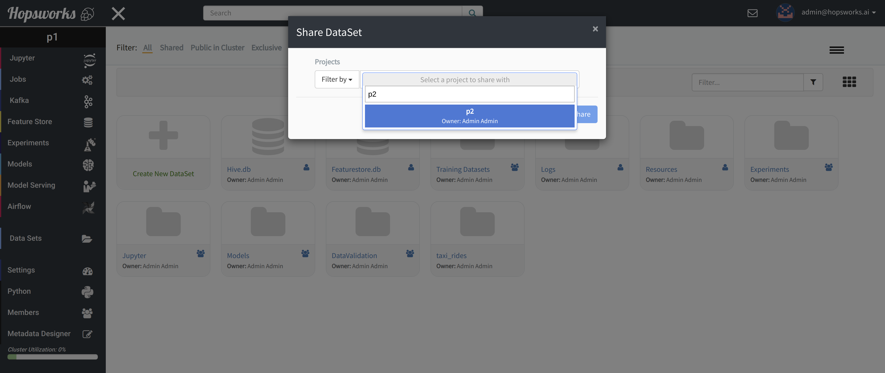
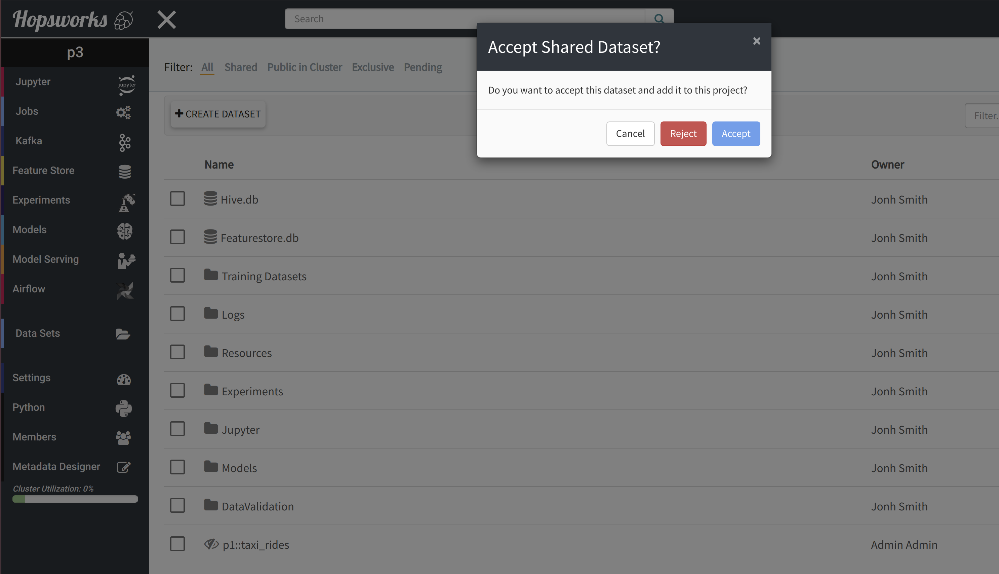
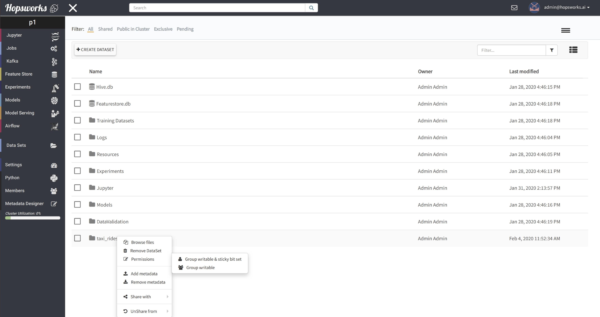

===================================
Data Set sharing and access-control
===================================

Share
-----

The basic principle of the Project - Data Set abstraction is that no data can be copied/moved outside of a
project's scope, making a project effectively a sandbox for data and programs. However, Data Sets can be shared with one
or more other projects and only `data owners` have privileges to share Data sets. To share a Data Set, navigate to
the ``Data Sets`` browser from the services menu on the left, right-click on the Data Set to be shared and from the
``Share with`` option select either ``project`` or ``cluster``.

.. _share-ds-1.png: ../../_images/share-ds-1.png
.. figure:: ../../imgs/share-ds-1.png
    :alt: Share a Data Set
    :target: `share-ds-1.png`_
    :scale: 25%
    :align: center
    :figclass: align-center

In the case of ``project``, a popup dialog will then prompt users to select a target project with which the *Data
Set* is to be share with. It is also feasible to filter projects by name as shown in the image below.

.. _share-ds-2.png: ../../_images/share-ds-2.png

To complete the sharing process, a Data Owner in the target project has to click on the shared Data Set,
and then click on ``Acccept`` to complete the process, ``Reject`` to reject the shared Data Set or ``cancel`` for no
action.

.. _share-ds-3.png: ../../_images/share-ds-3.png

Unshare
-------

Data Sets can be ``unshared`` by `data owners`, either from the parent project or from the project they have been
shared with. To do that, users of the parent project can right-click on the Data Set, click ``UnShare from`` and then
select the project to unshare from. Users of the "shared-with" project, need to right-click on the shared Data Set
and then click ``Remove DataSet``.

.. _data-set-access-control:
Data Set access-control
-----------------------

Inviting other users to a project and sharing a Data Set are ways to allow members of an organization to provide
fine-grained access control to original data to other members/departments without having to relinquish full control
over the data. Essentially that means that data organized in Data Sets can be shared with other projects so that
other users of Hopsworks can access and make use of this data in their AI pipelines and programs.

By default, Data Scientints of the project owning the Data Set and members of projects which a Data Set has been shared
with are allowed only ``read-only`` access to all file and directories of the Data Set. There are two more access
levels that give higher privileges to projects that can access this Data Set. All access-levels are:

- Owner only: Sets default permissions setting of a data set. Only Data Owners will be able to upload/remove files via the Data Sets Browser and only the data set owner via Jobs and Jupyter notebooks.

- Group writable and sticky-bit set: This enables Data Scientists of the parent project and members of projects the data set has been shared with to create directories upload files in the Data Set but are allowed to only remove files/dirs they own, via the Data Sets browser.

- Group writable: This is the least strict setting. It allows both Data Owners and Data Scientists to upload/remove files either via the Data Set Browser or via Jobs/Notebooks.

Changing the access level can be done with a right-click on the Data Set, permissions and click on one of the
available access levels as shown in the figure below.

.. _share-ds-5.png: ../../_images/share-ds-5.png
