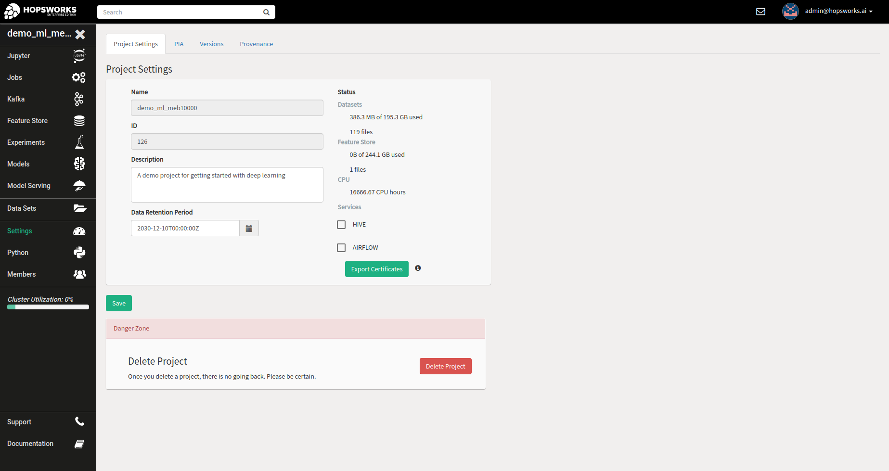

===========================
Delete a Project
===========================

You can delete a project using the Settings menu. In the Project Settings tab, you will find a Danger Zone section where
 there is an option to delete the project.

