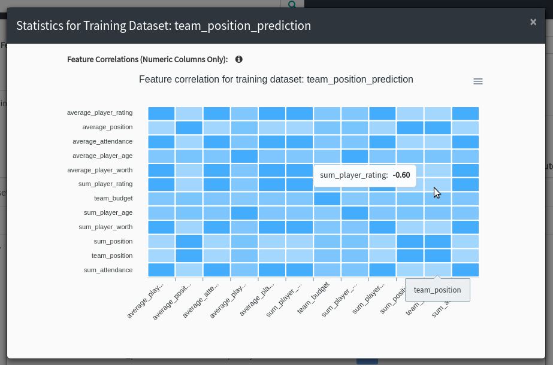
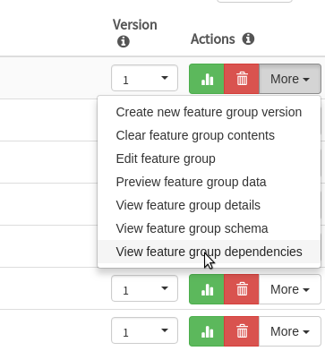
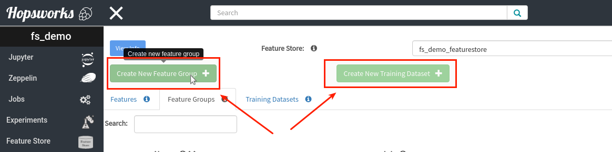
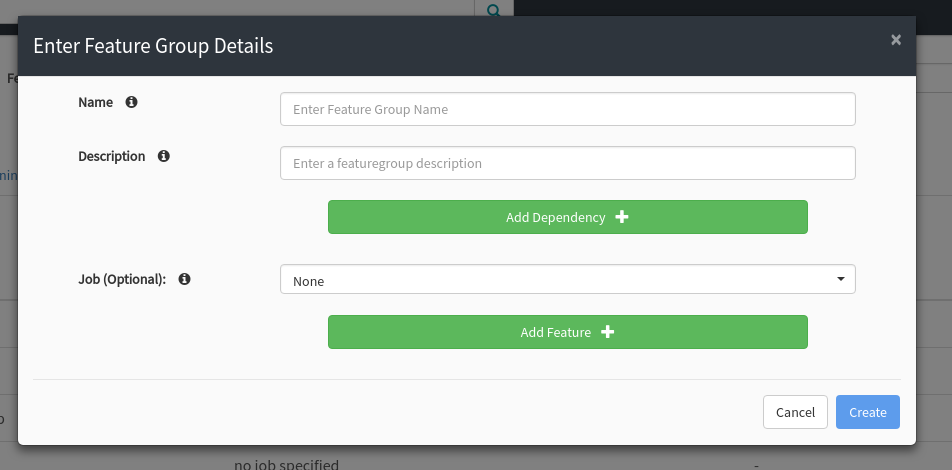
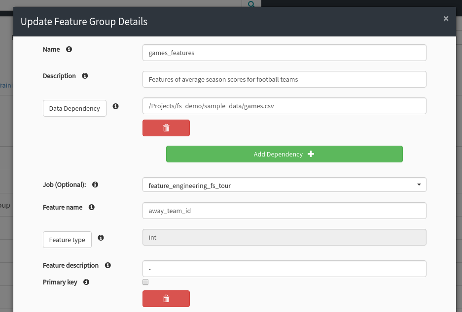
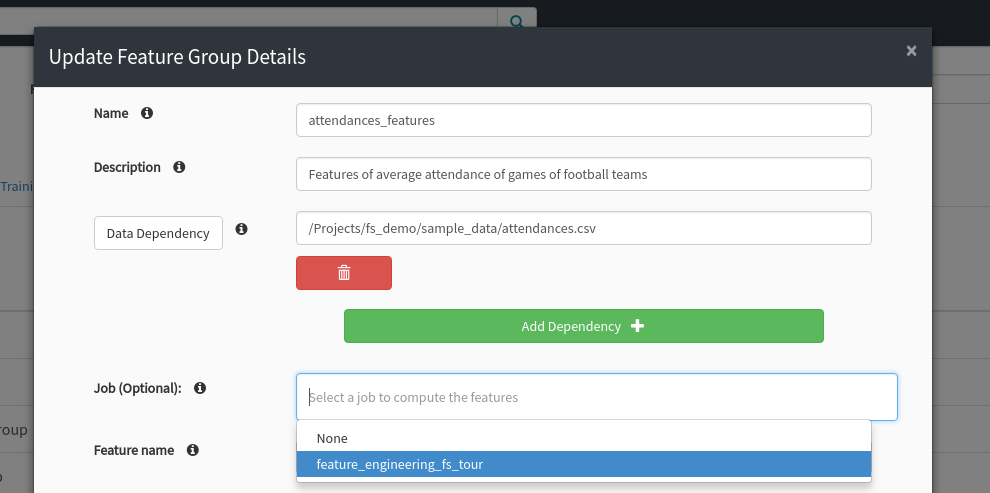
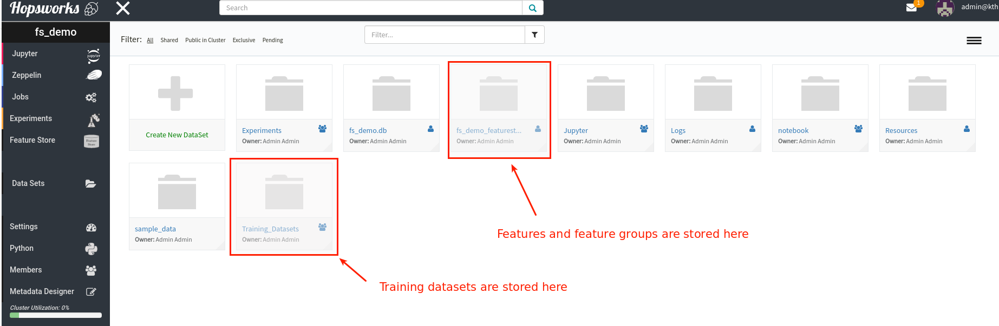

Feature Store
==============

In this tutorial we cover the feature store service in Hopsworks, how it should be used, how it fits into the machine learning pipeline, and the tech-stack behind it.

Feature Store: The Data Management Layer for Machine Learning in Hopsworks
--------------------------------------------------------------------------

The feature store is as a central place to store curated features for machine learning pipelines in Hopsworks. A feature is a measurable property of some data-sample. It could be for example an image-pixel, a word from a piece of text, the age of a person, a coordinate emitted from a sensor, or an aggregate value like the average number of purchases within the last hour. Features can come directly from tables or files or can be derived values, computed from one or more data sources.

Features are the fuel for AI systems, as we use them to train machine learning models so that we can make predictions for feature values that we have never seen before. In this tutorial we will see best practices for transforming raw/structured data into *features* that can be included in *training datasets* for training models.

.. _hopsworks_feature_store.png: ../../_images/overview_new.png
.. figure:: ../../imgs/feature_store/overview_new.png
    :alt: A feature store is the interface between feature engineering and model development.
    :target: `hopsworks_feature_store.png`_
    :align: center
    :scale: 55 %
    :figclass: align-center

    A feature store is the interface between feature engineering and model development.

Motivation for the Feature Store
--------------------------------

Machine learning systems have a tendency to assemble technical debt. Examples of technical debt in machine learning systems are:

* There is no principled way to to access features during model serving.
* Features cannot easily be re-used between multiple machine learning pipelines.
* Data science projects work in isolation without collaboration and re-use.
* Features used for training and serving are inconsistent.
* When new data arrives, there is no way to pin down exactly which features need to be recomputed, rather the entire pipeline needs to be run to update features.

Using a feature store is a best practice that can reduce the technical debt of machine learning work-flows. When the feature store is built up with more features, it becomes easier and cheaper to build new models as the new models can re-use features that exist in the feature store.

How to Use the Feature Store
----------------------------

When adopting the feature store in your machine learning work-flows, you can think of it as the interface between data engineering and data science. It has two APIs, one for writing to the feature store and one for reading features. At the end of your data engineering pipeline, instead of writing features to a custom storage location, write the features to the feature store and get benefits such as automatic documentation, versioning, feature analysis, and feature sharing. As a data scientist, when you start a new machine learning project, you can search through the feature store for available features and only add new features if they do not already exist in the feature store. We encourage to reuse features as much as possible to avoid doing unnecessary work and to make features consistent between different models.

Creating a Project on Hopsworks with The Feature Store Service Enabled
~~~~~~~~~~~~~~~~~~~~~~~~~~~~~~~~~~~~~~~~~~~~~~~~~~~~~~~~~~~~~~~~~~~~~~

To create a project with the feature store service, mark the check-box available when you create a new project in Hopsworks.

  .. _featurestore_create_project.png: ../../_images/create_project.png
.. figure:: ../../imgs/feature_store/create_project.png
    :alt: Create a new project with the feature store service enabled.
    :target: `featurestore_create_project.png`_
    :align: center
    :figclass: align-center

    Create a new project with the feature store service enabled.

Inside the project you can find the feature registry (where all the feature store data is browsable) in the feature store page that is accessible by clicking the feature store icon on the left.

  .. _featurestore_open_registry.png: ../../_images/opening_feature_registry.png
.. figure:: ../../imgs/feature_store/opening_feature_registry.png
    :alt: Opening the feature store registry
    :target: `featurestore_open_registry.png`_
    :align: center
    :figclass: align-center

    Opening the feature store registry in Hopsworks.

Data Modeling in the Feature Store
~~~~~~~~~~~~~~~~~~~~~~~~~~~~~~~~~~

We introduce three new concepts to our users for modeling data in the feature store.

* The **feature** is an individual versioned and documented data column in the feature store, e.g the average rating of a customer.
* The **feature group** is a documented and versioned group of features stored as a Hive table. The feature group is linked to a specific Spark/Numpy/Pandas job that takes in raw data and outputs the computed features.
* The **training dataset** is a versioned and managed dataset of features and labels (potentially from multiple different feature groups). Training datasets are stored in HopsFS as tfrecords, parquet, csv, or tsv files.

  .. _featurestore_concepts.png: ../../_images/concepts.png
.. figure:: ../../imgs/feature_store/concepts.png
    :alt: Feature Store API
    :target: `featurestore_concepts.png`_
    :align: center
    :figclass: align-center

    Concepts for modeling data in the feature store.

The API
~~~~~~~

The feature store in Hopsworks has both a Python API and a Scala/Java API. You'll see in the code snippets below that the python API contains optional arguments that are explicit in the Java API, but apart from that, the APIs are identical. This section gives an overview of the API and show examples of the most common API methods. To get a full overview of the API please see the API-Docs-Python_, API-Docs-Scala_ and the featurestore_example_notebooks_.

**Creating New Features**

The feature store is agnostic to the method for computing the features. The only requirement is that the features can be grouped together in a Pandas, Numpy, or Spark dataframe. The user provides a dataframe with features and associated feature metadata (metadata can also be edited later through the feature registry UI) and the feature store library takes care of creating a new version of the feature group, computing feature statistics and linking the features to the job to compute them.

* Inserting into an existing feature group using the Python API:

.. code-block:: python

    from hops import featurestore
    featurestore.insert_into_featuregroup(features_df, featuregroup_name)

* Inserting into an existing feature group using the Scala/Java API:

.. code-block:: scala

    import io.hops.util.Hops
    Hops.insertIntoFeaturegroup(
    featuresDf,
    spark,
    featureName,
    featurestore,
    featuregroupVersion,
    mode,
    descriptiveStats,
    featureCorr,
    featureHistograms,
    clusterAnalysis,
    statColumns,
    numBins,
    corrMethod,
    numClusters
    )

* Creating a new feature group using the Python API:

.. code-block:: python

    from hops import featurestore
    featurestore.create_featuregroup(
		features_df,
		feature_name,
		description=feature_description
		)

* Creating a new feature group using the Scala/Java API:

.. code-block:: scala

    import io.hops.util.Hops
    val jobId = null
    val dependencies = List[String]().asJava
    val primaryKey = null
    val descriptiveStats = false
    val featureCorr = false
    val featureHistograms = false
    val clusterAnalysis = false
    val statColumns = List[String]().asJava
    val numBins = null
    val corrMethod = null
    val numClusters = null
    val description = "a spanish version of teams_features"

    Hops.createFeaturegroup(
		spark, featuresDf, description, Hops.getProjectFeaturestore,
		1, description, jobId,
		dependencies, primaryKey, descriptiveStats, featureCorr,
		featureHistograms, clusterAnalysis, statColumns, numBins,
		corrMethod, numClusters
		)

**Reading From the Feature Store**

To read features from the feature store, users can use either SQL or APIs in Python and Scala. Based on our experience with users on our platform, data scientists can have diverse backgrounds. Although some data scientists are very comfortable with SQL, others prefer higher level APIs. This motivated us to develop a query-planner to simplify user queries. The query-planner enables users to express the bare minimum information to fetch features from the feature store. For example, a user can request 100 features that are spread across 20 different feature groups by just providing a list of feature names. The query planner uses the metadata in the feature store to infer where to fetch the features from and how to join them together.

  .. _featurestore_query_planner.png: ../../_images/query_optimizer.png
.. figure:: ../../imgs/feature_store/query_optimizer.png
    :alt: Feature Store Query Planner
    :target: `featurestore_query_planner.png`_
    :align: center
    :figclass: align-center

    Users query the feature store programmatically or using SQL. The output is provided as Pandas, Numpy or Spark dataframes.

For example, to fetch the features average_attendance and average_player_age from the feature store, all the user has to write is:

.. code-block:: python

    from hops import featurestore
    features_df = featurestore.get_features(["average_attendance", "average_player_age"])

and using the Scala/Java API:

.. code-block:: scala

    import io.hops.util.Hops
    val features = List("average_attendance", "average_player_age")
    val featuresDf = Hops.getFeatures(spark, features, Hops.getProjectFeaturestore)

**Creating Training Datasets**

Organizations typically have many different types of raw datasets that can be used to extract features. For example, in the context of user recommendation there might be one dataset with demographic data of users and another dataset with user activities. Features from the same dataset are naturally grouped into a feature group, producing one feature group per dataset. When training a model, you want to include all features that have predictive power for the prediction task, these features can potentially span multiple feature groups. The training dataset abstraction in Hopsworks Feature Store is used for this purpose, allowing users to group a set of features with labels for training a model to do a particular prediction task.

Once a user has fetched a set of features from different feature groups in the feature store, the features can be materialized into a training dataset. By creating a training dataset using the feature store API, the dataset becomes managed by the feature store. Managed training datasets are automatically analyzed for data anomalies, versioned, documented, and shared with the organization.

  .. _featurestore_pipeline.png: ../../_images/pipeline.png
.. figure:: ../../imgs/feature_store/pipeline.png
    :alt: Feature Store Pipeline
    :target: `featurestore_pipeline.png`_
    :align: center
    :figclass: align-center

    The life-cycle of data in HopsML. Raw data is transformed into features which are grouped together into training datasets that are used to train models.

To create a managed training dataset, the user supplies a Pandas, Numpy or Spark dataframe with features and labels together with metadata.

* Creating a training dataset using the Python API:

.. code-block:: python

    from hops import featurestore
    featurestore.create_training_dataset(features_df,
                                 training_dataset_name,
                                 training_dataset_description,
                                 computation_job,
                                 training_dataset_version,
                                 data_format="tfrecords"
                                 )

* Creating a training dataset using the Scala/Java API:

.. code-block:: scala

    import io.hops.util.Hops
    val features = List("average_attendance", "average_player_age")
    val featuresDf = Hops.getFeatures(spark, features, Hops.getProjectFeaturestore)
    val trainingDatasetName = "team_position_prediction"
    val jobId = null
    val dependencies = List[String]().asJava
    val primaryKey = null
    val dataFormat = "tfrecords"
    val descriptiveStats = false
    val featureCorr = false
    val featureHistograms = false
    val clusterAnalysis = false
    val statColumns = List[String]().asJava
    val numBins = null
    val corrMethod = null
    val numClusters = null
    val description = "a dataset with features for football teams, used for training a model to predict league-position"
    val trainingDatasetVersion = latestVersion + 1
    Hops.createTrainingDataset(spark, featuresDf, trainingDatasetName, Hops.getProjectFeaturestore,
		trainingDatasetVersion, description, jobId, dataFormat, dependencies, descriptiveStats, featureCorr,
		featureHistograms, clusterAnalysis, statColumns, numBins,
		corrMethod, numClusters)

**Reading a Training Dataset for Training a Model**:

Once the training dataset has been created, the dataset is discoverable in the feature
registry and users can use it to train models. Below is an example code snippet for training a
model using a training dataset stored distributed in the tfrecords format on HopsFS.

* Using the Python API:

.. code-block:: python

    from hops import featurestore
    import tensorflow as tf
    dataset_dir = featurestore.get_training_dataset_path(td_name)
    # the tf records are written in a distributed manner using partitions
    input_files = tf.gfile.Glob(dataset_dir + "/part-r-*")
    # tf record schemas are managed by the feature store
    tf_record_schema = featurestore.get_training_dataset_tf_record_schema(td_name)
    def decode(example_proto):
        return tf.parse_single_example(example_proto, tf_record_schema)

    dataset = tf.data.TFRecordDataset(input_files)
                                 .map(decode)
                                 .shuffle(shuffle_buffer_size)
                                 .batch(batch_size)
                                 .repeat(num_epochs)
    # three layer MLP for regression
    model = tf.keras.Sequential([
           layers.Dense(64, activation="relu"),
           layers.Dense(64, activation="relu"),
           layers.Dense(1)
        ])
    model.compile(optimizer=tf.train.AdamOptimizer(lr), loss="mse")
    model.fit(dataset, epochs=num_epochs, steps_per_epoch=spe)

* Using the Scala/Java API:

.. code-block:: scala

    import io.hops.util.Hops
    val dataset_df = Hops.getTrainingDataset(spark, "team_position_prediction", Hops.getProjectFeaturestore, 1)
    val transformedDf = new VectorAssembler().setInputCols(Array( "average_player_rating","average_attendance", "sum_player_rating",
                     "sum_position", "sum_player_worth", "average_player_age", "average_player_worth",
                     "team_budget", "average_position", "sum_player_age", "sum_attendance")).
		     setOutputCol("features").
		     transform(dataset_df).
		     drop("average_player_rating").
		     drop("average_attendance").
		     drop("sum_player_rating").
		     drop("sum_player_worth").
		     drop("average_player_age").
		     drop("average_player_worth").
		     drop("team_budget").
		     drop("average_position").
		     drop("sum_player_age").
		     drop("sum_attendance").
		     drop("sum_position")
    val lr = new LinearRegression().
    setLabelCol("team_position").
    setFeaturesCol("features").
    setMaxIter(NUM_ITER).
    setRegParam(REG_LAMBDA_PARAM).
    setElasticNetParam(ELASTIC_REG_PARAM)
    val lrModel = lr.fit(transformedDf)
    lrModel.transform(transformedDf).select("features", "team_position", "prediction").show()
    val trainingSummary = lrModel.summary
    println(s"numIterations: ${trainingSummary.totalIterations}")
    println(s"objectiveHistory: [${trainingSummary.objectiveHistory.mkString(",")}]")
    trainingSummary.residuals.show()
    println(s"RMSE: ${trainingSummary.rootMeanSquaredError}")
    println(s"r2: ${trainingSummary.r2}")

The Feature Registry
~~~~~~~~~~~~~~~~~~~~

The feature registry is the user interface for publishing and discovering features and training datasets. The feature registry also serves as a tool for analyzing feature evolution over time by comparing feature versions. When a new data science project is started, data scientists within the project typically begin by scanning the feature registry for available features, and only add new features for their model that do not already exist in the feature store.

The feature registry provides:

* Keyword search on feature/feature group/training dataset metadata.
* Create/Update/Delete/View operations on feature/feature group/training dataset metadata.
* Automatic feature analysis.
* Feature dependency tracking.
* Feature job tracking.

**Finding Features**

In the registry you can search for features, feature groups and training datasets in the search bar. Features are automatically grouped by versions in the search results.

.. _hopsworks_featurestore_finding_features.png: ../../_images/finding_features.png
.. figure:: ../../imgs/feature_store/finding_features.png
    :alt: Searching for features in the feature registry.
    :target: `hopsworks_featurestore_finding_features.png`_
    :align: center
    :figclass: align-center

    Searching for features in the feature registry.

**Automatic Feature Analysis**

When a feature group or training dataset is updated in the feature store, a data analysis step is performed. In particular, we look at cluster analysis, feature correlation, feature histograms and descriptive statistics. We have found that these are the most common type of statistics that our users find useful in the feature modeling phase. For example, feature correlation information can be used to identify redundant features, feature histograms can be used to monitor feature distributions between different versions of a feature to discover covariate shift, and cluster analysis can be used to spot outliers. Having such statistics accessible in the feature registry helps users decide on which features to use.

.. _hopsworks_featurestore_opening_stats_tab.png: ../../_images/opening_stats_tab.png
.. figure:: ../../imgs/feature_store/opening_stats_tab.png
    :alt: Searching for features in the feature registry.
    :target: `hopsworks_featurestore_opening_stats_tab.png`_
    :align: center
    :scale: 55 %
    :figclass: align-center

    Opening that statistics for a feature group.

.. _hopsworks_featurestore_corr_analysis.png: ../../_images/corr2.png

    Viewing the feature correlation analysis for a training dataset.

**Feature Data Dependencies**

When the feature store increases in size, scheduling of jobs to recompute features should be automated to avoid a potential management bottleneck. Feature groups and training datasets in Hops feature store are linked to Spark/Numpy/Pandas jobs which allows to reproduce and recompute the features when necessary. Moreover, each feature group and training dataset can have a set of data dependencies. By linking feature groups and training datasets to jobs and data dependencies, the features in Hops feature store can be automatically back-filled using workflow management systems such as Airflow.

.. _hopsworks_featurestore_open_deps.png: ../../_images/open_deps.png

    Open the tab to view the data dependencies of a feature group.

.. _hopsworks_featurestore_deps.png: ../../_images/deps.png
.. figure:: ../../imgs/feature_store/deps.png
    :alt: Feature group data dependencies.
    :target: `hopsworks_featurestore_deps.png`_
    :align: center
    :scale: 55 %
    :figclass: align-center

    Feature dependency tracking.

.. _hopsworks_featurestore_deps2.png: ../../_images/deps2.png
.. figure:: ../../imgs/feature_store/deps2.png
    :alt: Feature group automatic backfilling notification.
    :target: `hopsworks_featurestore_deps2.png`_
    :align: center
    :scale: 55 %
    :figclass: align-center

    By tracking data dependencies, features can be automatically back-filled by recomputing the associated feature engineering job when a data dependency has been updated.

**Other Actions Available in the Feature Registry**

A common practice using the feature store is that the data of feature groups and training datasets are inserted using the APIs in Python/Java/Scala, but the metadata is filled in the feature registry UI.

* Creating a new feature group with metadata from the UI registry:

.. _hopsworks_featurestore_create_fg1.png: ../../_images/create_fg1.png

    Creating a new feature group with metadata from the feature registry UI.

.. _hopsworks_featurestore_create_fg2.png: ../../_images/create_fg2.png

    Creating a new feature group with metadata from the feature registry UI.

* Updating metadata of a feature group using the UI registry:

.. _hopsworks_featurestore_edit_fg1.png: ../../_images/edit_fg1.png
.. figure:: ../../imgs/feature_store/edit_fg1.png
    :alt: Creating a new feature group with metadata from the UI registry.
    :target: `hopsworks_featurestore_edit_fg1.png`_
    :align: center
    :scale: 55 %
    :figclass: align-center

    Editing the metadata of a feature from the feature registry UI.

.. _hopsworks_featurestore_edit_fg2.png: ../../_images/edit_fg2.png

    Editing the metadata of a feature from the feature registry UI.

Other actions available in the feature registry are:

* Create/Update/Delete operations on feature groups and training datasets
* Preview feature group data
* View feature group and training dataset schemas

A Multi-tenant Feature Store Service
------------------------------------

Despite the benefit of centralizing features, we have identified a need to enforce access control to features. Several organizations that we have talked to are working partially with sensitive data that requires specific access rights that is not granted to everyone in the organization. For example, it might not be feasible to publish features that are extracted from sensitive data to a feature store that is public within the organization.

To solve this problem we utilize the multi-tenant model of Hopsworks. Feature stores in Hopsworks are by default project-private and can be shared across projects, which means that an organization can combine public and private feature stores. An organization can have a central public feature store that is shared with everyone in the organization as well as private feature stores containing features of sensitive nature that are only accessible by users with the appropriate permissions.

.. _hopsworks_featurestore_multitenant.png: ../../_images/multitenant.png
.. figure:: ../../imgs/feature_store/multitenant.png
    :alt: Based on the organization need, features can be divided into several feature stores to preserve data access control.
    :target: `hopsworks_featurestore_multitenant.png`_
    :align: center
    :scale: 55 %
    :figclass: align-center

    Based on the organization need, features can be divided into several feature stores to preserve data access control.

To share a feature store with another project, share the dataset containing the feature groups and features (**projectname_featurestore.db**) as well as the dataset that contains the training datasets (**projectname_Training_Datasets**). To share datasets in Hopsworks simply right-click the feature store inside of your project dataset browser:

.. _hopsworks_featurestore_share_fs.png: ../../_images/share_fs.png
.. figure:: ../../imgs/feature_store/share_fs.png
    :alt: Feature stores can be shared across project boundaries.
    :target: `hopsworks_featurestore_share_fs.png`_
    :align: center
    :scale: 55 %
    :figclass: align-center

    Feature stores can be shared across project boundaries.

.. _hopsworks_featurestore_share_fs2.png: ../../_images/share_fs2.png
.. figure:: ../../imgs/feature_store/share_fs2.png
    :alt: Feature stores can be shared across project boundaries.
    :target: `hopsworks_featurestore_share_fs2.png`_
    :align: center
    :scale: 55 %
    :figclass: align-center

    Feature stores can be shared across project boundaries.

When you have multiple feature stores shared with your project you can select which one to view in the feature registry:

.. _hopsworks_featurestore_select_fs.png: ../../_images/select_fs.png
.. figure:: ../../imgs/feature_store/select_fs.png
    :alt: Select feature store in the feature registry
    :target: `hopsworks_featurestore_select_fs.png`_
    :align: center
    :scale: 55 %
    :figclass: align-center

    Selecting a feature store in the feature registry.

Technical Details on the Architecture
-------------------------------------

A feature store consists of five main components:

* The feature engineering jobs, the jobs used to compute the features and insert into the feature store.
* The storage layer for storing the feature data.
* The metadata layer used for storing code to compute features, versioning, analysis data, and documentation.
* The API, used for reading/writing features from/to the feature store.
* The feature registry, a user interface (UI) service where data scientists can share, discover, and order computation of features.

The architecture of the feature store in hopsworks is depicted in the image below.

.. _hopsworks_featurestore_architecture.png: ../../_images/arch_w_pandas_numpy.png
.. figure:: ../../imgs/feature_store/arch_w_pandas_numpy.png
    :alt: Hopsworks feature store architecture
    :target: `hopsworks_featurestore_architecture.png`_
    :align: center
    :scale: 55 %
    :figclass: align-center

    Architecture of Hops Feature Store.

Feature Engineering Frameworks
~~~~~~~~~~~~~~~~~~~~~~~~~~~~~~

At Logical Clocks we specialize in Python-first ML pipelines, and for feature engineering we focus our support on Spark, PySpark, Numpy, and Pandas. Users can submit feature engineering jobs on the platform using notebooks, python files or .jar files. The jobs can later on be linked to the feature group or training dataset that it computes to enable automatic backfilling.

.. _hopsworks_featurestore_link_fg_to_job.png: ../../_images/link_fg_to_job.png

    Training datasets and feature groups can be linked to jobs in hopsworks (see documentation on jobs_.)

The Storage Layer
~~~~~~~~~~~~~~~~~

We have built the storage layer for the feature data on top of Hive/HopsFS with additional abstractions for modeling feature data. The reason for using Hive as the underlying storage layer is two-fold (1) it is not uncommon that our users are working with datasets in terabyte-scale or larger, demanding scalable solutions that can be deployed on HopsFS (See blog post on HopsFS [9]); and (2) data modeling of features is naturally done in a relational manner, grouping relational features into tables and using SQL to query the feature store. This type of data modeling and access patterns fits well with Hive in combination with columnar storage formats such as Parquet or ORC.

For each project with the feature store service enabled you can find a dataset called *projectname_featurestore.db* which is the Hive database where the features are stored.

Training datasets are not stored directly in the Hive database, rather they are stored in a separate dataset called *Training Datasets* in your project. Training datasets are not stored in Hive as they are generally stored in formats optimized for machine learning frameworks, such as tfrecords or petastorm.

.. _hopsworks_featurestore_storage_layer.png: ../../_images/storage_layer.png

    Storage layout of the feature store.

The Metadata Layer
~~~~~~~~~~~~~~~~~~

To provide automatic versioning, documentation, feature analysis, and feature sharing we store extended metadata about features in a metadata store. For the metadata store we utilize NDB (MySQL Cluster) which allows us to keep feature metadata that is strongly consistent with other metadata in Hopsworks, such as metadata about feature engineering jobs and datasets.

Want to Learn More?
-------------------

We have provided a large number of example notebooks, available here_. Go to Hopsworks and try them out! You can do this either by taking one of the built-in *tours* on Hopsworks, or by uploading one of the example notebooks to your project and run it through the Jupyter service. You can also have a look at HopsML_, which enables large-scale distributed deep learning on Hops.

.. _here: https://github.com/logicalclocks/hops-examples
.. _HopsML: ../../hopsml/hopsML.html
.. _jobs: ./jobs.html
.. _featurestore_example_notebooks: https://github.com/Limmen/hops-examples/tree/HOPSWORKS-721/notebooks/featurestore
.. _API-Docs-Python: http://hops-py.logicalclocks.com/
.. _API-Docs-Scala: http://snurran.sics.se/hops/hops-util-javadoc/
