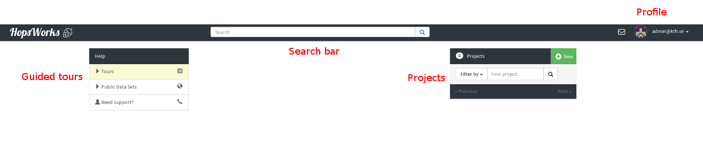

===========================
First Login (without 2-Factor Authentication)
===========================

    HopsWorks Login Page

On initial installation, you can login with the default username and password.
::

    username: admin@kth.se
    password: admin

Upon successful login, you will arrive on the landing page:

.. _landing-page-new.png: ../../_images/landing-page-new.png

    HopsWorks Landing (Home) Page

In the landing page, on the left you can see the Guided tours which
will guide you through launching a SparkPi application. On the top center
part is the search bar where you can search for public projects and
datasets. On the right side, your Projects are listed where you can
click and select them. Finally, on the upper right corner is your
personal menu and administration panel, and the notifications menu.

**If it goes wrong**

If login does not succeed, something has gone wrong during installation. The possible sources of error and the Web Application Server (Glassfish) and
the database (MySQL Clusters).

**Actions**:

* Double-check that system meets the minimum system requirements for
  HopsWorks. Is there enough available disk space and memory?
* Log in to Glassfish and make sure both hopsworks-ear and
  hopsworks-web are deployed.
* Default Glassfish credentials are:
  ::
     username: adminuser
     password: adminpw

* Investigate Glassfish misconfiguration problems. Glassfish log file
  is located at ``/srv/hops/domain1/logs/server.log``. Is Glassfish running? Are the JDBC connections working? Is JavaMail configured correctly?
* Investigate MySQL Cluster misconfiguration problems. Are the mgm
  server, data nodes, and MySQL server running? Do the hops and
  hopsworks databases exist and are they populated with tables and
  rows? If not, something went wrong during installation.
* Re-run the installation, as something may have gone wrong during installation.

.. raw:: latex

    \newpage
